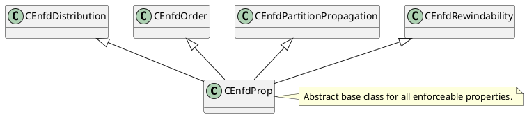
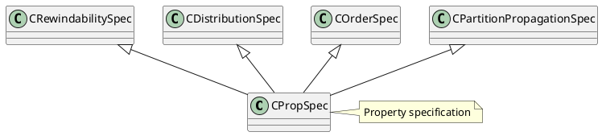

```C++
// Container of information passed among expression nodes during property derivation
class CDrvdPropCtxt : public CRefCount
```

```C++
class CExpressionHandle {
private:
    // required properties of attached expr/gexpr; set during required property computation
    CReqdProp *m_prp;
    // array of children's required properties
    CReqdPropArray *m_pdrgprp;

public:
	// recursive property derivation,
	void DeriveProps(CDrvdPropCtxt *pdpctxt);

    // initialize required properties container
    void InitReqdProps(CReqdProp *prpInput);
}
```
## Property
EnfdProp负责增加属性算子，DrvdProp用来计算算子所能提供的属性，PropSpec为算子属性描述类，ReqdProp用来计算对孩子的属性请求

Enforceable Property


Derived Properties
```plantuml
@startuml
class CDrvdProp {
    + virtual EPropType Ept() = 0
    + virtual void Derive(CMemoryPool *mp, CExpressionHandle &exprhdl, CDrvdPropCtxt *pdppropctxt) = 0
    + virtual BOOL FSatisfies(const CReqdPropPlan *prpp) const = 0
}

class CDrvdPropScalar

note right of CDrvdProp : Abstract base class for all derived properties
note right of CDrvdPropRelational : Derived logical properties container
note right of CDrvdPropPlan : Derived plan properties container

CDrvdPropScalar <|-- CDrvdProp
CDrvdPropRelational <|-- CDrvdProp
CDrvdPropPlan <|-- CDrvdProp

CDrvdPropCtxtRelational <|-- CDrvdPropCtxt
CDrvdPropCtxtPlan <|-- CDrvdPropCtxt
@enduml
```
required properties
```plantuml
class CReqdProp {
    + virtual BOOL FRelational() const
    + virtual BOOL FPlan() const
    + virtual void Compute(CMemoryPool *mp, CExpressionHandle &exprhdl,
            CReqdProp *prpInput, ULONG child_index,
            CDrvdPropArray *pdrgpdpCtxt, ULONG ulOptReq) = 0;
}
class CReqdPropPlan
class CReqdPropRelational

note right of CReqdProp : Abstract base class for all required properties

CReqdProp --|> CReqdPropPlan
CReqdPropPlan *-- CEnfdOrder
CReqdPropPlan *-- CEnfdRewindability
CReqdPropPlan *-- CEnfdDistribution
CReqdPropPlan *-- CEnfdPartitionPropagation
CReqdPropPlan *-- CCTEReq

CEnfdDistribution <|-- CEnfdProp
CEnfdOrder <|-- CEnfdProp
CEnfdPartitionPropagation <|-- CEnfdProp
CEnfdRewindability <|-- CEnfdProp
note right of CEnfdProp : Abstract base class for all enforceable properties.

CReqdProp --|> CReqdPropRelational

```
Property specification
