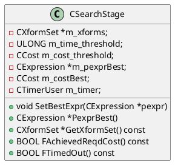
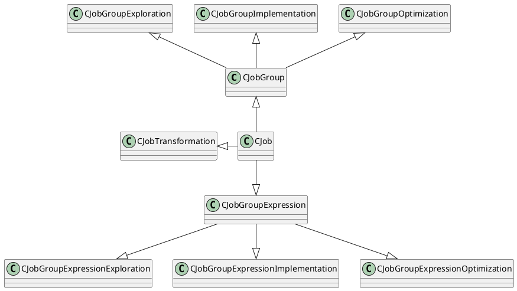
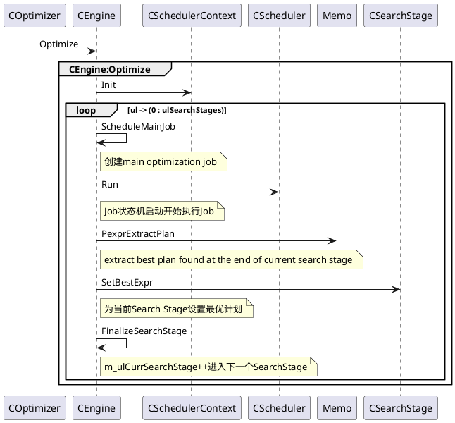

ORCA在`CEngine::Init`接口调用中如果`search_stage_array`为空采用`CSearchStage::PdrgpssDefault`来生成默认的Search策略。
```C++
//  Generate default search strategy;
//  one stage with all xforms and no time/cost thresholds
CSearchStageArray *
CSearchStage::PdrgpssDefault(CMemoryPool *mp)
{
	CXformSet *xform_set = GPOS_NEW(mp) CXformSet(mp);
	xform_set->Union(CXformFactory::Pxff()->PxfsExploration());
	CSearchStageArray *search_stage_array = GPOS_NEW(mp) CSearchStageArray(mp);
	search_stage_array->Append(GPOS_NEW(mp) CSearchStage(xform_set));

	return search_stage_array;
}
```



Orca的Job都是`CJob`,在其上派生出`CJobGroup`和`CJobGroupExpression`。Job的创建和释放管理通过`CJobFactory`来进行管理
```C++
// Create job of specific type
CJob *CJobFactory::PjCreate(CJob::EJobType ejt)

// Release completed job
void CJobFactory::Release(CJob *pj)
```
Job类图


Job调度通过CEngine:Optimize发起，


```C++
// Create and schedule the main optimization job
void
CEngine::ScheduleMainJob(CSchedulerContext *psc,
      COptimizationContext *poc) const
{
    // 1. CJobFactory:PjCreate创建CJobGroupOptimization
    // 2. CJobGroupOptimization:Init
    // 3. CScheduler:Add
    CJobGroupOptimization::ScheduleJob(
            psc, PgroupRoot(), nullptr /*pgexprOrigin*/, poc, nullptr /*pjParent*/);
}
```

Job切换执行主体流程
```plantuml
CScheduler -> CJobGroupOptimization:EevtStartOptimization
note right of CScheduler : Job通过状态机开始状态流转

CJobGroupOptimization -> CJobGroupImplementation:EevtStartImplementation

CJobGroupImplementation -> CJobGroupExploration:EevtStartExploration
note right of CJobGroupImplementation :Group State = estExploring

CJobGroupExploration -> CJobGroupExploration:**EevtExploreChildren(状态机)**

CJobGroupExploration -> CJobGroupExpressionExploration:EevtExploreChildren
CJobGroupExpressionExploration -> CJobGroupExpressionExploration:EevtExploreSelf
CJobGroupExpressionExploration -> CJobGroupExpressionExploration:EevtFinalize
note right of CJobGroupExpressionExploration :GroupExpression State = estExplored

CJobGroupExploration -> CJobGroupExploration:FScheduleGroupExpressions(返回false)
note right of CJobGroupExploration :所有的GroupExpression Exploration完成\nGroup State = estExplored

CJobGroupImplementation -> CJobGroupImplementation:FExplored(返回true)
note right of CJobGroupImplementation : Group Exploration完成\n Group State = estImplementing

CJobGroupImplementation -> CJobGroupImplementation:**EevtImplementChildren(状态机)**

CJobGroupImplementation -> CJobGroupExpressionImplementation:EevtImplementChildren
CJobGroupExpressionImplementation -> CJobGroupExpressionImplementation:ScheduleChildGroupsJobs
CJobGroupExpressionImplementation ->  CJobGroupExpressionImplementation:EevtImplementSelf
CJobGroupExpressionImplementation -> CJobGroupExpressionImplementation:EevtFinalize
note left of CJobGroupExpressionImplementation : GroupExpression State = estImplemented
CJobGroupImplementation -> CJobGroupImplementation:FScheduleGroupExpressions(返回true)
note right of CJobGroupImplementation : Group Implementation完成\n Group State = estImplemented

CJobGroupOptimization -> CJobGroupOptimization:FImplemented(返回true)
note right of CJobGroupOptimization : Group Implemente完成

CJobGroupOptimization -> CJobGroupOptimization:EevtOptimizeChildren(返回true)
note right of CJobGroupOptimization : **CJobGroupExpressionOptimization启动**

CJobGroupOptimization -> CJobGroupExpressionOptimization:EevtInitialize
CJobGroupExpressionOptimization -> CJobGroupExpressionOptimization:EevtOptimizeChildren
CJobGroupExpressionOptimization -> CJobGroupExpressionOptimization:EevtAddEnforcers
note right of CJobGroupExpressionOptimization : Add required enforcers to owning group
CJobGroupExpressionOptimization -> CJobGroupExpressionOptimization:EevtOptimizeSelf
CJobGroupExpressionOptimization -> CJobGroupExpressionOptimization:EevtFinalize

CJobGroupOptimization -> CJobGroupOptimization:FScheduleGroupExpressions(返回false)
note right of CJobGroupOptimization : 无法执行其他新的Job

CJobGroupOptimization -> CJobGroupOptimization:**EevtCompleteOptimization(状态机)**
CJobGroupOptimization -> CJobGroupOptimization:DampOptimizationLevel
note right of CJobGroupOptimization : next optimization level, 直到EolSentinel \nOptimizationContext state = estOptimized
```