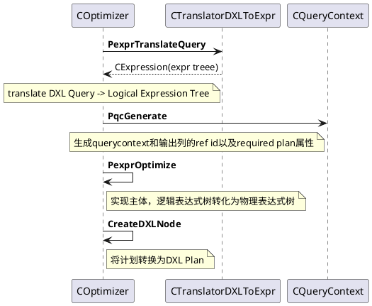

入口函数是`libgpopt\include\gpopt\optimizer\COptimizer.h`的`static CDXLNode *PdxlnOptimiz`。
```c++
static CDXLNode *PdxlnOptimize(
    CMemoryPool *mp, CMDAccessor *md_accessor,  /* MD accessor */
    const CDXLNode *query,
    const CDXLNodeArray*query_output_dxlnode_array,  /*required output columns */
    const CDXLNodeArray *cte_producers,
    IConstExprEvaluator *pceeval,  // constant expression evaluator
    ULONG ulHosts,		// number of hosts (data nodes) in the system
    ULONG ulSessionId,	// session id used for logging and minidumps
    ULONG ulCmdId,		// command id used for logging and minidumps
    CSearchStageArray *search_stage_array,	// search strategy
    COptimizerConfig *optimizer_config,		// optimizer configurations
    const CHAR *szMinidumpFileName = NULL  // name of minidump file to be created
);
```

删除`COptimizer::PdxlnOptimize`的部分非主要代码来了解一下执行的主流程。

```C++
// COptimizer的主要流程
CDXLNode* COptimizer::PdxlnOptimize(
    CMemoryPool *mp, CMDAccessor *md_accessor, const CDXLNode *query,
    const CDXLNodeArray *query_output_dxlnode_array/*required output columns*/,
    ...) {
  /**
   * 1. translate DXL Tree -> logical expression tree
   *     主逻辑在CTranslatorDXLToExpr::Pexpr(dxlnode)
   */    
  CTranslatorDXLToExpr dxltr(mp, md_accessor);
  CExpression *pexprTranslated = dxltr.PexprTranslateQuery(query,
       query_output_dxlnode_array, cte_producers);
  
  /**
   * 2. 根据logical Expression Tree创建Querycontext
   *    2.1  创建querycontext(CQueryContext::PqcGenerate)
   *        1) 创建required plan属性(CReqdPropPlan)存储于CQueryContext::m_prpp
   *        2) 根据query_output_dxlnode_array构造output column id ref
   *           并将相关信息存储于required plan属性的m_pcrs(CReqdPropPlan::m_pcrs)
   *    2.2 CQueryContext构造:
   *        1) 对logical expression预处理(CExpressionPreprocessor::PexprPreprocess)
   *            例如无用信息删除等
   */
  CQueryContext *pqc = CQueryContext::PqcGenerate(mp, pexprTranslated, 
        pdrgpul, pdrgpmdname, true /*fDeriveStats*/);
  
  // 3. 优化主实现, 将logical expression tree转化为physical expression tree
  CExpression *pexprPlan = PexprOptimize(mp, pqc, search_stage_array);
  
  // 4. translate plan into DXL
  CDXLNode *pdxlnPlan = NULL;
  pdxlnPlan = CreateDXLNode(mp, md_accessor, pexprPlan, pqc->PdrgPcr(), pdrgpmdname,ulHosts);
}
```

查询优化主要的调用流程在`COptimizer::PexprOptimize`,先了解一下数据结构
```plantuml
CJob -up--* SJobLink
SJobLink "waiting jobs(N)"-up--* "1" CScheduler

CScheduler -left--* CSchedulerContext
CJobFactory -up--* CSchedulerContext

CEngine -up--* CSchedulerContext
CQueryContext -right--* CEngine
CMemo -up--* CEngine
CSearchStageArray -up--* CEngine

CXformSet -up--* CSearchStageArray
timeThreshold -up--* CSearchStageArray
costThreshold -up--* CSearchStageArray
costBestPlanFound -up--* CSearchStageArray
note bottom of CXformSet: 一组Exploration transform是\n一个search stage

CReqdPropPlan -up--* CQueryContext
CColRefArray -up--* CQueryContext
CExpression -up--* CQueryContext

note bottom of CReqdPropPlan: required plan属性
note bottom of CColRefArray: 输出列信息
note bottom of CExpression: 待优化的逻辑expression树\n据此初始化memo\n(见CEngine::InitLogicalExpression)
```

主要执行流程
```C++
// 利用queryContext优化查询
CExpression * COptimizer::PexprOptimize(CMemoryPool *mp, CQueryContext *pqc,
        CSearchStageArray *search_stage_array) {
    CEngine eng(mp);
    /**
     * 1. 利用QueryContext初始化engine
     *    1.1 如果search_stage_array为空，进行设置默认值
     *        (参见CSearchStage::PdrgpssDefault)
     *    1.2. 利用expression结构构造group,参见CEngine::InitLogicalExpression
     *      1) 为memo设置根，见Memo::SetRoot
     *      2) 将expression的孩子添加到memo中，见CEngine::InsertExpressionChildren
    */
    eng.Init(pqc, search_stage_array);

    /**
     *  2. 优化实现这里将job schedule的状态机运行起来
     *     2.1 创建SchedulerContext
     *     2.2 root group创建JobGroupOptimization(参见CEngine::ScheduleMainJob)，
     *         之后通过状态机调度Implementation和Exploration Job等等
     *     2.3 运行optimize job(参见CScheduler::Run),
     *         在job内部将通过SchedulerContext将创建的job添加单jobquue中
     *         借助CScheduler进行job执行(参见CScheduler::ExecuteJobs)
     *     2.3 在每个search stage的末尾提取最优计划(见CMemo::PexprExtractPlan)
     *         并更新CSearchStage中的m_pexprBest和m_costBest(参见CSearchStage::SetBestExpr)
     */ 
    eng.Optimize();

    /**
     * 3. 
    */
    CExpression *pexprPlan = eng.PexprExtractPlan();

    CheckCTEConsistency(mp, pexprPlan);
    return pexprPlan;
}
```

查询优化主要的实现在`CEngine::Optimize`
```C++
void CEngine::Optimize() {
    const ULONG ulJobs = std::min((ULONG) GPOPT_JOBS_CAP,
                (ULONG)(m_pmemo->UlpGroups() * GPOPT_JOBS_PER_GROUP));
    // 通过CJobFactory来创建和释放job资源
    CJobFactory jf(m_mp, ulJobs);
    CScheduler sched(m_mp, ulJobs);
    CSchedulerContext sc;
    /** 
     *  1. 初始化SchedulerContext
    */
    sc.Init(m_mp, &jf, &sched, this);

    const ULONG ulSearchStages = m_search_stage_array->Size();
    for (ULONG ul = 0; !FSearchTerminated() && ul < ulSearchStages; ul++) {
        PssCurrent()->RestartTimer();

        // optimize root group
        m_pqc->Prpp()->AddRef();
        COptimizationContext *poc = GPOS_NEW(m_mp) COptimizationContext(
            m_mp,  PgroupRoot(),
            // required plan属性，在CQueryContext::PqcGenerate初始化
            m_pqc->Prpp(),
            // 传入空的required relational属性
            GPOS_NEW(m_mp) CReqdPropRelational(GPOS_NEW(m_mp) CColRefSet(m_mp)),
            //初始传入空的stats context
            GPOS_NEW(m_mp) IStatisticsArray(m_mp),
            m_ulCurrSearchStage);

        /**
         * 2. schedule main optimization job
         *      根据root group创建JobGroupOptimization,整个job的调度是一个状态机
         *      之后通过状态机调度Implementation Job和Exploration Job等等
         */
        ScheduleMainJob(&sc, poc);

        /**
         *  3. run optimization job,从JobQueue中取job并执行
         *     参见CScheduler::FExecute -> CJob::FExecute
         *     负责完成Job任务的类重写FExecute接口和CScheduler交互
        */
        CScheduler::Run(&sc);
        poc->Release();

        // 4. 在当前search stage将结束时提取最优计划
        extract best plan found at the end of current search stage
        CExpression *pexprPlan = m_pmemo->PexprExtractPlan(m_mp, m_pmemo->PgroupRoot(),
                m_pqc->Prpp(), m_search_stage_array->Size());
        PssCurrent()->SetBestExpr(pexprPlan);

        /**
         * 5. 当前search stage完成, 执行一些操作
         *    5.1 标识当前SearchStage的index加1,即m_ulCurrSearchStage++
         *    5.2. reset Memo Group中的state和jobqueue，参见CMemo::ResetGroupStates
        */
        FinalizeSearchStage();
    }

    if (CEnumeratorConfig::FSample()) {
        SamplePlans();
    }
}
```