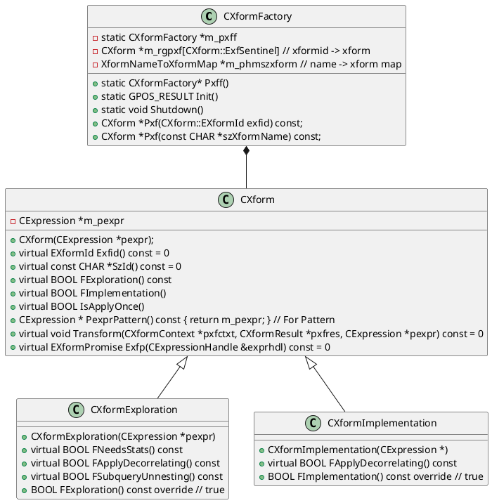

利用转换规则生成等价的逻辑表达式，实现包含两步：
- Exploration，探索和补全计划空间，生成逻辑等价的表达式，例如`a INNER JOIN b`和`b INNER JOIN a`。`CXformExploration`作为表达基类，在其上派生出子类来表示相应的规则。
- Implementation,将逻辑算子转换成物理算子。例如`Join(A,B)-> HashJoin(A, B)`。`CXformImplementation`作为基类，对其派生出子类表示相应的转换规则。

```
EopttraceDisableXformBase
```

`CXformExploration`和`CXformImplementation`都继承自`CXform`，每个`XFrom`都有一个唯一的`EXformId`和`xformName`，之后注册到`CXformFactory`,外界通过`EXformId`或`xformName`便可以获取到`xform`指针。每个负责具体的`Transformation`主要实现`Transform`和`EXformPromise Exfp`计算Promise置信度，`ORCA`会选择Promise高的`GroupExpression`，对于promise为`ExfpNone`的不会调用`Transform`接口。

关于Promise在ORCA的论文中有如下相关的描述
> In order to derive statistics for a target group, Orca picks the group expression with the highest promise of delivering reliable statistics. Statistics promise computation is expression-specific. For example, an InnerJoin expression with a small number of join conditions is more promising than another equivalent InnerJoin expression with a larger number of join conditions (this situation could arise when generating multiple join orders). The rationale is that the larger the number of join conditions, the higher the chance that estimation errors are propagated and amplified. Computing a confidence score for cardinality estimation is challenging due to the need to aggregate confidence scores across all nodes of a given expression. We are currently exploring several methods to compute confidence scores in the compact Memo structure.
> 
> 有道翻译供参考：
> 
> 为了获得目标Group的统计信息，Orca选择了最有可能提供可靠统计信息的`GroupExpression`。 统计promisze计算是特定于表达式的。 例如，具有少量连接条件的`InnerJoin`表达式比具有大量连接条件的另一个等效`InnerJoin`表达式更有希望(在生成多个`JoinOrder`时可能会出现这种情况)。 其基本原理是，连接条件的数量越多，估计误差被传播和放大的几率就越高。 由于需要在给定表达式的所有节点上聚合置信度得分，计算基数估计的置信度得分具有挑战性。 我们目前正在探索几种方法来计算紧凑的Memo结构中的置信度分数。

`CXform`主要的接口：

```C++
class CXform {
private:
    // 输入，内含COperator，通过构造函数赋值
    CExpression *m_pexpr

public:
    // XformID,唯一的，借此在CXformFactory的Pxf(CXform::EXformId)获取到CXform指针
    virtual EXformId Exfid() const = 0
    // xform name,借此可以在CXformFactory的Pxf(const CHAR*)获取到CXform指针
    virtual const CHAR *SzId() const = 0
    
    // 表示Tranformation的类型，Exploration为true，否则为false
    virtual BOOL FExploration() const
    // Implementation为true，否则为false
    virtual BOOL FImplementation() const
    
    // Pattren, 在CGroupExpression::Transform中被CBinding使用
    CExpression * PexprPattern() const { return m_pexpr; }

    // 实现Transform的接口，每个具体负责Transformation的类要实现它
    virtual void Transform(CXformContext *pxfctxt,
                           CXformResult *pxfres, CExpression *pexpr) const = 0
    
    // compute xform promise for a given expression handle
    virtual EXformPromise Exfp(CExpressionHandle &exprhdl) const = 0
};
```

`Xform`的功能通过`CXformFactory`单例对外提供服务，借助`xformID`和`xformName`,来获取相应的`CXform`指针,进而调用相应的计算Promise和`TransForm`接口。

```C++
class CXformFactory {
public:
    // 初始化，通过CXformFactory::Add接口创建所有的xform
    // 构建基于xformID和CXform的数组映射m_rgpxf
    // <xformName, CXform*>的key-value组合的m_phmszxform
    void Instantiate();

    // 根据xformID获取CXform指针
    CXform *Pxf(CXform::EXformId exfid) const;
    // 根据xformName获取CXform指针
    CXform *Pxf(const CHAR *szXformName) const;

    // 对外的CXformFactory单例访问接口
    static CXformFactory *Pxff()
}
```


# 和Job接口关系
任务调度的过程和`Xform`只有`CJobTransformation::EevtTransform`接口调用`CGroupExpression::Transform`调用`Xform::Transform`，各个Job通过调用这里进行RBO变换。
```C++
// 采用给定的xform进行Transform
// 删除一些代码实现了解主调用逻辑
void CGroupExpression::Transform(CMemoryPool *mp, CMemoryPool *pmpLocal, CXform *pxform
        CXformResult *pxfres, ULONG *pulElapsedTime, ULONG *pulNumberOfBindings) {
	// check traceflag and compatibility with origin xform
	if (GPOPT_FDISABLED_XFORM(pxform->Exfid()) || !pxform->FCompatible(m_exfidOrigin)) {
		return;
	}

	// check xform promise
	CExpressionHandle exprhdl(mp);
	exprhdl.Attach(this);
	exprhdl.DeriveProps(nullptr /*pdpctxt*/);
    // 
	if (CXform::ExfpNone == pxform->Exfp(exprhdl)) {
		return;
	}

	// pre-processing before applying xform to group expression
	PreprocessTransform(pmpLocal, mp, pxform);

	// extract memo bindings to apply xform
	CBinding binding;
	CXformContext *pxfctxt = GPOS_NEW(mp) CXformContext(mp);

	COptimizerConfig *optconfig = COptCtxt::PoctxtFromTLS()->GetOptimizerConfig();
	ULONG bindThreshold = optconfig->GetHint()->UlXformBindThreshold();
	CExpression *pexprPattern = pxform->PexprPattern();
	CExpression *pexpr = binding.PexprExtract(mp, this, pexprPattern, nullptr);
	while (nullptr != pexpr) {
		++(*pulNumberOfBindings);
		ULONG ulNumResults = pxfres->Pdrgpexpr()->Size();
		pxform->Transform(pxfctxt, pxfres, pexpr);
		ulNumResults = pxfres->Pdrgpexpr()->Size() - ulNumResults;
		PrintXform(mp, pxform, pexpr, pxfres, ulNumResults);

		if ((bindThreshold != 0 && (*pulNumberOfBindings) > bindThreshold) || pxform->IsApplyOnce() ||
			(0 < pxfres->Pdrgpexpr()->Size() && !CXformUtils::FApplyToNextBinding(pxform, pexpr))) {
			// do not apply xform to other possible patterns
			pexpr->Release();
			break;
		}

		CExpression *pexprLast = pexpr;
		pexpr = binding.PexprExtract(mp, this, pexprPattern, pexprLast);
	}

	// post-prcoessing before applying xform to group expression
	PostprocessTransform(pmpLocal, mp, pxform);
}
```

# 参考资料
- [GPORCA优化器Transform流程](https://blog.csdn.net/dusx1981/article/details/124553274)
- [深入浅出GPORCA 优化器Transform流程](https://view.inews.qq.com/a/20220512A08XU200?tbkt=A&uid=)
