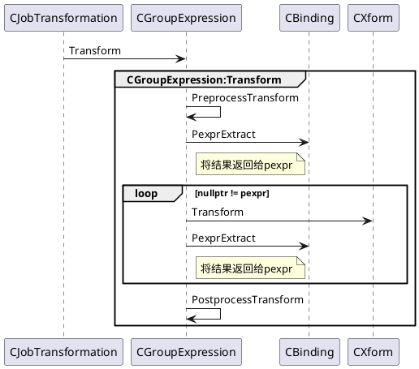

Orca优化器主要分为三个阶段：

- `Exploration`：推导等价的逻辑表达式
- `Implementation`：将逻辑表达式转化为物理表达式
- `Optimization`：搜索最优的执行计划

其中，`Exploration`和`Implementation`都是把一个表达式，转换为另一个等价表达式，统称为`Transformation`，该转换是基于规则进行的，称为基于规则的优化(`Role Based Optimization，RBO`)。`Optimization`主要是基于代价，比较不同的等价物理表达式树的代价，把总代价为最小的执行计划，作为最优解，输出给执行器执行；是基于代价的，称为基于代价的优化（`Cost Based Optimization，CBO`）。

对于`Exploration`和`Implementation`的RBO的变换，ORCA提供了一组`Xform`上层的接口可以通过`CXformFactory`根据xfomid获取到相应的`Xform`指针进而调用`Transform`来调用相应的实现。任务调度的过程和`Xform`只有`CJobTransformation::EevtTransform`接口调用`CGroupExpression::Transform`调用`Xform::Transform`，各个Job通过调用这里进行RBO变换。
```shell
CJobTransformation::EevtTransform
    -> CGroupExpression::Transform
        -> Xform::Transform
```


# Schedule Group Optimization

```C++
// Scheduler通过该接口Excute Job,可以看到这里触发状态机状态变换
// 这个触发状态机，因此接口中的pjOwner也就是this
BOOL CJobGroupOptimization::FExecute(CSchedulerContext *psc) {
	return m_jsm.FRun(psc, this);
}
```

Job的调度由`CEngine::ScheduleMainJob`构造出的`CJobGroupOptimization`开始，这里是调度开始的入口，从这里开始跟进。
```C++
// Schedule a new group optimization job
void CJobGroupOptimization::ScheduleJob(CSchedulerContext *psc, CGroup *pgroup,
        CGroupExpression *pgexprOrigin, COptimizationContext *poc, CJob *pjParent) {
    // 通过CJobFactory创建CJobGroupOptimization
    CJob *pj = psc->Pjf()->PjCreate(CJob::EjtGroupOptimization);

    CJobGroupOptimization *pjgo = PjConvert(pj);
    pjgo->Init(pgroup, pgexprOrigin, poc);
    // 添加到Scheduler中的waiting list(m_listjlWaiting)
    psc->Psched()->Add(pjgo, pjParent);
}
```

```C++
CJobGroupOptimization::EEvent 
    CJobGroupOptimization::EevtStartOptimization(CSchedulerContext *psc, CJob *pjOwner) {
    CJobGroupOptimization *pjgo = PjConvert(pjOwner);
    CGroup *pgroup = pjgo->m_pgroup;
    
    // Group还没有Implementation,那么schedule JobGroupImplementation
    // 当取不到unImplementateGroup Expression认为当前Group Implementated
    // 参见 CJobGroupImplementation::EevtImplementChildren
    if (!pgroup->FImplemented()) {
        CJobGroupImplementation::ScheduleJob(psc, pgroup, pjgo);
        return eevImplementing;
    }

    // move optimization context to optimizing state
    pjgo->m_poc->SetState(COptimizationContext::estOptimizing);

    // if this is the root, release implementation jobs
    if (psc->Peng()->FRoot(pgroup)) {
        psc->Pjf()->Truncate(EjtGroupImplementation);
        psc->Pjf()->Truncate(EjtGroupExpressionImplementation);
    }

    // 将当前job的optimization level设置为group中最大的optimization level
    // 之后进行child group expression Optimize是以当前的optimization level进行
    // 由于optimization level高，有优先权，因此可以抑制其他的groupexpression的优化
    pjgo->m_eolCurrent = pgroup->EolMax();
    return eevImplemented;
}
```

当Group完成Implementation，开始执行
```C++
// Optimize child group expressions
CJobGroupOptimization::EEvent
CJobGroupOptimization::EevtOptimizeChildren(CSchedulerContext *psc, CJob *pjOwner) {
	CJobGroupOptimization *pjgo = PjConvert(pjOwner);
	if (pjgo->FScheduleGroupExpressions(psc)) {
		return eevOptimizing;
	}
	return eevOptimizedCurrentLevel;
}

BOOL CJobGroupOptimization::FScheduleGroupExpressions(CSchedulerContext *psc) {
    // 在Init时将m_pgexprLastScheduled设置为null,
    // 即上个schedule的Group Expression是null, 参见CJobGroup::Init
    // 取pgexprLast为m_pgexprLastScheduled，之后开始schedule child group expression
    // 并更新pgexprLast，如果
	CGroupExpression *pgexprLast = m_pgexprLastScheduled;
	// iterate on expressions and schedule them as needed
	CGroupExpression *pgexpr = PgexprFirstUnsched();
	while (nullptr != pgexpr) {
        // 以当前的optimization level优化child group expression
        // 在上面的EevtStartOptimization将当前optimization level设置为最大
        // 因此child group expression有优先权
		if (psc->Peng()->FOptimizeChild(m_pgexprOrigin, pgexpr, m_poc, EolCurrent())) {
			const ULONG ulOptRequests =CPhysical::PopConvert(pgexpr->Pop())->UlOptRequests();
			for (ULONG ul = 0; ul < ulOptRequests; ul++) {
				// schedule an optimization job for each request
				CJobGroupExpressionOptimization::ScheduleJob(psc, pgexpr, m_poc,ul, this);
			}
		}
		pgexprLast = pgexpr;

		// move to next expression
		{
			CGroupProxy gp(m_pgroup);
			pgexpr = gp.PgexprSkipLogical(pgexpr);
		}
	}
	BOOL fNewJobs = (m_pgexprLastScheduled != pgexprLast);

	// set last scheduled expression
	m_pgexprLastScheduled = pgexprLast;
	return fNewJobs;
}
```


```C++
CJobGroupOptimization::EEvent
CJobGroupOptimization::EevtCompleteOptimization(CSchedulerContext *, CJob *pjOwner) {
	CJobGroupOptimization *pjgo = PjConvert(pjOwner);

	// 降低当前的Optimization Level降低其执行优先级
    // High -> Low, Low -> EolSentinel
	pjgo->DampOptimizationLevel();
	if (EolSentinel != pjgo->EolCurrent()) {
		// we need to optimize group expressions matching current level
		pjgo->m_pgexprLastScheduled = nullptr;
		return eevOptimizing;
	}

	// move optimization context to optimized state
	pjgo->m_poc->SetState(COptimizationContext::estOptimized);

	return eevOptimized;
}
```

# Schedule Group Expression Optimization

在`CJobGroupOptimization::EevtStartOptimization`可以看到当Group Implemented调用`CJobGroupExpressionOptimization::ScheduleJob`开始schedule child group expression optimization。

```C++
void
CJobGroupExpressionOptimization::ScheduleJob(CSchedulerContext *psc,
		CGroupExpression *pgexpr, COptimizationContext *poc,
		ULONG ulOptReq, CJob *pjParent) {
	CJob *pj = psc->Pjf()->PjCreate(CJob::EjtGroupExpressionOptimization);
	CJobGroupExpressionOptimization *pjgeo = PjConvert(pj);
	// 1. CJobGroupExpression::Init
    // 2. Init状态机并设置Action
    // 3. CJob::SetInit(),设置m_fInit=true
    pjgeo->Init(pgexpr, poc, ulOptReq);
	psc->Psched()->Add(pjgeo, pjParent);
}
```

和`CJobGroupOptimization`重写了`FExecute`实现和`Scheduler`的交互接口。

```C++
// Scheduler通过该接口Excute Job,可以看到这里触发状态机状态变换
BOOL CJobGroupExpressionOptimization::FExecute(CSchedulerContext *psc) {
	return m_jsm.FRun(psc, this);
}
```


```C++
// 初始化内部的数据结构
CJobGroupExpressionOptimization::EEvent
CJobGroupExpressionOptimization::EevtInitialize(CSchedulerContext *psc, CJob *pjOwner) {
	CJobGroupExpressionOptimization *pjgeo = PjConvert(pjOwner);
	CExpressionHandle exprhdl(psc->GetGlobalMemoryPool());
	exprhdl.Attach(pjgeo->m_pgexpr);
    // 属性Derive
	exprhdl.DeriveProps(nullptr /*pdpctxt*/);
	if (!psc->Peng()->FCheckReqdProps(exprhdl, pjgeo->m_poc->Prpp(), pjgeo->m_ulOptReq)) {
		return eevFinalized;
	}

    // 检查是否可以不优化child的情况下提前终止
	CCost costLowerBound(GPOPT_INVALID_COST);
	if (psc->Peng()->FSafeToPrune(pjgeo->m_pgexpr, pjgeo->m_poc->Prpp(),
				nullptr /*pccChild*/, gpos::ulong_max /*child_index*/, &costLowerBound)) {
		// 计算group expression cost
        (void) pjgeo->m_pgexpr->PccComputeCost(
			psc->GetGlobalMemoryPool(), pjgeo->m_poc, pjgeo->m_ulOptReq,
			nullptr /*pdrgpoc*/, true /*fPruned*/, costLowerBound);
		return eevFinalized;
	}

	pjgeo->InitChildGroupsOptimization(psc);
	return eevOptimizingChildren;
}
```


```C++
// Optimize child groups
CJobGroupExpressionOptimization::EEvent
CJobGroupExpressionOptimization::EevtOptimizeChildren(CSchedulerContext *psc, CJob *pjOwner) {
	CJobGroupExpressionOptimization *pjgeo = PjConvert(pjOwner);
	if (0 < pjgeo->m_ulArity && !pjgeo->FChildrenScheduled()) {
		pjgeo->ScheduleChildGroupsJobs(psc);
		if (pjgeo->m_fChildOptimizationFailed) {
			pjgeo->Cleanup();
			return eevFinalized;
		}
		return eevOptimizingChildren;
	}
	return eevChildrenOptimized;
}
```

