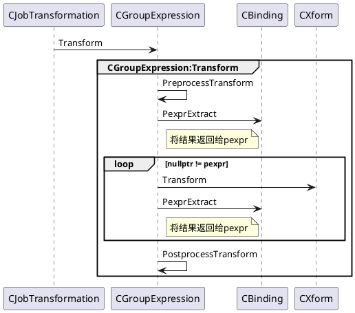

Orca优化器主要分为三个阶段：

- `Exploration`：推导等价的逻辑表达式
- `Implementation`：将逻辑表达式转化为物理表达式
- `Optimization`：搜索最优的执行计划

其中，`Exploration`和`Implementation`都是把一个表达式，转换为另一个等价表达式，统称为`Transformation`，该转换是基于规则进行的，称为基于规则的优化(`Role Based Optimization，RBO`)。`Optimization`主要是基于代价，比较不同的等价物理表达式树的代价，把总代价为最小的执行计划，作为最优解，输出给执行器执行；是基于代价的，称为基于代价的优化（`Cost Based Optimization，CBO`）。

对于`Exploration`和`Implementation`的RBO的变换，ORCA提供了一组`Xform`上层的接口可以通过`CXformFactory`根据xfomid获取到相应的`Xform`指针进而调用`Transform`来调用相应的实现。任务调度的过程和`Xform`只有`CJobTransformation::EevtTransform`接口调用`CGroupExpression::Transform`调用`Xform::Transform`，各个Job通过调用这里进行RBO变换。
```shell
CJobTransformation::EevtTransform
    -> CGroupExpression::Transform
        -> Xform::Transform
```


# Schedule Group Optimization

```C++
// Scheduler通过该接口Excute Job,可以看到这里触发状态机状态变换
// 这个触发状态机，因此接口中的pjOwner也就是this
BOOL CJobGroupOptimization::FExecute(CSchedulerContext *psc) {
	return m_jsm.FRun(psc, this);
}
```

Job的调度由`CEngine::ScheduleMainJob`构造出的`CJobGroupOptimization`开始，这里是调度开始的入口，从这里开始跟进。
```C++
// Schedule a new group optimization job
void CJobGroupOptimization::ScheduleJob(CSchedulerContext *psc, CGroup *pgroup,
        CGroupExpression *pgexprOrigin, COptimizationContext *poc, CJob *pjParent) {
    // 通过CJobFactory创建CJobGroupOptimization
    CJob *pj = psc->Pjf()->PjCreate(CJob::EjtGroupOptimization);

    CJobGroupOptimization *pjgo = PjConvert(pj);
    pjgo->Init(pgroup, pgexprOrigin, poc);
    // 添加到Scheduler中的waiting list(m_listjlWaiting)
    psc->Psched()->Add(pjgo, pjParent);
}
```

```C++
CJobGroupOptimization::EEvent 
    CJobGroupOptimization::EevtStartOptimization(CSchedulerContext *psc, CJob *pjOwner) {
    CJobGroupOptimization *pjgo = PjConvert(pjOwner);
    CGroup *pgroup = pjgo->m_pgroup;
    
    // Group还没有Implementation,那么schedule JobGroupImplementation
    // 当取不到unImplementateGroup Expression认为当前Group Implementated
    // 参见 CJobGroupImplementation::EevtImplementChildren
    if (!pgroup->FImplemented()) { // Group not Implement
         // 重要:调度JobGroupImplementation的入口
        // schedule Group Implementation job
        CJobGroupImplementation::ScheduleJob(psc, pgroup, pjgo);
        return eevImplementing;
    }

    // move optimization context to optimizing state
    pjgo->m_poc->SetState(COptimizationContext::estOptimizing);

    // if this is the root, release implementation jobs
    if (psc->Peng()->FRoot(pgroup)) {
        psc->Pjf()->Truncate(EjtGroupImplementation);
        psc->Pjf()->Truncate(EjtGroupExpressionImplementation);
    }

    // 将当前job的optimization level设置为group中最大的optimization level
    // 之后进行child group expression Optimize是以当前的optimization level进行
    // 由于optimization level高，有优先权，因此可以抑制其他的groupexpression的优化
    pjgo->m_eolCurrent = pgroup->EolMax();
    return eevImplemented;
}
```

当Group完成Implementation，开始执行
```C++
// Optimize child group expressions
CJobGroupOptimization::EEvent
CJobGroupOptimization::EevtOptimizeChildren(CSchedulerContext *psc, CJob *pjOwner) {
	CJobGroupOptimization *pjgo = PjConvert(pjOwner);
	if (pjgo->FScheduleGroupExpressions(psc)) {
		return eevOptimizing;
	}
	return eevOptimizedCurrentLevel;
}

BOOL CJobGroupOptimization::FScheduleGroupExpressions(CSchedulerContext *psc) {
    // 在Init时将m_pgexprLastScheduled设置为null,
    // 即上个schedule的Group Expression是null, 参见CJobGroup::Init
    // 取pgexprLast为m_pgexprLastScheduled，之后开始schedule child group expression
    // 并更新pgexprLast，如果
	CGroupExpression *pgexprLast = m_pgexprLastScheduled;
	// iterate on expressions and schedule them as needed
	CGroupExpression *pgexpr = PgexprFirstUnsched();
	while (nullptr != pgexpr) {
        // 以当前的optimization level优化child group expression
        // 在上面的EevtStartOptimization将当前optimization level设置为最大
        // 因此child group expression有优先权
		if (psc->Peng()->FOptimizeChild(m_pgexprOrigin, pgexpr, m_poc, EolCurrent())) {
			const ULONG ulOptRequests = CPhysical::PopConvert(pgexpr->Pop())->UlOptRequests();
			for (ULONG ul = 0; ul < ulOptRequests; ul++) {
				// schedule an optimization job for each request
				CJobGroupExpressionOptimization::ScheduleJob(psc, pgexpr, m_poc,ul, this);
			}
		}
		pgexprLast = pgexpr;

		// move to next expression
		{
			CGroupProxy gp(m_pgroup);
			pgexpr = gp.PgexprSkipLogical(pgexpr);
		}
	}
	BOOL fNewJobs = (m_pgexprLastScheduled != pgexprLast);

	// set last scheduled expression
	m_pgexprLastScheduled = pgexprLast;
	return fNewJobs;
}
```


```C++
CJobGroupOptimization::EEvent
CJobGroupOptimization::EevtCompleteOptimization(CSchedulerContext *, CJob *pjOwner) {
	CJobGroupOptimization *pjgo = PjConvert(pjOwner);

	// 降低当前的Optimization Level降低其执行优先级
    // High -> Low, Low -> EolSentinel
	pjgo->DampOptimizationLevel();
	if (EolSentinel != pjgo->EolCurrent()) {
		// we need to optimize group expressions matching current level
		pjgo->m_pgexprLastScheduled = nullptr;
		return eevOptimizing;
	}

	// move optimization context to optimized state
	pjgo->m_poc->SetState(COptimizationContext::estOptimized);

	return eevOptimized;
}
```

# Schedule Group Expression Optimization

在`CJobGroupOptimization::FScheduleGroupExpressions`当Group需要optimize(参见`CEngine::FOptimizeChild`)，则调用`CJobGroupExpressionOptimization::ScheduleJob`开始schedule child group expression optimization。

```C++
void CJobGroupExpressionOptimization::ScheduleJob(CSchedulerContext *psc,
		CGroupExpression *pgexpr, COptimizationContext *poc,
		ULONG ulOptReq, CJob *pjParent) {
	CJob *pj = psc->Pjf()->PjCreate(CJob::EjtGroupExpressionOptimization);
	CJobGroupExpressionOptimization *pjgeo = PjConvert(pj);
	// 1. CJobGroupExpression::Init
    // 2. Init状态机并设置Action
    // 3. CJob::SetInit(),设置m_fInit=true
    pjgeo->Init(pgexpr, poc, ulOptReq);
	psc->Psched()->Add(pjgeo, pjParent);
}
```

和`CJobGroupOptimization`一样重写了`FExecute`实现和`Scheduler`的交互接口。

```C++
// Scheduler通过该接口Excute Job,可以看到这里触发状态机状态变换
BOOL CJobGroupExpressionOptimization::FExecute(CSchedulerContext *psc) {
	return m_jsm.FRun(psc, this);
}
```


```C++
// 初始化内部的数据结构
CJobGroupExpressionOptimization::EEvent
CJobGroupExpressionOptimization::EevtInitialize(CSchedulerContext *psc, CJob *pjOwner) {
	CJobGroupExpressionOptimization *pjgeo = PjConvert(pjOwner);
	CExpressionHandle exprhdl(psc->GetGlobalMemoryPool());
	exprhdl.Attach(pjgeo->m_pgexpr);
    // 属性Derive并检查required属性，参见CEngine::FCheckReqdProps
    // 	1. 检查算子是否提供required columns,这里调用DeriveOutputColumns
	exprhdl.DeriveProps(nullptr /*pdpctxt*/);
	if (!psc->Peng()->FCheckReqdProps(exprhdl, pjgeo->m_poc->Prpp(), pjgeo->m_ulOptReq)) {
		return eevFinalized;
	}

    // 检查是否可以不优化child的情况下提前终止
	CCost costLowerBound(GPOPT_INVALID_COST);
	if (psc->Peng()->FSafeToPrune(pjgeo->m_pgexpr, pjgeo->m_poc->Prpp(),
				nullptr /*pccChild*/, gpos::ulong_max /*child_index*/, &costLowerBound)) {
		// 计算group expression cost
        (void) pjgeo->m_pgexpr->PccComputeCost(
			psc->GetGlobalMemoryPool(), pjgeo->m_poc, pjgeo->m_ulOptReq,
			nullptr /*pdrgpoc*/, true /*fPruned*/, costLowerBound);
		return eevFinalized;
	}

	pjgeo->InitChildGroupsOptimization(psc);
	return eevOptimizingChildren;
}

void CJobGroupExpressionOptimization::InitChildGroupsOptimization(CSchedulerContext *psc) {
	// initialize required plan properties computation
	m_pexprhdlPlan = GPOS_NEW(psc->GetGlobalMemoryPool())
        	CExpressionHandle(psc->GetGlobalMemoryPool());
	m_pexprhdlPlan->Attach(m_pgexpr);
	if (0 < m_ulArity) {
		m_ulChildIndex = m_pexprhdlPlan->UlFirstOptimizedChildIndex();
	}
	m_pexprhdlPlan->DeriveProps(nullptr /*pdpctxt*/);
	m_pexprhdlPlan->InitReqdProps(m_poc->Prpp());

	// initialize required relational properties computation
	m_pexprhdlRel = GPOS_NEW(psc->GetGlobalMemoryPool())
		CExpressionHandle(psc->GetGlobalMemoryPool());
	CGroupExpression *pgexprForStats = m_pgexpr->Pgroup()->PgexprBestPromise(
		psc->GetGlobalMemoryPool(), m_pgexpr);
	if (nullptr != pgexprForStats) {
		m_pexprhdlRel->Attach(pgexprForStats);
		m_pexprhdlRel->DeriveProps(nullptr /*pdpctxt*/);
		m_pexprhdlRel->ComputeReqdProps(m_poc->GetReqdRelationalProps(), 0 /*ulOptReq*/);
	}

	// create child groups derived properties
	m_pdrgpdp = GPOS_NEW(psc->GetGlobalMemoryPool())
		CDrvdPropArray(psc->GetGlobalMemoryPool());

	// initialize stats context with input stats context
	m_pdrgpstatCurrentCtxt = GPOS_NEW(psc->GetGlobalMemoryPool())
		IStatisticsArray(psc->GetGlobalMemoryPool());
	CUtils::AddRefAppend(m_pdrgpstatCurrentCtxt, m_poc->Pdrgpstat());
}
```


```C++
// Optimize child groups
CJobGroupExpressionOptimization::EEvent
CJobGroupExpressionOptimization::EevtOptimizeChildren(CSchedulerContext *psc, CJob *pjOwner) {
	CJobGroupExpressionOptimization *pjgeo = PjConvert(pjOwner);
	if (0 < pjgeo->m_ulArity && !pjgeo->FChildrenScheduled()) {
		pjgeo->ScheduleChildGroupsJobs(psc);
		if (pjgeo->m_fChildOptimizationFailed) {
			pjgeo->Cleanup();
			return eevFinalized;
		}
		return eevOptimizingChildren;
	}
	return eevChildrenOptimized;
}

void CJobGroupExpressionOptimization::ScheduleChildGroupsJobs(CSchedulerContext *psc) {
	CGroup *pgroupChild = (*m_pgexpr)[m_ulChildIndex];
	if (pgroupChild->FScalar()) {
		if (!m_pexprhdlPlan->FNextChildIndex(&m_ulChildIndex)){
			// child group optimization is complete
			SetChildrenScheduled();
		}
		return;
	}

	ComputeCurrentChildRequirements(psc);
			.......

	// use current stats for optimizing current child
	IStatisticsArray *stats_ctxt = GPOS_NEW(psc->GetGlobalMemoryPool())
		IStatisticsArray(psc->GetGlobalMemoryPool());
	CUtils::AddRefAppend(stats_ctxt, m_pdrgpstatCurrentCtxt);

	// compute required relational properties
	CReqdPropRelational *prprel = nullptr;
	if (CPhysical::PopConvert(m_pgexpr->Pop())->FPassThruStats()) {
		prprel = m_poc->GetReqdRelationalProps();
	} else {
		// retrieve requirements from handle
		prprel = m_pexprhdlRel->GetReqdRelationalProps(m_ulChildIndex);
	}

	// schedule optimization job for current child group
	COptimizationContext *pocChild = GPOS_NEW(psc->GetGlobalMemoryPool())
		COptimizationContext(psc->GetGlobalMemoryPool(), pgroupChild,
             m_pexprhdlPlan->Prpp(m_ulChildIndex), prprel,
             stats_ctxt, psc->Peng()->UlCurrSearchStage());
	if (pgroupChild == m_pgexpr->Pgroup() && pocChild->Matches(m_poc)) {
		// this is to prevent deadlocks, child context cannot be the same as parent context
		m_fChildOptimizationFailed = true;
		pocChild->Release();
		return;
	}

    // schedule JobGroupOptimization(即GroupExpression中的Group,pgroupChild)
    // 	 1. parent job : this
	CJobGroupOptimization::ScheduleJob(psc, pgroupChild, m_pgexpr, pocChild, this);
	pocChild->Release();
	if (!m_pexprhdlPlan->FNextChildIndex(&m_ulChildIndex)) { // advance to next child
		// child group optimization is complete
		SetChildrenScheduled();
	}
}

// 计算第N个孩子的required properties
void CExpressionHandle::ComputeChildReqdProps(ULONG child_index,
		CDrvdPropArray *pdrgpdpCtxt, ULONG ulOptReq) {
	CReqdProp *prp = m_prp;
	if (FScalarChild(child_index)) {
		// use local reqd properties to fill scalar child entry in children array
		prp->AddRef();
	} else {
		prp = Pop()->PrpCreate(m_mp);
		prp->Compute(m_mp, *this, m_prp, child_index, pdrgpdpCtxt, ulOptReq);
	}
	m_pdrgprp->Replace(child_index, prp);
}
```


```C++
// 添加required enforcer
CJobGroupExpressionOptimization::EEvent
CJobGroupExpressionOptimization::EevtAddEnforcers(CSchedulerContext *psc, CJob *pjOwner){
	CJobGroupExpressionOptimization *pjgeo = PjConvert(pjOwner);
	pjgeo->m_pdrgpoc = psc->Peng()->PdrgpocChildren(
        	psc->GetGlobalMemoryPool(),*pjgeo->m_pexprhdlPlan);

	// enforce physical properties
	BOOL fCheckEnfdProps = psc->Peng()->FCheckEnfdProps(
		psc->GetGlobalMemoryPool(), pjgeo->m_pgexpr, pjgeo->m_poc,
		pjgeo->m_ulOptReq, pjgeo->m_pdrgpoc);
	if (fCheckEnfdProps) {
        // enforcer是optional或unnecessary不添加新的enforer,继续优化当前group expression
		return eevOptimizingSelf;
	}

    // 	此时job可以被finalized，有两种情况会走到这里：
    // 	  1. 添加enforcer被禁止(prohibited),不必再优化当前的Group Expression
    // 	  2. enforcer是required。新增的enforcer group expression之后再创建job优化
	pjgeo->Cleanup();
	return eevFinalized;
}
```


```C++
// Optimize group expression
CJobGroupExpressionOptimization::EEvent
CJobGroupExpressionOptimization::EevtOptimizeSelf(CSchedulerContext *psc, CJob *pjOwner) {
	CJobGroupExpressionOptimization *pjgeo = PjConvert(pjOwner);
	if (pjgeo->m_fScheduledCTEOptimization) {
		// current job has triggered a CTE optimization child job,
		// we can only come here if the child job is complete,
		// we can now safely terminate current job
		return eevSelfOptimized;
	}

	// compute group expression cost under current context
	COptimizationContext *poc = pjgeo->m_poc;
	CGroupExpression *pgexpr = pjgeo->m_pgexpr;
	COptimizationContextArray *pdrgpoc = pjgeo->m_pdrgpoc;
	ULONG ulOptReq = pjgeo->m_ulOptReq;
	CCostContext *pcc = pgexpr->PccComputeCost(psc->GetGlobalMemoryPool(), poc, ulOptReq,
							   pdrgpoc, false /*fPruned*/, CCost(0.0));

	if (nullptr == pcc) { // 创建CostContext失败终止optimization job
		pjgeo->Cleanup();
		return eevFinalized;
	}

	pgexpr->Pgroup()->UpdateBestCost(poc, pcc);
    // 和EopttraceDisablePushingCTEConsumerReqsToCTEProducer配置参数相关
	if (FScheduleCTEOptimization(psc, pgexpr, poc, ulOptReq, pjgeo)) {
		// a child job for optimizing CTE has been scheduled
		pjgeo->m_fScheduledCTEOptimization = true;
		// suspend current job until CTE optimization child job is complete
		return eevOptimizingSelf;
	}
	return eevSelfOptimized;
}
```


```C++
// Finalize optimization
CJobGroupExpressionOptimization::EEvent
CJobGroupExpressionOptimization::EevtFinalize(CSchedulerContext *, CJob *pjOwner){
	CJobGroupExpressionOptimization *pjgeo = PjConvert(pjOwner);
    // 释放分配的内存
	pjgeo->Cleanup();
	return eevFinalized;
}
```


# Schedule Group Implementation

在`CJobGroupOptimization::EevtStartOptimization`可以看到当Group Implemented调用`CJobGroupImplementation::ScheduleJob`开始schedule group expression Implementation。

```C++
void CJobGroupImplementation::ScheduleJob(CSchedulerContext *psc, CGroup *pgroup, CJob *pjParent) {
	CJob *pj = psc->Pjf()->PjCreate(CJob::EjtGroupImplementation);
	CJobGroupImplementation *pjgi = PjConvert(pj);
    // job初始化
    // 	1. CJobGroup::Init. m_pgroup=pgroup,m_pgexprLastScheduled=nullptr
    // 	2. 状态机初始化并设置Action.
    // 	3. 设置JobQueue. 即Group拥有m_jqImplementation(implementation job queue)
    // 	4. CJob::SetInit.将m_fInit设置为true
	pjgi->Init(pgroup);
	psc->Psched()->Add(pjgi, pjParent);
}
```

实现`CJobGroupImplementation::FExecute`实现和`Scheduler`的交互接口。

```C++
BOOL CJobGroupImplementation::FExecute(CSchedulerContext *psc) {
	return m_jsm.FRun(psc, this);
}
```


```C++
CJobGroupImplementation::EEvent
CJobGroupImplementation::EevtStartImplementation(CSchedulerContext *psc, CJob *pjOwner) {
	CJobGroupImplementation *pjgi = PjConvert(pjOwner);
	CGroup *pgroup = pjgi->m_pgroup;
    // group没有Explorered，schedule group exploration job
	if (!pgroup->FExplored()) {
		CJobGroupExploration::ScheduleJob(psc, pgroup, pjgi);
		return eevExploring;
	} else {
		{ // move group to implementation state
			CGroupProxy gp(pgroup);
			gp.SetState(CGroup::estImplementing);
		}

		// 如果根Group，释放exploration job的资源
		if (psc->Peng()->FRoot(pgroup)) {
			psc->Pjf()->Truncate(EjtGroupExploration);
			psc->Pjf()->Truncate(EjtGroupExpressionExploration);
		}
		return eevExplored;
	}
}
```


```C++
CJobGroupImplementation::EEvent
CJobGroupImplementation::EevtImplementChildren(CSchedulerContext *psc, CJob *pjOwner) {
	CJobGroupImplementation *pjgi = PjConvert(pjOwner);
	if (pjgi->FScheduleGroupExpressions(psc)) {
		return eevImplementing;
	} else {
		{ // move group to implemented state
			CGroupProxy gp(pjgi->m_pgroup);
			gp.SetState(CGroup::estImplemented);
		}

		// 如果根Group，完成implementation phase
		if (psc->Peng()->FRoot(pjgi->m_pgroup)) {
			psc->Peng()->FinalizeImplementation();
		}
		return eevImplemented;
	}
}

BOOL CJobGroupImplementation::FScheduleGroupExpressions(CSchedulerContext *psc) {
	CGroupExpression *pgexprLast = m_pgexprLastScheduled;
	CGroupExpression *pgexpr = PgexprFirstUnsched();
	while (nullptr != pgexpr) {
		if (!pgexpr->FTransitioned(CGroupExpression::estImplemented) &&
			!pgexpr->ContainsCircularDependencies()) {
			CJobGroupExpressionImplementation::ScheduleJob(psc, pgexpr, this);
			pgexprLast = pgexpr;
		}

		{ // move to next expression
			CGroupProxy gp(m_pgroup);
			pgexpr = gp.PgexprNext(pgexpr);
		}
	}

	BOOL fNewJobs = (m_pgexprLastScheduled != pgexprLast);
	m_pgexprLastScheduled = pgexprLast;
	return fNewJobs;
}
```

# Schedule Group Expression Implementation

在`CJobGroupImplementation::FScheduleGroupExpressions`中如果Group没有Implementation(参见`CGroupExpression::FTransitioned`)，通过`CJobGroupExpressionImplementation::ScheduleJob`来schedule group Expression implementation job。

```C++
void CJobGroupExpressionImplementation::ScheduleJob(CSchedulerContext *psc,
		CGroupExpression *pgexpr, CJob *pjParent) {
	CJob *pj = psc->Pjf()->PjCreate(CJob::EjtGroupExpressionImplementation);
	CJobGroupExpressionImplementation *pjige = PjConvert(pj);
    // 1. CJobGroupExpression::Init. m_pgexpr = pgexpr;
    //		m_fChildrenScheduled=false; m_fXformsScheduled = false;
    // 2. Init状态机并设置Job Action
    // 3. CJob::SetInit(),设置m_fInit=true
	pjige->Init(pgexpr);
	psc->Psched()->Add(pjige, pjParent);
}
```

实现`FExecute`实现和`Scheduler`的交互接口。

```C++
BOOL CJobGroupExpressionImplementation::FExecute(CSchedulerContext *psc) {
	return m_jsm.FRun(psc, this);
}
```


```C++
CJobGroupExpressionImplementation::EEvent
CJobGroupExpressionImplementation::EevtImplementChildren(CSchedulerContext *psc, CJob *pjOwner) {
	CJobGroupExpressionImplementation *pjgei = PjConvert(pjOwner);
    // 还有child group没有Implementation, 为各个child Group
    // schedule Group Implementation Job(参见
    // CJobGroupExpressionImplementation::ScheduleChildGroupsJobs)
    // 完成schedule各个Group Implementation Job设置m_fChildrenScheduled=true
    // 参见SetChildrenScheduled()
	if (!pjgei->FChildrenScheduled()) {
		pjgei->m_pgexpr->SetState(CGroupExpression::estImplementing);
        // schedule各个Group Implementation Job
		pjgei->ScheduleChildGroupsJobs(psc);
		return eevImplementingChildren;
	} else {
		return eevChildrenImplemented;
	}
}

void CJobGroupExpressionImplementation::ScheduleChildGroupsJobs(CSchedulerContext *psc) {
	ULONG arity = m_pgexpr->Arity();
    // schedule各个Group Implementation Job
	for (ULONG i = 0; i < arity; i++) {
		CJobGroupImplementation::ScheduleJob(psc, (*(m_pgexpr))[i], this);
	}
    // 设置m_fChildrenScheduled=true
	SetChildrenScheduled();
}
```


```C++
CJobGroupExpressionImplementation::EEvent
CJobGroupExpressionImplementation::EevtImplementSelf(CSchedulerContext *psc, CJob *pjOwner) {
	CJobGroupExpressionImplementation *pjgei = PjConvert(pjOwner);
    // 存在没有schedule的xform transformation
	if (!pjgei->FXformsScheduled()) {
        // 应用支持的xform规则进行transformation
		pjgei->ScheduleApplicableTransformations(psc);
		return eevImplementingSelf;
	} else {
		return eevSelfImplemented;
	}
}

void CJobGroupExpressionImplementation::ScheduleApplicableTransformations(CSchedulerContext *psc) {
    // 从算子中获取所有候选的xform
	COperator *pop = m_pgexpr->Pop();
	CXformSet *xform_set = CLogical::PopConvert(pop)->PxfsCandidates(
        	psc->GetGlobalMemoryPool());

	// 取算子候选xform, XformFactory所有支持的exploration xform
    // 当前search stage设置的xform取交集
	xform_set->Intersection(CXformFactory::Pxff()->PxfsImplementation());
	xform_set->Intersection(psc->Peng()->PxfsCurrentStage());
    // schedule transformation应用xform规则
    // 参见CJobTransformation::ScheduleJob
	ScheduleTransformations(psc, xform_set);
	xform_set->Release();
    // 设置m_fXformsScheduled为true
	SetXformsScheduled();
}

// 一一应用xform的transformation规则
void CJobGroupExpression::ScheduleTransformations(CSchedulerContext *psc, CXformSet *xform_set){
	CXformSetIter xsi(*(xform_set));
	while (xsi.Advance()) {
		CXform *pxform = CXformFactory::Pxff()->Pxf(xsi.TBit());
		CJobTransformation::ScheduleJob(psc, m_pgexpr, pxform, this);
	}
}
```


```C++
CJobGroupExpressionImplementation::EEvent
CJobGroupExpressionImplementation::EevtFinalize(CSchedulerContext *, CJob *pjOwner) {
	CJobGroupExpressionImplementation *pjgei = PjConvert(pjOwner);
    // Group Expression的state设置为Implemented
	pjgei->m_pgexpr->SetState(CGroupExpression::estImplemented);
	return eevFinalized;
}
```


# Schedule Group Exploration

在`CJobGroupImplementation::EevtStartImplementation`中如果Group没有Exploration，通过`CJobGroupExploration::ScheduleJob`来schedule group implementation job。

```C++
void CJobGroupExploration::ScheduleJob(CSchedulerContext *psc, CGroup *pgroup, CJob *pjParent) {
	CJob *pj = psc->Pjf()->PjCreate(CJob::EjtGroupExploration);
	CJobGroupExploration *pjge = PjConvert(pj);
    // job初始化
    // 	1. CJobGroup::Init. m_pgroup=pgroup,m_pgexprLastScheduled=nullptr
    // 	2. 状态机初始化并设置Action.
    // 	3. 设置JobQueue. 即Group拥有m_jqExploration(exploration job queue)
    // 	4. CJob::SetInit.将m_fInit设置为true
	pjge->Init(pgroup);
	psc->Psched()->Add(pjge, pjParent);
}
```

实现`CJobGroupImplementation::FExecute`实现和`Scheduler`的交互接口。

```C++
BOOL CJobGroupImplementation::FExecute(CSchedulerContext *psc) {
	return m_jsm.FRun(psc, this);
}
```


```C++
CJobGroupExploration::EEvent
CJobGroupExploration::EevtStartExploration(CSchedulerContext *,	CJob *pjOwner) {
	CJobGroupExploration *pjge = PjConvert(pjOwner);
	CGroup *pgroup = pjge->m_pgroup;
	{ // move group to exploration state
		CGroupProxy gp(pgroup);
        // 设置group state为estExploring
		gp.SetState(CGroup::estExploring);
	}
	return eevStartedExploration;
}
```

```C++
// Explore child group expression
CJobGroupExploration::EEvent
CJobGroupExploration::EevtExploreChildren(CSchedulerContext *psc, CJob *pjOwner) {
	CJobGroupExploration *pjge = PjConvert(pjOwner);
    // 对所有没有Exploration group expression, schedule group expression exploration job
    // (重要:开始schedule JobGroupExpressionExploration的入口)
	if (pjge->FScheduleGroupExpressions(psc)) {
		// new expressions have been added to group
		return eevNewChildren;
	} else 
		// no new expressions have been added to group, move to explored state
		{
			CGroupProxy gp(pjge->m_pgroup);
			gp.SetState(CGroup::estExplored);
		}

		if (psc->Peng()->FRoot(pjge->m_pgroup)) 
            // 1. merge group
            // 2. derive statistic(重要:derive stat入口)
			psc->Peng()->FinalizeExploration();
		}
		return eevExplored;
	}
}

BOOL CJobGroupExploration::FScheduleGroupExpressions(CSchedulerContext *psc) {
	CGroupExpression *pgexprLast = m_pgexprLastScheduled;
	CGroupExpression *pgexpr = PgexprFirstUnsched();
	while (nullptr != pgexpr) {
         // Group没有explore, schedule Group Expression Exploration job
		if (!pgexpr->FTransitioned(CGroupExpression::estExplored)) {
			CJobGroupExpressionExploration::ScheduleJob(psc, pgexpr, this);
			pgexprLast = pgexpr;
		}

		{ // move to next expression
			CGroupProxy gp(m_pgroup);
			pgexpr = gp.PgexprNext(pgexpr);
		}
	}
	BOOL fNewJobs = (m_pgexprLastScheduled != pgexprLast);
	m_pgexprLastScheduled = pgexprLast;
	return fNewJobs;
}
```

# Schedule Group Expression Exploration

在`CJobGroupExploration::FScheduleGroupExpressions`中当Group没有过渡到`explored`

`CJobGroupExpressionExploration::ScheduleJob`来schedule group expression eaploration。

```C++
void CJobGroupExpressionExploration::ScheduleJob(CSchedulerContext *psc,
		CGroupExpression *pgexpr, CJob *pjParent) {
	CJob *pj = psc->Pjf()->PjCreate(CJob::EjtGroupExpressionExploration);
	CJobGroupExpressionExploration *pjege = PjConvert(pj);
    // job初始化
    // 	1. CJobGroup::Init. m_pgroup=pgroup,m_fChildrenScheduled = false,
    // 		m_fXformsScheduled = false;
    // 	2. 状态机初始化并设置Job Action.
    // 	3. CJob::SetInit.将m_fInit设置为true
	pjege->Init(pgexpr);
	psc->Psched()->Add(pjege, pjParent);

```

实现`CJobGroupExpressionExploration::FExecute`实现和`Scheduler`的交互接口。

```C++
BOOL CJobGroupExpressionExploration::FExecute(CSchedulerContext *psc) {
	return m_jsm.FRun(psc, this);
}
```


```C++
CJobGroupExpressionExploration::EEvent
CJobGroupExpressionExploration::EevtExploreChildren(CSchedulerContext *psc, CJob *pjOwner) {
	CJobGroupExpressionExploration *pjgee = PjConvert(pjOwner);
    // 如果group没有explorate,为各个child group schedule Group Exploration job
    // 完成各个Group的Exploration,SetChildrenScheduled将m_fChildrenScheduled = true
    // 即进入eevChildrenExplored状态,开始调用EevtExploreSelf
	if (!pjgee->FChildrenScheduled()) {
		pjgee->m_pgexpr->SetState(CGroupExpression::estExploring);
		pjgee->ScheduleChildGroupsJobs(psc);
		return eevExploringChildren;
	} else {
		return eevChildrenExplored;
	}
}


void CJobGroupExpressionExploration::ScheduleChildGroupsJobs(CSchedulerContext *psc) {
	ULONG arity = m_pgexpr->Arity();
	for (ULONG i = 0; i < arity; i++) {
		CJobGroupExploration::ScheduleJob(psc, (*(m_pgexpr))[i], this);
	}
	SetChildrenScheduled();
}
```


```C++
CJobGroupExpressionExploration::EEvent
CJobGroupExpressionExploration::EevtExploreSelf(CSchedulerContext *psc, CJob *pjOwner) {
	CJobGroupExpressionExploration *pjgee = PjConvert(pjOwner);
    // 当schedule可应用的transformation(参见ScheduleApplicableTransformations)
    // 通过SetXformsScheduled将m_fXformsScheduled设置为true
	if (!pjgee->FXformsScheduled()) {
		pjgee->ScheduleApplicableTransformations(psc);
		return eevExploringSelf;
	} else {
		return eevSelfExplored;
	}
}

void CJobGroupExpressionExploration::ScheduleApplicableTransformations(CSchedulerContext *psc) {
	// 从算子中获取所有候选的xform
    COperator *pop = m_pgexpr->Pop();
	CXformSet *xform_set = CLogical::PopConvert(pop)->PxfsCandidates(psc->GetGlobalMemoryPool());

	// 将候选的xform和XformFactory所有支持的exploration xform取交集
	xform_set->Intersection(CXformFactory::Pxff()->PxfsExploration());
	xform_set->Intersection(psc->Peng()->PxfsCurrentStage());
    // schedule transformation将schedule transformation应用xform规则
    // 参见CJobTransformation::ScheduleJob
	ScheduleTransformations(psc, xform_set);
	xform_set->Release();
    // 设置m_fXformsScheduled为true
	SetXformsScheduled();
}

void CJobGroupExpression::ScheduleTransformations(CSchedulerContext *psc, CXformSet *xform_set){
	CXformSetIter xsi(*(xform_set));
	while (xsi.Advance()) {
		CXform *pxform = CXformFactory::Pxff()->Pxf(xsi.TBit());
		CJobTransformation::ScheduleJob(psc, m_pgexpr, pxform, this);
	}
}
```


```C++
CJobGroupExpressionExploration::EEvent
CJobGroupExpressionExploration::EevtFinalize(CSchedulerContext *, CJob *pjOwner) {
	CJobGroupExpressionExploration *pjgee = PjConvert(pjOwner);
	pjgee->m_pgexpr->SetState(CGroupExpression::estExplored);
	return eevFinalized;
}
```


# Schedule Transformation Job

```
CJobGroupExpression::ScheduleTransformations
	-> CJobTransformation::EevtTransform
		-> CGroupExpression::Transform
			-> PexprExtract::PexprExtract
			-> CXform::Transform
```

通过`CJobTransformation::ScheduleJob`来schedule transformation job

```C++
void CJobTransformation::ScheduleJob(CSchedulerContext *psc,
            CGroupExpression *pgexpr, CXform *pxform, CJob *pjParent) {
	CJob *pj = psc->Pjf()->PjCreate(CJob::EjtTransformation);
	CJobTransformation *pjt = PjConvert(pj);
    // 初始化job
    // 	1. m_pgexpr = pgexpr; m_xform = pxform;
    // 	2. 状态机初始化并设置Job Action.
    // 	3. CJob::SetInit.将m_fInit设置为true
	pjt->Init(pgexpr, pxform);
	psc->Psched()->Add(pjt, pjParent);
}
```

实现`CJobTransformation::FExecute`实现和`Scheduler`的交互接口。

```C++
BOOL CJobTransformation::FExecute(CSchedulerContext *psc) {
	return m_jsm.FRun(psc, this);
}
```


```C++
// Apply transformation action
CJobTransformation::EEvent
CJobTransformation::EevtTransform(CSchedulerContext *psc, CJob *pjOwner) {
	CJobTransformation *pjt = PjConvert(pjOwner);
	CMemoryPool *pmpGlobal = psc->GetGlobalMemoryPool();
	CMemoryPool *pmpLocal = psc->PmpLocal();
	CGroupExpression *pgexpr = pjt->m_pgexpr;
	CXform *pxform = pjt->m_xform;

	// insert transformation results to memo
	CXformResult *pxfres = GPOS_NEW(pmpGlobal) CXformResult(pmpGlobal);
	ULONG ulElapsedTime = 0;
	ULONG ulNumberOfBindings = 0;
    // 应用xform transformation
	pgexpr->Transform(pmpGlobal, pmpLocal, pxform, pxfres, &ulElapsedTime,
					  &ulNumberOfBindings);
    // 将xform transformation的结果插入到memo
	psc->Peng()->InsertXformResult(pgexpr->Pgroup(), pxfres, pxform->Exfid(),
               pgexpr, ulElapsedTime, ulNumberOfBindings);
	pxfres->Release();
	return eevCompleted;
}
```


