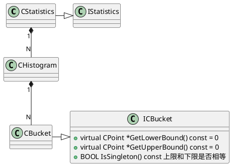

ORCA采用在`IStatistics`派生出`CStatistics`表达统计信息




```C++
class CStatistics : public IStatistics {
private:
	// <column id, 直方图histogram>的HashMap映射
	UlongToHistogramMap *m_colid_histogram_mapping;
	// <column id, 列宽度>HashMap映射
	UlongToDoubleMap *m_colid_width_mapping;
    
    // 基数估计的偏差风险,取值范围1到无穷(inf)
	// 其中1表示从叶子到根计划没有风险
    // join, 选择和groups增大了风险
	ULONG m_stats_estimation_risk;

	CDouble m_rows; // 行数
	BOOL m_empty; // 标识输入关系是否为空
	// 关系中的块数(非总是最新值)
	ULONG m_relpages;
	// 关系中的可见的块数(非总是最新值)
	ULONG m_relallvisible;

	// statistics could be computed using predicates with external parameters (outer
	// references), this is the total number of external parameters' values
	CDouble m_num_rebinds;

	// number of predicates applied
	ULONG m_num_predicates;

	CStatisticsConfig *m_stats_conf;

	// array of upper bound of ndv per source;
	// source can be one of the following operators: like Get, Group By, and Project
	CUpperBoundNDVPtrArray *m_src_upper_bound_NDVs;

	// extended statistics metadata
	const IMDExtStatsInfo *m_ext_stats;

	// map colid to attno (required because extended stats are stored as attno)
	UlongToIntMap *m_colid_to_attno_mapping;

	// 算子中没有基数估计风险的运算符的默认值,1
	static const ULONG no_card_est_risk_default_val;
public:
};

class IStatistics : public CRefCount {
public:
	// 行数
    virtual CDouble Rows() const = 0;
    // 关系中块数(并不总是最新值，在expression中有stat的缓存)
	virtual ULONG RelPages() const = 0;
    // 关系中所有可见块数(并不总是最新值)
	virtual ULONG RelAllVisible() const = 0;
    // 数据宽度,单位byte(字节)
	virtual CDouble Width() const = 0;
	virtual CDouble Width(ULongPtrArray *colids) const = 0;
	virtual CDouble Width(CMemoryPool *mp, CColRefSet *colrefs) const = 0;
	// 获取指定列distinct值的数量
    virtual CDouble GetNDVs(const CColRef *colref) = 0;	

	// is statistics on an empty input
	virtual BOOL IsEmpty() const = 0;

	// statistics could be computed using predicates with external parameters (outer references),
	// this is the total number of external parameters' values
	virtual CDouble NumRebinds() const = 0;
	// set number of rebinds
	virtual void SetRebinds(CDouble num_rebinds) = 0;
    

	// 指定列的偏斜估计
	virtual CDouble GetSkew(ULONG colid) const = 0;
	// 基数估计的偏差
	virtual ULONG StatsEstimationRisk() const = 0;
	// 更新基数估计的偏差
	virtual void SetStatsEstimationRisk(ULONG risk) = 0;

	virtual ULONG GetNumberOfPredicates() const = 0;
    
    // inner join with another stats structure
	virtual IStatistics *CalcInnerJoinStats(CMemoryPool *mp, const IStatistics *
            other_stats, CStatsPredJoinArray *join_preds_stats) const = 0;
	// LOJ with another stats structure
	virtual IStatistics *CalcLOJoinStats(CMemoryPool *mp, const IStatistics *
         other_stats, CStatsPredJoinArray *join_preds_stats) const = 0;
	// semi join stats computation
	virtual IStatistics *CalcLSJoinStats(CMemoryPool *mp, const IStatistics*
         inner_side_stats, CStatsPredJoinArray *join_preds_stats) const = 0;
	// anti semi join
	virtual IStatistics *CalcLASJoinStats(CMemoryPool *mp, const IStatistics *
          other_stats, CStatsPredJoinArray *join_preds_stats,
          BOOL DoIgnoreLASJHistComputation) const = 0;
    
    // return required props associated with stats object
	virtual CReqdPropRelational *GetReqdRelationalProps(CMemoryPool *mp) const = 0;

	// append given stats to current object
	virtual void AppendStats(CMemoryPool *mp, IStatistics *stats) = 0;
	virtual IStatistics *CopyStats(CMemoryPool *mp) const = 0;

	// return a copy of this stats object scaled by a given factor
	virtual IStatistics *ScaleStats(CMemoryPool *mp, CDouble factor) const = 0;

	// copy stats with remapped column ids
	virtual IStatistics *CopyStatsWithRemap(CMemoryPool *mp,
            UlongToColRefMap *colref_mapping, BOOL must_exist = true) const = 0;

	// return a set of column references we have stats for
	virtual CColRefSet *GetColRefSet(CMemoryPool *mp) const = 0;
    
    // 将统计信息转化成DXL结构
	virtual CDXLStatsDerivedRelation *GetDxlStatsDrvdRelation(
        	CMemoryPool *mp, CMDAccessor *md_accessor) const = 0;
};
```

```C++
class CHistogram {
private:
    // 直方图中的所有桶(Bucket), 这在直方图间共享的
    // 因此除非我们先制作一个新副本，否则不得修改
   	// 除非需要，否则不会复制直方图，因为这是一项耗费内存和时间的操作
	CBucketArray *m_histogram_buckets;

	// well-defined histogram. if false, then bounds are unknown
	BOOL m_is_well_defined;

	// null fraction
	CDouble m_null_freq;

	// ndistinct of tuples not covered in the buckets
	CDouble m_distinct_remaining;

	// frequency of tuples not covered in the buckets
	CDouble m_freq_remaining;

	// has histogram skew been measures
	BOOL m_skew_was_measured;

	// skew estimate
	CDouble m_skew;

	// was the NDVs in histogram scaled
	BOOL m_NDVs_were_scaled;

	// is column statistics missing in the database
	BOOL m_is_col_stats_missing;
}
```


```C++
class CBucket : public IBucket {
private:
	// bucket的下限和上限
	CPoint *m_bucket_lower_bound;
	CPoint *m_bucket_upper_bound;

    // 下限和上限是否包含其中
	BOOL m_is_lower_closed;
	BOOL m_is_upper_closed;

	// bucket对应的频率(frequency)
	CDouble m_frequency;
	// bucket中distinct值的数量
	CDouble m_distinct;
};
```

# 统计信息计算
算子中定义了纯虚`COperator::PstatsDerive`函数用于derive statistics，在其上派生逻辑算子重写`PstatsDerive`实现统计信息的计算，`CLogical::PstatsDerive`各个逻辑算子重写实现， 例如`CLogicalLimit::PstatsDerive`调用`CLimitStatsProcessor::CalcLimitStats)`.

```C++
CJobGroupExploration::EevtExploreChildren(当group中所有的group expression完成exploration)
    -> CEngine::FinalizeExploration
    	-> CEngine::DeriveStats
    		-> CExpressionHandle::DeriveStats
    			-> CExpression::PstatsDerive
    				-> CExpressionHandle::DeriveStats(stats_ctxt, true)
    					-> CExpressionHandle::DeriveRootStats
    						-> CLogical::PstatsDerive(derive stat,算子进行统计信息计算)
```

```C++
// 在根group derive stat
void CEngine::DeriveStats(CMemoryPool *pmpLocal) {
	{
		CAutoTimer at(sz, GPOS_FTRACE(EopttracePrintOptimizationStatistics));
		// derive stats on root group
		CEngine::DeriveStats(pmpLocal, m_mp, PgroupRoot(), nullptr /*prprel*/);
	}
}

void CEngine::DeriveStats(CMemoryPool *pmpLocal, CMemoryPool *pmpGlobal,
					 CGroup *pgroup, CReqdPropRelational *prprel) {
	CGroupExpression *pgexprFirst = CEngine::PgexprFirst(pgroup);
	CExpressionHandle exprhdl(pmpGlobal);
	exprhdl.Attach(pgexprFirst);
	exprhdl.DeriveStats(pmpLocal, pmpGlobal, prprel, nullptr /*stats_ctxt*/);
}

void CExpressionHandle::DeriveStats(CMemoryPool *pmpLocal, CMemoryPool *pmpGlobal,
           CReqdPropRelational *prprel, IStatisticsArray *stats_ctxt) const {
	CReqdPropRelational *prprelNew = prprel;
    IStatisticsArray *pdrgpstatCtxtNew = stats_ctxt;
    		.....
    if (nullptr != Pgexpr()) { // group expression不为空
        // 在group上递归地derive statistic, 参见CGroup::PstatsRecursiveDerive
		(void) Pgexpr()->Pgroup()->PstatsRecursiveDerive(
			pmpLocal, pmpGlobal, prprelNew, pdrgpstatCtxtNew);
	} else {
         // Derive statistics, 参见CExpression::PstatsDerive
		(void) Pexpr()->PstatsDerive(prprelNew, pdrgpstatCtxtNew);
	}
    		......
}
```


```C++
// 在group上递归地derive statistic,此时还没有Implemente,在逻辑算子derive stat
IStatistics * CGroup::PstatsRecursiveDerive(CMemoryPool *pmpLocal, CMemoryPool *pmpGlobal,
          CReqdPropRelational *prprel, IStatisticsArray *stats_ctxt) {
	if (FScalar()) { // scalar group创建空stats
		return PstatsInitEmpty(pmpGlobal);
	}

	IStatistics *stats = nullptr;
	if (FDuplicateGroup()) {
		// call stat derivation on the duplicate group
		stats = PgroupDuplicate()->PstatsRecursiveDerive(
            	pmpLocal, pmpGlobal, prprel, stats_ctxt);
	}

	CReqdPropRelational *prprelInput = prprel;
	if (nullptr == stats) {
		stats = Pstats();
	}
	if (nullptr != stats) {
		CReqdPropRelational *prprelExisting = stats->GetReqdRelationalProps(pmpGlobal);
		prprelInput = prprel->PrprelDifference(pmpGlobal, prprelExisting);
		if (prprelInput->IsEmpty()) {
             // 已获取stat已包含必需的stat列
			return stats;
		}
	}

	// 寻找promise高的group expression来derive stat
	CGroupExpression *pgexprBest = PgexprBestPromise(pmpLocal, pmpGlobal, prprelInput, stats_ctxt);
	// derive stats on group expression and copy them to group
	stats = pgexprBest->PstatsRecursiveDerive(pmpLocal, pmpGlobal, prprelInput, stats_ctxt);
	if (!FInitStats(stats)) {
		// a group stat object already exists, we append derived stats to that object
		AppendStats(pmpGlobal, stats);
	}
	return Pstats();
}

// Derive statistics
IStatistics * CExpression::PstatsDerive(CReqdPropRelational *prprel, IStatisticsArray *stats_ctxt){
	if (Pop()->FScalar()) {
		if (nullptr == m_pstats) {
			m_pstats = CStatistics::MakeEmptyStats(m_mp);
		}
		return m_pstats;
	}

	CReqdPropRelational *prprelInput = prprel;
	// check if requirements stat are covered by what's already derived
	if (nullptr != m_pstats) {
		CReqdPropRelational *prprelExisting = m_pstats->GetReqdRelationalProps(m_mp);
		prprelInput = prprel->PrprelDifference(m_mp, prprelExisting);
		if (prprelInput->IsEmpty()) {
			// required statistics columns are already covered by existing statistics, clean up
			prprelInput->Release();
			return m_pstats;
		}
	}

	IStatisticsArray *pdrgpstatCtxtNew = stats_ctxt;
	if (nullptr == stats_ctxt) {
		pdrgpstatCtxtNew = GPOS_NEW(m_mp) IStatisticsArray(m_mp);
	} else {
		pdrgpstatCtxtNew->AddRef();
	}

	// trigger recursive property derivation
	CExpressionHandle exprhdl(m_mp);
	exprhdl.Attach(this);
	CDrvdPropCtxtRelational *pdpctxtrel = GPOS_NEW(m_mp) CDrvdPropCtxtRelational(m_mp);
	exprhdl.DeriveProps(pdpctxtrel);

	// compute required relational properties of expression's children
	exprhdl.ComputeReqdProps(prprelInput, 0 /*ulOptReq*/);

	exprhdl.DeriveStats(pdrgpstatCtxtNew);
	// cache derived stats on expression
	IStatistics *stats = exprhdl.Pstats();
	if (nullptr == m_pstats) {
		stats->AddRef();
		m_pstats = stats;
	} else {
		IStatistics *stats_copy = stats->CopyStats(m_mp);
		stats_copy->AppendStats(m_mp, m_pstats);
		m_pstats->Release();
		m_pstats = nullptr;
		m_pstats = stats_copy;
	}
	return m_pstats;
}

void CExpressionHandle::DeriveRootStats(IStatisticsArray *stats_ctxt) {
	CLogical *popLogical = CLogical::PopConvert(Pop());
	IStatistics *pstatsRoot = nullptr;
	if (FAttachedToLeafPattern()) {
		// for leaf patterns extracted from memo, trigger state derivation on origin group
		pstatsRoot = m_pexpr->Pgexpr()->Pgroup()->PstatsRecursiveDerive(
			m_mp, m_mp, CReqdPropRelational::GetReqdRelationalProps(m_prp), stats_ctxt);
	} else {
		// otherwise, derive stats using root operator
		pstatsRoot = popLogical->PstatsDerive(m_mp, *this, stats_ctxt);
	}
	m_pstats = pstatsRoot;
}
```


## 投影统计信息计算

```C++
CStatistics *CProjectStatsProcessor::CalcProjStats(CMemoryPool *mp,
       const CStatistics *input_stats,ULongPtrArray *projection_colids,
       UlongToIDatumMap *datum_map)
```


## 选择统计信息计算

```C++
class CFilterStatsProcessor;

class CStatsPredLike : public CStatsPred;
class CStatsPredConj : public CStatsPred;
class CStatsPredDisj : public CStatsPred;
class CStatsPredArrayCmp : public CStatsPred;
```


## Limit统计信息计算

```C++
CStatistics * CLimitStatsProcessor::CalcLimitStats(CMemoryPool *mp,
	const CStatistics *input_stats, CDouble input_limit_rows) {
	UlongToHistogramMap *colid_histogram = input_stats->CopyHistograms(mp);
	CDouble limit_rows = CStatistics::MinRows;
	if (!input_stats->IsEmpty()) {
		limit_rows = std::max(CStatistics::MinRows, input_limit_rows);
	}
	// create an output stats object
	CStatistics *pstatsLimit = GPOS_NEW(mp) CStatistics(
		mp, colid_histogram, input_stats->CopyWidths(mp), limit_rows,
		input_stats->IsEmpty(), input_stats->GetNumberOfPredicates());

	// In the output statistics object, the upper bound source cardinality of the join column
	// cannot be greater than the upper bound source cardinality information maintained in the input
	// statistics object. Therefore we choose CStatistics::EcbmMin the bounding method which takes
	// the minimum of the cardinality upper bound of the source column (in the input hash map)
	// and estimated limit cardinality.

	// modify source id to upper bound card information
	CStatisticsUtils::ComputeCardUpperBounds(
		mp, input_stats, pstatsLimit, limit_rows,
		CStatistics::EcbmMin /* card_bounding_method */);
	return pstatsLimit;
}
```

## Join统计信息计算

```C++

class CInnerJoinStatsProcessor : public CJoinStatsProcessor;
class CLeftAntiSemiJoinStatsProcessor : public CJoinStatsProcessor;
class CLeftOuterJoinStatsProcessor : public CJoinStatsProcessor;
class CLeftSemiJoinStatsProcessor : public CJoinStatsProcessor;
```


## Groupby统计信息计算

```C++
CStatistics * CGroupByStatsProcessor::CalcGroupByStats(CMemoryPool *mp,
     const CStatistics *input_stats, ULongPtrArray *GCs,
	ULongPtrArray *aggs, CBitSet *keys) {
    
}
```


## UnionAll统计信息计算

```C++
CStatistics *CUnionAllStatsProcessor::CreateStatsForUnionAll(
	CMemoryPool *mp, const CStatistics *stats_first_child,
	const CStatistics *stats_second_child, ULongPtrArray *output_colids,
	ULongPtrArray *first_child_colids, ULongPtrArray *second_child_colids) {
	
}
```

