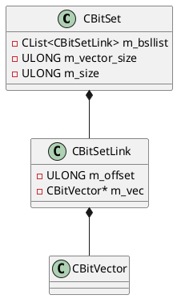
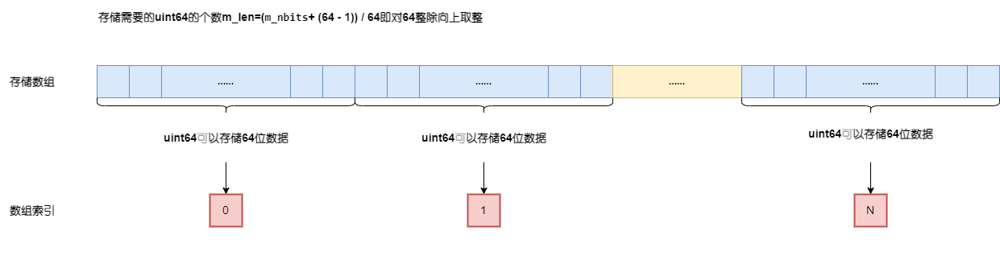
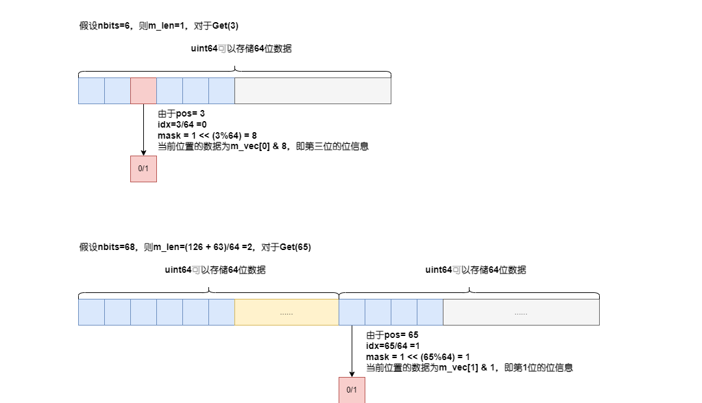
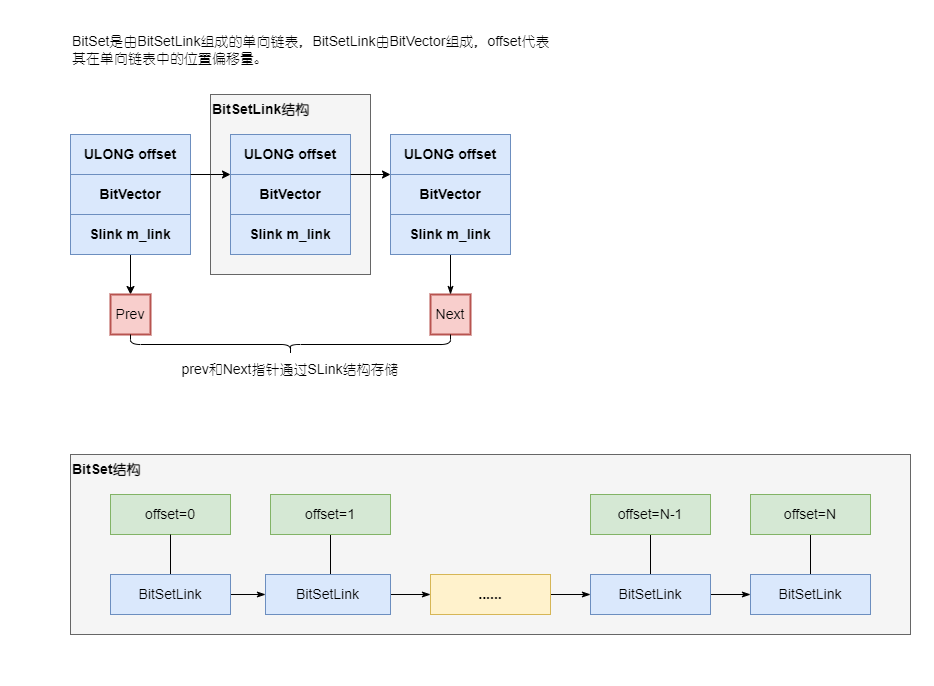

# BitSet解读



# CBitVector数据结构

构造`CBitVector`需要`nbits`指定数据的bit数，ORCA采用一个`uint64`的数组存储数据，并对外提供了一系列的接口通过位操作来实现一些集合操作。

```C++
#define BYTES_PER_UNIT GPOS_SIZEOF(ULLONG) // 8
#define BITS_PER_UNIT (8 * BYTES_PER_UNIT) // 64

CBitVector::CBitVector(CMemoryPool *mp, ULONG nbits)
    : m_nbits(nbits), m_len(0), m_vec(nullptr) {
    // 对64向上取整，由于数据是通过uint64存储的
    // m_len表示储存nbits位信息所需要uint64的数量
    m_len = m_nbits / BITS_PER_UNIT;
    if (m_len * BITS_PER_UNIT < m_nbits) {
        m_len++;
    }

    // 申请数组内存
    m_vec = GPOS_NEW_ARRAY(mp, ULLONG, m_len);

    // 将数组数据初始化为0
    Clear();
}
```

完成初始化，便是一系列通过位操作来实现设置、获取该位信息的接口。
<center>
    
    <div><b>BitVector数据存储图形化表示</b></div>
</center>


`Get`接口获取指定的位是否被设置，如果被设置则响应值为1，否则相应值为0。

```C++
BOOL CBitVector::Get(ULONG pos) const {
    // 获取pos所在uint64位数组m_vec中的索引位置信息
    ULONG idx = pos / BITS_PER_UNIT;
    // 获取存储的uint64所在的位置
    ULLONG mask = ((ULLONG) 1) << (pos % BITS_PER_UNIT);

    return m_vec[idx] & mask;
}
```

<center>
    
    <div><b>BitVector的Get接口获取数据图形化表示</b></div>
</center>

和`Get`接口的原理类似，`ExchangeSet`将相应位置设置为1，并返回设置前对应位置的设置状态
```C++
BOOL CBitVector::ExchangeSet(ULONG pos) {
    // 获取pos位置的设置信息，即设置前pos位置的0/1状态
    BOOL fSet = Get(pos);

    // 获取数组索引idx和uint64所在的位置mask
    ULONG idx = pos / BITS_PER_UNIT;
    ULLONG mask = ((ULLONG) 1) << (pos % BITS_PER_UNIT);

    // 借助or将相应的位置设置为1
    m_vec[idx] |= mask;
    return fSet;
}
```

# CBitSet数据结构
在CBitSet类内部定义了CBitSetLink，将CBitVector和在单向链表中的偏移量封装在其内部
```C++
class CBitSetLink {
private:
    ULONG m_offset;
    CBitVector *m_vec;

public:
    SLink m_link; // 由prev和next两个指针构成

};
```

```C++
class CBitSet {
    // bitset iter needs to access internals
    friend class CBitSetIter;
private:
    CList<CBitSetLink> m_bsllist;
    ULONG m_vector_size;    // size of individual bitvectors
    ULONG m_size; // number of elements
}
```
<center>
    
    <div><b>BitSet数据存储图形化表示</b></div>
</center>
