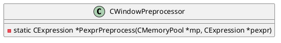
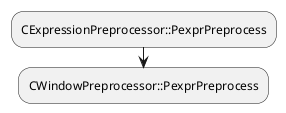
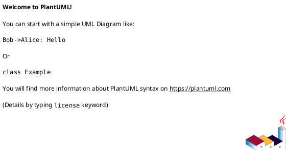

```plantuml
@startuml
class CWindowPreprocessor {
- static CExpression *PexprPreprocess(CMemoryPool *mp, CExpression *pexpr)
}
@enduml
```


```plantuml
@startuml
:CExpressionPreprocessor::PexprPreprocess;
:CWindowPreprocessor::PexprPreprocess;
@enduml
```


```plantuml
@startuml
@enduml
```

```C++
// 窗口统计信息计算
IStatistics * CLogicalUnary::PstatsDeriveProject
CStatistics *CProjectStatsProcessor::CalcProjStats
```

