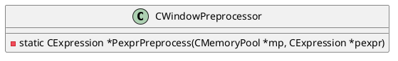
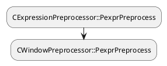
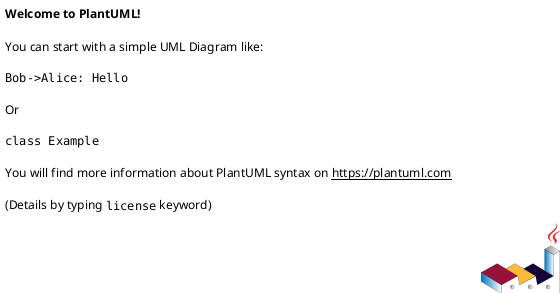

```plantuml
@startuml
class CWindowPreprocessor {
- static CExpression *PexprPreprocess(CMemoryPool *mp, CExpression *pexpr)
}
@enduml
```

```plantuml
@startuml
:CExpressionPreprocessor::PexprPreprocess;
:CWindowPreprocessor::PexprPreprocess;
@enduml
```

```plantuml
@startuml
@enduml
```
