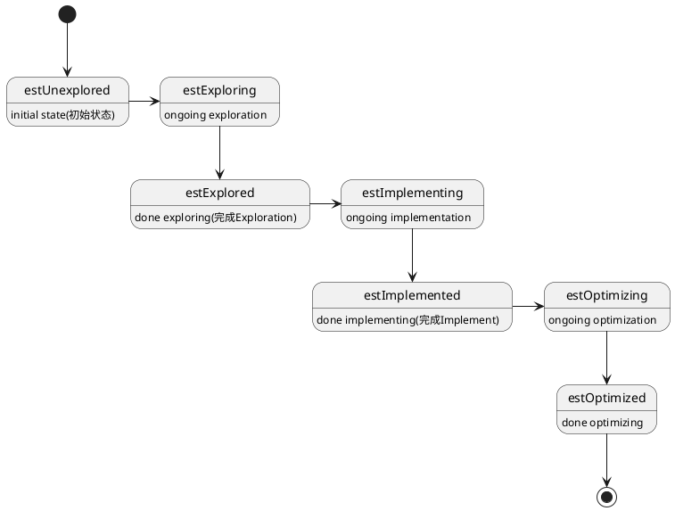

ORCA采用Memo数据结构来存储执行计划的搜索空间，它由一系列的Group组成。Memo存有一个HashTable存储，其Key是GroupExpression的HashValue，Value是GroupExpression，当向memo中插入GroupExpression时，会先在HashTable中进行查找如果存在，就不需要新建Group来节省内存空间。

```C++
// hash function
ULONG HashValue() const {
	return HashValue(m_pop, m_pdrgpgroup);
}

ULONG CGroupExpression::HashValue(COperator *pop, CGroupArray *pdrgpgroup) {
    // GroupExpression中Operator的HashValue
    // 取Operator Id的HashValue，参见下面COperator::HashValue
	ULONG ulHash = pop->HashValue();
    // 获取子Group的HashValue进行combine
    // 取Group ID的HashValue，参见下面CGroup::HashValue
	ULONG arity = pdrgpgroup->Size();
	for (ULONG i = 0; i < arity; i++) {
		ulHash = CombineHashes(ulHash, (*pdrgpgroup)[i]->HashValue());
	}
	return ulHash;
}

ULONG CGroup::HashValue() const {
	ULONG id = m_id;
	if (FDuplicateGroup() && 0 == m_ulGExprs) {
		// group has been merged into another group
		id = PgroupDuplicate()->Id();
	}
	return gpos::HashValue<ULONG>(&id);
}

ULONG COperator::HashValue() const {
	ULONG ulEopid = (ULONG) Eopid();
	return gpos::HashValue<ULONG>(&ulEopid);
}
```


# Memo
```plantuml
class CEngine {
	- CMemo *m_pmemo; // memo table
	- CQueryContext *m_pqc; // query context
}
CEngine -right--* CMemo
```
`CEngine`中拥有`CMemo`结构，并在`CEngine::Init`用根据`CQueryContext`中的逻辑表达式树转化为`CGroup`，从而初始化Memo。其中`CQueryContext`来自`COptimizer`(见`COptimizer::PdxlnOptimize`)，ORCA的输入是一个DXL Tree经过`CTranslatorDXLToExpr`将其转化为Expr Tree从而得到了这个逻辑表达式树作为整个优化的起点。
```C++
// Initialize engine using a given query context
void CEngine::Init(CQueryContext *pqc, CSearchStageArray *search_stage_array) {
	...
	m_pqc = pqc;
	InitLogicalExpression(m_pqc->Pexpr());
}

// 将表达式树以及孩子转化为Group并设置Memo的根Group
void CEngine::InitLogicalExpression(CExpression *pexpr) {
	CGroup *pgroupRoot = PgroupInsert(nullptr /*pgroupTarget*/, pexpr, CXform::ExfInvalid,
					nullptr /*pgexprOrigin*/, false /*fIntermediate*/);
	m_pmemo->SetRoot(pgroupRoot);
}
```
## 数据结构

Memo数据结构的表示

```C++
class CMemo {
private:
    // 根Group
    CGroup *m_pgroupRoot;

    // 所有GroupExpression的HashTable，
    // 插入GroupExpression时先检查是否已经存在，如果存在不需要新建Group可以节省内存空间
    // 参见PgroupInsert
	CSyncHashtable<CGroupExpression, CGroupExpression> m_sht;
}
```

## 数据操作

Memo结构对外提供的数据操作API:

```C++
设置跟Group
void SetRoot(CGroup *pgroup);

将GroupExpression插入Hash Table,如果HashTable中已有该GroupExpression则直接将查找到的GroupExpression中的Group返回，值得注意的是，如果新建了Group，会调用Expression的PdpDerive接口来derive属性
CGroup *PgroupInsert(CGroup *pgroupTarget, CExpression *pexprOrigin,
                     CGroupExpression *pgexpr);

从当前的搜索stage中提取最优的计划
CExpression * PexprExtractPlan(CMemoryPool *mp, CGroup *pgroupRoot,
                        CReqdPropPlan *prppInput, ULONG ulSearchStages)
```

# Group

Group是由一组等价的逻辑或物理表达式，它们产生相同的结果。

在GroupExpression中存储有一个`EOptimizationLevel`类型的数据表示optimization level，在特定的优化上下文中optimization level高的GroupExpression必须在低GroupExpression之前进行优化，Group通过`CGroupExpression::SetOptimizationLevel()`设置GroupExpression的optimization level
```C++
enum EOptimizationLevel {
	EolLow = 0,	 // low optimization level, this is the default level
	EolHigh,	 // high optimization level

	EolSentinel
};
```

Group和GroupExpression都存在一个状态信息，Group和GroupExpression的初始状态为`estUnexplored`, 在JobScheduler的状态机完成状态的切换。


```plantuml
class CGroup {
	- BOOL m_fScalar; // true if group hold scalar expressions

	- CList<CGroupExpression> m_listGExprs;
	- ULONG m_ulGExprs; // number of group expressions

	- EState m_estate;// current state
	- CJobQueue m_jqExploration;
	- CJobQueue m_jqImplementation;
}

class CGroupExpression {
    - COperator *m_pop;
	- CGroupArray *m_pdrgpgroup; // array of child groups
	- CXform::EXformId m_exfidOrigin; // xform id that generated group expression
	- CGroupExpression *m_pgexprOrigin; // group expression that generated current group expression via xform
	- BOOL m_fIntermediate

	- EState m_estate{estUnexplored}; // state of group expression
	- EOptimizationLevel m_eol{EolLow};
}

class CGroupProxy {
	- CGroup *m_pgroup;
}

CGroupProxy -right--|> CGroup
CGroup --* CGroupExpression
```
