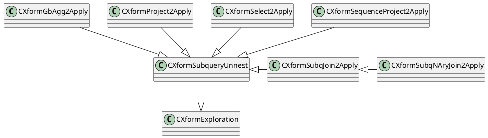
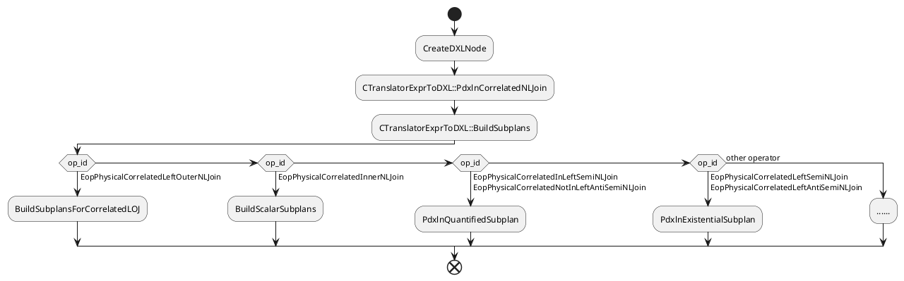
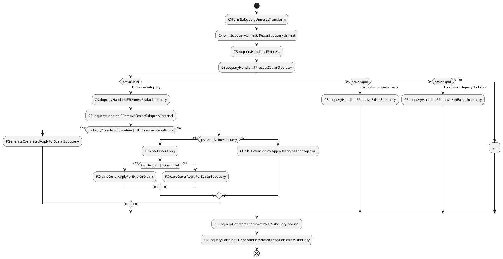

```C++
// Scalar subquery
class CScalarSubquery : public CScalar

//	@class:
//		CScalarSubqueryQuantified
//
//	@doc:
//		Parent class for quantified subquery operators (ALL/ANY subqueries);
//		A quantified subquery expression has two children:
//		- Logical child: the inner logical expression
//		- Scalar child:	the scalar expression in the outer expression that
//		is used in quantified comparison;
//
//		Example: SELECT * from R where a+b = ANY (SELECT c from S);
//		- logical child: (SELECT c from S)
//		- scalar child : (a+b)
class CScalarSubqueryQuantified : public CScalar
class CScalarSubqueryAll : public CScalarSubqueryQuantified
class CScalarSubqueryAny : public CScalarSubqueryQuantified

// Parent class for EXISTS/NOT EXISTS subquery operators
class CScalarSubqueryExistential : public CScalar
class CScalarSubqueryExists : public CScalarSubqueryExistential
class CScalarSubqueryNotExists : public CScalarSubqueryExistential
```

```C++
// Logical left outer Apply operator used in subquery transformations
class CLogicalLeftOuterApply : public CLogicalApply
class CLogicalApply : public CLogical
```

```C++
/*  1. CLogicalProject -> CLogicalLeftOuterApply
        Transform Project to Apply; this transformation is only applicable
        to a Project expression with subqueries in its scalar project list
*/
class CXformProject2Apply : public CXformSubqueryUnnest
//		Base class for subquery unnesting xforms
class CXformSubqueryUnnest : public CXformExploration{}


// 2. CLogicalLeftOuterApply -> CLogicalLeftOuterJoin
// Transform Apply into Join by decorrelating the inner side
class CXformLeftOuterApply2LeftOuterJoin
    : public CXformApply2Join<CLogicalLeftOuterApply, CLogicalLeftOuterJoin> {}
template <class TApply, class TJoin>
class CXformApply2Join : public CXformExploration {}


// 3. LeftOuterJoin -> RightOuterJoin
class CXformLeftJoin2RightJoin : public CXformExploration
```

```C++
// Transform Project to ComputeScalar
// CLogicalProject -> CPhysicalComputeScalar
class CXformProject2ComputeScalar : public CXformImplementation{}

// 逻辑算子转物理算子
class CXformImplementLeftOuterCorrelatedApply
    : public CXformImplementCorrelatedApply<CLogicalLeftOuterCorrelatedApply,
                                            CPhysicalCorrelatedLeftOuterNLJoin> {}
```




根据示例进行代码跟进解读

对于
```sql
EXPLAIN
	SELECT (SELECT sum(a) FROM test_a where test_b.a=test_b.b) FROM test_b;
```

经过preprocess处理之后的语法树
```
Algebrized preprocessed query:
+--CLogicalProject
   |--CLogicalGet "test_b" ("test_b"), Columns: ["a" (0), "b" (1), "c" (2), "d" (3), "ctid" (4), "xmin" (5), "cmin" (6), "xmax" (7), "cmax" (8), "tableoid" (9), "gp_segment_id" (10)] Key sets: {[4,10]}
   +--CScalarProjectList
      +--CScalarProjectElement "sum" (23)
         +--CScalarSubquery["sum" (22)]
            +--CLogicalGbAgg( Global ) Grp Cols: [][Global], Minimal Grp Cols: [], Generates Duplicates :[ 0 ]
               |--CLogicalSelect
               |  |--CLogicalGet "test_a" ("test_a"), Columns: ["a" (11), "b" (12), "c" (13), "d" (14), "ctid" (15), "xmin" (16), "cmin" (17), "xmax" (18), "cmax" (19), "tableoid" (20), "gp_segment_id" (21)] Key sets: {[4,10]}
               |  +--CScalarCmp (=)
               |     |--CScalarIdent "a" (0)
               |     +--CScalarIdent "b" (1)
               +--CScalarProjectList
                  +--CScalarProjectElement "sum" (22)
                     +--CScalarAggFunc (sum , Distinct: false , Aggregate Stage: Global)
                        |--CScalarValuesList
                        |  +--CScalarIdent "a" (11)
                        |--CScalarValuesList
                        |--CScalarValuesList
                        +--CScalarValuesList
```

`CXformProject2Apply`对其进行Exploration处理，它继承自`CXformSubqueryUnnest`采用`CXformSubqueryUnnest::Transform`
```C++
CXformProject2Apply::CXformProject2Apply(CMemoryPool *mp)
    :  CXformSubqueryUnnest(GPOS_NEW(mp) CExpression(
            mp, GPOS_NEW(mp) CLogicalProject(mp),
            GPOS_NEW(mp) CExpression(
                mp, GPOS_NEW(mp) CPatternLeaf(mp)),  // relational child
            GPOS_NEW(mp) CExpression(
                mp, GPOS_NEW(mp) CPatternTree(mp))  // scalar project list
            )) {}
```
`CXformProject2Apply`没有实现`Transform`采用子类的`CXformSubqueryUnnest::Transform`

主要的调用流程:
