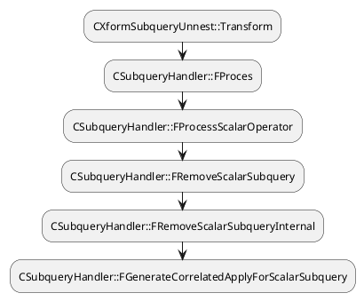
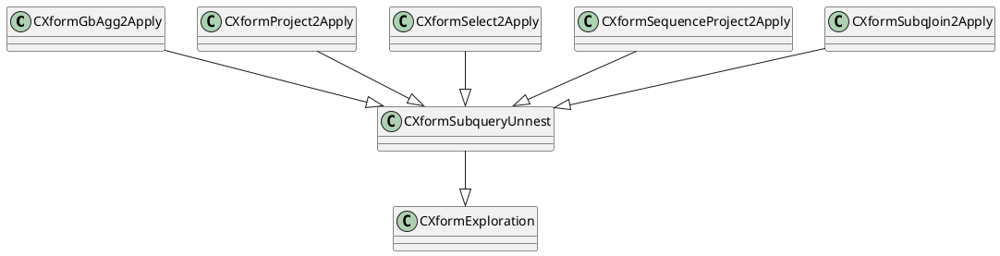

```plantuml
@startuml
:CXformSubqueryUnnest::Transform;
:CSubqueryHandler::FProces;
:CSubqueryHandler::FProcessScalarOperator;
:CSubqueryHandler::FRemoveScalarSubquery;
:CSubqueryHandler::FRemoveScalarSubqueryInternal;
:CSubqueryHandler::FGenerateCorrelatedApplyForScalarSubquery;

@enduml
```

```plantuml
@startuml
CXformGbAgg2Apply -down-|> CXformSubqueryUnnest
CXformProject2Apply -down-|> CXformSubqueryUnnest
CXformSelect2Apply -down-|> CXformSubqueryUnnest
CXformSequenceProject2Apply -down-|> CXformSubqueryUnnest

CXformSubqJoin2Apply -down-|> CXformSubqueryUnnest 
CXformSubqueryUnnest -down-|> CXformExploration 
@enduml
```
