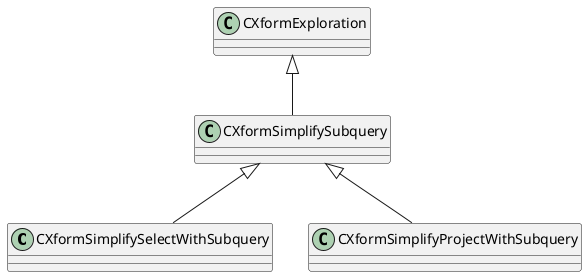
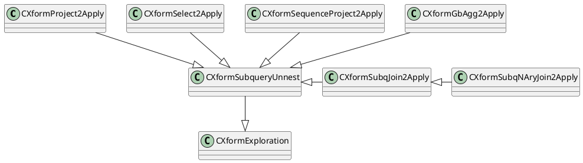
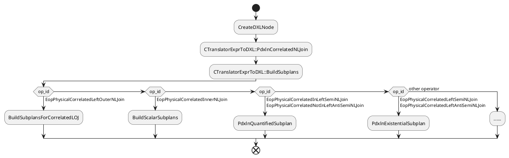
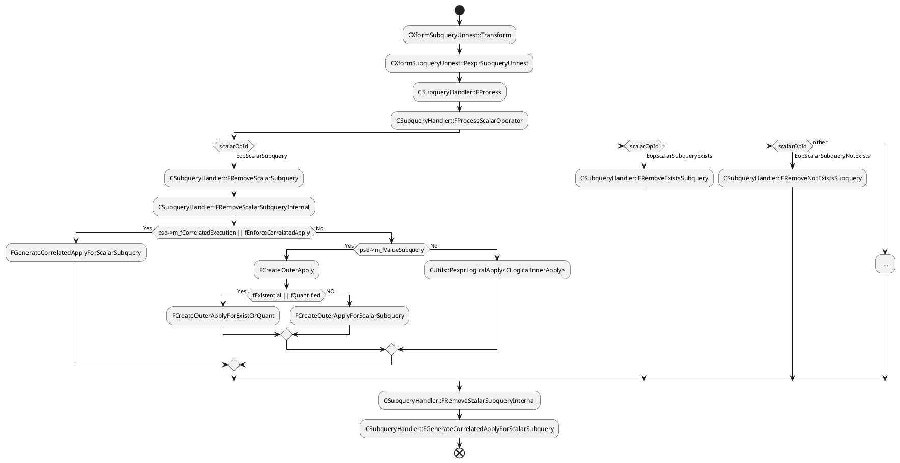

orca对于子查询可以采用去关联化和相关执行两种方式实现：
- **去关联化(Decoorelation或Unnesting)**，理论上可以对任意一个查询去关联化。

例如，对于非相关查询:

```sql
EXPLAIN
    SELECT (SELECT sum(a) FROM test_a) FROM test_b;
```
去关联，将其转化为一个` Nested Loop Left Join`
```
 Gather Motion 3:1  (slice1; segments: 3)  (cost=0.00..1324032.55 rows=1 width=8)
   ->  Nested Loop Left Join  (cost=0.00..1324032.55 rows=1 width=8)
         Join Filter: true
         ->  Seq Scan on test_b  (cost=0.00..431.00 rows=1 width=1)
         ->  Materialize  (cost=0.00..431.00 rows=1 width=8)
               ->  Broadcast Motion 1:3  (slice2)  (cost=0.00..431.00 rows=1 width=8)
                     ->  Finalize Aggregate  (cost=0.00..431.00 rows=1 width=8)
                           ->  Gather Motion 3:1  (slice3; segments: 3)  (cost=0.00..431.00 rows=1 width=8)
                                 ->  Partial Aggregate  (cost=0.00..431.00 rows=1 width=8)
                                       ->  Seq Scan on test_a  (cost=0.00..431.00 rows=1 width=4)
 Optimizer: Pivotal Optimizer (GPORCA)
```
相关查询
```sql
EXPLAIN
    SELECT (SELECT sum(a) FROM test_a where test_a.a=test_b.a) FROM test_b
```
得到`Hash Left Join`执行计划
```
 Gather Motion 3:1  (slice1; segments: 3)  (cost=0.00..862.00 rows=1 width=8)
   ->  Hash Left Join  (cost=0.00..862.00 rows=1 width=8)
         Hash Cond: (test_b.a = test_a.a)
         ->  Seq Scan on test_b  (cost=0.00..431.00 rows=1 width=4)
         ->  Hash  (cost=431.00..431.00 rows=1 width=12)
               ->  GroupAggregate  (cost=0.00..431.00 rows=1 width=12)
                     Group Key: test_a.a
                     ->  Sort  (cost=0.00..431.00 rows=1 width=4)
                           Sort Key: test_a.a
                           ->  Seq Scan on test_a  (cost=0.00..431.00 rows=1 width=4)
 Optimizer: Pivotal Optimizer (GPORCA)
```
- **相关执行(Correlated Execution)**(配置subplan，将结果集物化，再执行外层查询)，可以将`optimizer_enforce_subplans`配置参数设置为true，来强制采取此方式执行，默认该参数为false。例如，非相关子查询
```sql
-- Enforce correlated execution in the optimizer
SET optimizer_enforce_subplans=on;

EXPLAIN
    SELECT (SELECT sum(a) FROM test_a) FROM test_b;
```
可以将`SELECT sum(a) FROM test_a`设置为subplan先执行，将其结果物化，再执行外层的查询
```
 Gather Motion 3:1  (slice1; segments: 3)  (cost=0.00..1324047.16 rows=1 width=8)
   ->  Seq Scan on test_b  (cost=0.00..1324047.16 rows=334 width=8)
         SubPlan 1
           ->  Materialize  (cost=0.00..431.00 rows=1 width=8)
                 ->  Broadcast Motion 1:3  (slice2)  (cost=0.00..431.00 rows=1 width=8)
                       ->  Finalize Aggregate  (cost=0.00..431.00 rows=1 width=8)
                             ->  Gather Motion 3:1  (slice3; segments: 3)  (cost=0.00..431.00 rows=1 width=8)
                                   ->  Partial Aggregate  (cost=0.00..431.00 rows=1 width=8)
                                         ->  Seq Scan on test_a  (cost=0.00..431.00 rows=1 width=4)
 Optimizer: Pivotal Optimizer (GPORCA
```

对于相关查询也可以采用subplan+物化的方式执行
```sql
EXPLAIN
    SELECT (SELECT sum(a) FROM test_a where test_a.a=test_b.a) FROM test_b
```
相关执行的执行计划
```
Gather Motion 3:1  (slice1; segments: 3)  (cost=0.00..1324047.00 rows=1 width=8)
   ->  Seq Scan on test_b  (cost=0.00..1324047.00 rows=334 width=8)
         SubPlan 1
           ->  Aggregate  (cost=0.00..431.00 rows=1 width=8)
                 ->  Result  (cost=0.00..431.00 rows=1 width=4)
                       Filter: (test_a.a = test_b.a)
                       ->  Materialize  (cost=0.00..431.00 rows=1 width=4)
                             ->  Broadcast Motion 3:3  (slice2; segments: 3)  (cost=0.00..431.00 rows=1 width=4)
                                   ->  Seq Scan on test_a  (cost=0.00..431.00 rows=1 width=4)
 Optimizer: Pivotal Optimizer (GPORCA)
```
orca初始化的代数表达式
```
Algebrized query:
+--CLogicalProject
   |--CLogicalGet "test_b" ("test_b"), Columns: ["a" (0), "b" (1), "c" (2), "d" (3), "ctid" (4), "xmin" (5), "cmin" (6), "xmax" (7), "cmax" (8), "tableoid" (9), "gp_segment_id" (10)] Key sets: {[4,10]}
   +--CScalarProjectList
      +--CScalarProjectElement "sum" (23)
         +--CScalarSubquery["sum" (22)]
            +--CLogicalGbAgg( Global ) Grp Cols: [][Global], Minimal Grp Cols: [], Generates Duplicates :[ 0 ]
               |--CLogicalGet "test_a" ("test_a"), Columns: ["a" (11), "b" (12), "c" (13), "d" (14), "ctid" (15), "xmin" (16), "cmin" (17), "xmax" (18), "cmax" (19), "tableoid" (20), "gp_segment_id" (21)] Key sets: {[4,10]}
               +--CScalarProjectList
                  +--CScalarProjectElement "sum" (22)
                     +--CScalarAggFunc (sum , Distinct: false , Aggregate Stage: Global)
                        |--CScalarValuesList
                        |  +--CScalarIdent "a" (11)
                        |--CScalarValuesList
                        |--CScalarValuesList
                        +--CScalarValuesList

Algebrized preprocessed query:
+--CLogicalProject
   |--CLogicalGet "test_b" ("test_b"), Columns: ["a" (0), "b" (1), "c" (2), "d" (3), "ctid" (4), "xmin" (5), "cmin" (6), "xmax" (7), "cmax" (8), "tableoid" (9), "gp_segment_id" (10)] Key sets: {[4,10]}
   +--CScalarProjectList
      +--CScalarProjectElement "sum" (23)
         +--CScalarSubquery["sum" (22)]
            +--CLogicalGbAgg( Global ) Grp Cols: [][Global], Minimal Grp Cols: [], Generates Duplicates :[ 0 ]
               |--CLogicalGet "test_a" ("test_a"), Columns: ["a" (11), "b" (12), "c" (13), "d" (14), "ctid" (15), "xmin" (16), "cmin" (17), "xmax" (18), "cmax" (19), "tableoid" (20), "gp_segment_id" (21)] Key sets: {[4,10]}
               +--CScalarProjectList
                  +--CScalarProjectElement "sum" (22)
                     +--CScalarAggFunc (sum , Distinct: false , Aggregate Stage: Global)
                        |--CScalarValuesList
                        |  +--CScalarIdent "a" (11)
                        |--CScalarValuesList
                        |--CScalarValuesList
                        +--CScalarValuesList
```

经过`Xform: CXformSimplifyProjectWithSubquery`,输入和输出的结构一致，无改变。

经过`Xform: CXformProject2Apply`，其输入和输出:
```
LOG:  2023-02-01 09:44:35:674729 CST,THD000,TRACE,"Xform: CXformProject2Apply
Input:
+--CLogicalProject   origin: [Grp:12, GrpExpr:0]
   |--CLogicalGet "test_b" ("test_b"), Columns: ["a" (0), "b" (1), "c" (2), "d" (3), "ctid" (4), "xmin" (5), "cmin" (6), "xmax" (7), "cmax" (8), "tableoid" (9), "gp_segment_id" (10)] Key sets: {[4,10]}   origin: [Grp:0, GrpExpr:0]
   +--CScalarProjectList   origin: [Grp:11, GrpExpr:0]
      +--CScalarProjectElement "sum" (23)   origin: [Grp:10, GrpExpr:0]
         +--CScalarSubquery["sum" (22)]   origin: [Grp:9, GrpExpr:0]
            +--CLogicalGbAgg( Global ) Grp Cols: [][Global], Minimal Grp Cols: [], Generates Duplicates :[ 0 ]    origin: [Grp:8, GrpExpr:0]
               |--CLogicalGet "test_a" ("test_a"), Columns: ["a" (11), "b" (12), "c" (13), "d" (14), "ctid" (15), "xmin" (16), "cmin" (17), "xmax" (18), "cmax" (19), "tableoid" (20), "gp_segment_id" (21)] Key sets: {[4,10]}   origin: [Grp:1, GrpExpr:0]
               +--CScalarProjectList   origin: [Grp:7, GrpExpr:0]
                  +--CScalarProjectElement "sum" (22)   origin: [Grp:6, GrpExpr:0]
                     +--CScalarAggFunc (sum , Distinct: false , Aggregate Stage: Global)   origin: [Grp:5, GrpExpr:0]
                        |--CScalarValuesList   origin: [Grp:3, GrpExpr:0]
                        |  +--CScalarIdent "a" (11)   origin: [Grp:2, GrpExpr:0]
                        |--CScalarValuesList   origin: [Grp:4, GrpExpr:0]
                        |--CScalarValuesList   origin: [Grp:4, GrpExpr:0]
                        +--CScalarValuesList   origin: [Grp:4, GrpExpr:0]
Output:
Alternatives:
0:
+--CLogicalProject
   |--CLogicalLeftOuterCorrelatedApply (Reqd Inner Cols: "sum" (22))
   |  |--CLogicalGet "test_b" ("test_b"), Columns: ["a" (0), "b" (1), "c" (2), "d" (3), "ctid" (4), "xmin" (5), "cmin" (6), "xmax" (7), "cmax" (8), "tableoid" (9), "gp_segment_id" (10)] Key sets: {[4,10]}   origin: [Grp:0, GrpExpr:0]
   |  |--CLogicalGbAgg( Global ) Grp Cols: [][Global], Minimal Grp Cols: [], Generates Duplicates :[ 0 ]
   |  |  |--CLogicalGet "test_a" ("test_a"), Columns: ["a" (11), "b" (12), "c" (13), "d" (14), "ctid" (15), "xmin" (16), "cmin" (17), "xmax" (18), "cmax" (19), "tableoid" (20), "gp_segment_id" (21)] Key sets: {[4,10]}   origin: [Grp:1, GrpExpr:0]
   |  |  +--CScalarProjectList   origin: [Grp:7, GrpExpr:0]
   |  |     +--CScalarProjectElement "sum" (22)   origin: [Grp:6, GrpExpr:0]
   |  |        +--CScalarAggFunc (sum , Distinct: false , Aggregate Stage: Global)   origin: [Grp:5, GrpExpr:0]
   |  |           |--CScalarValuesList   origin: [Grp:3, GrpExpr:0]
   |  |           |  +--CScalarIdent "a" (11)   origin: [Grp:2, GrpExpr:0]
   |  |           |--CScalarValuesList   origin: [Grp:4, GrpExpr:0]
   |  |           |--CScalarValuesList   origin: [Grp:4, GrpExpr:0]
   |  |           +--CScalarValuesList   origin: [Grp:4, GrpExpr:0]
   |  +--CScalarConst (1)
   +--CScalarProjectList
      +--CScalarProjectElement "sum" (23)
         +--CScalarIdent "sum" (22)
```
```plantuml

```

```C++
// Scalar subquery
class CScalarSubquery : public CScalar

//	@class:
//		CScalarSubqueryQuantified
//
//	@doc:
//		Parent class for quantified subquery operators (ALL/ANY subqueries);
//		A quantified subquery expression has two children:
//		- Logical child: the inner logical expression
//		- Scalar child:	the scalar expression in the outer expression that
//		is used in quantified comparison;
//
//		Example: SELECT * from R where a+b = ANY (SELECT c from S);
//		- logical child: (SELECT c from S)
//		- scalar child : (a+b)
class CScalarSubqueryQuantified : public CScalar
class CScalarSubqueryAll : public CScalarSubqueryQuantified
class CScalarSubqueryAny : public CScalarSubqueryQuantified

// Parent class for EXISTS/NOT EXISTS subquery operators
class CScalarSubqueryExistential : public CScalar
class CScalarSubqueryExists : public CScalarSubqueryExistential
class CScalarSubqueryNotExists : public CScalarSubqueryExistential
```

```C++
// Logical Apply operator used in scalar subquery transformations
class CLogicalLeftOuterCorrelatedApply : public CLogicalLeftOuterApply {}
// Logical left outer Apply operator used in subquery transformations
class CLogicalLeftOuterApply : public CLogicalApply {}
class CLogicalApply : public CLogical {
public:
    // return a copy of the operator with remapped columns
    COperator * PopCopyWithRemappedColumns(CMemoryPool *,
            UlongToColRefMap *, //colref_mapping,
            BOOL //must_exist
            ) override {
        return PopCopyDefault();
    }
}
```

```C++
// Turn inner Apply into Inner Join when Apply's inner child has no correlations
class CXformLeftOuterApply2LeftOuterJoinNoCorrelations
    : public CXformApply2Join<CLogicalLeftOuterApply, CLogicalLeftOuterJoin>
```

```C++
/*  1. CLogicalProject -> CLogicalLeftOuterApply
        Transform Project to Apply; this transformation is only applicable
        to a Project expression with subqueries in its scalar project list
*/
class CXformProject2Apply : public CXformSubqueryUnnest {}
// Base class for subquery unnesting xforms
class CXformSubqueryUnnest : public CXformExploration {}


// 2. CLogicalLeftOuterApply -> CLogicalLeftOuterJoin
// Transform Apply into Join by decorrelating the inner side
class CXformLeftOuterApply2LeftOuterJoin
    : public CXformApply2Join<CLogicalLeftOuterApply, CLogicalLeftOuterJoin> {}
template <class TApply, class TJoin>
class CXformApply2Join : public CXformExploration {}


// 3. LeftOuterJoin -> RightOuterJoin
class CXformLeftJoin2RightJoin : public CXformExploration
```

```C++
// Transform Project to ComputeScalar
// CLogicalProject -> CPhysicalComputeScalar
class CXformProject2ComputeScalar : public CXformImplementation{}

// 逻辑算子转物理算子
class CXformImplementLeftOuterCorrelatedApply
    : public CXformImplementCorrelatedApply<CLogicalLeftOuterCorrelatedApply,
                                            CPhysicalCorrelatedLeftOuterNLJoin> {}
```

```C++


CExpression:PexprCopyWithRemappedColumns -> COperator:PopCopyWithRemappedColumns
```
```C++
// Helper to build subplans for existential subqueries
CDXLNode* CTranslatorExprToDXL::PdxlnExistentialSubplan

//      Construct a boolean scalar dxl node with a subplan as its child. The
//      sublan has a boolean output column, and has	the given relational child
//      under it
CDXLNode *
CTranslatorExprToDXL::PdxlnBooleanScalarWithSubPlan(
        CDXLNode *pdxlnRelChild, CDXLColRefArray *dxl_colref_array)

//  Helper to build subplans for quantified (ANY/ALL) subqueries
CDXLNode *
CTranslatorExprToDXL::PdxlnQuantifiedSubplan(

//  Construct a scalar dxl node with a subplan as its child. Also put this
//  subplan in the hashmap with its output column, so that anyone who
//  references that column can use the subplan
void
CTranslatorExprToDXL::BuildDxlnSubPlan(CDXLNode *pdxlnRelChild,
        const CColRef *colref, CDXLColRefArray *dxl_colref_array)
```

```C++
CTranslatorExprToDXL::BuildScalarSubplans {
    BuildDxlnSubPlan
}
```
# 相关执行


# 去关联



根据示例进行代码跟进解读

对于
```sql
EXPLAIN
	SELECT (SELECT sum(a) FROM test_a where test_b.a=test_b.b) FROM test_b;
```

经过preprocess处理之后的语法树
```
Algebrized preprocessed query:
+--CLogicalProject
   |--CLogicalGet "test_b" ("test_b"), Columns: ["a" (0), "b" (1), "c" (2), "d" (3), "ctid" (4), "xmin" (5), "cmin" (6), "xmax" (7), "cmax" (8), "tableoid" (9), "gp_segment_id" (10)] Key sets: {[4,10]}
   +--CScalarProjectList
      +--CScalarProjectElement "sum" (23)
         +--CScalarSubquery["sum" (22)]
            +--CLogicalGbAgg( Global ) Grp Cols: [][Global], Minimal Grp Cols: [], Generates Duplicates :[ 0 ]
               |--CLogicalSelect
               |  |--CLogicalGet "test_a" ("test_a"), Columns: ["a" (11), "b" (12), "c" (13), "d" (14), "ctid" (15), "xmin" (16), "cmin" (17), "xmax" (18), "cmax" (19), "tableoid" (20), "gp_segment_id" (21)] Key sets: {[4,10]}
               |  +--CScalarCmp (=)
               |     |--CScalarIdent "a" (0)
               |     +--CScalarIdent "b" (1)
               +--CScalarProjectList
                  +--CScalarProjectElement "sum" (22)
                     +--CScalarAggFunc (sum , Distinct: false , Aggregate Stage: Global)
                        |--CScalarValuesList
                        |  +--CScalarIdent "a" (11)
                        |--CScalarValuesList
                        |--CScalarValuesList
                        +--CScalarValuesList
```

`CXformProject2Apply`对其进行Exploration处理，它继承自`CXformSubqueryUnnest`采用`CXformSubqueryUnnest::Transform`
```C++
CXformProject2Apply::CXformProject2Apply(CMemoryPool *mp)
    :  CXformSubqueryUnnest(GPOS_NEW(mp) CExpression(
            mp, GPOS_NEW(mp) CLogicalProject(mp),
            GPOS_NEW(mp) CExpression(
                mp, GPOS_NEW(mp) CPatternLeaf(mp)),  // relational child
            GPOS_NEW(mp) CExpression(
                mp, GPOS_NEW(mp) CPatternTree(mp))  // scalar project list
            )) {}
```
`CXformProject2Apply`没有实现`Transform`采用子类的`CXformSubqueryUnnest::Transform`

主要的调用流程:
