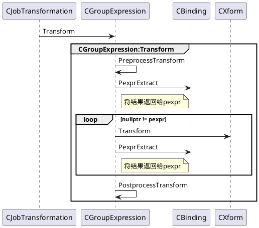

Orca优化器主要分为三个阶段：
- Exploration：推导等价的逻辑表达式
- Implementation：将逻辑表达式转化为物理表达式
- Optimization：搜索最优的执行计划

其中，Exploration和Implementation都是把一个表达式，转换为另一个等价表达式，统称为Transformation，该转换是基于规则进行的，称为基于规则的优化(Role Based Optimization，RBO)。Optimization主要是基于代价，比较不同的等价物理表达式树的代价，把总代价为最小的执行计划，作为最优解，输出给执行器执行；是基于代价的，称为基于代价的优化（Cost Based Optimization，CBO）

`CJobTransformation::EevtTransform`

# 参考资料
- [GPORCA优化器Transform流程](https://blog.csdn.net/dusx1981/article/details/124553274)
- [深入浅出GPORCA 优化器Transform流程](https://view.inews.qq.com/a/20220512A08XU200?tbkt=A&uid=)