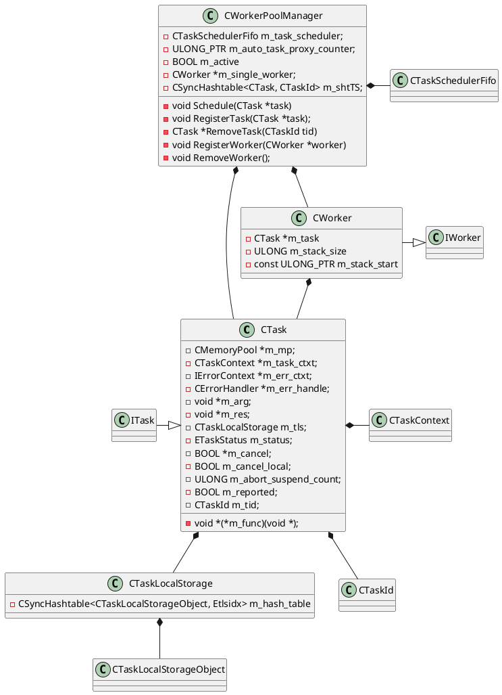

```plantuml
@startuml
class CTask {
    - CMemoryPool *m_mp;
    - CTaskContext *m_task_ctxt;
    - IErrorContext *m_err_ctxt;
    - CErrorHandler *m_err_handle;
    - void *(*m_func)(void *);
    - void *m_arg;
    - void *m_res;
    - CTaskLocalStorage m_tls;
    - ETaskStatus m_status; 
    - BOOL *m_cancel;
    - BOOL m_cancel_local;
    - ULONG m_abort_suspend_count;
    - BOOL m_reported;
    - CTaskId m_tid;
}

class CTaskLocalStorage {
    - CSyncHashtable<CTaskLocalStorageObject, Etlsidx> m_hash_table
}

class CWorker {
    - CTask *m_task
    - ULONG m_stack_size
    - const ULONG_PTR m_stack_start
}

class CWorkerPoolManager {
    - CTaskSchedulerFifo m_task_scheduler;
    - ULONG_PTR m_auto_task_proxy_counter;
    - BOOL m_active
    - CWorker *m_single_worker;
    - CSyncHashtable<CTask, CTaskId> m_shtTS;

    - void Schedule(CTask *task)
    - void RegisterTask(CTask *task);
    - CTask *RemoveTask(CTaskId tid)
    - void RegisterWorker(CWorker *worker)
    - void RemoveWorker();
}


ITask -|> CTask
CTask *- CTaskContext
CTask *-- CTaskId
CTask *-- CTaskLocalStorage
CTaskLocalStorage *-- CTaskLocalStorageObject

CWorker -|> IWorker
CWorker *-- CTask

CWorkerPoolManager *- CTaskSchedulerFifo
CWorkerPoolManager *-- CWorker
CWorkerPoolManager *-- CTask
@enduml
```