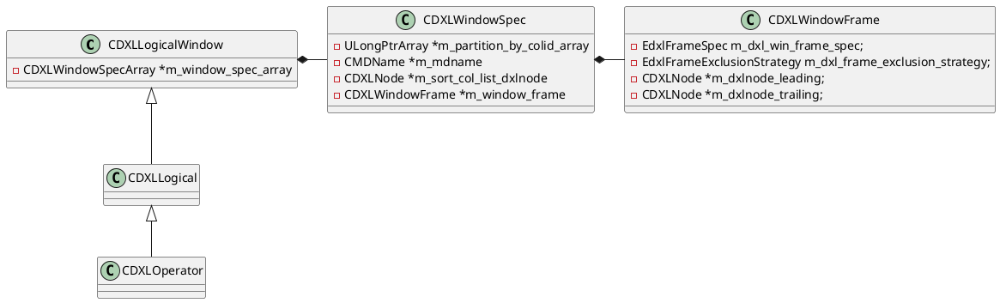
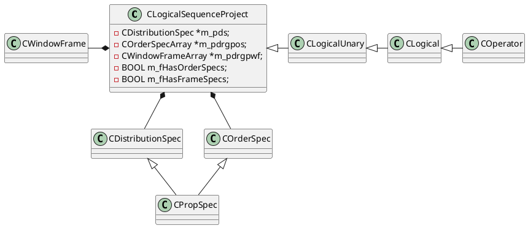
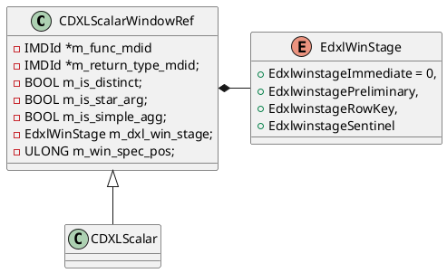
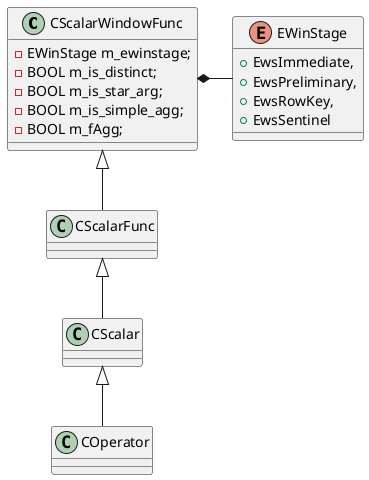

```C++
// Create a logical sequence expr from a DXL logical window
CExpression *
CTranslatorDXLToExpr::PexprLogicalSeqPr(const CDXLNode *dxlnode)
```
```C++
CExpression *
CWindowPreprocessor::PexprPreprocess(CMemoryPool *mp, CExpression *pexpr)
```




```C++
// Create a scalar window function expression from a DXL window ref
//  CDXLScalarWindowRef -> CScalarWindowFunc Operator
CExpression *
CTranslatorDXLToExpr::PexprWindowFunc(const CDXLNode *pdxlnWindowRef)
```




```C++
class CXformSequenceProject2Apply : public CXformSubqueryUnnest

CXformImplementSequenceProject
```