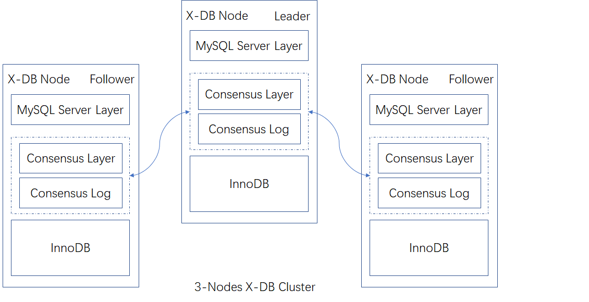
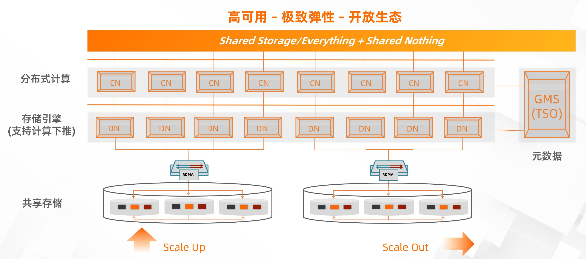

    

X-DB主要指在MySQL的基础上基于XEngine引擎打造的分布式跨AZ高可用数据库，X-DB的核心能力之一是基于Paxos跨AZ RPO为0。

    

X-DB比较好的解决了灾备、故障恢复的问题，PolarDB-X 2.0的数据节点(DN)融合X-DB的集群容灾技术，在这之上提供了水平扩展的能力。

    

PolarDB(指PolarDB For MySQL)是一个基于共享存储技术的云原生数据库。在DN引入PolarDB基于RDMA硬件+共享存储架构的核心技术，从而达到在所有资源都可以水平扩展的同时，大幅降低容量弹性的代价。

# 参考资料
1. [知乎：PolarDB-X 与 X-DB、PolarDB](https://zhuanlan.zhihu.com/p/296392729)
