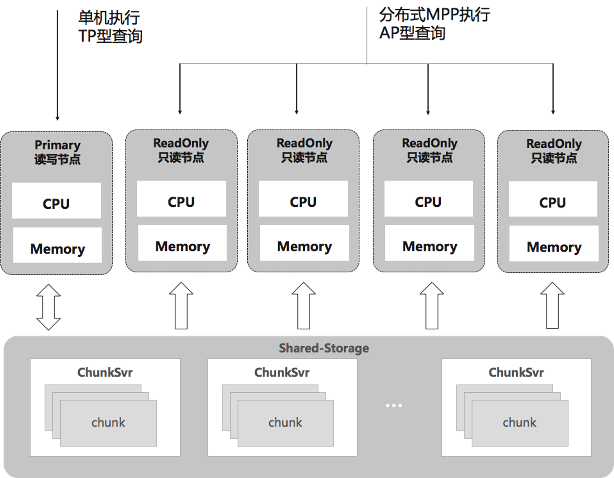
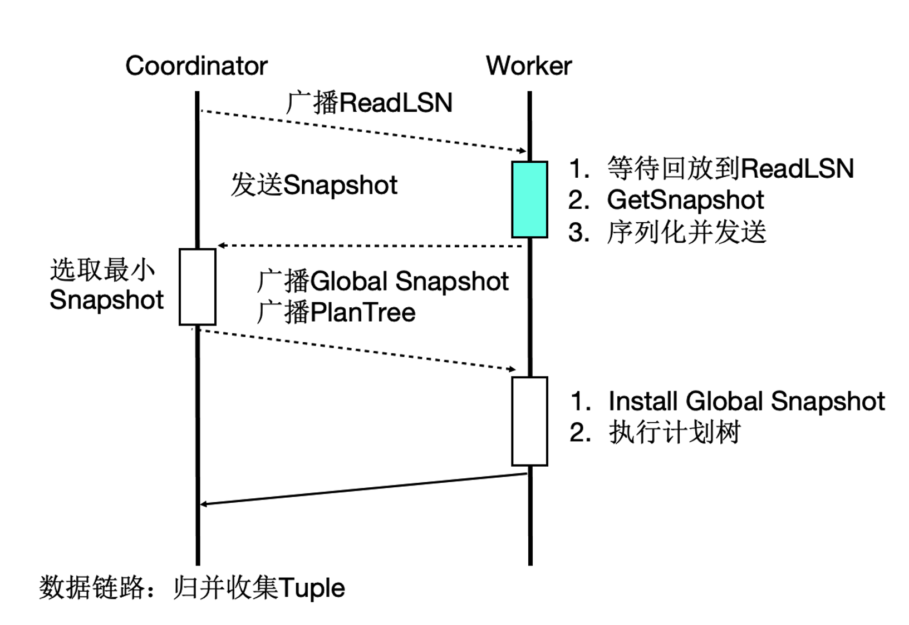

# 存储计算分离架构

PolarDB-PG的实现是基于共享存储(Shared-Storage)的一写多读架构，主备使用共享存储中的一份数据。读写节点，也称为主节点或Primary节点，可以读写共享存储中的数据；只读节点，也称为备节点或Replica节点，仅能各自通过回放日志，从共享存储中读取数据，而不能写入。

    

数据库由传统的share nothing，转变成了shared storage架构。需要解决如下问题：

- 数据一致性：由原来的N份计算+N份存储，转变成了N份计算+1份存储。
- 读写分离：如何基于新架构做到低延迟的复制。
- 高可用：如何Recovery和Failover。
- IO模型：如何从Buffer-IO向Direct-IO优化。

基于Shared-Storage后，主节点和多个只读节点共享一份存储数据，主节点刷脏不能再像传统的刷脏方式了，否则：
- 只读节点去存储中读取的页面，可能是比较老的版本，不符合他自己的状态。--> <b>页面多版本能力来解决</b>
- 只读节点指读取到的页面比自身内存中想要的数据要超前。 -->  <b>主库控制脏页的刷脏速度</b>
- 主节点切换到只读节点时，只读节点接管数据更新时，存储中的页面可能是旧的，需要读取日志重新对脏页的恢复。

## 架构原理

    

基于Shared-Storage的PolarDB的架构原理。
- 主节点为可读可写节点（RW），只读节点为只读（RO）。
- Shared-Storage层，只有主节点能写入，因此主节点和只读节点能看到一致的落盘的数据。
- 只读节点的内存状态通过回放WAL保持和主节点同步。
- 主节点的WAL日志写到Shared-Storage，仅复制WAL的meta给只读节点。
- 只读节点从Shared-Storage上读取WAL并回放。

## 数据一致性

# HTAP架构
## 事务一致性

为了支持云原生下Serverless弹性扩展的要求，引入了事务一致性，下图是分布式事务一致性保障的流程。任意选择一个节点作为Coordinator节点后，Coordinator的ReadLSN会作为约定LSN，所有MPP节点的快照版本号中最小的版本号作为约定全局快照版本号，通过LSN等待回放和GlobalSnapshot同步机制，确保在任何一个节点发起MPP查询数据和快照均达到一致可用的状态。

> PostgreSQL将所有修改作为历史数据(称为XLOG记录或WAL数据)写入持久化存储中。当插入、删除、提交等变更动作发生时，PostgreSQL会将XLOG记录写入内存中的WAL缓冲区。当事务提交或中止时，它们会被立即写入持久化存储的WAL段文件中。XLOG记录的日志序列号(Log Sequence Number, LSN)标识了该记录在事务日志中的位置，记录的LSN被用作XLOG记录的唯一标识符。

    
    
分布式事务一致性保障的流程

# 参考资料

1. [知乎:PolarDB-X 并行计算框架](https://zhuanlan.zhihu.com/p/346320114)
2. [PolarDB-PG DOC: 存储计算分离架构](https://docs.polardbpg.com/1653230754878/PolarDB-for-PostgreSQL/Storage-Compute-Decoupled-Arch.html)
