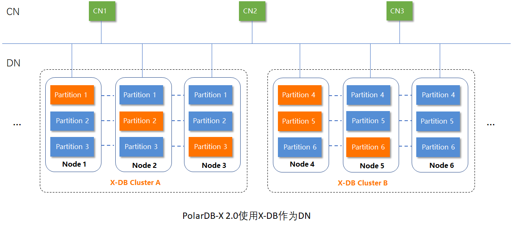

    

PolarDB-X 包含 4 个核心组件构成：

1. CN(Compute Node)负责计算。CN是服务入口，完成三个任务：
    - 通过MySQL协议接收用户请求，返回结果。
    - 作为分布式查询引擎，兼容MySQL语法，提供分布式事务、全局索引、MPP 等特性。
    - 通过RPC协议与DN交互，下发读写指令，汇总结果。
2. DN(Data Node)负责存储。
3. GMS(Global Meta Service)负责管理元数据和提供TSO服务。
4. CDC(Change Data Capture)负责生成变更日志。

| **Component Name**        | **Repository**                                               |
| ------------------------- | ------------------------------------------------------------ |
| CN (Compute Node)         | [polardbx-sql](https://github.com/polardb/polardbx-sql)      |
| GMS (Global Meta Service) | [polardbx-engine](https://github.com/polardb/polardbx-engine) |
| DN (Data Node)            | [polardbx-engine](https://github.com/polardb/polardbx-engine) |
| CDC (Change Data Capture) | [polardbx-cdc](https://github.com/polardb/polardbx-cdc)      |
| RPC                       | [polardbx-glue](https://github.com/polardb/polardbx-glue)    |
| K8S Operator              | [polardbx-operator](https://github.com/polardb/polardbx-operator) |

X-DB比较好的解决了灾备、故障恢复的问题，PolarDB-X 2.0的数据节点(DN)融合X-DB的集群容灾技术，在这之上提供了水平扩展的能力。

    

 # 参考资料

1. [知乎：PolarDB-X 与 X-DB、PolarDB](https://zhuanlan.zhihu.com/p/296392729)

    