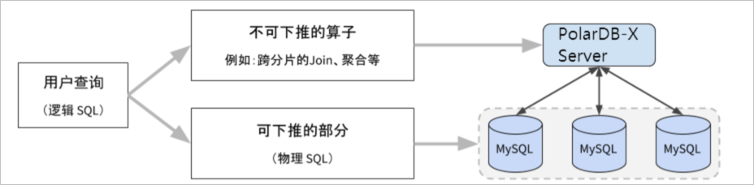

PolarDB-X是一款计算存储分离的分布式数据库产品。当一条查询SQL发往PolarDB-X计算节点（CN）时（此SQL又称为逻辑SQL），PolarDB-X会将其分成可下推和不可下推的两部分，可下推的部分也被称为物理SQL。不可下推的SQL在CN上执行，可下推的SQL在DN上执行。

    

PolarDB-X按照以下原则进行SQL优化：

- 尽可能将逻辑SQL下推到DN上执行，除了可以避免CN和DN间数据网络交互以外，还可以充分利用多分片并发执行的能力，利用各个DN资源加速查询。
- 对于无法下推的部分包含的物理算子，查询优化器会选择最优的方式来执行，例如选择合适的物理算子，选择合适的并行度策略以及使用MPP执行。
- PolarDB-X的索引一般分为局部索引和全局索引，局部索引是指单个DN节点的索引（MySQL索引），全局索引是指构建在多个DN上的分布式索引。选择合适的索引，可以极大提高PolarDB-X的检索速度。

PolarDB-X接收到一条SQL后的执行过程大致如下：

    

- 语法解析器（Parser）将SQL文本解析成抽象语法树（AST）。
- 语法树被转化成基于关系代数的逻辑计划。
- 查询优化器（Optimizer）对逻辑计划进行优化得到物理计划。
- 查询执行器（Executor）执行该计划，得到查询结果并返回给客户端。

| 含义                                       | 算子                                                         |
| ------------------------------------------ | ------------------------------------------------------------ |
| 可下推至DN的算子                           | LogicalView， `LogicalModifyView` `PhyTableOperation`, ` IndexScan` |
| 排序                                       | `MemSort` `TopN`  `MergeSort`                        |
| 聚合（Group By）                           | `HashAgg` `SortAgg`                                      |
| 数据重分布或者聚合                         | `Exchange` `Gather`                                      |
| 过滤                                       | `Filter`                                                     |
| 投影                                       | `Project`                                                    |
| 求并集                                     | `UnionAll` `UnionDistinct`                               |
| 设置结果集输出行数（Limit/Offset...Fetch） | `Limit`                                                      |
| 窗口函数                                   | `OverWindow`                                                 |

# 参考资料

1. [查询优化器介绍](https://help.aliyun.com/document_detail/316594.html?spm=a2c4g.316590.0.0.1e9b4730YYXLDL)