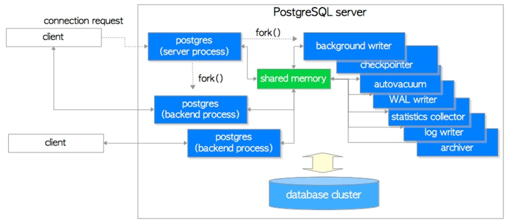
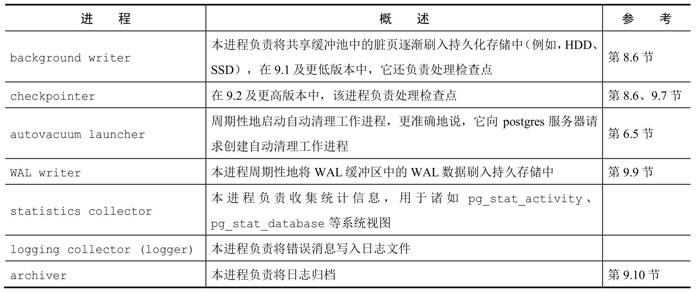

# 数据库集簇
## 数据库集簇逻辑结构
<b>数据库集簇(Database Cluster)是一组数据库(Database)的集合</b>，由一个PostgreSQL服务器管理。一个 PostgreSQL服务器只会在单机上运行并管理单个数据库集簇。

<b>数据库是数据库对象(database object)的集合。</b>在关系型数据库理论中，数据库对象用于存储或引用数据的数据结构，(堆)表就是一个典型的例子，还有更多对象，例如索引、序列、视图、函数等。在PostgreSQL中，数据库本身也是数据库对象，并在逻辑上彼此分离。所有其他的数据库对象(例如表、索引等)都归属于各自相应的数据库。

在PostgreSQL内部，所有的数据库对象都通过相应的无符号的4字节整型的对象标识符(object identifier, oid)进行管理。数据库对象与相应oid之间的关系存储在对应的系统目录中。
```sql

```
## 数据库集簇物理结构
数据库集簇在本质上就是一个文件目录，即基础目录，包含着一系列子目录与文件。执行initdb命令会在指定目录下创建基础目录，从而初始化一个新的数据库集簇。

base子目录中的每一个子目录都对应一个数据库，数据库中的每个表和索引都至少在相应子目录下存储为一个文件，还有几个包含特定数据的子目录，以及配置文件。PostgreSQL中的表空间对应一个包含基础目录之外数据的目录。

### 数据库布局
一个数据库与base子目录下的子目录对应，且该子目录的名称与相应数据库的 oid相同。
```sql
```

### 表和索引相关文件的布局
表和索引的relfilenode值会被一些命令(例如TRUNCATE、REINDEX、CLUSTER)改变。
```sql

```

当表和索引的文件大小超过1GB时，PostgreSQL会创建并使用一个名为`relfilenode.1`的新文件。如果新文件也填满了，则会创建下一个名为`relfilenode.2`的新文件，以此类推。构建PostgreSQL时，可以使用配置选项`--with-segsize`更改表和索引的最大文件大小。

每个表都有两个与之关联的文件，后缀分别为`_fsm`和`_vm`，实际上是空闲空间映射和可见性映射文件，分别存储表文件每个页面上的空闲空间信息与可见性信息

---
在数据库系统内部，这些文件(主体数据文件、空闲空间映射文件、可见性映射文件等)也被称为相应关系的分支(fork)；空闲空间映射是表/索引数据文件的第一个分支(分支编号为1)，可见性映射表是数据文件的第二个分支(分支编号为2)，数据文件的分支编号为0。

每个关系(relation)可能会有4种分支，分支编号分别为0、1、2、3, 0号分支(main)为关系数据文件本体，1号分支(fsm)保存了main分支中空闲空间的信息，2号分支vm保存了main分支中可见性的信息，3号分支init是很少见的特殊分支，通常表示不被日志记录(unlogged)的表与索引。

每个分支都会被存储为磁盘上的一或多个文件：PostgreSQL会将过大的分支文件切分为若干个段，以免文件的尺寸超过某些特定文件系统允许的大小，也便于一些归档工具进行并发复制，默认的段大小为1GB。

### 表空间布局
PostgreSQL中的表空间是基础目录之外的附加数据区域，8.0版本中引入该功能。

# 进程架构
PostgreSQL是C/S结构的关系型数据库，采用多进程架构，运行在单台主机上。PostgreSQL Server实际上是一系列协同工作的进程集合，其中包含下列进程：

- Postgres服务器进程(postgres server process)是所有数据库集簇管理进程的父进程。
- 每个后端进程(backend process)负责处理客户端发出的查询和语句。
- 各种后台进程(background process)负责执行各种数据库管理任务(例如清理过程与存档过程)。
-  各种复制相关进程(replication associated process)负责流复制。
-  后台工作进程(background worker process)在9.3版本中被引入，它能执行任意由用户实现的处理逻辑。
<center>
	
	<div>不同资源组的查询占用CPU的实时对比</div>
</center>

## 服务器进程
postgres服务器进程是 PostgreSQL服务器中所有进程的父进程，在早期版本中被称为“postmaster”。带start参数执行pg_ctl实用程序会启动一个postgres服务器进程。它会在内存中分配共享内存区域，启动各种后台进程，如有必要还会启动复制相关进程与后台工作进程，并等待来自客户端的连接请求。每当接收到来自客户端的连接请求时，它都会启动一个后端进程，然后由启动的后端进程处理该客户端发出的所有查询。

## 后端进程
每个后端进程（也称为postgres）由postgres服务器进程启动，并处理连接另一侧的客户端发出的所有查询，它通过单条TCP连接与客户端通信，并在客户端断开连接时终止。因为一条连接只允许操作一个数据库，所以必须在连接到PostgreSQL服务器时显式地指定要连接的数据库。PostgreSQL允许多个客户端同时连接，配置参数`max_connections`用于控制最大客户端连接(默认为100)。

<b>因为PostgreSQL没有原生的连接池功能，如果许多客户端频繁地重复与 PostgreSQL服务器建立断开连接(譬如Web应用)，则会导致建立连接与创建后端进程的开销变大，对数据库服务器的性能有负面影响，通常可以使用池化中间件(pgbouncer或pgpool-II)来避免该问题。</b>

## 后台进程
<center>
    
    <div>后台进程</div>
</center>
