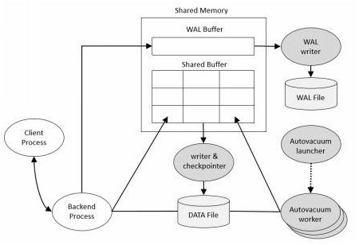
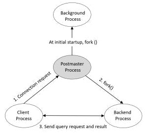

# 进程架构

# 体系结构

物理结构由共享内存(shared memory)和少量的后台进程以及数据文件组成。

## 共享内存(Shared Memory)

共享内存是指提供数据缓存和事务日志缓存的内存。在共享内存中最重要的组成部分是共享缓冲区(`Shared Buffer`)和预写日志缓存(`WAL buffer`)。

### Shared Buffer

主要目的是最大限度的减少磁盘IO，为达到这个目的，必须要满足如下要求

- 需要快速访问非常大的缓冲区

- 当多个用户同时访问并发生争用时，应该确保最小化争用。
- 使用最频繁的数据块必须尽可能长时间的保存在缓冲区中。

### `WAL Buffer` 

`WAL Buffer`是一个临时存储数据更改的缓冲区，存储在`WAL Buffer`中的内容将在预定时间点写入`WAL`文件。从备份和恢复的角度，`WAL Buffer`和`WAL`文件非常重要。

## 后台进程

PostGreSQL有四种类型的进程

- Postmaster(Daemon)进程。

    PostGreSQL启动的第一个进程。负责实施恢复，初始化共享内存，并启动后台进程。当客户端进程有链接请求时，负责创建后端进程。

- 后台进程(Background Process)

- 后端进程(Backend Process)

- 客户端进程(Client Process)

# 数据库结构

## 表空间

## 表

> 什么是Vacuum?
>
> Vacuum做了如下这些事
>
> 1. 收集表和索引统计信息
> 2. 重新组织表
> 3. 清理表和索引无用的数据块
> 4. 由记录XID冻结，以防止XID循环
>
> 1和2通常是DBMS管理所必需的。但是3和4是必要的，因为PostgreSQL MVCC特性

# 参考资料

- [阿里云:理解PostgreSQL的体系结构](https://developer.aliyun.com/article/708764)