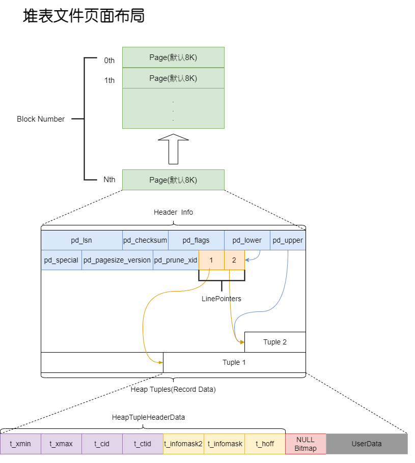
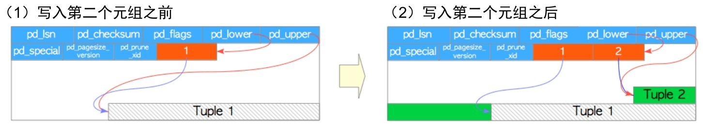

## 堆表文件内部布局

数据文件（堆表、索引，也包括空闲空间映射和可见性映射）内部被划分为固定长度的页，或者叫区块，大小默认为`8192B(8KB)`。每个文件中的页从0开始按顺序编号，这些数字称为区块号。如果文件已填满，`PostgreSQL`就通过在文件末尾追加一个新的空页来增加文件长度。页面内部的布局取决于数据文件的类型。



表的页面包含了三种类型的数据：

1. 堆元组——即数据记录本身。它们从页面底部开始依序堆叠。
2. 行指针——每个行指针占`4B`，保存着指向堆元组的指针。也被称为项目指针。行指针形成一个简单的数组，扮演了元组索引的角色。每个索引项从1开始依次编号，称为偏移号。当向页面中添加新元组时，一个相应的新行指针也会被放入数组中，并指向新添加的元组。
3. 首部数据——页面的起始位置分配了由`PageHeaderData `定义的首部数据，`24B`，包含关于页面的元数据。

磁盘页面布局由`PageHeaderData`定义，位于`src\include\storage\bufpage.h`。

```c
typedef struct PageHeaderData
{
	PageXLogRecPtr pd_lsn;		// 最近应用至本页面XLog记录的LSN
	uint16		pd_checksum;	// 校验和
	uint16		pd_flags;		// 标记位
	LocationIndex pd_lower;		// 空闲空间起始位置
	LocationIndex pd_upper;		// 空闲空间终止位置 
	LocationIndex pd_special;	// 特殊用途空间得开始位置
	uint16		pd_pagesize_version;
	TransactionId pd_prune_xid; // 最老的可修剪XID, 若无,为0
	ItemIdData	pd_linp[FLEXIBLE_ARRAY_MEMBER]; // 行指针数组
} PageHeaderData;

typedef struct
{
	uint32		xlogid;			/* high bits */
	uint32		xrecoff;		/* low bits */
} PageXLogRecPtr;
```

行指针由`ItemIdData`表示，相关实现位于`src\include\storage\itemid.h`。行指针的末尾与最新元组起始位置之间的空余空间称为空闲空间或空洞。

```c
typedef struct ItemIdData
{
	unsigned	lp_off:15,		// 相对于页面起始处得元组偏移量
				lp_flags:2,		// 行指针状态
				lp_len:15;		// 元组长度，单位字节
} ItemIdData;

typedef ItemIdData *ItemId;

#define LP_UNUSED		0		/* unused (should always have lp_len=0) */
#define LP_NORMAL		1		/* used (should always have lp_len>0) */
#define LP_REDIRECT		2		/* HOT redirect (should have lp_len=0) */
#define LP_DEAD			3		/* dead, may or may not have storage */
```

## 元组

表页中的堆元组分为普通数据元组与TOAST元组两类。大小超过约2KB(8KB的四分之一)的堆元组会使用一种称为TOAST(The Oversized-Attribute Storage Technique，超大属性存储技术) 的方法来存储与管理。

为了识别表中的元组，使用元组标识符（tuple identifier, TID）来标识表中得元组。TID由一对值组成，分别是元组所属页面的区块号和指向元组的行指针的偏移号。

### 读写元组方式

#### 写入堆元组

> 假设有一个表仅由一个页面组成，且该页面只包含一个堆元组。此页面的pd_lower指向第一个行指针，而该行指针和pd_upper都指向第一个堆元组
>
> 当写入第二个元组时，它会被放在第一个元组之后。第二个行指针写入到第一个行指针的后面，并指向第二个元组。pd_lower 更改为指向第二个行指针，pd_upper 更改为指向第二个堆元组。
>
> 页面内的首部数据（例如pd_lsn、pg_checksum和pg_flag）也会被改写为适当的值，




#### 读取元组

元组支持的访问方式：

- 顺序扫描。通过扫描每一页中的行指针，依序读取所有页面中的所有元组。

- B树索引扫描。索引文件包含索引元组，索引元组由一个键值对组成，键为被索引的列值，值为目标堆元组的 TID。进行索引查询时，首先使用键进行查找，如果找到了对应的索引元组，PostgreSQL就会根据相应值中的TID来读取对应的堆元组。

- TID扫描。使用所需元组的TID直接访问元组的方法。

    ```sql
    -- 查找表中第0个页面中的第1个元组
    SELECT ctid, data FROM sampletbl WHERE ctud='(0,1)';
    ```

    

- 位图扫描

- 仅索引扫描

### 元组结构

 ### 普通元组

 ### 增、删、改


# 参考资料

1. 《PostgreSQL指南：内幕探索》