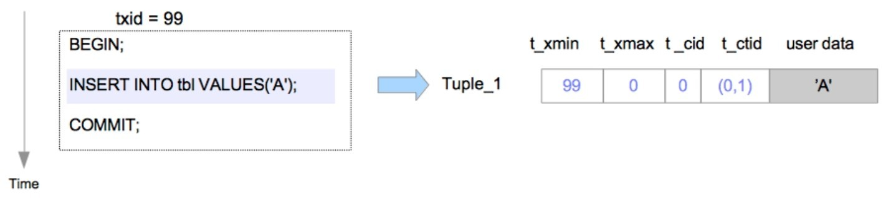
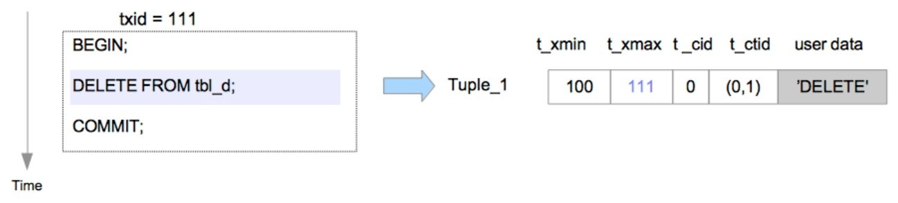
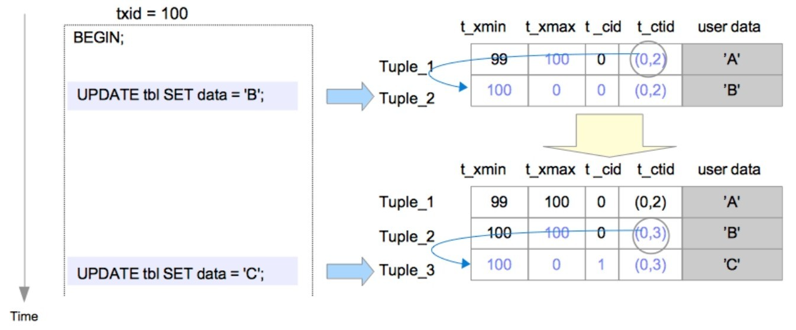

# 元组


堆元组由三部分构成

```c
// 位于src/include/access/htup.h
typedef struct HeapTupleData {
	uint32		t_len;			/* length of *t_data */
	ItemPointerData t_self;		/* SelfItemPointer */
	Oid			t_tableOid;		/* table the tuple came from */
#define FIELDNO_HEAPTUPLEDATA_DATA 3
	HeapTupleHeader t_data;		/* -> tuple header and data */
} HeapTupleData;
```

```c
// 位于src\include\access\htup_details.h
typedef struct HeapTupleFields {
	TransactionId t_xmin;		/* inserting xact ID */
	TransactionId t_xmax;		/* deleting or locking xact ID */
	union {
		CommandId	t_cid;		/* inserting or deleting command ID, or both */
		TransactionId t_xvac;	/* old-style VACUUM FULL xact ID */
	}			t_field3;
} HeapTupleFields;

typedef struct DatumTupleFields {
	int32		datum_len_;		/* varlena header (do not touch directly!) */
	int32		datum_typmod;	/* -1, or identifier of a record type */
	Oid			datum_typeid;	/* composite type OID, or RECORDOID */

	/*
	 * datum_typeid cannot be a domain over composite, only plain composite,
	 * even if the datum is meant as a value of a domain-over-composite type.
	 * This is in line with the general principle that CoerceToDomain does not
	 * change the physical representation of the base type value.
	 *
	 * Note: field ordering is chosen with thought that Oid might someday
	 * widen to 64 bits.
	 */
} DatumTupleFields;

struct HeapTupleHeaderData {
	union {
		HeapTupleFields t_heap;
		DatumTupleFields t_datum;
	} t_choice;

	ItemPointerData t_ctid;		/* current TID of this or newer tuple (or a
								 * speculative insertion token) */

	/* Fields below here must match MinimalTupleData! */

#define FIELDNO_HEAPTUPLEHEADERDATA_INFOMASK2 2
	uint16		t_infomask2;	/* number of attributes + various flags */

#define FIELDNO_HEAPTUPLEHEADERDATA_INFOMASK 3
	uint16		t_infomask;		/* various flag bits, see below */

#define FIELDNO_HEAPTUPLEHEADERDATA_HOFF 4
	uint8		t_hoff;			/* sizeof header incl. bitmap, padding */

	/* ^ - 23 bytes - ^ */

#define FIELDNO_HEAPTUPLEHEADERDATA_BITS 5
	bits8		t_bits[FLEXIBLE_ARRAY_MEMBER];	/* bitmap of NULLs */

	/* MORE DATA FOLLOWS AT END OF STRUCT */
};
```


## 堆表文件内部布局

数据文件（堆表、索引，也包括空闲空间映射和可见性映射）内部被划分为固定长度的页，或者叫区块，大小默认为`8192B(8KB)`。每个文件中的页从0开始按顺序编号，这些数字称为区块号。如果文件已填满，`PostgreSQL`就通过在文件末尾追加一个新的空页来增加文件长度。页面内部的布局取决于数据文件的类型。


表的页面包含了三种类型的数据：

1. 堆元组——即数据记录本身。它们从页面底部开始依序堆叠。
2. 行指针——每个行指针占`4B`，保存着指向堆元组的指针。也被称为项目指针。行指针形成一个简单的数组，扮演了元组索引的角色。每个索引项从1开始依次编号，称为偏移号。当向页面中添加新元组时，一个相应的新行指针也会被放入数组中，并指向新添加的元组。
3. 首部数据——页面的起始位置分配了由`PageHeaderData `定义的首部数据，`24B`，包含关于页面的元数据。

磁盘页面布局由`PageHeaderData`定义，位于`src\include\storage\bufpage.h`。

```c
typedef struct PageHeaderData
{
	PageXLogRecPtr pd_lsn;		// 最近应用至本页面XLog记录的LSN
	uint16		pd_checksum;	// 校验和
	uint16		pd_flags;		// 标记位
	LocationIndex pd_lower;		// 空闲空间起始位置
	LocationIndex pd_upper;		// 空闲空间终止位置 
	LocationIndex pd_special;	// 特殊用途空间得开始位置
	uint16		pd_pagesize_version;
	TransactionId pd_prune_xid; // 最老的可修剪XID, 若无,为0
	ItemIdData	pd_linp[FLEXIBLE_ARRAY_MEMBER]; // 行指针数组
} PageHeaderData;

typedef struct
{
	uint32		xlogid;			/* high bits */
	uint32		xrecoff;		/* low bits */
} PageXLogRecPtr;
```

行指针由`ItemIdData`表示，相关实现位于`src\include\storage\itemid.h`。行指针的末尾与最新元组起始位置之间的空余空间称为空闲空间或空洞。

```c
typedef struct ItemIdData
{
	unsigned	lp_off:15,		// 相对于页面起始处得元组偏移量
				lp_flags:2,		// 行指针状态
				lp_len:15;		// 元组长度，单位字节
} ItemIdData;

typedef ItemIdData *ItemId;

#define LP_UNUSED		0		/* unused (should always have lp_len=0) */
#define LP_NORMAL		1		/* used (should always have lp_len>0) */
#define LP_REDIRECT		2		/* HOT redirect (should have lp_len=0) */
#define LP_DEAD			3		/* dead, may or may not have storage */
```

## 元组

表页中的堆元组分为普通数据元组与TOAST元组两类。大小超过约2KB(8KB的四分之一)的堆元组会使用一种称为TOAST(The Oversized-Attribute Storage Technique，超大属性存储技术) 的方法来存储与管理。

为了识别表中的元组，使用元组标识符（tuple identifier, TID）来标识表中得元组。TID由一对值组成，分别是元组所属页面的区块号和指向元组的行指针的偏移号。

### 读写元组方式

#### 写入堆元组

> 假设有一个表仅由一个页面组成，且该页面只包含一个堆元组。此页面的pd_lower指向第一个行指针，而该行指针和pd_upper都指向第一个堆元组
>
> 当写入第二个元组时，它会被放在第一个元组之后。第二个行指针写入到第一个行指针的后面，并指向第二个元组。pd_lower 更改为指向第二个行指针，pd_upper 更改为指向第二个堆元组。
>
> 页面内的首部数据（例如pd_lsn、pg_checksum和pg_flag）也会被改写为适当的值，


#### 读取元组

元组支持的访问方式：

- 顺序扫描。通过扫描每一页中的行指针，依序读取所有页面中的所有元组。

- B树索引扫描。索引文件包含索引元组，索引元组由一个键值对组成，键为被索引的列值，值为目标堆元组的 TID。进行索引查询时，首先使用键进行查找，如果找到了对应的索引元组，PostgreSQL就会根据相应值中的TID来读取对应的堆元组。

- TID扫描。使用所需元组的TID直接访问元组的方法。

    ```sql
    -- 查找表中第0个页面中的第1个元组
    SELECT ctid, data FROM sampletbl WHERE ctud='(0,1)';
    ```

    

- 位图扫描

- 仅索引扫描

### 元组结构

 #### 普通元组

堆元组由三个部分组成，由`HeapTupleHeaderData` 结构、空值位图及用户数据.

堆元组由` HeapTupleHeaderData` 表示，相关实现在`src\include\access\htup_details.h`。

```c
typedef struct HeapTupleFields
{
	TransactionId t_xmin;		// 插入此元组的事务的ID即txid
	TransactionId t_xmax;		// 删除或更新此元组的事务的txid
	union {
		CommandId	t_cid;		// 插入或删除的命令ID(Command id,cid)
        						// cid指当前事务中，执行当前命令前执行了多少SQL，从零开始计数
		TransactionId t_xvac;	// 老式VACUUM FULL的事务ID
	} t_field3;
} HeapTupleFields;

typedef struct DatumTupleFields
{
	int32		datum_len_;		// 可变首部的长度
	int32		datum_typmod;	// -1或者是记录类型的标识
	Oid			datum_typeid;	// 复杂类型的oid或记录ID
} DatumTupleFields;

struct HeapTupleHeaderData
{
	union {
		HeapTupleFields t_heap;
		DatumTupleFields t_datum;
	} t_choice;
	
    ItemPointerData 	t_ctid; // 当前元组或更新元组的TID
    							// 更新该元组时，t_ctid会指向新版本的元组，否则t_ctid指向自己

	/* 下面的字段必须与结构MinimalTupleData相匹配 */
	uint16		t_infomask2;	/* number of attributes + various flags */
	uint16		t_infomask;		/* various flag bits, see below */
	uint8		t_hoff;			/* sizeof header incl. bitmap, padding */
	/* ^ - 23 bytes - ^ */
	bits8		t_bits[FLEXIBLE_ARRAY_MEMBER];	// NULL值的位图,变长数组
	/* MORE DATA FOLLOWS AT END OF STRUCT */
};
```

##### 增删改

将新元组插入目标表的页面，扩展模块`pageinspect`，可用于检查数据库页面的具体内容。假设元组是由`txid=99`的事务插入页面中的，在这种情况下，被插入元组的首部字段会依以下步骤设置，`Tuple_1`：

-  `t_xmin`设置为99，因为此元组由`txid=99`的事务所插入。
-  `t_xmax`设置为0，因为此元组尚未被删除或更新。
- `t_cid`设置为0，因为此元组是由`txid=99`的事务所执行的第一条命令插入的。
- ` t_ctid`设置为(0,1)，指向自身，因为这是该元组的最新版本。




在删除操作中，目标元组只是在逻辑上被标记为删除。目标元组的`t_xmax` 字段将被设置为执行DELETE命令事务的`txid`，假设Tuple_1被`txid=111`的事务删除。在这种情况下，`Tuple_1`的首部字段`t_xmax`被设为111。如果`txid=111`的事务已经提交，就不一定要`Tuple_1`。通常不需要的元组被称为死元组（Dead Tuple）。死元组最终将从页面中被移除。清除死元组的过程被称为清理（VACUUM）过程




在更新操作中，逻辑上实际执行的是删除最新的元组，并插入一条新的元组。假设由`txid=99`的事务插入的行，被`txid=100`的事务更新两次。

当执行第一条UPDATE命令时，Tuple_1的`t_xmax`被设为`txid 100`，在逻辑上被删除，然后Tuple_2被插入，接下来重写Tuple_1的`t_ctid`以指向Tuple_2。Tuple_1和Tuple_2的头部字段设置如下:

- 对于Tuple_1：` t_xmax`被设置为100, `t_ctid`从(0,1)被改写为(0,2)。

- 对于Tuple_2: `t_xmin`被设置为100, `t_xmax`被设置为0, `t_cid`被设置为0, ` t_ctid`被设置为(0,2)。

当执行第二条UPDATE命令时，和第一条UPDATE命令类似，Tuple_2被逻辑删除，Tuple_3被插入。Tuple_2和Tuple_3的首部字段设置如下。

- 对于`Tuple_2`, ` t_xmax`设置为100, `t_ctid`从(0,2)被改写为(0,3)。
- 对于`Tuple_3`,  `t_xmin`设置为100，`t_xmax`设置为0,  `t_cid`设置为1, ` t_ctid`设置为(0,3)。

与删除操作类似，如果`txid=100`的事务已经提交，那么Tuple_1和Tuple_2成死元组，而如果`txid=100`的事务中止，`Tuple_2`和`Tuple_3`成死元组。



##### 空闲空间映射

插入堆或索引元组时，PostgreSQL使用表与索引相应的FSM来选择可供插入的页面。每个FSM存储着相应表或索引文件中每个页面可用空间容量的信息。所有FSM都以后缀fsm存储，在需要时它们会被加载到共享内存中。扩展 pg_freespacemap能提供特定表或索引上的空闲空间信息。


# 参考资料

1. 《PostgreSQL指南：内幕探索》