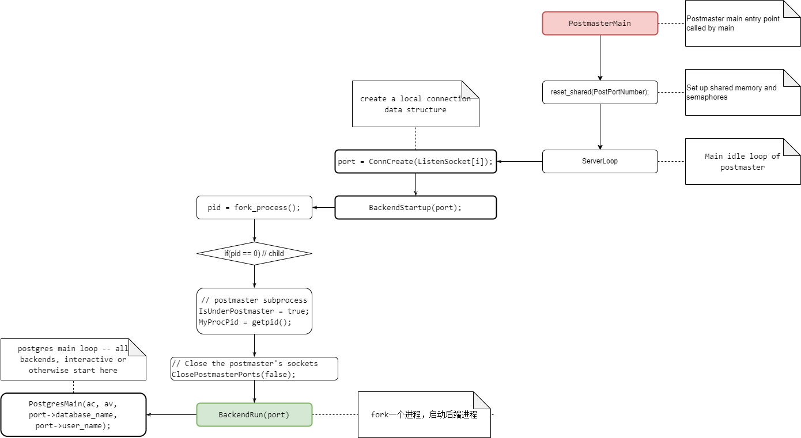

PostgreSQL服务器进程的源码位于`src\backend\postmaster\postmaster.c`

<center>
    
</center>


```c
/*
 * Main idle loop of postmaster
 *
 * NB: Needs to be called with signals blocked
 */
static int
ServerLoop(void)
{
    ......
    nSockets = initMasks(&readmask);
	for (;;)
	{
        ........
            		/*
		 * New connection pending on any of our sockets? If so, fork a child
		 * process to deal with it.
		 */
		if (selres > 0)
		{
			int			i;

			for (i = 0; i < MAXLISTEN; i++)
			{
				if (ListenSocket[i] == PGINVALID_SOCKET)
					break;
				if (FD_ISSET(ListenSocket[i], &rmask))
				{
					Port	   *port;

					port = ConnCreate(ListenSocket[i]);
					if (port)
					{
                        // 
						BackendStartup(port);

						/*
						 * We no longer need the open socket or port structure
						 * in this process
						 */
						StreamClose(port->sock);
						ConnFree(port);
					}
				}
			}
		}
    }
}
```


```c
/*
 * BackendRun -- set up the backend's argument list and invoke PostgresMain()
 *
 * returns:
 *		Shouldn't return at all.
 *		If PostgresMain() fails, return status.
 */
static void
BackendRun(Port *port)
```

