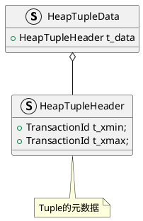

基于`REL_16_STABLE`分进行源码解读。

# 页(Page)
每个页的大小通常是 8KB(8192 字节)，也可以配置为其他大小。每个页包含以下部分：
- Page Header：存储有关该页的元数据，如页的整体信息，包括元组的个数、偏移量等，大约24字节。
- Tuple Data：存储实际的元组数据。元组存储在页中，<b>自底向上增长</b>。
- Item Pointer/Offset：元组的偏移指针，存储每个元组在页中的位置。存储在页的顶部，并向下增长。
- Free Space：未使用的空间。如果空间不足，会分配到新页。

```c
// src/include/storage/bufpage.h
typedef struct PageHeaderData
{
	// 用于WAL日志同步
	PageXLogRecPtr pd_lsn;
	// 页的校验和
	uint16		pd_checksum;
	// 页的标志位，用于描述页状态
	uint16		pd_flags;
	
	// 
	LocationIndex pd_lower;		/* offset to start of free space */
	LocationIndex pd_upper;		/* offset to end of free space */
	
	// 页中特殊块(如索引页)的开始位置
	LocationIndex pd_special;
	// 页大小和版本
	uint16		pd_pagesize_version;
	TransactionId pd_prune_xid; /* oldest prunable XID, or zero if none */
	ItemIdData	pd_linp[FLEXIBLE_ARRAY_MEMBER]; /* line pointer array */
} PageHeaderData;
typedef PageHeaderData *PageHeader;
```

# 元组
可以将表页中的堆元组分为普通数据元组与TOAST元组两类。

---

堆元组由三个部分组成，即HeapTupleHeaderData结构、空值位图及用户数据。
<center>
    
    <div>元组结构</div>
</center>

```c
// src/include/access/htup.h
typedef struct HeapTupleHeaderData HeapTupleHeaderData;
typedef HeapTupleHeaderData *HeapTupleHeader;

typedef struct HeapTupleData
{
	uint32		t_len;			/* length of *t_data */
	ItemPointerData t_self;		/* SelfItemPointer */
	Oid			t_tableOid;		/* table the tuple came from */
	HeapTupleHeader t_data;		/* tuple header and data */
} HeapTupleData;

typedef HeapTupleData *HeapTuple;
```
```c
// src/include/storage/itemid.h
typedef struct ItemIdData
{
	unsigned	lp_off:15,		/* offset to tuple (from start of page) */
				lp_flags:2,		/* state of line pointer */
				lp_len:15;		/* byte length of tuple */
} ItemIdData;
typedef ItemIdData *ItemId;
```
## 元组元数据

`HeapTupleHeaderData`中有和事务相关的几个重要字段：
- `t_xmin`:保存插入此元组的事务的txid。
- `t_xmax`：保存删除或更新此元组的事务的txid。如果尚未删除或更新此元组，则`t_xmax`设置为0，即无效。
- `t_cid`保存命令标识(command id, cid), 表示在当前事务中，执行当前命令之前执行了多少SQL命令，从零开始计数。例如，假设在单个事务中执行了3条`INSERT`命令`BEGIN; INSERT; INSERT; INSERT; COMMIT;`。如果第一条命令插入此元组，则该元组的`t_cid`被设置为0。如果第二条命令插入此元组，则其`t_cid`被设置为1，以此类推。
- `t_ctid`保存着指向自身或新元组的元组标识符(tid)。在更新该元组时，t_ctid 会指向新版本的元组，否则`t_ctid`会指向自己。

```c
// src/include/access/htup_details.h
struct HeapTupleHeaderData
{
	union
	{
		HeapTupleFields t_heap;
		DatumTupleFields t_datum;
	} t_choice;

	// 指向自身或新元组的元组标识(TID)
	// 更新元组时,它指向新版本元组,否则指向自己
	ItemPointerData t_ctid;

	/* 下面字段必须和MinimalTupleData相匹配*/
	uint16		t_infomask2;	/* number of attributes + various flags */
	// 标志位，用于指示该元组的状态(如是否有效、是否已删除等)
	uint16		t_infomask;
	uint8		t_hoff;			/* sizeof header incl. bitmap, padding */

	/* ^ - 23 bytes - ^ */
	// 空值位图
	bits8		t_bits[FLEXIBLE_ARRAY_MEMBER];

	/* MORE DATA FOLLOWS AT END OF STRUCT */
};

typedef struct HeapTupleFields
{
	// 插入此元组的事务ID
	TransactionId t_xmin;
	// 删除或更新此元组的事务ID
	// 若尚未删除或更细此元组,t_xmax设置为0,表示无效
	TransactionId t_xmax;
	union {
		// 插入或删除的命令标识(command id)
		// 表示当前事务中，执行当前命令前执行了多少SQL，从零开始计数
		CommandId	t_cid;
		// 老式VACUUM FULL的事务ID
		TransactionId t_xvac;
	} t_field3;
} HeapTupleFields;

typedef struct DatumTupleFields
{
	// 可变长Header的长度
	int32		datum_len_;
	//  -1或者是record类型标识
	int32		datum_typmod;	
	/* composite type OID, or RECORDOID */
	Oid			datum_typeid;	
} DatumTupleFields;
```

```c
// src/include/storage/itemptr.h
typedef struct ItemPointerData
{
	// 确定属于哪个block
	BlockIdData ip_blkid;
	// pd_linp数组哪个ItemIdData
	OffsetNumber ip_posid;
} ItemPointerData;
```



# 缓冲池
```c
// src/include/storage/buf_internals.h
typedef struct buftag
{
	Oid			spcOid;			/* tablespace oid */
	Oid			dbOid;			/* database oid */
	RelFileNumber relNumber;	/* relation file number */
	ForkNumber	forkNum;		/* fork number */
	BlockNumber blockNum;		/* blknum relative to begin of reln */
} BufferTag;

typedef struct BufferDesc
{
	// 缓冲区对应的页信息
	BufferTag	tag;
	int			buf_id;			/* buffer's index number (from 0) */

	/* state of the tag, containing flags, refcount and usagecount */
	pg_atomic_uint32 state;

	int			wait_backend_pgprocno;	/* backend of pin-count waiter */
	// LRU机制空闲缓冲区链表
	int			freeNext;
	LWLock		content_lock;	/* to lock access to buffer contents */
} BufferDesc;

// todo : 填充大小是如何决定的？
#define BUFFERDESC_PAD_TO_SIZE	(SIZEOF_VOID_P == 8 ? 64 : 1)
// 在BufferDesc中添加填充避免伪共享
typedef union BufferDescPadded
{
	BufferDesc	bufferdesc;
	char		pad[BUFFERDESC_PAD_TO_SIZE];
} BufferDescPadded;
```
缓冲池本质上是由一组`BufferDesc`。它存储在共享内存中，并通过PostgreSQL内部的 BufferPool模块进行管理。
```c
void InitBufferPool(void) {
				.....
	BufferDescriptors = (BufferDescPadded *)
		ShmemInitStruct("Buffer Descriptors",
			NBuffers * sizeof(BufferDescPadded), &foundDescs);
			......
}
```