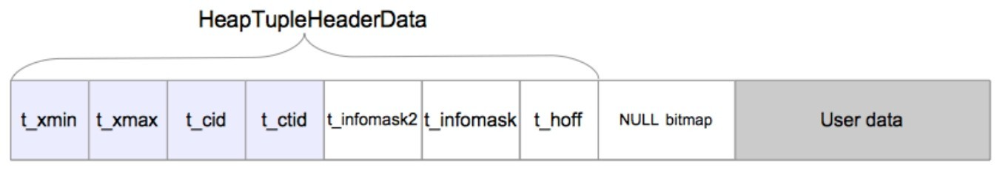

基于`REL_16_STABLE`分进行源码解读。
# 物理结构
PostgreSQL 的数据文件是按特定的目录和文件名组成：
1. 如果是特定的tablespace 的表/索引数据，则文件名形如
	```
	$PGDATA/pg_tblspc/$tablespace_oid/$database_oid/$relation_oid.no
	```
2. 如果不是特定的tablespace 的表/索引数据，则文件名形如
	```
	$PGDATA/base/$database_oid/$relation_oid.num
	```

## 页(Page)
数据文件(堆表、索引，也包括空闲空间映射和可见性映射)内部都是按照固定长度的页(Page)为单位存储的，页也叫区块，每个页的大小通常是 8KB(8192字节)，也可以配置为其他大小。每个文件中的页从0开始按顺序编号，这些数字称为区块号。如果文件已填满，PostgreSQL就通过在文件末尾追加一个新的空页。每个页包含以下部分：
- Page Header：存储有关该页的元数据，如页的整体信息，包括元组的个数、偏移量等，大约24字节。
- Tuple Data：存储实际的元组数据。元组存储在页中，<b>自底向上增长</b>。
- Item Pointer/Offset：元组的偏移指针，存储每个元组在页中的位置。存储在页的顶部，并向下增长。
- Free Space：未使用的空间。如果空间不足，会分配到新页。

Postgres磁盘页面布局
```
 * +----------------+---------------------------------+
 * | PageHeaderData | linp1 linp2 linp3 ...           |
 * +-----------+----+---------------------------------+
 * | ... linpN |									  |
 * +-----------+--------------------------------------+
 * |		   ^ pd_lower							  |
 * |												  |
 * |			 v pd_upper							  |
 * +-------------+------------------------------------+
 * |			 | tupleN ...                         |
 * +-------------+------------------+-----------------+
 * |	   ... tuple3 tuple2 tuple1 | "special space" |
 * +--------------------------------+-----------------+
 *									^ pd_special
```
```c
// src/include/storage/bufpage.h
typedef struct PageHeaderData
{
	// 用于WAL日志同步,本页面最近一次更变写入的XLOG记录对应的LSN
	PageXLogRecPtr pd_lsn;
	// 页的校验和
	uint16		pd_checksum;
	// 页的标志位，用于描述页状态
	uint16		pd_flags;
	// 空闲空间开始位置
	LocationIndex pd_lower;
	// 空闲空间结束位置
	LocationIndex pd_upper;
	// 页中特殊空间(如索引页)的开始位置
	LocationIndex pd_special;
	// 页大小和版本，将其打包成一个uint16字段是历史原因：
	// 在PostgreSQL7.3之前没有页面版本编号, 将7.3之前版本的页面版本编号为0
	// 约定页面的尺寸必须为256的倍数，留下低8位用于页面版本编号
	uint16		pd_pagesize_version;
	// 本页面中可以修剪的最老元组中的XID，如果没有则为0
	// 提示字段，用于确认剪枝是否有用
	TransactionId pd_prune_xid;

	// 行指针数组
	ItemIdData	pd_linp[FLEXIBLE_ARRAY_MEMBER];
} PageHeaderData;
typedef PageHeaderData *PageHeader;
```
```c
// src/include/storage/itemid.h
// 缓冲区页中的项目指针(item pointer)，也被称为行指针(line pointer)
typedef struct ItemIdData
{
	unsigned	lp_off:15,		// 相对于页面起始位置的元组偏移量
						lp_flags:2,		// 行指针的状态
						lp_len:15;		// 元组的长度，单位字节
} ItemIdData;
typedef ItemIdData *ItemId;

// 行指针的可能状态，LP_UNUSED表示该行指针可以立即重用，其他状态不可以
#define LP_UNUSED		0		/* unused (should always have lp_len=0) */
#define LP_NORMAL		1		/* used (should always have lp_len>0) */
#define LP_REDIRECT	2		/* HOT redirect (should have lp_len=0) */
#define LP_DEAD			3		/* dead, may or may not have storage */
```
行指针的末尾与最新元组起始位置之间的空余空间称为空闲空间或空洞。缓冲管理器使用LSN来强制实施WAL的基本规则是"WAL要先于数据写入"。在xlog刷盘位置超过本页面的LSN之前，不允许将缓冲区的脏页刷入磁盘。最小的可行页面大小可能是64B，能放下页面的首部、空闲空间，以及一个最小的元组。在实践中肯定要大得多(默认为8192B)，所以页面大小必须是256的倍数并不是一个重要限制。因为`lp_off/lp_len`字段都是15bit，最大只能支持32KB的页面。

## 元组
可以将表页中的堆元组分为普通数据元组与TOAST元组两类，大小超过约2KB(8KB的四分之一)的堆元组会使用一种称为TOAST(The Oversized-Attribute Storage Technique，超大属性存储技术)的方法来存储与管理。为了识别表中的元组，数据库内部会使用元组标识符(tuple identifier, TID)。TID由一对值组成，分别是元组所属页面的区块号和指向元组的行指针的偏移号。

---

堆元组由三个部分组成，即HeapTupleHeaderData结构、空值位图及用户数据。
<center>
    
    <div>元组结构</div>
</center>

```c
// src/include/access/htup.h
typedef struct HeapTupleHeaderData HeapTupleHeaderData;
typedef HeapTupleHeaderData *HeapTupleHeader;

typedef struct HeapTupleData
{
	uint32					t_len;			/* length of *t_data */
	ItemPointerData t_self;		/* SelfItemPointer */
	Oid							t_tableOid;		/* table the tuple came from */
	// 元组元数据
	HeapTupleHeader t_data;
} HeapTupleData;

typedef HeapTupleData *HeapTuple;
```
```c
// src/include/storage/itemptr.h
typedef struct ItemPointerData {
	// 确定属于哪个block
	BlockIdData ip_blkid;
	// 行指针的偏移, pd_linp数组哪个ItemIdData
	OffsetNumber ip_posid;
} ItemPointerData;
```
### 元组元数据

`HeapTupleHeaderData`中有和事务相关的几个重要字段：
- `t_xmin`:保存插入此元组的事务的txid。
- `t_xmax`：保存删除或更新此元组的事务的txid。如果尚未删除或更新此元组，则`t_xmax`设置为0，即无效。
- `t_cid`保存命令标识(command id, cid), 表示在当前事务中，执行当前命令之前执行了多少SQL命令，从零开始计数。例如，假设在单个事务中执行了3条`INSERT`命令`BEGIN; INSERT; INSERT; INSERT; COMMIT;`。如果第一条命令插入此元组，则该元组的`t_cid`被设置为0。如果第二条命令插入此元组，则其`t_cid`被设置为1，以此类推。
- `t_ctid`保存着指向自身或新元组的元组标识符(tid)。在更新该元组时，t_ctid 会指向新版本的元组，否则`t_ctid`会指向自己。

```c
// src/include/access/htup_details.h
struct HeapTupleHeaderData
{
	union
	{
		HeapTupleFields t_heap;
		DatumTupleFields t_datum;
	} t_choice;

	// 指向自身或新元组的元组标识(TID)
	// 更新元组时,它指向新版本元组,否则指向自己
	ItemPointerData t_ctid;

	/* 下面字段必须和MinimalTupleData相匹配*/
	uint16		t_infomask2;	/* number of attributes + various flags */
	// 标志位，用于指示该元组的状态(如是否有效、是否已删除等)
	uint16		t_infomask;
	uint8		t_hoff;			/* sizeof header incl. bitmap, padding */

	/* ^ - 23 bytes - ^ */
	// 空值位图
	bits8		t_bits[FLEXIBLE_ARRAY_MEMBER];

	/* MORE DATA FOLLOWS AT END OF STRUCT */
};

typedef struct HeapTupleFields
{
	// 插入此元组的事务ID
	TransactionId t_xmin;
	// 删除或更新此元组的事务ID
	// 若尚未删除或更细此元组,t_xmax设置为0,表示无效
	TransactionId t_xmax;
	union {
		// 插入或删除的命令标识(command id)
		// 表示当前事务中，执行当前命令前执行了多少SQL，从零开始计数
		CommandId	t_cid;
		// 老式VACUUM FULL的事务ID
		TransactionId t_xvac;
	} t_field3;
} HeapTupleFields;

typedef struct DatumTupleFields
{
	// 可变长Header的长度
	int32		datum_len_;
	//  -1或者是record类型标识
	int32		datum_typmod;	
	/* composite type OID, or RECORDOID */
	Oid			datum_typeid;	
} DatumTupleFields;
```


## 缓冲池
缓冲池中最终存储的就是一个个的page，每个page可以按照(tablespace_oid, database_oid, relation_oid, fork_no, page_no)唯一标示，采用`BufferTag`数据结构表示。
```c
// src/include/storage/buf_internals.h
typedef struct buftag
{
	Oid			spcOid;			/* tablespace oid */
	Oid			dbOid;			/* database oid */
	RelFileNumber relNumber;	/* relation file number */
	ForkNumber	forkNum;		/* fork number */
	BlockNumber blockNum;		/* blknum relative to begin of reln */
} BufferTag;
```
在PostgreSQL中，缓存池可以简单理解为在共享内存上分配的一个数组，其初始化的过程:
```c
// src/backend/storage/buffer/buf_init.c
void InitBufferPool(void) {
					.....
	// BufferDescPadded是在BufferDesc中添加填充避免伪共享
	BufferDescriptors = (BufferDescPadded *)
		ShmemInitStruct("Buffer Descriptors",
			NBuffers * sizeof(BufferDescPadded), &foundDescs);
	
	BufferBlocks = (char *) TYPEALIGN(PG_IO_ALIGN_SIZE,
		ShmemInitStruct("Buffer Blocks",
			NBuffers * (Size) BLCKSZ + PG_IO_ALIGN_SIZE, &foundBufs));
					......
}
```
`NBuffers`即缓存池的大小与GUC参数`shared_buffers`相关，`BufferBlocks`数组中每个元素都存储一个缓存也，对应的`buf_id`唯一标识一个缓存页。为了对缓存页进行管理，需要管理其元数据，`BufferDesc`结构体用来表示每个缓存页的元数据，将其称为缓存描述符。缓存描述符和缓存池的每个页面一一对应。

至此，如果要从缓存池中请求某个特定的页面，需要遍历所有的缓存描述符，为了优化此性能，PostgreSQL引入了一个BufferTag和缓存描述符的hash映射表，使得可以快速找到特定的数据页面在缓存池中的位置，
```c
// src/backend/storage/buffer/buf_table.c
typedef struct {
	BufferTag	key;			/* Tag of a disk page */
	int			id;				/* Associated buffer ID */
} BufferLookupEnt;
static HTAB *SharedBufHash;

void InitBufTable(int size) {
	HASHCTL		info;
	// 将BufferTag映射到Buffer
	info.keysize = sizeof(BufferTag);
	info.entrysize = sizeof(BufferLookupEnt);
	info.num_partitions = NUM_BUFFER_PARTITIONS;

	SharedBufHash = ShmemInitHash("Shared Buffer Lookup Table",
			size, size, &info, HASH_ELEM | HASH_BLOBS | HASH_PARTITION);
}
```
由此，PostgreSQL的缓存管理形成了三层结构：
- 缓存池，是一个数组，每个元素其实就是一个缓存页，下标buf_id唯一标示一个缓存页。
- 缓存描述符，也是一个数组，而且和缓存池的缓存一一对应，保存每个缓存页的元数据信息。
- 缓存hash表，是存储BufferTag和缓存描述符之间映射关系的hash表。

<div>

</img>
</div>

### 缓存描述符
```c
// src/include/storage/buf_internals.h
typedef struct BufferDesc {
	// 缓冲页存储的数据页的对应的页信息
	BufferTag	tag;
	// 缓存页下标，通过该字段可以访问对应缓存页，从0开始
	int			buf_id;

	// 由flags, refcount and usagecount组成的无符号32位状态变量
	// 18位的refcount,  当前一共有多少个后台进程正在访问该缓存页
	//									如果没有进程访问该页面，本文称为该缓存描述符unpinned
	//									否则称为该缓存描述符pinned
	// 4位的usagecount, 最近一共有多少个后台进程访问过该缓存页, 用于缓存页淘汰算法
	// 10位的flags,			表示一些缓存页的其他状态
	pg_atomic_uint32 state;

	int			wait_backend_pgprocno;	/* backend of pin-count waiter */
	// 该缓存之后第一个空闲的缓存描述符
	int			freeNext;
	// 控制缓存描述符的一个轻量级锁
	LWLock		content_lock;
} BufferDesc;

// todo : 填充大小是如何决定的？
#define BUFFERDESC_PAD_TO_SIZE	(SIZEOF_VOID_P == 8 ? 64 : 1)
// 在BufferDesc中添加填充避免伪共享
typedef union BufferDescPadded {
	BufferDesc	bufferdesc;
	char		pad[BUFFERDESC_PAD_TO_SIZE];
} BufferDescPadded;
```