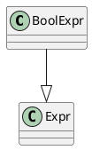

SQL字符串下发给Postgres到查询优化，调用栈：
```c
exec_simple_query(query_string)
  // 1. 语法解析
  pg_parse_query
    raw_parser
  // 2. Analyze和rewrite
  pg_analyze_and_rewrite_fixedparams
    // Analyse原始语法树并转化为Query
    parse_analyze_fixedparams
    // Rewrite the query
    pg_rewrite_query
  // 3. 执行查询优化
  pg_plan_queries
    pg_plan_query
      planner   // 查询优化入口
```
# Parser
`src/backend/parser/gram.y`词法分析，`src/backend/parser/scan.l`语法分析。
```C
// 将用户输入字符串形式的SQL解析成查询树
List * raw_parser(const char *str, RawParseMode mode)
```
## 语法树数据结构

PostgreSQL中的结构体采用了统一的形式，它们都是基于`Node`结构体进行的“扩展”，Node结构体中只包含一个`NodeTag`成员变量，`NodeTag`是枚举类型
```C
// src/include/nodes/nodes.h
typedef struct Node {
  NodeTag    type;
} Node;
```
以常见的简单的SELECT语句为例，了解其查询树的数据结构，在语法分析中可以看到
```
simple_select:
  SELECT opt_all_clause opt_target_list
  into_clause from_clause where_clause
  group_clause having_clause window_clause
    {
      SelectStmt *n = makeNode(SelectStmt);
      n->targetList = $3;
      n->intoClause = $4;
      n->fromClause = $5;
      n->whereClause = $6;
      n->groupClause = ($7)->list;
      n->groupDistinct = ($7)->distinct;
      n->havingClause = $8;
      n->windowClause = $9;
      $$ = (Node *) n;
    }
```

makeNode接口用于创建Node结构体，并给type赋值(T_SelectStmt)
```C
// src/include/nodes/nodes.h
#define newNode(size, tag) \
({  Node   *_result; \
  _result = (Node *) palloc0fast(size); \
  _result->type = (tag); \
  _result; \
})

#define makeNode(_type_)    ((_type_ *) newNode(sizeof(_type_),T_##_type_))
```
可见，SELECT语句的查询树采用`SelectStmt`结构表达
```C++
typedef struct SelectStmt {
  // makeNode接口给type赋值,即T_SelectStmt
  NodeTag    type;

  List     *distinctClause;
  IntoClause *intoClause;    /* target for SELECT INTO */
  List     *targetList;    /* the target list (of ResTarget) */
  List     *fromClause;    /* the FROM clause */
  Node     *whereClause;  /* WHERE qualification */
  List     *groupClause;  /* GROUP BY clauses */
  bool    groupDistinct;  /* Is this GROUP BY DISTINCT? */
  Node     *havingClause;  /* HAVING conditional-expression */
  List     *windowClause;  /* WINDOW window_name AS (...), ... */

  List     *valuesLists;  /* untransformed list of expression lists */

  List     *sortClause;    /* sort clause (a list of SortBy's) */
  Node     *limitOffset;  /* # of result tuples to skip */
  Node     *limitCount;    /* # of result tuples to return */
  LimitOption limitOption;  /* limit type */
  List     *lockingClause;  /* FOR UPDATE (list of LockingClause's) */
  WithClause *withClause;    /* WITH clause */

  SetOperation op;      /* type of set op */
  bool    all;      /* ALL specified? */
  struct SelectStmt *larg;  /* left child */
  struct SelectStmt *rarg;  /* right child */
} SelectStmt;
```
```c
// src/include/nodes/primnodes.h
// 语法树FROM clause, relation_expr经list_make1处理为List
typedef struct RangeVar {
  NodeTag    type;
  char     *catalogname;
  char     *schemaname;
  char     *relname;
  bool    inh;
  char    relpersistence;
  Alias     *alias;
  int      location;
} RangeVar;
```
`List`也是对Node的扩展，它的第一个成员也是`NodeTag`用于表示不同类型的List
```c
// src/include/nodes/pg_list.h
typedef struct List {
  // 表示不同类型的List
  NodeTag    type;
  // 当前elements的数量
  int      length;
  //  allocated length of elements[]
  int      max_length;
  // 
  ListCell   *elements;
  ListCell  initial_elements[FLEXIBLE_ARRAY_MEMBER];
} List;
```

# Analyze
`Query *parse_analyze_fixedparams(RawStmt *parseTree, ...)`实现对原始的语法树Analyze并转化为`Query`。首先了解一下`Query`结构。

## Query数据结构
```C
// src/include/nodes/parsenodes.h
typedef struct Query {
  // 取值为T_Query
  NodeTag    type;
  CmdType    commandType;
  QuerySource querySource pg_node_attr(query_jumble_ignore);
      ......
} Query;
```
### Var结构
```C
typedef struct Var {
  Expr    xpr;
  // 列属性所在表在Query->rtable中的rtindex
  int      varno;
  // 列属性在表中的编号(第几列)
  AttrNumber  varattno;

  // 列属性对应的类型
  Oid      vartype pg_node_attr(query_jumble_ignore);
  // 列属性的精度(长度)
  int32    vartypmod pg_node_attr(query_jumble_ignore);
  /* OID of collation, or InvalidOid if none */
  Oid      varcollid pg_node_attr(query_jumble_ignore);
  Bitmapset  *varnullingrels pg_node_attr(query_jumble_ignore);

  // 列属性的相对位置,和子查询相关
  // 确定列属性对应的表所在的层次(相对值)
  Index    varlevelsup;

  Index    varnosyn pg_node_attr(equal_ignore, query_jumble_ignore);
  AttrNumber  varattnosyn pg_node_attr(equal_ignore, query_jumble_ignore);

  // 列属性出现在SQL语句中的位置
  int      location;
} Var;
```

### RangeTblEntry结构
RangeTblEntry(范围表，简称RTE)描述了查询中出现的表，它通常出现在查询语句的FROM子句中，范围表中既有常规意义上的堆表，还有子查询、连接表等。
```c
typedef struct RangeTblEntry{
  NodeTag    type;
  // 范围表的类型
  RTEKind    rtekind;

  // For RTE_RELATION,普通的表
  Oid      relid;
  char    relkind;
  int      rellockmode;
  struct TableSampleClause *tablesample;
  Index    perminfoindex;

  // for RTE_SUBQUERY,子查询类型的表
  Query     *subquery;
  bool    security_barrier;

  // For RTE_JOIN,连接类型的表
  JoinType  jointype;
  int      joinmergedcols;
  // Join的表的所有列集合
  List     *joinaliasvars;
  List     *joinleftcols;
  List     *joinrightcols;

        ......
} RangeTblEntry;
```
### RangeTblRef结构
`RangeTblEntry`只保留在查询树的`Query->rtable`链表中，而链表是一个线性结构，它如何保存树状的关系代数表达式中的连接操作呢？答案是在`Query->jointree`中保存各个范围表之间的连接关系。

如果在`Query->jointree`中还保存同样的一份`RangeTblEntry`，那么一方面会造成存储的冗余，另一方面也容易产生数据不一致的问题，因此在查询树的其他任何地方都不再存放新的`RangeTblEntry`，每个范围表在Query->rtable链表中有且只能有一个，在其他地方使用到范围表都使用`RangeTblRef`来代替。`RangeTblRef`是对`RangeTblEntry`的引用，因为`RangeTblEntry`在`Query->rtable`中的位置是确定的，因此可以用它在`Query->rtable`链表中的位置`rtindex`来标识。

```C
// src/include/nodes/primnodes.h
typedef struct RangeTblRef {
  NodeTag    type;
  int      rtindex;
} RangeTblRef;
```
### 表连接
查询语句中如果显式地指定两个表之间的连接关系，例如`A LEFT JOIN B ON Pab`这种形式，用`JoinExpr`来表示
```c
typedef struct JoinExpr {
  NodeTag    type;
  // Join类型，例如JOIN_INNER等
  JoinType  jointype;
  // 是否是自然连接
  bool    isNatural;
  // 连接操作的LHS(左侧)表
  Node     *larg;
  // 连接操作的RHS(右侧)表
  Node     *rarg;
  // USING子句对应的约束条件
  List     *usingClause pg_node_attr(query_jumble_ignore);
  /* alias attached to USING clause, if any */
  Alias     *join_using_alias pg_node_attr(query_jumble_ignore);
  // on子句对应的约束条件
  Node     *quals;
  // 连接操作的投影列
  Alias     *alias pg_node_attr(query_jumble_ignore);
  // 当前JoinExpr对应的RangeTblRef->rtindex
  int      rtindex;
} JoinExpr;
```

`FromExpr`和`JoinExpr`是用来表示表之间的连接关系的结构体。通常来说，`FromExpr`中的各个表之间的连接关系是Inner Join，这样就可以在`FromExpr->fromlist`中保存任意多个表，默认是内连接的关系
```C
typedef struct FromExpr {
  NodeTag    type;
  // FromExpr中包含的表
  List     *fromlist;
  // fromlist中表间的约束条件
  Node     *quals;
} FromExpr;
```


# 查询优化

## 逻辑重写优化

查询优化的入口在`src\backend\optimizer\plan\planner.c`的`planner`接口,它支持通过`planner_hook`来自定义优化方法，如果没有采用PG自定义的标准的查询优化函数`standard_planner`。
```C++
PlannedStmt * planner(Query *parse, const char *query_string,
            int cursorOptions, ParamListInfo boundParams)
```

### 表达式预处理
```C
static Node * preprocess_expression(PlannerInfo *root, Node *expr, int kind)
```
预处理表达式(`preprocess_expression`函数)是对查询树(Query)中的表达式进行规范整理的过程，包括对连接产生的别名Var进行替换、对常量表达式求值、对约束条件进行拉平、为子连接(SubLink)生成执行计划等。

表达式表达数据结构
```C
// 表达式表达的父类
typedef struct Expr {
  pg_node_attr(abstract)
  NodeTag    type;
} Expr;
```


#### 常量化简
`eval_const_expressions`对含有常量的表达预先进行求值，它递归地调用了`eval_const_expressions_mutator`对不同类型的表达式处理。
```C
Node * eval_const_expressions(PlannerInfo *root, Node *node)
```
常量化简的主要的优化点有参数常量化、函数常量化、约束条件常量化3个方面
1. 参数的常量化是通过遍历参数的表达式实现的，如果发现参数表达式中全部为常量，则对参数执行预先求值。
  ```sql
  
  ```

2. 函数常量化(`simplify_function`)，如果所有的参数都是常量，则尝试预先获取函数的执行结果，并将结果常量化。
  ```sql
  
  ```

3. 


### 谓词规范
```C
// src/include/nodes/primnodes.h
// BoolExpr用于表示AND, OR和NOT的bool表达式
typedef enum BoolExprType {
  AND_EXPR, OR_EXPR, NOT_EXPR
} BoolExprType;

typedef struct BoolExpr {
  pg_node_attr(custom_read_write)
  Expr    xpr;
  BoolExprType boolop;
  List     *args;
  // token location, or -1 if unknown
  int      location;
} BoolExpr;
```
#### 谓词规约
`find_duplicate_ors`可以实现谓词规约，例如,OR操作，约束条件中的NULL和FALSE是可以忽略掉的
```sql
SELECT * FROM student WHERE NULL OR FALSE OR sno=1;s

-- 谓词规约处理，等价于
SELECT * FROM student WHERE sno=1;
```
对于AND操作，如果涉及了NULL或FALSE，则实际上代表整个约束条件可以规约为FALSE
```sql
SELECT * FROM student WHERE NULL AND FALSE AND sno=1;s

-- 谓词规约处理，等价于
SELECT * FROM student WHERE FALSE;
```

相关实现源码：
```C
// src/backend/optimizer/prep/prepqual.c
// @param is_check 表示是否规约
static Expr * find_duplicate_ors(Expr *qual, bool is_check) {
  // 1. 处理OR子句处理
  if (is_orclause(qual)) {
    List     *orlist = NIL;
    ListCell   *temp;

    foreach(temp, ((BoolExpr *) qual)->args) {
      Expr     *arg = (Expr *) lfirst(temp);
      arg = find_duplicate_ors(arg, is_check);

      // 1.1 处理OR子句中的常量
      if (arg && IsA(arg, Const)) {
        Const     *carg = (Const *) arg;
        if (is_check) {
          /* Within OR in CHECK, drop constant FALSE */
          if (!carg->constisnull && !DatumGetBool(carg->constvalue)) continue;
          /* Constant TRUE or NULL, so OR reduces to TRUE */
          return (Expr *) makeBoolConst(true, false);
        } else {
          // 如果发现了NULL或FALSE，直接跳过(丢弃)
          if (carg->constisnull || !DatumGetBool(carg->constvalue))
            continue;
          // 否则，该常量是真值，该约束条件
          return arg;
        }
      }
      orlist = lappend(orlist, arg);
    }

    // 1.2 OR拉平
    orlist = pull_ors(orlist);
    return process_duplicate_ors(orlist);
  } else if (is_andclause(qual)) {
    // 2. 处理AND子句
    List     *andlist = NIL;
    ListCell   *temp;
    foreach(temp, ((BoolExpr *) qual)->args) {
      Expr     *arg = (Expr *) lfirst(temp);
      arg = find_duplicate_ors(arg, is_check);
      
      // 2.1 处理AND子句的常量
      if (arg && IsA(arg, Const)) {
        Const     *carg = (Const *) arg;
        if (is_check) {
          /* Within AND in CHECK, drop constant TRUE or NULL */
          if (carg->constisnull || DatumGetBool(carg->constvalue)) continue;
          /* Constant FALSE, so AND reduces to FALSE */
          return arg;
        } else {
          // 如果常量恒为True，则直接跳过
          if (!carg->constisnull && DatumGetBool(carg->constvalue)) continue;
          // 否则这个常量是NULL或FALSE，直接将这个约束条件规约威FALSE
          return (Expr *) makeBoolConst(false, false);
        }
      }
      andlist = lappend(andlist, arg);
    }

    // 2.2 AND拉平
    andlist = pull_ands(andlist);

    /* AND of no inputs reduces to TRUE */
    if (andlist == NIL) return (Expr *) makeBoolConst(true, false);

    /* Single-expression AND just reduces to that expression */
    if (list_length(andlist) == 1) return (Expr *) linitial(andlist);

    /* Else we still need an AND node */
    return make_andclause(andlist);
  }
  else
    return qual;
}
```
#### 谓词拉平
or谓词拉平
```C
// src/backend/optimizer/prep/prepqual.c
static List * pull_ors(List *orlist) {
  List     *out_list = NIL;
  ListCell   *arg;
  foreach(arg, orlist) {
    Node     *subexpr = (Node *) lfirst(arg);
    if (is_orclause(subexpr))
      // 对于OR之举，递归处理
      out_list = list_concat(out_list, pull_ors(((BoolExpr *) subexpr)->args));
    else
      // 非OR子句，将表达式添加到链表尾部
      out_list = lappend(out_list, subexpr);
  }
  return out_list;
}
```

AND谓词拉平
```C
// src/backend/optimizer/prep/prepqual.c
static List *pull_ands(List *andlist) {
  List     *out_list = NIL;
  ListCell   *arg;
  foreach(arg, andlist) {
    Node     *subexpr = (Node *) lfirst(arg);
    if (is_andclause(subexpr))
      // AND Bool子句，递归处理
      out_list = list_concat(out_list, pull_ands(((BoolExpr *) subexpr)->args));
    else
      // 非AND Bool子句，将表达式添加到链表尾部
      out_list = lappend(out_list, subexpr);
  }
  return out_list;
}
```

#### 提取公共项
在约束条件被规约和拉平之后，可以尝试对形如`(A AND B) OR (A AND C)`的约束条件进行优化，提取出A作为公共项，相关功能实现在`process_duplicate_ors`中，实现主流程：

1. 对参数`orlist`分解，找到其中最短的子句。例如对于约束条件`(A AND B AND C)OR (A AND B) OR (A AND C AND D)`，OR操作串联了3个子约束条件，可以先尝试找到其中最短的一个`(A AND B)`，因为如果有公共因子，那么最短的那个也一定包含公共因子，通过找到最短的那个子句，在后面的操作里能减少循环的次数。

2. 以最短的约束条件为依据，提取公共项。

```c
static Expr * process_duplicate_ors(List *orlist) {
  List     *reference = NIL;
  int      num_subclauses = 0;
  ListCell   *temp;

  if (orlist == NIL) return (Expr *) makeBoolConst(false, false);

  /* Single-expression OR just reduces to that expression */
  if (list_length(orlist) == 1) return (Expr *) linitial(orlist);

  // 1. 找最短子句
  foreach(temp, orlist) {
    Expr     *clause = (Expr *) lfirst(temp);
    if (is_andclause(clause)) {
      List     *subclauses = ((BoolExpr *) clause)->args;
      int      nclauses = list_length(subclauses);
      // 比较长度，寻找比较短的约束条件
      if (reference == NIL || nclauses < num_subclauses) {
        reference = subclauses;
        num_subclauses = nclauses;
      }
    } else {
      // 不是AND类型的约束条件，全部记录下来
      // 可能是带表达式的约束条件或单个约束条件
      // 例如：(A AND B) OR A 或 (A IS NULL AND B) or A IS NULL
      reference = list_make1(clause);
      break;
    }
  }
  // 删除重复项
  reference = list_union(NIL, reference);


  // 2. 查找公共项
  //  winner表示公共项，orlist总含最短子句的AND子句或和最短子句相同的子句
  List     * winners = NIL;
  foreach(temp, reference) {
    Expr     *refclause = (Expr *) lfirst(temp);
    bool    win = true;
    ListCell   *temp2;

    foreach(temp2, orlist) {
      Expr     *clause = (Expr *) lfirst(temp2);
      if (is_andclause(clause)) {
        // 如果是AND子句，refclause是clause AND子句的子集
        if (!list_member(((BoolExpr *) clause)->args, refclause)) {
          win = false;
          break;
        }
      } else {
        // 非AND子句，相等是公共项
        if (!equal(refclause, clause)) {
          win = false;
          break;
        }
      }
    }

    if (win) winners = lappend(winners, refclause);
  }

  // 无公共项
  if (winners == NIL) return make_orclause(orlist);

  // 3. 存在公共项，提取公共项
  List     *neworlist = NIL;
  foreach(temp, orlist) {
    Expr     *clause = (Expr *) lfirst(temp);
    if (is_andclause(clause)) {
      List     *subclauses = ((BoolExpr *) clause)->args;
      // 剔除subclauses中的公共项，生成subclauses
      subclauses = list_difference(subclauses, winners);
      if (subclauses != NIL) {
        if (list_length(subclauses) == 1)
          neworlist = lappend(neworlist, linitial(subclauses));
        else
          neworlist = lappend(neworlist, make_andclause(subclauses));
      } else {
        // 提取后无剩余项，例如(A AND B AND C) OR (A AND B)
        neworlist = NIL;
        break;
      }
    } else {
      if (!list_member(winners, clause))
        neworlist = lappend(neworlist, clause);
      else {
        // 提取后无剩余项，例如(A AND B AND C) OR (A)
        neworlist = NIL;  /* degenerate case, see above */
        break;
      }
    }
  }

  // 将neworlist添加到winner尾部
  if (neworlist != NIL) {
    if (list_length(neworlist) == 1)
      winners = lappend(winners, linitial(neworlist));
    else
      winners = lappend(winners, make_orclause(pull_ors(neworlist)));
  }

  if (list_length(winners) == 1)
    return (Expr *) linitial(winners);
  else
    return make_andclause(pull_ands(winners));
}
```

```c
GroupingSetsPath * create_groupingsets_path(
```

```c
AggPath * create_agg_path(
```

### Group By键值消除
Group By字句实现需要借助排序或Hash来实现，减少Group后面的字段，可以降低排序或Hash带来的开销。对于有主键的表，如果Group by字段包含主键的所有键值，那么主键实际上已经符合分组要求。
```c
static void remove_useless_groupby_columns(PlannerInfo *root) {
  Query     *parse = root->parse;
  ListCell   *lc;
  int      relid;

  // 下面场景无法进行消除优化,直接返回
  //    1. Group By字段数量小于2
  //    2. 含grouppingset
  if (list_length(root->processed_groupClause) < 2 ||
      parse->groupingSets) return;

  // 二维数组，[var->varno][var->varattno + 7]
  Bitmapset ** groupbyattnos = (Bitmapset **) palloc0(sizeof(Bitmapset *) *
      (list_length(parse->rtable) + 1));
  // 1. 获取group by字段,构建BitMapSet
  foreach(lc, root->processed_groupClause) {
    // 获取group by字段
    SortGroupClause *sgc = lfirst_node(SortGroupClause, lc);
    TargetEntry *tle = get_sortgroupclause_tle(sgc, parse->targetList);
    Var       *var = (Var *) tle->expr;

    // 忽略非表达式或非本层的表达式
    if (!IsA(var, Var) || var->varlevelsup > 0) continue;
    relid = var->varno;
    groupbyattnos[relid] = bms_add_member(groupbyattnos[relid],
        var->varattno - FirstLowInvalidHeapAttributeNumber/*常量-7*/);
  }

  // 如果group by子句包含主键所有键值，记录group by中可以删除的项
  Bitmapset ** surplusvars = NULL;
  relid = 0;
  // 2. 获取表的表主键键值并计算group by中可以删除的项
  foreach(lc, parse->rtable) {
    RangeTblEntry *rte = lfirst_node(RangeTblEntry, lc);
    Bitmapset  *relattnos;
    Bitmapset  *pkattnos;
    Oid      constraintOid;

    relid++;

    // 只有RTE_RELATION才可能有主键约束
    if (rte->rtekind != RTE_RELATION) continue;

    // 继承分区表可能会导致数据重复，不可以进行该优化
    if (rte->inh && rte->relkind != RELKIND_PARTITIONED_TABLE) continue;

    // 如果该关系没有>1个Group by的var, 则不需优化
    relattnos = groupbyattnos[relid];
    if (bms_membership(relattnos) != BMS_MULTIPLE) continue;

    // 获取表主键，并封装bit map set
    pkattnos = get_primary_key_attnos(rte->relid, false, &constraintOid);
    if (pkattnos == NULL) continue;

    // 如果group by字段包含主键键值，可以将group by中非主键键值删除
    // surplusvars记录group by中可以被删除的项
    if (bms_subset_compare(pkattnos, relattnos) == BMS_SUBSET1) {
      if (surplusvars == NULL)
        surplusvars = (Bitmapset **) palloc0(sizeof(Bitmapset *) *
                           (list_length(parse->rtable) + 1));
      surplusvars[relid] = bms_difference(relattnos, pkattnos);
    }
  }

  // 删除group by字段中主键键值之外的属性
  if (surplusvars != NULL) {
    List     *new_groupby = NIL;
    foreach(lc, root->processed_groupClause) {
      SortGroupClause *sgc = lfirst_node(SortGroupClause, lc);
      TargetEntry *tle = get_sortgroupclause_tle(sgc, parse->targetList);
      Var       *var = (Var *) tle->expr;

      // 新group by字段需要满足是本层表达式且非待删除项
      if (!IsA(var, Var) || var->varlevelsup > 0 ||
        !bms_is_member(var->varattno - FirstLowInvalidHeapAttributeNumber,
                 surplusvars[var->varno]))
        new_groupby = lappend(new_groupby, sgc);
    }

    root->processed_groupClause = new_groupby;
  }
}
```

## 统计信息
PostgreSQL数据库在`PG_CLASS`系统表中会保存两个统计信息，分别是relpages和reltuples，relpages记录了当前表占用了多少个页面，reltuples记录了当前表共有多少条元组。

`PG_STATISTIC`系统表保存单列的统计信息，如果用户要给某一个表生成统计信息，则可以使用`ANALYZE`对一个表进行统计分析，生成统计信息在`PG_STATISTIC`中。

```c
CATALOG(pg_statistic,2619,StatisticRelationId) {
  // 分别表的OID和列的编号
  Oid  starelid BKI_LOOKUP(pg_class);
  int16		staattnum;

  bool		stainherit;		/* true if inheritance children are included */

  // 空值率,表示属性中NULL值占比
  float4		stanullfrac;
  // 属性的平均宽度
  int32		stawidth;
  // 属性去重后非NULL值的个数或比例,有3种可能取值情况
  // = 0, 代表未知或者未计算的情况
  // > 0, 代表消除重复值之后的个数，不常使用这种情况
  // < 0, 其绝对值是去重之后的个数占总个数的比例，通常使用这种类型
  float4		stadistinct;


  /**
   * PostgreSQL对每个属性统计最多只能应用STATISTIC_NUM_SLOTS=5种方法,因此有
   *  stakind(1-5) : 表示统计信息的形式
   *  staop(1-5) : 统计过程中涉及的操作符
   *  stanumbers[1](1-5) : 存放统计信息的高频值数组或相关系数
   *  stavalues(1-5) : 统计值数组
   */
  int16  stakind1;
  int16		stakind2;
  int16		stakind3;
  int16		stakind4;
  int16		stakind5;

  Oid  staop1 BKI_LOOKUP_OPT(pg_operator);
  Oid  staop2 BKI_LOOKUP_OPT(pg_operator);
  Oid  staop3 BKI_LOOKUP_OPT(pg_operator);
  Oid  staop4 BKI_LOOKUP_OPT(pg_operator);
  Oid  staop5 BKI_LOOKUP_OPT(pg_operator);

  Oid  stacoll1 BKI_LOOKUP_OPT(pg_collation);
  Oid  stacoll2 BKI_LOOKUP_OPT(pg_collation);
  Oid  stacoll3 BKI_LOOKUP_OPT(pg_collation);
  Oid  stacoll4 BKI_LOOKUP_OPT(pg_collation);
  Oid  stacoll5 BKI_LOOKUP_OPT(pg_collation);

#ifdef CATALOG_VARLEN	
  // 
  float4  stanumbers1[1];
  float4  stanumbers2[1];
  float4  stanumbers3[1];
  float4  stanumbers4[1];
  float4  stanumbers5[1];

  // 统计值数组
  // 如果stakind1保存的统计信息类型是STATISTIC_KIND_MCV
  // stavalues中保存的是高频值对应的值
  anyarray  stavalues1;
  anyarray  stavalues2;
  anyarray  stavalues3;
  anyarray  stavalues4;
  anyarray  stavalues5;
#endif
} FormData_pg_statistic;
```

```C
// 列可以应用的统计方法
#define STATISTIC_NUM_SLOTS  5

// 高频值, 表示一个列中出现最频繁的值
#define STATISTIC_KIND_MCV 1 
// 直方图
#define STATISTIC_KIND_HISTOGRAM 2
// 相关系数, 记录的是当前列未排序的数据分布和排序后的数据分布的相关性
#define STATISTIC_KIND_CORRELATION 3
// 类型高频值
#define STATISTIC_KIND_MCELEM 4 
// 数组类型高频值
#define STATISTIC_KIND_DECHIST 5 
```

`PG_STATISTIC_EXT`系统表保存的是多列的统计信息，用户需要显式地使用`CREATE STATISTICS`语句对一个表创建多列统计信息。通过`CREATE STATISTICS`语句创建统计信息之后只是在`PG_STATISTIC_EXT`系统表中增加了一个统计信息项，此时并没有真正对指定表上的属性去做统计分析，只有在用户对表再次执行`ANALYZE`时，而且ANALYZE的表的属性满足了多列统计信息的要求，才会生成多列统计信息。
```c
CATALOG(pg_statistic_ext,3381,StatisticExtRelationId) {
  // 统计信息属于哪个表
  Oid oid;
  // relation containing attributes
  Oid stxrelid BKI_LOOKUP(pg_class);

  // 这两个字段构成了唯一key
  // 分别表示统计信息的名字和命名空间
  NameData stxname;
  // 统计信息的命名空间
  Oid stxnamespace BKI_LOOKUP(pg_namespace);

  // 
  Oid     stxowner BKI_LOOKUP(pg_authid); /* statistics object's owner */
  int32   stxstattarget BKI_DEFAULT(-1);  /* statistics target */

  // 统计了哪些列
  int2vector  stxkeys BKI_FORCE_NOT_NULL;
#ifdef CATALOG_VARLEN
  // 多列统计支持的类型，参见下面的宏定义
  char stxkind[1] BKI_FORCE_NOT_NULL;
  pg_node_tree stxexprs;
#endif
} FormData_pg_statistic_ext;
```

```c
// 多列统计支持的类型, 宏定义
#define STATS_EXT_NDISTINCT       'd'
#define STATS_EXT_DEPENDENCIES    'f'
#define STATS_EXT_MCV             'm'
#define STATS_EXT_EXPRESSIONS     'e'
```

### 单列统计信息生成
`analyze_rel`调用的`do_analyze_rel`实现单列统计信息的生成，主要包含两部分：数据采集和数据统计
```c
static void do_analyze_rel(Relation onerel,
    VacuumParams *params, List *va_cols,
    AcquireSampleRowsFunc acquirefunc,
    BlockNumber relpages, bool inh,
    bool in_outer_xact, int elevel)
```
PostgreSQL数据库的统计模块对一个表进行统计的时候，不是使用全部数据作为样本进行统计，而是随机地采集表中的一部分元组作为样本来生成统计信息。通过调整default_statistics_target的值可以改变样本容量，目前default_statistics_target的默认值是100，在计算样本容量时，采用300×default_statistics_target=30000作为采样的样本默认容量。


数据采样的实现代码在acquire_sample_rows函数中，它采用了两阶段采样的算法进行数据的采样，第一个阶段使用S算法对表中的页面进行随机采样，第二阶段使用Z(Vitter)算法，它在第一阶段采样出来的页面的基础上对元组进行采样。

Algorithm S from Knuth 3.4.2 https://rosettacode.org/wiki/Knuth%27s_algorithm_S

## 扫描路径
扫描路径是对基表进行遍历时的执行路径，针对不同的基表有不同的扫描路径，例如针对堆表有顺序扫描(SeqScan)、针对索引有索引扫描(IndexScan)和位图扫描(BitmapScan)、针对子查询有子查询扫描(SubqueryScan)、针对通用表达式有通用表达式扫描(CteScan)等，扫描路径通常是执行计划树的叶子节点。


```c
// src/include/optimizer/cost.h

// 基于页面的IO基准代价
// 1. 顺序读写一个页面的IO代价
#define DEFAULT_SEQ_PAGE_COST  1.0
// 2. 随机读写一个页面的IO代价
#define DEFAULT_RANDOM_PAGE_COST  4.0

// 基于元组的CPU代价
#define DEFAULT_CPU_TUPLE_COST	0.01
#define DEFAULT_CPU_INDEX_TUPLE_COST 0.005

// 基于表达式的COU代价
#define DEFAULT_CPU_OPERATOR_COST  0.0025

// 并行查询产生的基准代价
// Gather进程和Worker进程在并行查询的过程中需要进行通信,需要考虑
//  1. Worker进程向Gather进程投递元组的代价
#define DEFAULT_PARALLEL_TUPLE_COST 0.1
//  2. 进程间通信(IPC)所需的初始化代价
#define DEFAULT_PARALLEL_SETUP_COST  1000.0

#define DEFAULT_RECURSIVE_WORKTABLE_FACTOR  10.0

// 缓存对代价的影响
// 数据库本身有缓存系统，磁盘上也有磁盘缓存
// 当读取一个缓存中的数据页面时是不会产生磁盘IO的
// 如果对每个页面都计算磁盘IO的代价，代价计算会失真
// 因此, 需要对缓存中的页面数量有一个估计
// 用effective_cache_size参数来表示
#define DEFAULT_EFFECTIVE_CACHE_SIZE  524288
```

`compute_parallel_worker`函数来获得实际可用的并行度

## 生成执行计划
最优的执行路径生成后，虽然Path Tree已经足够清楚地指出查询计划要进行的物理操作，但含有代价计算的冗余信息，不便于查询执行器使用，并且有些参数还没有建立好，因此通过将其转换成执行计划来生成更适合查询执行器的Plan Tree，然后将Plan Tree转交给执行器。

PostgreSQL数据库的每个Path节点都一一对应一个Plan节点(相关实现见`create_plan_recurse`)，最优的执行路径需要通过`create_plan`函数转换成对应的执行计划(Plan)。
```c
// 递归地将Path转化为Plan
static Plan * create_plan_recurse(PlannerInfo *root,
    Path *best_path, int flags)
```

### 表扫描
`Scan`是所有扫描路径的基类，在其上派生出`SeqScan`,`IndexScan`等。
```c
// 所有扫描路径的基类
typedef struct Scan {
  pg_node_attr(abstract)
  Plan    plan;
  Index    scanrelid;
} Scan;

// 顺序扫描
typedef struct SeqScan {
  Scan    scan;
} SeqScan;

typedef struct IndexOnlyScan {
  Scan    scan;
  Oid      indexid;    /* OID of index to scan */
  List     *indexqual;    /* list of index quals (usually OpExprs) */
  List     *recheckqual;  /* index quals in recheckable form */
  List     *indexorderby;  /* list of index ORDER BY exprs */
  List     *indextlist;    /* TargetEntry list describing index's cols */
  ScanDirection indexorderdir;  /* forward or backward or don't care */
} IndexOnlyScan;
```

```c
static Plan * create_scan_plan(PlannerInfo *root,
    Path *best_path, int flags) {
  List     *scan_clauses;
  switch (best_path->pathtype) {
    case T_IndexScan:
    case T_IndexOnlyScan:
      // 索引过滤条件
      scan_clauses = castNode(IndexPath, best_path)->indexinfo->indrestrictinfo;
      break;
    default:
     // 过滤条件
      scan_clauses = rel->baserestrictinfo;
      break;
  }

}
```


### 聚集
```c
static Plan * create_plan_recurse(PlannerInfo *root,
        Path *best_path, int flags) {
        ......
  case T_Agg:
    if (IsA(best_path, GroupingSetsPath))
      plan = create_groupingsets_plan(root, (GroupingSetsPath*) best_path);
    else {
      plan = (Plan *) create_agg_plan(root, (AggPath*) best_path);
    }
    break;
        ......
}
```

### MergeAppend

```c
static Plan * create_merge_append_plan(PlannerInfo *root, 
    MergeAppendPath *best_path, int flags) {
  MergeAppend *node = makeNode(MergeAppend);
  PartitionPruneInfo *partpruneinfo = NULL;

        .....
  
  if (enable_partition_pruning) {
    List *prunequal = extract_actual_clauses(
      rel->baserestrictinfo, false);

    if (prunequal != NIL)
      partpruneinfo = make_partition_pruneinfo(root, rel,
          best_path->subpaths, prunequal);
  }
  node->mergeplans = subplans;
  node->part_prune_info = partpruneinfo;

        ......
}
```
### 其他
```C
// 将Path中的Cost和Size信息复制到Plan(Explain会用到，一般执行不需要)
// 复制并行相关的信息
static void copy_generic_path_info(Plan *dest, Path *src) {
   dest->startup_cost = src->startup_cost;
   dest->total_cost = src->total_cost;
   dest->plan_rows = src->rows;
   dest->plan_width = src->pathtarget->width;
   dest->parallel_aware = src->parallel_aware;
   dest->parallel_safe = src->parallel_safe;
}
```