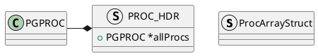

PG是多进程架构，Postgres Server Process(服务器进程)是所有数据库集簇管理进程的父进程，也称PostgreMaster。在PostMaster中存有一个`PROC_HDR *ProcGlobal`进程数据以及`ProcArrayStruct *procArray`，在`procArray`中存在一个`pgprocnos`标识


```C++
// src/backend/storage/ipc/procarray.c
// 其后存在一个pgprocnos变量定义记录在allProcs[]中的index
static ProcArrayStruct *procArray;

// 指向ProcGlobal->allProcs相同的地址
// 参见CreateSharedProcArray
static PGPROC *allProcs;

// src/include/storage/proc.h
// 整个Database cluster有一个ProcGlobal数据结构
// 参见InitProcGlobal()对ProcGlobal进行初始化
extern PGDLLIMPORT PROC_HDR *ProcGlobal;
```


```C++
static void InitCommunication(void) {
	if (!IsUnderPostmaster) {
		CreateSharedMemoryAndSemaphores();
	}
}

```

