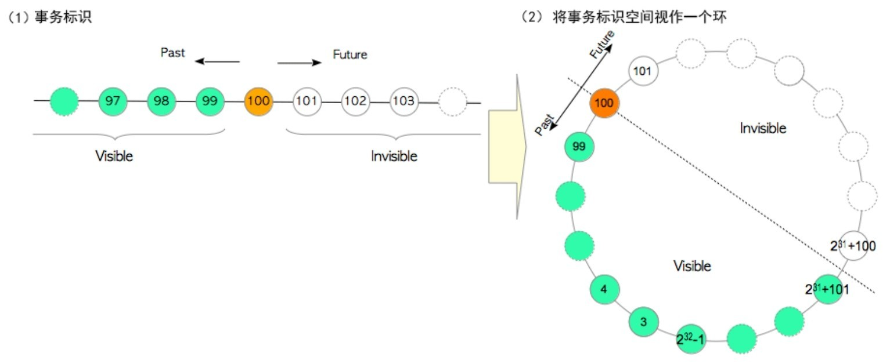
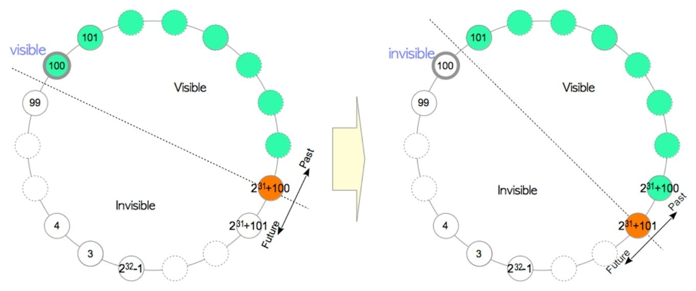
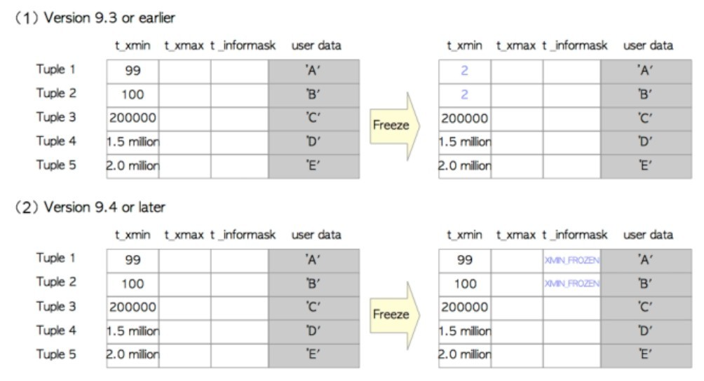
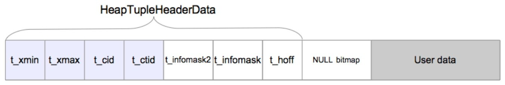

当多个事务同时在数据库中运行时，并发控制是一种用于维持一致性与隔离性的技术。PostgreSQL使用一种MVCC的变体，叫作快照隔离(Snapshot Isolation, SI)。PostgreSQL通过可见性检查来实现SI，即新数据对象被直接插入相关表页中，读取对象时，根据可见性检查规则，为每个事务选择合适的对象版本作为响应。

SI中不会出现在ANSI SQL-92标准中定义的三种异常，分别是脏读、不可重复读和幻读。但 SI无法实现真正的可串行化，因为在 SI中可能会出现串行化异常，例如写偏差和只读事务偏差。需要注意的是，ANSI SQL-92标准中可串行化的定义与现代理论中的定义并不相同。为了解决这个问题，PostgreSQL 从9.1版本之后添加了可串行化快照隔离(Serializable Snapshot Isolation, SSI), SSI可以检测串行化异常，并解决这种异常导致的冲突。因此，9.1版本之后的PostgreSQL提供了真正的SERIALIZABLE隔离等级。

| 隔离级别 |            脏读             | 不可重复读 |            幻读             | 串行化异常 |                                        |
| :------: | :-------------------------: | :--------: | :-------------------------: | ---------- | -------------------------------------- |
| 读未提交 | SQL标准允许，PG中不可能出现 |    可能    |            可能             | 可能       | 实际上不存在，因为PG中不存在脏读       |
| 读已提交 |           不可能            |    可能    |            可能             | 可能       | 事务在每次执行SQL时获取快照            |
| 可重复读 |           不可能            |   不可能   | SQL标准允许，PG中不可能出现 | 可能       | 事务只会在执行第一条命令时获取一次快照 |
| 可串行化 |           不可能            |   不可能   |           不可能            | 不可能     | 事务只会在执行第一条命令时获取一次快照 |

在9.0及更低的版本中，可重复读被当作可串行化(它满足了ANSI SQL-92标准)，但9.1版本中SSI的实现可意见检查串行化异常，并解决串行化异常导致的冲突，实现了真正的SERIALIZABLE隔离等级。PostgreSQL对DML(SELECT、UPDATE、INSERT、DELETE等命令)使用SSI，对DDL(CREATE TABLE等命令)使用2PL。


PostgreSQL除了基础的事务能力之外，还提供了子事务的能力，也就是保存点(SAVEPOINT)的功能。保存点功能能够支持在发生错误时自动回滚到上一保存点，而无需回滚整个事务；或者在任意时刻回滚到某一特定保存点的状态，而放弃事务中的部分修改。由于PostgreSQL保存点/子事务的强大能力，其被广泛应用与PLSQL/UDF/Function、Webservice(django)，数据同步服务保证exactly-once等诸多场景。

```sql
-- 在当前事务内,定义一个savepoint
SAVEPOINT savepoint_name;

-- 回滚所有在savepoint后执行的命令,实现回滚到指定savepoint
ROLLBACK [ WORK | TRANSACTION ] TO [ SAVEPOINT ] savepoint_name

-- 销毁在当前事务内之前定义的savepoint，这不会导致中间的修改失效
RELEASE [ SAVEPOINT ] savepoint_name;
```


```sql
BEGIN;
    INSERT INTO table1 VALUES (1);
    SAVEPOINT my_savepoint;
    INSERT INTO table1 VALUES (2);
    ROLLBACK TO SAVEPOINT my_savepoint;
    INSERT INTO table1 VALUES (3);
COMMIT;
-- 插入1和3，但不会插入 2。

-- 建立并且稍后销毁一个保存点：
BEGIN;
    INSERT INTO table1 VALUES (3);
    SAVEPOINT my_savepoint;
    INSERT INTO table1 VALUES (4);
    RELEASE SAVEPOINT my_savepoint;
COMMIT;
-- 插入 3 和 4。
```


PG的事务系统是一个三层的系统

| 分层   |                                                              | 描述                                                         |
| ------ | ------------------------------------------------------------ | ------------------------------------------------------------ |
| 顶层   | `BeginTransactionBlock`<br/>`EndTransactionBlock`<br/>`UserAbortTransactionBlock`<br/>`DefineSavepoint`<br/>`RollbackToSavepoint`<br/>`ReleaseSavepoint` | 用户通过`BEGIN,` `COMMIT,` `ROLLBACK`, `SAVEPOINT`, `ROLLBACK TO` ， `RELEASE`等SQL命令触发顶层操作。 |
| 中间层 | `StartTransactionCommand`<br/>`CommitTransactionCommand`<br/>`AbortCurrentTransaction` | 每个指令执行都会由`postgres.c`在开始和结束发起调用           |
| 最底层 | `StartTransaction`<br/>`CommitTransaction`<br/>`AbortTransaction`<br/>`CleanupTransaction`<br/>`StartSubTransaction`<br/>`CommitSubTransaction`<br/>`AbortSubTransaction`<br/>`CleanupSubTransaction` |                                                              |

参考[PG源码:src/backend/access/transam/README](https://github.com/postgres/postgres/blob/REL_16_STABLE/src/backend/access/transam/README)


PostgreSQL的并发控制机制需要以下维护过程。

1. 删除死元组及指向死元组的索引元组。
2. 移除提交日志中非必要的部分。
3. 冻结旧的事务标识(事务标识回卷问题)。
4. 更新FSM、VM及统计信息。

# 事务标识

每当事务开始(当执行BEGIN命令后的第一条命令)时，事务管理器就会为其分配一个称为事务标识（transaction id, txid）的唯一标识符。PostgreSQL的txid 是一个32位无符号整数，取值空间大小约为42亿。PostgreSQL保留以下三个特殊txid：

- 0表示无效的txid，表示尚未删除或更新此元组。
- 1表示初始启动的txid，仅用于数据库集群的初始化过程。
- 2表示冻结的txid，用于解决事务回卷问题，非活跃事务，结果对于其他事务可见。

txid 可以相互比较大小，大于txid属于"未来"，对当前事务不可见，小于txid属于过去，对当前事务可见。txid 在逻辑上是无限的，而实际系统中的txid 空间不足（4B整型的取值空间大小约42亿），因此PostgreSQL将txid空间视为一个环。对于某个特定的txid，其前约21亿个txid属于过去，其后约21亿个txid属于未来

<center>
    
</center>


事务标识回卷问题

> 假设元组Tuple_1是由txid = 100事务创建的，即Tuple_1的t_xmin = 100。服务器运行了很长时间，但Tuple_1一直未被修改。假设txid已经前进到了2^31+100，这时正好执行一条SELECT命令。此时，因为对当前事务而言txid = 100的事务属于过去的事务，所以Tuple_1对当前事务可见。然后再执行相同的SELECT命令，此时txid步进至2^31+101。对当前事务而言，txid = 100的事务是属于未来的，因此 Tuple_1不再可见。这就是PostgreSQL中的事务回卷问题。

<center>
    
</center>


为解决该问题，PostgreSQL 引入了一个冻结事务标识概念，并实现了一个名为FREEZE的过程。在 PostgreSQL中定义了一个冻结的`txid`，它是一个特殊的保留值`txid = 2`，在参与事务标识大小比较时，它总是比所有其他`txid` 都旧。换句话说，冻结的`txid`始终处于非活跃状态，且其结果对其他事务始终可见。

清理过程会调用冻结过程，冻结过程将扫描所有表文件，如果元组的`t_xmin`比当前`txidvacuum_freeze_min_age`（默认值为5000万）更旧，则将该元组的`t_xmin`重写为冻结事务标识。

例如，当前`txid`为5000万，此时通过`VACUUM`命令调用冻结过程，在9.3及更早的版本，`Tuple_1`和`Tuple_2`的`t_xmin`被重写为2，在版本9.4或更高版本中使用元组`t_infomask`字段中的`XMIN_FROZEN`标记位来标识冻结元组.

<center>
    
</center>


# 元组结构

可以将表页中的堆元组分为普通数据元组与TOAST元组两类。

## 普通元组

堆元组由三个部分组成，即 HeapTupleHeaderData 结构、空值位图及用户数据。

<center>
    
    <div>元组结构</div>
</center>


```C++
// src/include/storage/itemptr.h
typedef struct ItemPointerData {
	BlockIdData ip_blkid;
	OffsetNumber ip_posid;
} ItemPointerData;
```

```C
// src/include/access/htup_details.h
typedef struct HeapTupleFields {
    // 插入此元组的事务ID
	TransactionId t_xmin;
    // 删除或更新此元组的事务ID,若尚未删除或更新此元组,则为0,即无效
	TransactionId t_xmax;
	union {
         // 命令标识(command id, cid)
         // 表示当前事务中，执行当前命令之前执行了多少SQL命令
		CommandId	t_cid;
         // 老式VACUUM FULL的事务ID
		TransactionId t_xvac;
	} t_field3;
} HeapTupleFields;

typedef struct DatumTupleFields {
    // 可变收不长度
	int32		datum_len_;
    // -1或record类型标识
	int32		datum_typmod;
    // composite type OID, or RECORDOID
	Oid			datum_typeid;
} DatumTupleFields;

struct HeapTupleHeaderData {
	union {
		HeapTupleFields t_heap;
		DatumTupleFields t_datum;
	} t_choice;
	// 指向自身或新元组的元组标识符(tid)
    // 更新元组时,t_ctid会指向新版本元组，否则指向自己
	ItemPointerData t_ctid;

	/* Fields below here must match MinimalTupleData! */

#define FIELDNO_HEAPTUPLEHEADERDATA_INFOMASK2 2
	uint16		t_infomask2;	/* number of attributes + various flags */

#define FIELDNO_HEAPTUPLEHEADERDATA_INFOMASK 3
	uint16		t_infomask;		/* various flag bits, see below */

#define FIELDNO_HEAPTUPLEHEADERDATA_HOFF 4
	uint8		t_hoff;			/* sizeof header incl. bitmap, padding */

	/* ^ - 23 bytes - ^ */

#define FIELDNO_HEAPTUPLEHEADERDATA_BITS 5
	bits8		t_bits[FLEXIBLE_ARRAY_MEMBER];	/* bitmap of NULLs */

	/* MORE DATA FOLLOWS AT END OF STRUCT */
};
// src/include/access/htup.h
typedef HeapTupleHeaderData *HeapTupleHeader;
```

在PostgreSQL中，通常不需要的元组被称为死元组(dead tuple)。死元组最终将从页面中被移除。清除死元组的过程被称为清理(VACUUM)过程。

表和索引都有各自的FSM(空闲空间映射)。每个FSM存储着相应表或索引文件中每个页面可用空间容量的信息。所有FSM都以后缀fsm存储，在需要时它们会被加载到共享内存中。插入堆或索引元组时，PostgreSQL使用表与索引相应的FSM来选择可供插入的页面。

```sql
-- 扩展 pg_freespacemap能提供特定表或索引上的空闲空间信息
CREATE EXTENSION  pg_freespacemap;

SELECT *, ROUND(100 * avail/1892, 2) AS "freespace ratio"
	FROM pg_freespace(accounts)
```


# 提交日志

PostgreSQL在提交日志(Commit Log, CLOG)中保存事务的状态。提交日志分配于共享内存中，并用于事务处理过程的全过程。PostgreSQL 定义了4种事务状态，即

- `IN_PROGRESS`：事务正在进行中。
- `COMMITTED`
- `ABORTED` 
- `SUB_COMMITTED`：

<b><font color="orange">提交日志如何工作</font></b>

CLOG逻辑上是一个数组，由共享内存中一系列8KB页面组成。数组的序号索引对应着相应事务的标识，其内容则是相应事务的状态。txid不断前进，当CLOG空间耗尽无法存储新的事务状态时，就会追加分配新的页面。当需要获取事务的状态时，PostgreSQL将调用相应内部函数读取CLOG，并返回所请求事务的状态。

---

<b><font color="orange">提交日志如何维护</font></b>

当PostgreSQL关机或执行存档过程时，CLOG数据会写入`pg_clog`子目录下的文件中(10.0版本中，`pg_clog`被重命名为`pg_xact`)。这些文件被命名为0000, 0001等。文件的最大尺寸为256 KB。例如，当CLOG使用8个页面时，从第1页到第8页的总大小为64 KB，这些数据会写入文件0000(64 KB)中，而当CLOG使用37个页面时(296 KB)，数据则会写入0000和0001两个文件中，其大小分别为256 KB和40 KB。
当PostgreSQL启动时会加载存储在pg_clog(pg_xact)中的文件，用其数据初始化CLOG。
CLOG的大小会不断增长，因为只要CLOG一填满就会追加新的页面。但并非所有数据都是必要的。第6章中描述的清理过程会定期删除这些不需要的旧数据（CLOG页面和文件）

---

# 事务快照

事务快照是一个数据集，存储着某个特定事务在某个特定时间点所看到的事务状态信息：哪些事务处于活跃状态(事务正在进行中或还没开始)。

```sql
-- 数txid_current_snapshot显示当前事务的快照
SELECT txid_current_snapshot();
-- 结果示例100:104:100,102(xmin:xmax:xip_list)
```

- `xmin`：最早仍然活跃的事务的`txid`。所有比它更早的事务(`txid < xmin`)，要么已经提交并可见，要么已经回滚并生成死元组。
- `xmax`：第一个尚未分配的txid。所有`txid ≥ xmax`的事务在获取快照时尚未启动，因此其结果对当前事务不可
- `xip_list`：获取快照时活跃事务的txid列表。该列表仅包括xmin与xmax之间的txid

事务快照是由事务管理器提供的。在 READ COMMITTED 隔离级别，事务在执行每条 SQL时都会获取快照，在其他情况下（REPEATABLE READ 或 SERIALIZABLE 隔离级别），事务只会在执行第一条 SQL命令时获取一次快照。获取的事务快照用于元组的可见性检查。

用获取的快照进行可见性检查时，所有活跃的事务都必须被当成 IN PROGRESS 的事务等同对待，无论它们实际上是否已经提交或中止。这条规则非常重要，因为它正是 READ COMMITTED 和REPEATABLE READ/SERIALIZABLE 隔离级别中表现差异的根本来源。


# 可见性检查规则

可见性检查规则是一组规则，用于确定一条元组是否对一个事务可见，可见性检查规则会用到元组的t_xmin和t_xmax，提交日志CLOG，以及已获取的事务快照。


# 可见性检查

可见性检查即如何为给定事务挑选堆元组的恰当版本。


# 防止丢失更新


# 可串行化快照隔离(SSI)

从版本9.1开始，可串行化快照隔离(SSI)已经嵌入到快照隔离(SI)中，用以实现真正的可串行化隔离等级。

| 冲突                | PG是否会出现 |      |      |
| ------------------- | ------------ | ---- | ---- |
| 读-写冲突(脏读)     | 否           |      |      |
| 读-读冲突(丢失更新) | 否           |      |      |
| 写-读冲突           | 是           |      |      |


PostgreSQL在SSI实现中采用以下策略：
1．使用SIREAD锁记录事务访问的所有对象（元组、页面和关系）。
2．当写入任何堆元组/索引元组时，使用SIREAD锁检测读-写冲突。
3．如果从读-写冲突中检测出串行化异常，则中止事务。

```C++
// 检查SIREAD锁来检测是否存在冲突，如果有就创建一个读-写冲突
static void CheckTargetForConflictsIn(PREDICATELOCKTARGETTAG *targettag);
// 
void PreCommit_CheckForSerializationFailure(void)
```

写偏差

```sql
CREATE TABLE tbl (id INT primary key, flag bool DEFAULT false);
INSERT INTO tbl (id) SELECT generate_series(1,2000);
ANALYZE tbl;
```


|      | `Tx_A`                                            | `Tx_B`                                            |
| ---- | ------------------------------------------------- | ------------------------------------------------- |
|      | `START TRANSACTION ISOLATION LEVEL SERIALIZABLE;` | `START TRANSACTION ISOLATION LEVEL SERIALIZABLE;` |
| `T1` | `SELECT * FROM tbl WHERE id=2000;`                |                                                   |
| `T2` |                                                   | `SELECT * FROM tbl WHERE id=1;`                   |
| `T3` | `UPDATE tbl SET flag=TRUE WHERE id=1`             |                                                   |
| `T4` |                                                   | `UPDATE tbl SET flag=TRUE WHERE id=2000;`         |
| `T5` | `COMMIT;`                                         |                                                   |
| `T6` |                                                   | `COMMIT;`                                         |
|      | <b><font color="green">Success</font></b>         | <b><font color="red">Abort</font></b>             |

假阳性串行化异常

|      | `Tx_A`                                            | `Tx_B`                                            |
| ---- | ------------------------------------------------- | ------------------------------------------------- |
|      | `START TRANSACTION ISOLATION LEVEL SERIALIZABLE;` | `START TRANSACTION ISOLATION LEVEL SERIALIZABLE;` |
| `T1` | `SELECT * FROM tbl WHERE id=1;`                   |                                                   |
| `T2` |                                                   | `SELECT * FROM tbl WHERE id=2;`                   |
| `T3` | `UPDATE tbl SET flag=TRUE WHERE id=1`             |                                                   |
| `T4` |                                                   | `UPDATE tbl SET flag=TRUE WHERE id=2;`            |
| `T5` | `COMMIT;`                                         |                                                   |
| `T6` |                                                   | `COMMIT;`                                         |

当使用顺序扫描时，PostgreSQL创建了一个关系级的`SIREAD`锁。在这种情况下，产生了与`tbl`表上SIREAD锁相关联的读-写冲突：`C1`和`C2`，它们在前趋图中构成了一个环。因此会检测到假阳性的写偏差异常，虽然实际上没有冲突，但是`Tx_A`与`Tx_B`两者之一也将被中止。


即使使用索引扫描，如果事务`Tx_A`和`Tx_B`都获取了相同的索引SIREAD锁，PostgreSQL也会误报假阳性异常。假设索引页`Pkey_1`包含两条索引项，其中一条指向Tuple_1，另一条指向Tuple_2。当`Tx_A`和`Tx_B`执行相应的SELECT和UPDATE命令时，`Pkey_1`同时被`Tx_A` 和`Tx_B`读取与写入。这时候会产生与`Pkey_1`相关联的读-写冲突：`C1`和`C2`，在前趋图中构成一个环，因而检测到假阳性写偏差异常。如果`Tx_A`和`Tx_B`获取不同索引页上的SIREAD锁，则不会误报，并且两个事务都可以提交。

# WAL
预写日志(WAL)是一种确保数据完整性的标准方法，用于保持系统的可靠性。 WAL的中心思想是对数据文件的修改必须只能发生在这些修改已经记录到日志之后，也就是说，描述这些变化的日志记录刷写到永久存储器之后，才对修改数据文件。如果遵循这个过程，那么就不需要在每次事务提交的时候都把数据页刷写到磁盘， 因为如果出现崩溃可以用日志来恢复数据库： 任何尚未应用于数据页的修改都可以先从日志记录中重做(REDO)[1]。

使用WAL显著地减少了磁盘写的次数，因为

- 只有日志文件需要刷写到磁盘以保证事务被提交， 而不是事务修改的所有数据文件都需要刷写到磁盘。
- 日志文件是顺序写的，同步日志的开销要远比刷写数据页的开销小。 尤其对于有很多修改不同数据存储位置的小事务的服务而言更是如此[1]。

当服务器正在处理许多小的并发事务时， 日志文件的一个`fsync`足以提交许多事务(<b><font color="orange">异步提交提高吞吐量</font></b>)。事务提交通常是同步的。即使服务器利己崩溃，客户端保证报告提交的事务将被保持，这会导致更高的开销。对于短事务，延迟是总事务时间的主要部分，异步提交模式在它产生的WAL记录实际转移到磁盘之前，一旦事务逻辑上完成之后服务器就返回成功。 这样小事务的吞吐量可以有一个显著的提升。但是，如果数据库崩溃，在异步提交模式，最新的事务可能会丢失。

使用异步提交的风险在于数据丢失，而不是数据损坏。如果数据库崩溃，那么它会根据刷入的最新的 WAL记录来进行恢复，数据库会被转储到一个一致的状态， 但任何没有写入到磁盘的事务不能反映在这个状态，最后的结果是丢失最新的几个事务。 因为事务是以提交的顺序进行重放，不会引入非一致状态；例如，如果事务B所做的更改依赖于前一个事务A， 那么丢失A的效果，而B的效果被保留是不可能的。

用户可以为每个事务选择提交模式，因此可以同时使用同步和异步提交事务，这样就允许在性能和事务持久性之间做一个灵活的权衡。提交模式是由用户可设定的参数 `synchronous_commit`控制的，任意一个事务的提交模式依赖于事务提交开始时`synchronous_commit`的值。

```sql
-- 设置提交模式,用于执行是否事务提交等待WAL记录写入磁盘
-- 默认安全设置是on
-- off,报告给客户端成功时,不保证事务安全
set synchronous_commit = on;
```

为了保证服务器文件系统和数据库逻辑状态之间的一致性，某些实用命令，如`DROP TABLE`，会强制使用同步提交。支持两阶段提交的命令， 如`PREPARE TRANSACTION`，也是使用同步提交。

如果在一个异步提交和写事务的WAL记录中间时发生数据库崩溃， 在事务期间的修改将会丢失。风险的持续时间会被限制，风险的实际最大持续时间是三倍的`wal_writer_delay`(`WAL writer`后台进程会每隔`wal_writer_delay`毫秒就向磁盘刷入未写入的WAL记录)， 因为WAL写进程被设计为支持在繁忙时一次写入所有块。

异步提交不同于设置`fsync = off`。`fsync` 是一个用于更改所有事物行为的服务器端设置，它会禁用所有PostgreSQL 中尝试向数据库不同部分同步写入的逻辑。

`commit_delay`与异步提交很相似，但实际上它是一种同步提交方法 （事实上，异步提交时会忽略`commit_delay`）。一个事务尝试向磁盘刷入 WAL之前，`commit_delay`会造成延迟， 希望在一个这样的事务中执行一个单独的刷入可以用于同一时间的其他事务提交。 这个设置可以看作增大时间窗口的一种方式，在这个时间窗口内，事务可以加入一个单次刷写的分组， 来分摊多个事务刷写的开销。

<b>为了应对系统失效，PostgreSQL将所有修改作为历史数据写入持久化存储中，这份历史数据被称为XLOG记录或WAL数据。当插入、删除、提交等变更动作发生时，PostgreSQL会将 XLOG记录写入内存中的 WAL缓冲区。当事务提交或中止时，它们会被立即写入持久化存储的WAL段文件中。XLOG记录的日志序列号(Log Sequence Number, LSN)标识了该记录在事务日志中的位置，记录的LSN被用作XLOG记录的唯一标识符。</b>

PostGreSQl在恢复时，从最新的检查点开始时XLOG记录写入的位置开始恢复。


## 参考资料

1. [PG 9.4.4 中文手册：预写日志](http://www.postgres.cn/docs/9.4/wal-intro.html)
2. [PG 9.4.4 中文手册：异步提交](http://www.postgres.cn/docs/9.4/wal-async-commit.html)
