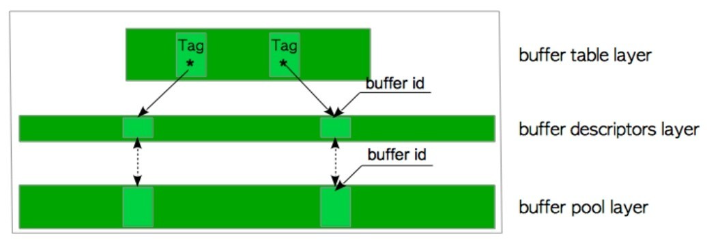
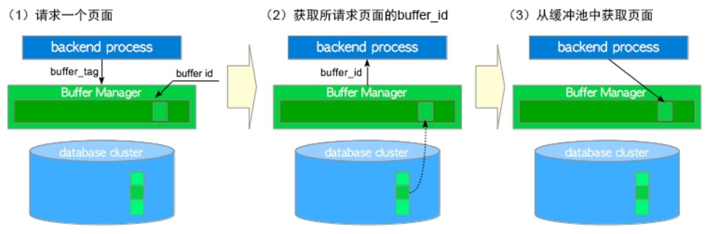

缓冲区管理器管理着共享内存和持久存储之间的数据传输，对于数据库管理系统的性能有着重要的影响。PostgreSQL的缓冲区管理器十分高效。

```
		|-------------------------------------|
		|			Backend Process			|
		|-------------------------------------|
						^
						|
						v
		|-------------------------------------|
		|			Buffer Manager			|
		|	       Shared Buffer Pool		 |
		|-------------------------------------|
						^
						|
						v
		|-------------------------------------|
		|				Storage			    |
		|-------------------------------------|			
```

PostgreSQL缓冲区管理器由缓冲表、缓冲区描述符和缓冲池三层组成

<center>
    
    <div><b>缓冲区管理器的三层结构</b></div>
</center>


- 缓冲表层是一个散列表，它存储着页面的buffer_tag与描述符的buffer_id 之间的映射关系。
- 缓冲区描述符层是一个由缓冲区描述符组成的数组。每个描述符与缓冲池槽一一对应，并保存着相应槽的元数据。
- 缓冲池层，存储着数据文件页面，诸如表页与索引页，以及其相应的自由空间映射和可见性映射的页面。它是一个数组。每个槽都存储一个数据文件页(每个数据页面都可以分配到一个唯一的缓冲区标签)，数组槽的索引称为buffer_id。

PostgreSQL中的每个数据文件页面都可以分配到唯一的标签，即**缓冲区标签**。缓冲区标签由三个值组成，分别是关系文件节点、关系分支编号和页面块号。第一个值分别代表了表空间、数据库和表的`oid`；第二个值代表关系表的分支号；最后一个值代表页面号。其中关系文件节点用于定位页面所属的关系，关系分支编号用于定位关系文件的具体分支文件，页面块号则在具体分支文件中指明相应页面的偏移量。一个关系可能有三种分支，分别是关系主体(`main`分支，编号为0)、空闲空间映射（`fsm`分支，编号为1)及可见性映射(`vm`分支，编号为2)。当缓冲区管理器收到请求时，会用到目标页面的缓冲区标签。

```C++
// src/include/storage/buf_internals.h
typedef struct buftag {
	RelFileNode rnode;			/* physical relation identifier */
	ForkNumber	forkNum;
	BlockNumber blockNum;		/* blknum relative to begin of reln */
} BufferTag;

typedef struct RelFileNode {
	Oid			spcNode;		/* tablespace */
	Oid			dbNode;			/* database */
	Oid			relNode;		/* relation */
} RelFileNode;
```

后端进程如何从缓冲区管理器中读取数据页

1. 当读取表或索引页时，后端进程向缓冲区管理器发送请求，请求中带有目标页面的buffer_tag。
2. 缓冲区管理器会根据 buffer_tag 返回一个 buffer_id，即目标页面存储在数组中的槽位的序号。如果请求的页面没有存储在缓冲池中，那么缓冲区管理器会将页面从持久存储位置加载到其中一个缓冲池槽位中，然后再返回该槽位的buffer_id。
3. 后端进程访问buffer_id对应的槽位(以读取所需的页面)。

<center>
    
    <div><b>后端进程如何读取数据页</b></div>
</center>


当后端进程修改缓冲池中的页面时(例如向页面插入元组)，这种尚未刷新到持久存储，但已被修改的页面被称为**脏页**。脏页最终应该被刷入存储，PG中，检查点进程和后台写入器两个后台进程负责此任务。

当所有缓冲池槽位都被占用，且其中未包含所请求的页面时，缓冲区管理器必须在缓冲池中选择一个页面逐出，用于放置被请求的页面。选择页面的算法通常被称为页面置换算法，而所选择的页面被称为受害者页面。从8.1版本开始，PostgreSQL使用时钟扫描算法，比起以前版本中使用的LRU算法，更为简单高效。

# 缓冲区管理器的结构


# 缓冲区管理器的锁

## 缓冲表锁

`BufMappingLock`保护整个缓冲表的数据完整性，是一种轻量级的锁，有共享模式与独占模式。在缓冲表中查询条目时，后端进程会持有共享的`BufMappingLock`。插入或删除条目时，后端进程会持有独占的`BufMappingLock`。`BufMappingLock`会被分为多个分区，以减少缓冲表中的争用(默认为128个分区)。每个`BufMappingLock`分区都保护着一部分相应的散列桶槽。

缓冲表也需要许多其他锁。例如，在缓冲表内部会使用自旋锁(spin lock)来删除数据项。

## 缓冲区描述符相关的锁

每 个 缓 冲 区 描 述 符 都 会 用 到 内 容 锁(`content_lock`)与 IO 进 行 锁(`io_in_progress_lock`)这两个轻量级锁，以控制对相应缓冲池槽页面的访问。当检查或更改描述符本身字段的值时，就会用到自旋锁。

内容锁(`content_lock`)是一个典型的强制限制访问的锁，它有共享与独占两种模式。当读取页面时，后端进程以共享模式获取页面相应缓冲区描述符中的`content_lock`。执行下列操作之一时，则会获取独占模式的`content_lock`。

- 将行（即元组）插入页面，或更改页面中元组的`t_xmin/t_xmax`字段时。
- 物理移除元组，或压紧页面上的空闲空间（由清理过程和HOT执行，分别在第6章和第7章中有过介绍）。
- 冻结页面中的元组。

IO 进行锁(`io_in_progress_lock`)用于等待缓冲区上的I/O完成。当PostgreSQL进程加载/写入页面数据时，该进程在访问页面期间，持有对应描述符上独占的`io_in_progres_lock`。

 # 缓冲区管理器的工作原理

 # 环形缓冲区

在读写大表时，PostgreSQL会使用环形缓冲区而不是缓冲池。环形缓冲器是一个很小的临时缓冲区域。当满足下列任一条件时，PostgreSQL将在共享内存中分配一个环形缓冲区。

1. 批量读取。当扫描关系读取数据的大小超过缓冲池的四分之一时，环形缓冲区的大小为256 KB。
2. 批量写入，当执行下列SQL命令时，环形缓冲区大小为16 MB。其中`COPY FROM`, `CREATE TABLE AS`,  `CREATE MATERIALIZED VIEW`或 `REFRESH MATERIALIZED VIEW`， `ALTER TABLE`命令。
3. 清理过程，当自动清理守护进程执行清理过程时，环形缓冲区大小为256 KB。

分配的环形缓冲区将在使用后被立即释放。环形缓冲区的好处显而易见，如果后端进程在不使用环形缓冲区的情况下读取大表，则所有存储在缓冲池中的页面都会被移除，这会导致缓存命中率降低，环形缓冲区可以避免此问题。

为什么批量读取和清理过程的默认环形缓冲区大小为256 KB

> src/backend/storage/buffer/README中有描述
>
> For sequential scans, a 256KB ring is used. That's small enough to fit in L2 cache, which makes transferring pages from OS cache to shared buffer cache efficient.  Even less would often be enough, but the ring must be big enough to accommodate all pages in the scan that are pinned concurrently.  256KB should also be enough to leave a small cache trail for other backends to join in a synchronized seq scan.  If a ring buffer is dirtied and its LSN updated, we would normally have to write and flush WAL before we could re-use the buffer; in this case we instead discard the buffer from the ring and (later) choose a replacement using the normal clock-sweep algorithm. Hence this strategy works best for scans that are read-only (or at worst update hint bits).  In a scan that modifies every page in the scan, like a bulk UPDATE or DELETE, the buffers in the ring will always be dirtied and the ring strategy effectively degrades to the normal strategy.
>
> 顺序扫描使用256KB的环形缓冲区，它足够小，因而能放入L2缓存中，从而使得操作系统缓存到共享缓冲区的页面传输变得高效。通常更小一点也可以，但环形缓冲区需要足够大到能同时容纳扫描中被钉住的所有页面。

 # 脏页刷盘

除了置换受害者页面之外，检查点进程和后台写入器进程也会将脏页刷盘至存储中。尽管两个进程都具有相同的功能(脏页刷盘)，但是它们有着不同的角色和行为。

- 检查点进程将检查点记录写入WAL段文件，并在检查点开始时进行脏页刷盘。
- 后台写入器的目的是通过少量多次的脏页刷盘，减少检查点带来的密集写入的影响。后台写入器会一点点地将脏页落盘，尽可能减少对数据库活动造成的影响。默认，后台写入器每`200ms` 被唤醒一次(由参数 `bgwriter_delay`定义)，且最多刷写`bgwriter_lru_maxpages`个页面（默认100个页面）。

