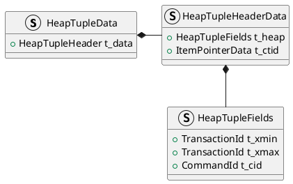

事务快照是一个数据集，存储着某个特定事务在某个特定时间点所看到的事务状态信息：哪些事务处于活跃状态。活跃状态意味着事务正在进行中或还没有开始。

在 `READ COMMITTED`隔离级别，事务在执行每条 SQL时都会获取快照，在其他情况下(`REPEATABLE READ`或 `SERIALIZABLE`隔离级别)，事务只会在执行第一条 SQL命令时获取一次快照。获取的事务快照用于元组的可见性检查

```C++
// src/backend/storage/ipc/procarray.c
Snapshot GetSnapshotData(Snapshot snapshot) {
    	......
    return snapshot;
}
```

 # 数据结构

## 快照

```C++
// src/include/utils/snapshot.h
typedef struct SnapshotData *Snapshot;
typedef struct SnapshotData {
	SnapshotType snapshot_type; /* type of snapshot */

	// 最小活跃事务的txid, 所有txid<xmin,对于当前事务都可见
	TransactionId xmin;			/* all XID < xmin are visible to me */
	// 第一个尚未分配的txid,所有txid>xmax的事务, 对当前事务都不可见
	TransactionId xmax;			/* all XID >= xmax are invisible to me */
	// 获取快照时,活跃事务的txid列表
	// for all ids in xip[] satisfy xmin <= xip[i] < xmax
	TransactionId *xip;
	uint32		xcnt;			/* # of xact ids in xip[] */

	/*
	 * For non-historic MVCC snapshots, this contains subxact IDs that are in
	 * progress (and other transactions that are in progress if taken during
	 * recovery). For historic snapshot it contains *all* xids assigned to the
	 * replayed transaction, including the toplevel xid.
	 *
	 * note: all ids in subxip[] are >= xmin, but we don't bother filtering
	 * out any that are >= xmax
	 */
	TransactionId *subxip;
	int32		subxcnt;		/* # of xact ids in subxip[] */
	bool		suboverflowed;	/* has the subxip array overflowed? */

	bool		takenDuringRecovery;	/* recovery-shaped snapshot? */
	bool		copied;			/* false if it's a static snapshot */
	
	CommandId	curcid;				// 最小可见的command number

	/*
	 * An extra return value for HeapTupleSatisfiesDirty, not used in MVCC
	 * snapshots.
	 */
	uint32		speculativeToken;

	/*
	 * For SNAPSHOT_NON_VACUUMABLE (and hopefully more in the future) this is
	 * used to determine whether row could be vacuumed.
	 */
	struct GlobalVisState *vistest;

	/*
	 * Book-keeping information, used by the snapshot manager
	 */
	uint32		active_count;	/* refcount on ActiveSnapshot stack */
	uint32		regd_count;		/* refcount on RegisteredSnapshots */
	pairingheap_node ph_node;	/* link in the RegisteredSnapshots heap */

	TimestampTz whenTaken;		/* timestamp when snapshot was taken */
	XLogRecPtr	lsn;			/* position in the WAL stream when taken */

	/*
	 * The transaction completion count at the time GetSnapshotData() built
	 * this snapshot. Allows to avoid re-computing static snapshots when no
	 * transactions completed since the last GetSnapshotData().
	 */
	uint64		snapXactCompletionCount;
} SnapshotData;
```


## 元组

Tuple中在`HeapTupleHeaderData`中和事务相关的几个重要字段：
- `t_xmin`:保存插入此元组的事务的txid。
- `t_xmax`：保存删除或更新此元组的事务的txid。如果尚未删除或更新此元组，则`t_xmax`设置为0，即无效。
- `t_cid`保存命令标识(command id, cid), 表示在当前事务中，执行当前命令之前执行了多少SQL命令，从零开始计数。例如，假设在单个事务中执行了3条`INSERT`命令`BEGIN; INSERT; INSERT; INSERT; COMMIT;`。如果第一条命令插入此元组，则该元组的`t_cid`被设置为0。如果第二条命令插入此元组，则其`t_cid`被设置为1，以此类推。
- `t_ctid`保存着指向自身或新元组的元组标识符(tid)。在更新该元组时，t_ctid 会指向新版本的元组，否则`t_ctid`会指向
```C++
typedef struct HeapTupleFields {
    // 插入此元组的事务的txid
	TransactionId t_xmin;
    // 保存删除或更新此元组的事务的txid
    // 若尚未删除或更细此元组,t_xmax设置为0,表示无效
	TransactionId t_xmax;
	union {
         // 保存命令标识(cid),表示当前事务
         // 执行当前命令之前执行了多少SQL, 从零开始计数
		CommandId	t_cid;
         // old-style VACUUM FULL xact ID
		TransactionId t_xvac;
	} t_field3;
} HeapTupleFields;

struct HeapTupleHeaderData {
	union {
		HeapTupleFields t_heap;
		DatumTupleFields t_datum;
	} t_choice;

	// 保存指向自身或新元组的元组标识符(tid),表示表中元组
    // 更新元组时,它指向新版本元组,否则指向自己
	ItemPointerData t_ctid;

	uint16 t_infomask2;		/* number of attributes + various flags */
	uint16 t_infomask;		/* various flag bits, see below */
	uint8  t_hoff;			/* sizeof header incl. bitmap, padding */
	bits8  t_bits[FLEXIBLE_ARRAY_MEMBER];	/* bitmap of NULLs */
};

typedef struct HeapTupleData {
	uint32		t_len;			/* length of *t_data */
	ItemPointerData t_self;		/* SelfItemPointer */
	Oid			t_tableOid;		/* table the tuple came from */
	HeapTupleHeader t_data;		/* -> tuple header and data */
} HeapTupleData;

typedef HeapTupleData *HeapTuple;
typedef struct HeapTupleHeaderData HeapTupleHeaderData;
typedef HeapTupleHeaderData *HeapTupleHeader;
```




# 子事务可见性判断


```C++
ExecScan
	> heapgettup_pagemode
		> heapgetpage
			> HeapTupleSatisfiesVisibility
				> HeapTupleSatisfiesMVCC
```

```C++
// src/backend/access/heap/heapam.c
void heapgetpage(TableScanDesc sscan, BlockNumber page) {
	HeapScanDesc scan = (HeapScanDesc) sscan;
	Snapshot	snapshot;
				.......
	/* 缓存读, 返回pin & unlock状态的buffer */
	scan->rs_cbuf = ReadBufferExtended(scan->rs_base.rs_rd,
			MAIN_FORKNUM, page, RBM_NORMAL, scan->rs_strategy);
	snapshot = scan->rs_base.rs_snapshot;
		    	.......
	LockBuffer(buffer, BUFFER_LOCK_SHARE);
	all_visible = PageIsAllVisible(dp) && !snapshot->takenDuringRecovery;

	for (lineoff = FirstOffsetNumber, lpp = PageGetItemId(dp, lineoff);
		 lineoff <= lines; lineoff++, lpp++) {
		if (ItemIdIsNormal(lpp)) {
					......
			if (all_visible) valid = true;
			else {
                 // 可见性判断入口函数
				 // HeapTupleSatisfiesVisibility -> 
				valid = HeapTupleSatisfiesVisibility(&loctup, snapshot, buffer);
			}
					......
             // 记录可见元组
			if (valid) scan->rs_vistuples[ntup++] = lineoff;
		}
	}

	LockBuffer(buffer, BUFFER_LOCK_UNLOCK);
}
```

```C++
static bool HeapTupleSatisfiesMVCC(HeapTuple htup, Snapshot snapshot, Buffer buffer) {
	HeapTupleHeader tuple = htup->t_data;

	// 1. 判断创建者是否提交
	if (!HeapTupleHeaderXminCommitted(tuple)) {
		// 1.1 创建者的事务已回滚
		if (HeapTupleHeaderXminInvalid(tuple)) return false;
					......

		if (...) {

			// ... 用于pre-9.0二进制升级，忽略

		} else if (TransactionIdIsCurrentTransactionId(HeapTupleHeaderGetRawXmin(tuple))) {
			// 1.2 判断当前事务产生的元组

			// 1.2.1 insert后scan,不可见
			if (HeapTupleHeaderGetCmin(tuple) >= snapshot->curcid) return false;
			
			// 1.2.2 xid无效
			if (tuple->t_infomask & HEAP_XMAX_INVALID) return true;
			// 1.2.3 not deleter
			if (HEAP_XMAX_IS_LOCKED_ONLY(tuple->t_infomask)) return true;

			if (tuple->t_infomask & HEAP_XMAX_IS_MULTI) {
				TransactionId xmax;
				xmax = HeapTupleGetUpdateXid(tuple);

				/* updating subtransaction must have aborted */
				if (!TransactionIdIsCurrentTransactionId(xmax)) return true;
				else if (HeapTupleHeaderGetCmax(tuple) >= snapshot->curcid)
					return true;	/* updated after scan started */
				else
					return false;	/* updated before scan started */
			}

			if (!TransactionIdIsCurrentTransactionId(HeapTupleHeaderGetRawXmax(tuple))) {
				/* deleting subtransaction must have aborted */
				SetHintBits(tuple, buffer, HEAP_XMAX_INVALID, InvalidTransactionId);
				return true;
			}

			if (HeapTupleHeaderGetCmax(tuple) >= snapshot->curcid)
				return true;	/* deleted after scan started */
			else
				return false;	/* deleted before scan started */
		}
        
		// 1.3 非当前事务产生的元组,事务ID在当前快照中(存在性能问题)
		else if (XidInMVCCSnapshot(HeapTupleHeaderGetRawXmin(tuple), snapshot))
			return false;
		// 1.4 非当前事务产生的元组，事务已经提交
		else if (TransactionIdDidCommit(HeapTupleHeaderGetRawXmin(tuple)))
			SetHintBits(tuple, buffer, HEAP_XMIN_COMMITTED,
						HeapTupleHeaderGetRawXmin(tuple));
		else {
			/* it must have aborted or crashed */
			SetHintBits(tuple, buffer, HEAP_XMIN_INVALID,
						InvalidTransactionId);
			return false;
		}
	} else {
		/* xmin is committed, but maybe not according to our snapshot */
		if (!HeapTupleHeaderXminFrozen(tuple) &&
			XidInMVCCSnapshot(HeapTupleHeaderGetRawXmin(tuple), snapshot))
			return false;		/* treat as still in progress */
	}

	/* by here, the inserting transaction has committed */

	if (tuple->t_infomask & HEAP_XMAX_INVALID)	/* xid invalid or aborted */
		return true;

	if (HEAP_XMAX_IS_LOCKED_ONLY(tuple->t_infomask)) return true;

	if (tuple->t_infomask & HEAP_XMAX_IS_MULTI) {
		TransactionId xmax;
		xmax = HeapTupleGetUpdateXid(tuple);
		/* not LOCKED_ONLY, so it has to have an xmax */
		Assert(TransactionIdIsValid(xmax));

		if (TransactionIdIsCurrentTransactionId(xmax)) {
			if (HeapTupleHeaderGetCmax(tuple) >= snapshot->curcid)
				return true;	/* deleted after scan started */
			else
				return false;	/* deleted before scan started */
		}
		if (XidInMVCCSnapshot(xmax, snapshot)) return true;
		if (TransactionIdDidCommit(xmax))
			return false;		/* updating transaction committed */
		/* it must have aborted or crashed */
		return true;
	}

	if (!(tuple->t_infomask & HEAP_XMAX_COMMITTED)) {
		if (TransactionIdIsCurrentTransactionId(HeapTupleHeaderGetRawXmax(tuple)))
		{
			if (HeapTupleHeaderGetCmax(tuple) >= snapshot->curcid)
				return true;	/* deleted after scan started */
			else
				return false;	/* deleted before scan started */
		}

		if (XidInMVCCSnapshot(HeapTupleHeaderGetRawXmax(tuple), snapshot))
			return true;

		if (!TransactionIdDidCommit(HeapTupleHeaderGetRawXmax(tuple)))
		{
			/* it must have aborted or crashed */
			SetHintBits(tuple, buffer, HEAP_XMAX_INVALID,
						InvalidTransactionId);
			return true;
		}

		/* xmax transaction committed */
		SetHintBits(tuple, buffer, HEAP_XMAX_COMMITTED,
					HeapTupleHeaderGetRawXmax(tuple));
	}
	else
	{
		/* xmax is committed, but maybe not according to our snapshot */
		if (XidInMVCCSnapshot(HeapTupleHeaderGetRawXmax(tuple), snapshot))
			return true;		/* treat as still in progress */
	}

	/* xmax transaction committed */

	return false;
}
```


```C++
bool XidInMVCCSnapshot(TransactionId xid, Snapshot snapshot) {
	uint32		i;
	/* Any xid < xmin is not in-progress */
	if (TransactionIdPrecedes(xid, snapshot->xmin)) return false;
	/* Any xid >= xmax is in-progress */
	if (TransactionIdFollowsOrEquals(xid, snapshot->xmax)) return true;

	if (!snapshot->takenDuringRecovery) {
		if (!snapshot->suboverflowed) {
			// 快照中保存了完整的事务信息(子事务少于64个)通过快照保存的子事务查找
			int32		j;
			for (j = 0; j < snapshot->subxcnt; j++) {
				if (TransactionIdEquals(xid, snapshot->subxip[j]))
					return true;
			}
		} else {
			// Snapshot子事务信息溢出,遍历SLRU页面
			// 通过txid一层层直到找到顶层事务id,进行可见性判断
			xid = SubTransGetTopmostTransaction(xid);
			if (TransactionIdPrecedes(xid, snapshot->xmin)) return false;
		}

		for (i = 0; i < snapshot->xcnt; i++) {
			if (TransactionIdEquals(xid, snapshot->xip[i])) return true;
		}
	} else {
		int32		j;
		if (snapshot->suboverflowed) {
			xid = SubTransGetTopmostTransaction(xid);
			if (TransactionIdPrecedes(xid, snapshot->xmin)) return false;
		}
		for (j = 0; j < snapshot->subxcnt; j++) {
			if (TransactionIdEquals(xid, snapshot->subxip[j])) return true;
		}
	}
	return false;
}
```

