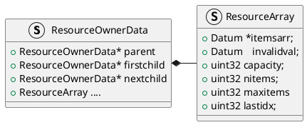

在PostgreSQL中，每个事务（包括子事务）在执行时，需要跟踪其占用的内存资源。为简化查询相关资源的管理，PG中引入了`ResourceOwner`对象（例如，需要跟踪一个缓冲区的pin锁或一个表的锁资源，以保障在事务结束或失败的时候能够被及时释放）的概念。这些与查询相关的资源必须以某种可靠的方式被跟踪，以确保当查询结束后被释放，甚至是查询由于错误被中止时资源被释放。相对于期望整个执行过程拥有牢不可破的数据结构，PG更愿意采用单例模式去跟踪这些资源。`ResourceOwner`记录了大多数事务过程中使用到的资源，主要包括：

- 父节点、子节点的`ResourceOwner`指针，用于构成资源跟踪器之间的树状结构
- 占用的共享缓冲区数组和持有的缓冲区pin锁个数
- Cache的引用次数以及占用的Cache中存储的数据链表，包括`CatCache`、`RelCache`以及缓存查询计划的`PlanCache`
- `TupleDesc`引用次数以及占用的`TupleDesc`数组
- Snapshot引用次数以及占用的`Snapsot`数组

`ResourceOwner`的API建立在`MemoryContext` API之上，`MemoryContext` API已经被证明十分灵活的且在防止内存泄漏上十分有效。`ResourceOwner`可以有子对象(`child ResourceOwner`)，可以形成对象树，当释放父对象(`parent ResourceOwner`)时，所有直接和间接的子节点都将被释放。每个`ResourceOwner`的节点内存都在`TopMemoryContext`中进行分配。在内存中保存了几个全局的`ResourceOwner`结构变量：

```C++
// src/include/utils/resowner.h

// 当前使用的ResourceOwner
extern PGDLLIMPORT ResourceOwner CurrentResourceOwner;
// 当前(子)事务的ResourceOwner
extern PGDLLIMPORT ResourceOwner CurTransactionResourceOwner;
// 顶层事务的ResourceOwner,PG支持在事务内定义子事务
extern PGDLLIMPORT ResourceOwner TopTransactionResourceOwner;
extern PGDLLIMPORT ResourceOwner AuxProcessResourceOwner;
```


# 数据结构

每个事务的资源跟踪器都通过其parent指针指向父事务的资源跟踪器，如果该事务本身就是顶层事务，则parent指针为空。同一个事务的子事务的资源跟踪器之间通过`nextchild`指针连接在一起，而父事务的资源跟踪器的`firstchild`指针则指向其第一个子事务的资源跟踪器。通过`parent`、`firstchild`、`nextchild`三个指针，资源管理器之间就构成了一种树状结构。


```C++
// src/backend/utils/resowner/resowner.c
typedef struct ResourceOwnerData {
    // 每个事务的parent指向父事务的ResourceOwner
    // 如果该事务是顶层事务,则parent为空
	ResourceOwner parent;
    // 事务中第一个子事务的ResourceOwner
	ResourceOwner firstchild;
    // 同一个事务中的子事务通过nextchild进行连接
	ResourceOwner nextchild;

	const char *name; // 只用于debug

	/* We have built-in support for remembering: */
	ResourceArray bufferarr;	/* owned buffers */
	ResourceArray catrefarr;	/* catcache references */
	ResourceArray catlistrefarr;	/* catcache-list pins */
	ResourceArray relrefarr;	/* relcache references */
	ResourceArray planrefarr;	/* plancache references */
	ResourceArray tupdescarr;	/* tupdesc references */
	ResourceArray snapshotarr;	/* snapshot references */
	ResourceArray filearr;		/* open temporary files */
	ResourceArray dsmarr;		/* dynamic shmem segments */
	ResourceArray jitarr;		/* JIT contexts */
	ResourceArray cryptohasharr;	/* cryptohash contexts */
	ResourceArray hmacarr;		/* HMAC contexts */

	/* We can remember up to MAX_RESOWNER_LOCKS references to local locks. */
	int			nlocks;			/* number of owned locks */
	LOCALLOCK  *locks[MAX_RESOWNER_LOCKS];	/* list of owned locks */
} ResourceOwnerData;

// src/include/utils/resowner.h
typedef struct ResourceOwnerData *ResourceOwner;
```

`ResourceArray`用于存放所有类型的资源ID，将资源ID存放在成员`itemsarr`数组中，其中

```C++
itemsarr[k] holds an ID, for 0 <= k < nitems <= maxitems = capacity
```

如果资源ID过多，则使用开链哈希表，此时`itemsarr`数组是由capacity个slot组成的哈希表(参见`ResourceArrayAdd`)，每个slot或者存放资源ID或者`invalidval`。`nitems`是合法的资源ID的数量。如果超过了`maxitems`，会扩大数组空间并重新Hash。这种模式下，`maxitems`应小于`capacity`，这样可以不浪费太多时间搜索空Slot。

```C++
typedef struct ResourceArray {
    // 存放资源ID的数组
	Datum	   *itemsarr;
    // value that is considered invalid
	Datum		invalidval;
    // 已分配的itemsarr的长度
	uint32		capacity;
    // 合法的资源ID的数量
	uint32		nitems;
    // 
	uint32		maxitems;		/* current limit on nitems before enlarging */
    // 最后查询或GetAny返回的index位置信息
    // 可以加快ResourceArrayRemove函数的执行
	uint32		lastidx;
} ResourceArray;
```


```C++
// 资源ID过多,nitems超过maxitems扩大数组空间并重新Hash
static void ResourceArrayEnlarge(ResourceArray *resarr) {
	uint32		i, oldcap, newcap;
	Datum	   *olditemsarr;
	Datum	   *newitemsarr;

    // nitems < maxitems无需扩展空间
	if (resarr->nitems < resarr->maxitems) return;
   
	olditemsarr = resarr->itemsarr;
	oldcap = resarr->capacity;
     // 将capacity翻倍并申请空间,扩展空间
	newcap = (oldcap > 0) ? oldcap * 2 : RESARRAY_INIT_SIZE;
	newitemsarr = (Datum *) MemoryContextAlloc(
        	TopMemoryContext,newcap * sizeof(Datum));
    // 将新申请的itemsarr每个slot都填充invalidval
	for (i = 0; i < newcap; i++)
		newitemsarr[i] = resarr->invalidval;

	resarr->itemsarr = newitemsarr;
	resarr->capacity = newcap;
	resarr->maxitems = RESARRAY_MAX_ITEMS(newcap);
	resarr->nitems = 0;

    // 重新Hash(re-hash)
	if (olditemsarr != NULL) {
		for (i = 0; i < oldcap; i++) {
			if (olditemsarr[i] != resarr->invalidval)
				ResourceArrayAdd(resarr, olditemsarr[i]);
		}
		pfree(olditemsarr);
	}
}

```

```C++
static void ResourceArrayAdd(ResourceArray *resarr, Datum value) {
	uint32		idx;
    // capacity <= RESARRAY_MAX_ARRAY(64)采用数组储存
	if (RESARRAY_IS_ARRAY(resarr)) {
		idx = resarr->nitems;
	} else {
        // 资源ID太多,采用开链Hash
		uint32		mask = resarr->capacity - 1;
		idx = DatumGetUInt32(hash_any((void *) &value, sizeof(value))) & mask;
		for (;;) {
			if (resarr->itemsarr[idx] == resarr->invalidval) break;
			idx = (idx + 1) & mask;
		}
	}
	resarr->lastidx = idx;
	resarr->itemsarr[idx] = value;
	resarr->nitems++;
}
```


# 数据操作

| 接口                     | 描述                                                         |
| ------------------------ | ------------------------------------------------------------ |
| `ResourceOwnerCreate`    | 创建一个空的`ResourceOwner`                                  |
| `ResourceOwnerRelease`   |                                                              |
| `ResourceOwnerNewParent` | 将一个`ResourceOwner`分配给一个新的parent<br/>在delete时调用该接口，将`ower`分配给NULL。 |
| `ResourceOwnerDelete`    | 删除`ResourceOwner`并删除其子节点                            |

```C++
// Create an empty ResourceOwner
ResourceOwner ResourceOwnerCreate(ResourceOwner parent, const char *name) {
    ResourceOwner owner;
    owner = (ResourceOwner) MemoryContextAllocZero(
        	TopMemoryContext, sizeof(ResourceOwnerData));
    owner->name = name;

    if (parent) {
        owner->parent = parent;
        owner->nextchild = parent->firstchild;
        parent->firstchild = owner;
    }
	
    // 一些列调用ResourceArrayInit对owner中的ResourceArray类型变量初始化, 忽略
    // ResourceArrayInit(ResourceArray *resarr, Datum invalidval)
			.......

	return owner;
}
```


```C++
// 释放ResourceOwner以及子节点持有的所有资源
// 并不删除ResourceOwner自身
void ResourceOwnerRelease(ResourceOwner owner,
	ResourceReleasePhase phase, bool isCommit,bool isTopLevel) {
}
```


```C++
// Reassign a ResourceOwner to have a new parent
void ResourceOwnerNewParent(ResourceOwner owner, ResourceOwner newparent)
```


```C++
void ResourceOwnerDelete(ResourceOwner owner) {
    // 删除子节点
	while (owner->firstchild != NULL)
		ResourceOwnerDelete(owner->firstchild);

    // 将owner和其parent之间连接断开
	ResourceOwnerNewParent(owner, NULL);

    // Free owner中ResourceArray类型变量(调用ResourceArrayFree),忽略
			......
	pfree(owner);
}
```


# 应用

PG中为每个事务、子事务以及每个Portal创建一个`ResourceOwner`。在Portal的整个生命周期中，全局变量`CurrentResourceOwner`指向Portal的`ResourceOwner`，这有助于类似的操作(如`ReadBuffer`、`LockAcquire`等)记录所需的资源到这个`ResourceOwner`中。当Portal关闭时，任何未释放的资源(典型的主要是锁)成为当前事务的责任。这体现在将Portal的`ResourceOwner`变成当前事务的`ResourceOwner`的子对象(参见`AtSubCommit_Portals`)。


为事务创建`ResourceOwner`，

```C++
// src/backend/access/transam\xact.c
static void AtStart_ResourceOwner(void) {
	TransactionState s = CurrentTransactionState;
	// Create a toplevel resource owner for the transaction.
	s->curTransactionOwner = ResourceOwnerCreate(NULL, "TopTransaction");

	TopTransactionResourceOwner = s->curTransactionOwner;
	CurTransactionResourceOwner = s->curTransactionOwner;
	CurrentResourceOwner = s->curTransactionOwner;
}
```

为子事务创建一个`ResourceOwner`。

```C++
// src/backend/access/transam\xact.c
static void AtSubStart_ResourceOwner(void) {
	TransactionState s = CurrentTransactionState;
    // 为子事务创建ResourceOwner,它是parent ResourceOwner的孩子
    // 也就是说ResourceOwner是一个树状结构
	s->curTransactionOwner = ResourceOwnerCreate(
        	s->parent->curTransactionOwner, "SubTransaction");

	CurTransactionResourceOwner = s->curTransactionOwner;
	CurrentResourceOwner = s->curTransactionOwner;
}
```

为每个Portal创建一个`ResourceOwner`

```C++
// src/backend/utils/mmgr/portalmem.c
Portal CreatePortal(const char *name, bool allowDup, bool dupSilent) {
	Portal		portal;
	portal = GetPortalByName(name);
	if (PortalIsValid(portal)) {
        // !allowDup || !dupSilent 报错处理 忽略
		PortalDrop(portal, false);
	}

	/* make new portal structure */
	portal = (Portal) MemoryContextAllocZero(TopPortalContext, sizeof *portal);

	/* initialize portal context */
	portal->portalContext = AllocSetContextCreate(
        	TopPortalContext, "PortalContext", ALLOCSET_SMALL_SIZES);

    // 为portal创建ResourceOwner
	portal->resowner = ResourceOwnerCreate(CurTransactionResourceOwner, "Portal");

	/* initialize portal fields that don't start off zero */
	portal->status = PORTAL_NEW;
	portal->cleanup = PortalCleanup;
	portal->createSubid = GetCurrentSubTransactionId();
	portal->activeSubid = portal->createSubid;
	portal->createLevel = GetCurrentTransactionNestLevel();
	portal->strategy = PORTAL_MULTI_QUERY;
	portal->cursorOptions = CURSOR_OPT_NO_SCROLL;
	portal->atStart = true;
	portal->atEnd = true;		/* disallow fetches until query is set */
	portal->visible = true;
	portal->creation_time = GetCurrentStatementStartTimestamp();

	/* put portal in table (sets portal->name) */
	PortalHashTableInsert(portal, name);

	/* for named portals reuse portal->name copy */
	MemoryContextSetIdentifier(portal->portalContext,
			portal->name[0] ? portal->name : "<unnamed>");

	return portal;
}
```


 # 参考资料

1. [PostgreSQL数据库事务系统-ResourceOwner](https://blog.csdn.net/asmartkiller/article/details/120668692)