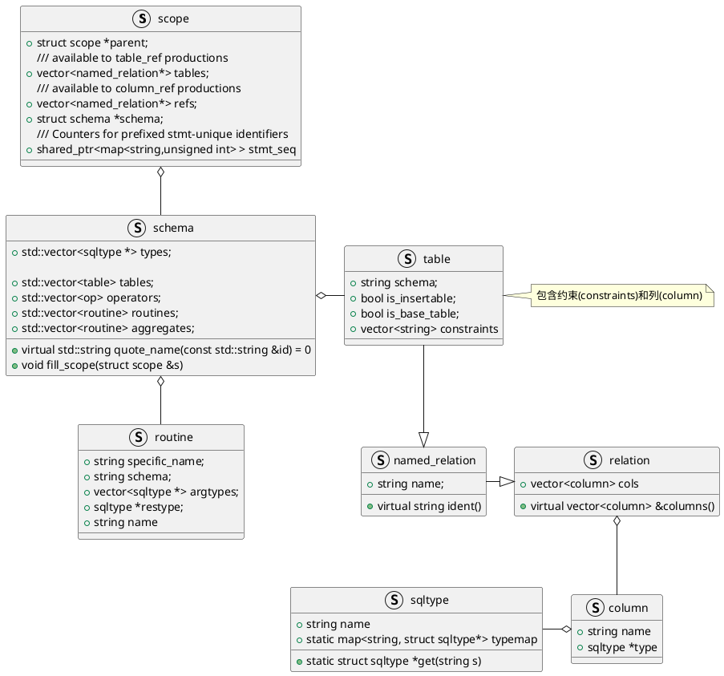
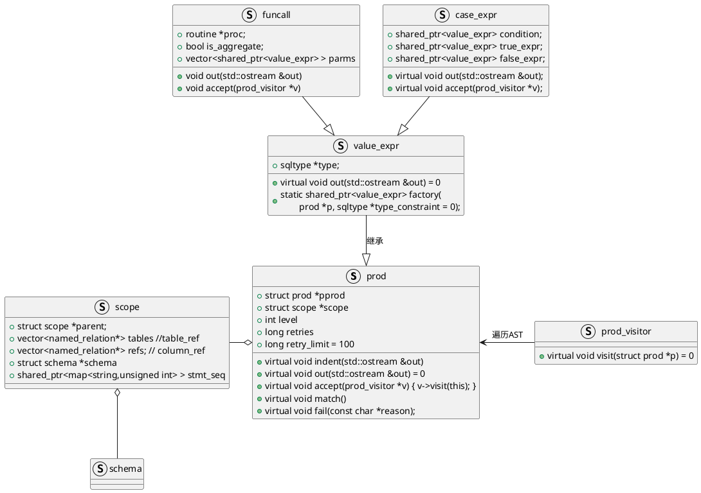
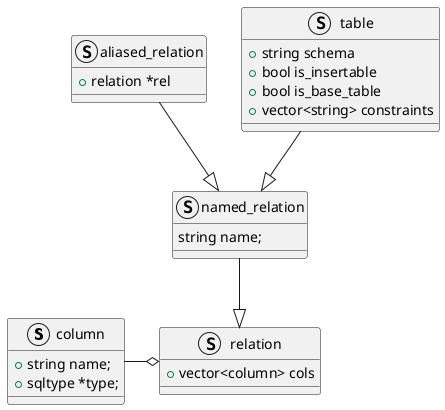
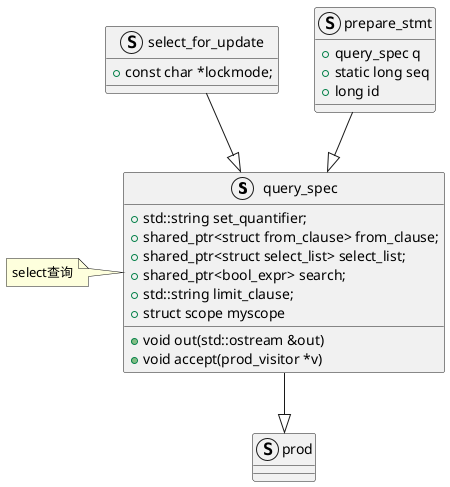
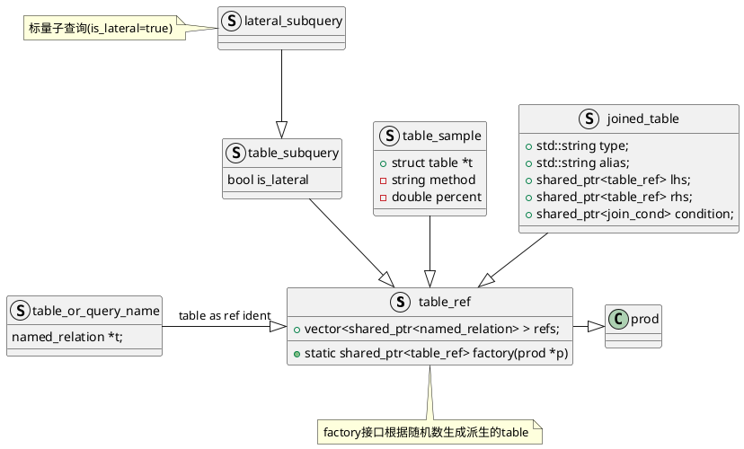
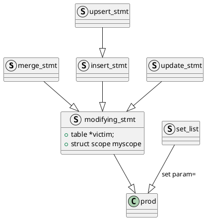
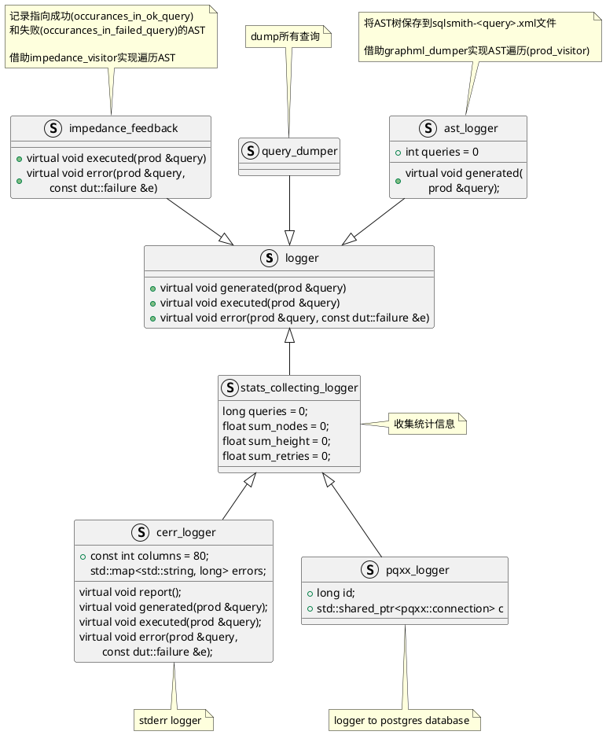
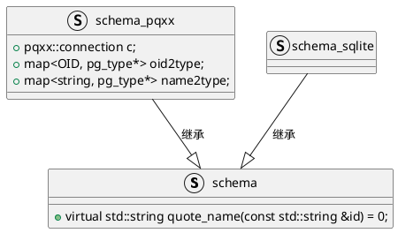
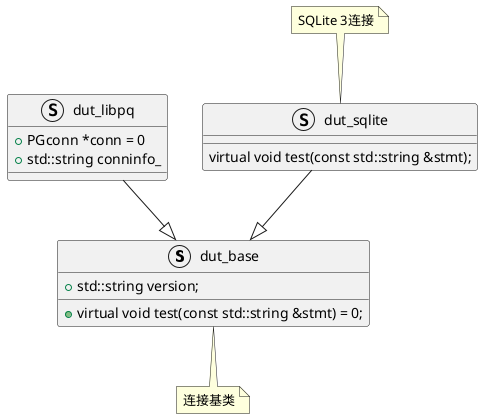

SQLsmith定义了一些数据结构来表达AST并提供了接口将其转换成SQL字符串，从某种意义上来说，是数据库内核Parser解析的逆操作。这个得到的SQL字符串发送给数据库执行，如果执行成功则忽略，如果执行报错可以进行一些记录和统计工作。

<center>
    
    <div>SQLsmith git仓库AST示例，链接地址：https://github.com/anse1/sqlsmith/blob/master/ast.png</div>
</center>
<br/>

其中`query_spec`是SELECT的语句的AST,其`out`接口将其逆转换成SQL字符串
```C++
void query_spec::out(std::ostream &out) {
    out << "select " << set_quantifier << " "
        << *select_list;
    indent(out);
    out << *from_clause;
    indent(out);
    out << "where ";
    out << *search;
    if (limit_clause.length()) {
        indent(out);
        out << limit_clause;
    }
}
```
---
[SQLsmith:随机SQL query生成器](https://github.com/anse1/sqlsmith/tree/master?tab=readme-ov-file)程序的入口在`sqlsmith.cc`

```C++
int main(int argc, char *argv[]) {
    // 生成schema类,读取目标数据库中的各种元数据(metadata)
    shared_ptr<schema> schema;
    schema = make_shared<...>(...)
    scope scope;
    schema->fill_scope(scope);

    // 格式化输出和统计
    vector<shared_ptr<logger> > loggers;
    loggers.push_back(make_shared<impedance_feedback>());

    // 数据库连接器
    shared_ptr<dut_base> dut;

    // 生成query AST
    shared_ptr<prod> gen = statement_factory(&scope);

    // 根据AST生成SQL
    ostringstream s;
    gen->out(s);

    // 执行SQL
    dut->test(s.str());
    for (auto l : loggers)
        l->executed(*gen);
}
```

主要结构类图



SQLsmith大致包含三大模块：
1. 抽象语法树(AST)生成器
2. 格式化输出和统计工具
3. 目标数据库连接器
其工作流程就是依次调用这三个模块：首先由AST生成器产生随机的query AST，然后由格式化工具将其转化为SQL字符串，最后由数据库连接器将该SQL字符串在目标数据库上执行。


# AST生成器

AST生成器可以进一步细分为三部分：句法(syntax)模块;语义(semantic)模块; 语法(grammar)模块。

## syntax模块
这部分包括prod(prod.cc和prod.hh)和expr(expr.cc和expr.hh)这两组文件，负责定义value expression的syntax。prod是expr的基类，prod定义了基本的抽象类和方法，expr继承prod并定义具体的表达式。如果需要扩展表达式syntax的话，通常只需要修改expr而不需要改动prod。这里只负责value expression的定义，即boolean expression，constant expression等可以作为"值"(value)来使用的表达式.

类图


一些重要接口
```C++
struct value_expr: prod {
  sqltype *type;
  virtual void out(std::ostream &out) = 0;
  virtual ~value_expr() { }
  value_expr(prod *p) : prod(p) { }
  // 根据std::uniform_int_distribution随机数生成不同的expr
  static shared_ptr<value_expr> factory(prod *p, sqltype *type_constraint = 0);
};
```

```C++
// 遍历AST的基类
struct prod_visitor {
  virtual void visit(struct prod *p) = 0;
  virtual ~prod_visitor() { }
};

// AST基类
struct prod {
    // 根据level处理换行和缩进
    virtual void indent(std::ostream &out);
    // 生成SQL
    virtual void out(std::ostream &out) = 0;

    // Check with the impedance matching code whether this production
    // has been blacklisted and throw an exception.
    virtual void match();

    // 采用visitor方式遍历AST
    virtual void accept(prod_visitor *v) { v->visit(this); }
    //生成failed to generate报错
    virtual void fail(const char *reason);
}
```


## 语义(semantic)模块
包括relmodel这一组文件，负责描述relational model，定义了table，column等主要的class以及他们之间的包含和约束关系。



## 语法(grammar)模块
包括grammar这一组文件，负责定义query的syntax。定义了最高层的syntax，即整个query的syntax，比如一个select query规定为一个select clause+可选的from clause及where clause，而一个select clause定义为一个select关键字+一个或多个value expression，等等。语法模块以上述句法和语义模块为基础，是AST生成器中最顶层的模块，也是最主要的模块。如果要修改query的语法，主要就是修改这部分代码。
```C++
// 生成select。insert, update,merge等查询
shared_ptr<prod> statement_factory(struct scope *s)
```







# 格式化输出和统计工具
包含log，dump和impedance三组文件，负责格式化输出、AST转换为SQL字符串、以及收集并报告query生成和执行过程中的必要统计信息。



# 目标数据库连接器
包括schema和dut两组文件，负责连接、读取目标数据库并将query在数据库上执行。其中schema负责描述数据库的内容和结构，比如在哪个table中可以获取data type信息、从哪个table中读取所有UDF的信息等。而dut负责调用相应的数据库驱动API来连接数据库并执行SQL指令。





# 参考资料
1. [知乎：SQLsmith-开源随机SQL query生成器](https://zhuanlan.zhihu.com/p/397285187)