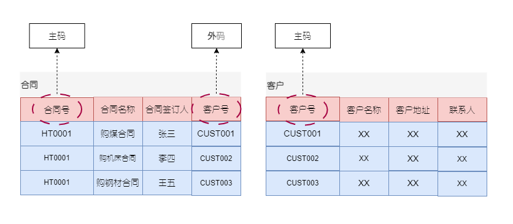

在关系模型的实现中会出现一些相关的概念名词，这里对相关的概念进行整理

# 候选码(Candidate Key)/候选键

**关系中的一个属性组，其值能唯一标识一个元组，若从该属性组中去掉任何一个属性，它就不具有这一性质，这样的属性组称作候选码。**

例如，学生`(S#, Sname, Sage, Sclass)`，`S#`是一个候选码，在该关系中，任何两个元组的`S#`一定是不同的。选课`(S#, C#,Sname, Cname, Grade)`，`(S#, C#)`联合起来是一个候选码。

在关系中可能会有很多候选码，例如，学生`(S#, Sname, Sage, Sclass, Saddress)`其中属性S#是候选码，属性组`(Sname, Saddress)`也是候选码(同名同地址的两个同学是不存在的)。

# 主码(Primary Key)/主键

**当有多个候选码时，可以选定一个作为主码。**DBMS以主码为主要线索管理关系中的各个元组。

例如，学生`(S#, Sname, Sage, Sclass, Saddress)`，可以将S#属性做该表的主码，也可以选定属性组`(Sname, Saddress)`做表的主码。

# 主属性与非主属性

包含在任何一个候选码中的属性被称作主属性，而其他属性被称作非主属性。

- 最简单的，候选键只包含一个属性
- 最极端情况下，所有的属性构成这个关系的候选码，称为全码(All-Key)。

例如，选课`(S#, C#,Sname, Cname, Grade)`，`(S#, C#)`联合起来是一个候选码，S#，C#是主属性，而`Sname, Cname, Grade`是非主属性。

# 外码(Foreign Key)/外键

关系R中的一个属性组，它不是R的候选码，但它与另一个关系S的候选码相对应，则称这个属性组为R的外码或外键。两个关系通常是通过外码联系的。

    

