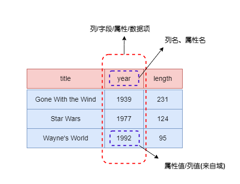
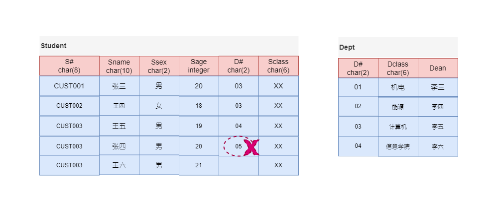
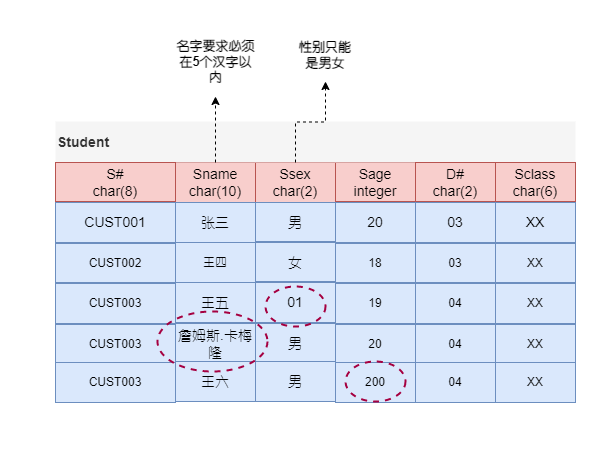

数据模型(Data Model)用于描述数据或信息的标记，一般由三部分组成：

1. **数据结构(structure of the data)**: 数据库系统中讨论的数据结构是一种物理数据模型(physical data model)，在数据库中，数据模型处于比数据结构更高的层次，为强调这一点，将其称之为概念模型(conceptual model)。
2. **数据操作(operation on the data)**: 在数据库数据模型中，数据操作是在数据上附加的一些有限的可执行操作集，例如查询(query, 检索信息操作)，修改(modification，修改数据库操作)等。这些限制对于数据库是一个强有力的约束操作，通过这些约束操作，开发者可以在一个较高层级上对数据库操作进行描述，从而是的数据库管理系统可以更有效地执行这些操作。
3. **数据上的约束(constraint on the data)**: 例如一周的每天只能是1~7的正数，一部电影最多只能有一个名字等等。

数据库有三大经典的数据模型：关系数据模型、网状数据模型和层次数据模型。

1. 层次模型(hierarchical model)是一种基于树结构的模型，类似于半结构化数据模型，其缺点是他是真正在物理层次上操作，这样开发者无法在一个较高的层次上进行代码实现。
2. 网状模型(network model)是一种基于图的位于物理层次上的模型。
3. 关系数据模型

接下来，了解关系数据模型。

---

关系数据模型是一种基于表的数据模型，一个关系(relation)就是一个Table。例如下面的关系：

<center>
    
</center>

关系模型处理Table，它由三部分组成：

1. 描述DB各种数据的基本结构形式(Table/Relation)
2. 描述Table与Table间所可能发生的各种操作(关系运算)
3. 描述这些操作所应遵循的约束条件(完整性约束)

研究关系模型就是学习Table如何描述，有哪些操作、结果是什么，有哪些约束。

# 关系基本结构

关系模型提供了一种描述数据的方法：一个称为关系(Relation)的二维表。关系模型的基本结构：Table/Relation：

<center>
    
</center>
关系的列命名为**属性(attribute)**。

---

**模式(Schema)**

关系名和属性集合的组合称为这个关系的**模式(schema)**。描述关系模式时，先给出一个关系名，其后用圆括号括起来所有的属性，例如`Movies(title, year, length, genre)`。


关系和模式的关系：同一关系模式下，可有很多的关系。关系模式是关系的结构，关系是关系模式在某一时刻的数据。关系模式是稳定的；而关系是某一时刻的值，是随时间可能变化的。

---

**元组(Tuple)**

关系中出含有属性名所在行以外的其他数据行称为**元组(tuple)**，每个元组均有一个分量(component)对应于关系的每个属性。

关系是元组的集合而非元组列表，因此关系中元组出现的顺序不是实质问题。关系属性次序也可以任意排列，关系不改变，由于属性是标题，因袭改变属性次序也需要改变列的次序，同时，元组分量也需要相应发生改动。


一个给定关系中元组集合叫关系的实例(instance)。通常一个数据库系统仅仅维护关系的一个版本即关系的当前元组集合，这个关系实例称为当前实例(current instance)。

---

**域(Domain)**

关系模型要求元组每个分量具有原子性，即它必须属于某种元素类型，例如integer或string，不可以是集合、列表等可以分解为更小分量的组合类型。进一步假定与关系的每个属性相关联的是一个**域(domain)**，即一个特殊的元素类型，关系的任一个元组的分量值必须属于对应的列的域。例如关系`Movies`中分量对应的数据类型分别是`string, integer, integer, string`，可以采用这样的方式来描述关系`Movies`：`Movies(title:string, year:integer, length:integer, genre:string)`。

域是列的取值范围。它是一组具有相同数据类型的值的集合，集合中元素的个数称为域的基数(Cardinality)。

<center>
    
</center>
---

**关系的严格定义**

笛卡尔积是所有可能组合成的元组。一组域$D_1, D_2, ..., D_n$的笛卡尔积为:

$$
D_1 \times D_2 \times ... \times D_n = \{(d_1, d_2, ..., d_n) | d_i \in D_i, i=1, ....n\}
$$

笛卡尔积的每个元素$(d_1, d_2, ..., d_n)$称作一个n-元组(n-tuple)，笛卡尔积是由n个域形成的所有可能的n-元组的集合。元组$(d_1, d_2, ..., d_n)$的每一个值叫做一个分量(Component)，若$D_i$的基数为$m_i$，则笛卡尔积基数即元组个数为$m_1 \times m_2 \times ... \times m_n$。


关系是一组域$D_1, D_2, ..., D_n$的笛卡尔积的子集，笛卡尔积中具有某一方面意义的那些元组被称作一个关系(Relation)。由于关系的不同列可能来自同一个域，为区分，需要为每一列起一个名字，即属性名。

<center>
    
</center>
关系可以用$R(A_1:D_1, A_2:D_2, ..., A_n:D_n)$表示，可简记为$R(A_1, A_2, ..., A_n$，这种模式又被称为关系模式(schema)或标题(Head)。其中$R$是关系名称，$A_i$是属性，$D_i$是属性所对应的域，n是关系的度或目(degree)，**关系中元组的数目称为关系的基数(Cardinality)**。

---

**关系特性**

1. 列是同质：即每一列中的分量来自同一域，是同一类型的数据
2. 不同的列可以来自同一个域，称其中的每一列为一个属性，不同的属性要给予不同的属性名。关系模式$R(A_1:D_1, A_2:D_2, ..., A_n:D_n)$中，$A_i (i = 1,…,n)$必须是不同的, 而$D_i(i = 1,…,n)$可以相同.
3. 列位置互换性：区分哪一列靠列名。
4. 行位置互换性。
5. 元组相同是指两个元组的每个分量都相同。
6. **属性不可再分特性**:又被称为关系第一范式

---

# 关系操作

描述Table与Table间所可能发生的各种操作，也就是关系运算，可以分为：

- 关系代数，它以一个或多个关系为输入，产生一个新的关系。ISBL是基于关系代数设计的数据库语言。
- 关系演算，它以数理逻辑中的谓词演算为基础，根据谓词变量的不同，可以分为关系元组演算(Ingres系统的QUEL是基于元组演算设计的数据库语言)和关系域演算(QBE是基于域演算设计的数据库语言)

这三种关系运算都是抽象数据运算，运算之间是等价的，体现了三种不同的思维：

- 关系代数---以集合为对象的操作思维，由集合到集合的变换。
- 元组演算---以元组为对象的操作思维，取出关系的每一个元组进行验证，有一个元组变量则可能需要一个循环，多个元组变量则需要多个循环。
- 域演算---以域变量为对象的操作思维，取出域的每一个变量进行验证看其是否满足条件。


## 关系代数

关系代数包含一些简单但功能强大的方法，可以从给定关系构造出新的关系。当给定关系是真正被系统存储的数据(表)时，构造出的信管系也可以是对这些数据查询而产生的结果。

<b><font color="orange">为什么需要一种专门的查询语言？</font></b>

关系代数不如C或Java强大，它通过对查询语言做出某种限制，可以获得两个极为有益的回报--可以**非常方便地进行开发以及能够编译产生高度优化的代码。** 那么，什么是代数？

**一门代数通常由一些操作符和一些原子操作数组成**，例如算术代数中原子操作数变量`x`和常量15，加、减、乘、除是操作符。任何一门代数都允许将操作符作用在原子操作数或其他代数表达式上构造表达式(expression)，一般括号用来组合操作符和操作数，例如`(x+y)*z`。

<div>
    <b>
        <font color="green">关系代数的原子操作数是：
        <ol>
            <li>代表关系的变量</li>
            <li>代表有限关系的常量</li>
        </ol>
        接下来，来了解关系代数的操作符
        </font>
    </b>
</div>

关系代数操作以一个或多个关系为输入，结果是一个新的关系。它用关系的运算来表达查询具有一定的过程性，也是一种抽象的语言。关系代数操作包含集合操作和纯关系操作

- 集合操作，其中有
    - 通常的关系操作：UNION(并) $R \cup S$; Intersection(交) $R \cap S $ ; Difference(差) $R - S$; 
    - 结合两个关系元组的操作：Cartesian Product(笛卡尔积) $R \times S$，当然，对两个关系元组结合还包含其他的Join操作。
- 纯关系操作，其中有
    - 除去某些行或列的操作：Project(投影) $\pi_A(R)$， Select(选择) $\sigma_{con}(R)$。其中，选择是消除某些行(元组)，投影是消除某些列的操作。
    -  重命名(renaming)操作，它不影响关系中的元组，但它改变了关系模式，即属性的名称或关系的名称。
    - Join(连接) $R \Join_{A \theta B} S$; Division(除) $R \div S $

一般将关系代数的表达式称为查询(query)。

### 关系代数的运算约束

---

某些关系代数操作，如并、差、交等，需满足“并相容性”。

并相容性：参与运算的两个关系及其相关属性之间有一定的对应性、可比性或意义关联性.

定义：关系R与关系S存在相容性，当且仅当：

1. 关系R和关系S的属性数目必须相同
2. 对于任意i，关系R的第i个属性的域必须和关系S的第i个属性的域相同

假设：$R(A_{1}, A_{2}, … , A_{n})$ , $S(B_{1}, B_{2}, … ,B_{m})$，$R$和$S$满足并相容性：$n = m$ 且 $Domain(A_{i}) = Domain(B_{i})$。


并相容性的示例:

```sql
STUDENT(SID char(10), Sname char(8), Age char(3))
PROFESSOR(PID char(10), Pname char(8), Age char(3)) 
```

关系`STUDENT`与关系`PROFESSOR`是相容的，因为：

1. 关系R和关系S的属性数目都是3
2.  关系R的属性`SID`与关系S的属性`PID`的域都是`char(10)`
3.  关系R的属性`Sname`与关系S的属性`Sname`的域都是`char(8)`
4. 关系R的属性`Age`与关系S的属性`Age`的域都是`char(3)`

---

### 基本操作

并、交、差、广义笛卡尔积、选择和投影是关系代数的基本操作。

---

**并(Union)**

定义：假设关系$R$和关系$S$是并相容的，则关系$R$与关系$S$的并运算结果也是一个关系，记作：$R \cup S$, 它由或者出现在关系R中，或者出现在S中的元 组构成。其数学描述：
$$
\begin{array}{l}
R \cup S = \{t | t \in R \vee t \in S \} \ 其中，t是元组
\end{array}
$$
并运算是将两个关系的元组合并成一个关系，在合并时去掉重复的元组。 
$R \cup S$与$S \cup R$运算的结果是同一个关系

---

**差(Difference)**

定义：假设关系$R$和关系$S$是并相容的，则关系$R$与关系$S$的差运算结果
也是一个关系，记作：$R -S$, 它由出现在关系R中但不出现在关系S中的元组构成。其数学描述:
$$
\begin{array}{l}
R-S = \{t | t \in R \wedge  t \notin S \} \ 其中，t是元组
\end{array}
$$
$R-S$ 与$S-R$是不同的

---

**广义笛卡尔积(Cartesian Product)**

定义：关系$R (<a_{1} , a_{2}, …, a_{n}>)$ 与关系$S(<b_{1}, b_{2}, …, b_{m}>)$ 的广义笛卡尔积(简称广义积, 或积, 或笛卡尔积) 运算结果也是一个关系，记作：$R \times S$, 它由关系$R$中的元组与关系$S$的元组进行所有可能的拼接(或串接)构成。其数学描述:
$$
\begin{array}{l}
R \times S = \{<a_{1}, a_{2}, …, a_{n}, b_{1}, b_{2}, …, b_{m}> & | \\
<a_{1}, a_{2}, …, a_{n}> \in R \ \wedge <b_{1}, b_{2}, …, b_{m}> \in S\}
\end{array}
$$
- $R \times S = S \times R$
- 两个关系$R$和$S$，它们的属性个数分别为$n$和$m$($R$是$n$度关系，$S$是$m$ 度关系), 则笛卡尔积 $R \times S$ 的属性个数 = $n + m$。即元组的前n个分量是R中元组的分量，后m个分量是S中元组的分量($R \times S$是$n+m$度关系).
- 两个关系$R$和$S$，它们的元组个数分别为$x$和$y$(关系$R$的基数$x$, $S$的基数$y$ ), 则笛卡尔积$R \times S$ 的元组个数 = $x  \times y$。($R \times S$的基数是$x \times y$).

---

**选择(Select)**

定义：给定一个关系R, 同时给定一个选择的条件condition(简记con), 选择运算结果也是一个关系，记作$\sigma_{con}(R)$, 它从关系R中选择出满足给定条件condition的元组构成。其数学描述
$$
\sigma_{con}(R) = \{t|t \in R \wedge con(t) = '真'\}
$$
- 设$R(A_{1} ,A_{2} , … ,A_{n})$, t是R的元组, t的分量记为$t[A_{i}]$, 或简写为$A_{i}$
- 条件con由逻辑运算符连接比较表达式组成
- 逻辑运算符：$\vee, \wedge, \neg$或写为$and, or, not$。
- 比较表达式：$X \ \theta \ Y$, 其中X, Y 是t的分量、常量或简单函数, $\theta$是比较运算符, $\theta \in \{>, \ge, <, \le,  =, \ne \}$

---

**投影(Project)**

 定义：给定一个关系R, 投影运算结果也是一个关系，记作$\Pi_{A}(R)$, 它从关系R中选出属性包含在A中的列构成。数学描述:

$$
\begin{array}{l}
\Pi_{A_{i1}, A_{i2}, ... A_{ik}}(R) = \{<t[A_{i1}], t[A_{i2}], ... t[A_{ik}]> | t \in R\}
\end{array}
$$
- 设$R(A_{1} ,A_{2} , … ,A_{n})$
- ${A_{i1}, A_{i2}, … ,A_{ik}} \subseteq { A_{1} ,A_{2} , … ,A_{n}}$ 
- $t[A_{i}]$表示元组t中相应于属性$A_i$的分量
- 投影运算可以对原关系的列在投影后重新排列

**投影操作从给定关系中选出某些列组成新的关系, 而选择操作是从给定关系中选出某些行组成新的关系**

---

### 扩展操作

交、$\theta$连接、等值连接和自然连接是关系代数的扩展操作。

---

**交(Intersection)**

定义：假设关系R和关系S是并相容的，则关系R与关系S的交运算结果也是一个关系，记作：$R \cap S$, 它由同时出现在关系R和关系S中的元组构成。数学描述:

$$
R \cap S = \{t | t \in R \wedge t \in S \} \ 其中：t是元组
$$

$R \cap S$ 和$S \cap R$运算的结果是同一个关系

交运算可以通过差运算来实现：$R \cap S = R - (R - S) = S - (S - R)$

---

$\theta$连接($\theta $-Join,  Theta-Join)


定义：给定关系R和关系S, R与S的$\theta$连接运算结果也是一个关系，记作$\underset{A \theta B}{R \Join S}$，它由关系R和关系S的笛卡尔积中, 选取R中属性A与S中属性B之间满足条件的元组构成。数学描述：
$$
\underset{A \theta B}{R \Join S} = \sigma_{t[A] \ \theta \ s[B]}(R \times S)
$$
- 设$R(A_{1}, A_{2} , … ,A_{n}), A \in { A_{1} ,A_{2} , … ,A_{n}}$和 $S(B_{1} ,B_{2}, … ,B_{m}), B \in {B_{1} ,B_{2}, … ,B_{m}}$
- t是关系R中的元组，s是关系S中的元组
- 属性A和属性B具有可比性
- $\theta$是比较运算符, $\theta \in {>, \ge, <, \le,  =, \ne }$

----

等值连接(Equi-Join)

定义：给定关系R和关系S, R与S的等值连接运算结果也是一个关系，记作$\underset{A = B}{R \Join S}$ ，它由关系R和关系S的笛卡尔积中选取R中属性A与S中属性B上值相等的元组所构成。数学描述:

$$
\underset{A = B}{R \Join S} = \sigma_{t[A] = s[B]}(R \times S)
$$
- 当$\theta$-连接中运算符为“＝”时，就是等值连接，等值连接是$\theta$-连接的一个特例。

广义积的元组组合并不是都有意义的，另广义积的元组组合数目也非常庞大，因此采用$\theta$-连接/等值连接运算可大幅度降低中间结果的保存量，提高速度。

---

自然连接(Natural-Join)

定义：给定关系R和关系S, R与S的自然连接运算结果也是一个关系，记作$R \Join S$ ，它由关系R和关系S的笛卡尔积中选取相同属性组B上值相等的元组所构成。数学描述

$$
{R \Join S} = \sigma_{t[B] = s[B]}(R \times S)
$$
- 自然连接是一种特殊的等值连接
- 要求关系R和关系S必须有相同的属性组B(如R,S共有一个属性$B_{1}$,则B是$B_{1}$, 如R,S共有一组属性$B_{1}, B_{2}, …, B_{n}$，则B是这些共有的所有属性)
- $R,S$属性相同，值必须相等才能连接，即$R.B_{1} = S.B_{1} \ and \ R.B_{2}=S.B_{2} … \ and \ R.B_{n} = S.B_{n}$才能连接
- 要在结果中去掉重复的属性列(因结果中$R.B_{i}$ 始终是等于$S.B_{i}$ 所以可只保留一列即可)

---

### 复杂扩展操作

除、外连接(Outer Join)是关系代数的复杂扩展操作


**除(Division)**

除法运算经常用于求解“查询… 全部的/所有的…”问题

前提条件：给定关系$R(A_{1} ,A_{2}, …, A_{n})$为n度关系, 关系$S(B_{1}, B_{2}, …,B_{m})$为m度关系 。如果可以进行关系R与关系S的除运算，当且仅当：属性集$\{B_{1}, B_{2}, …, B_{m}\}$是属性集$\{A_{1}, A_{2}, …, A_{n}\}$的真子集，即$m < n$

定义：关系R和关系S的除运算结果也是一个关系，记作$R \div S$，分两部分来定义,
- 先定义$R \div S $结果的属性应有哪些？设属性集$\{C_{1}, C_{2}, … ,C_{k}\} = \{A_{1}, A_{2}, …, A_{n}\} \ – \ \{B_{1}, B_{2}, …, B_{m}\}$, 则有$k=n–m$则$R \div S$结果关系是k度(n-m度)关系，由$\{C_{1}, C_{2}, … ,C_{k}\}$属性构成
- 再定义$R \div S$的元组怎样形成？再设关系$R(<a_{1}, …, a_{n}>)$和关系$S (<b_{1}, …, b_{m}>)$, 那么$R \div S$结果关系为元组$<c_1, …, c_k>$的集合，元组$<c_1, …, c_k>$满足下述条件：它与S中每一个元组$<b_{1}, …, b_{m}>$组合形成的一个新元组都是R中的某一个元组$<a_{1}, …, a_{n}>$ 。(其中，$a_{1}, …, a_{n}, b_{1}, …, b_{m}, c_{1}, …, c_{k}$分别是属性$A_{1}, … , A_{n}, \ B_{1}, … ,B_{m}, \ C_{1}, …, C_{k}$的值)

数学描述：
$$
\begin{array}{l}
{R \div S} = { t | t \in \Pi_{R-S}(R) \wedge \forall u \in S(tu \in R) }\\
= \Pi_{R-S}(R) - \Pi_{R-S}(\Pi_{R-S}(R) \times S) - R)
\end{array}
$$


<div>
    <div id="r" style=float:left width=25%>
        <table>
            <tr>R
            </tr>
            <tr>
                <td>A1</td>
                <td>A2</td>
                <td>A3</td>
            </tr>
             <tr>
                <td>a</td>
                <td>b</td>
                <td>c</td>
            </tr>
            <tr>
                <td>d</td>
                <td>b</td>
                <td>c</td>
            </tr>
            <tr>
                <td>a</td>
                <td>e</td>
                <td>c</td>
            </tr>
			<tr>
                <td>a</td>
                <td>e</td>
                <td>f</td>
            </tr>
        </table>
    </div>
    <div id= "s1" style=float:left width=10%>
        <table>
        	<tr>&nbsp;&nbsp;&nbsp;&nbsp;&nbsp;&nbsp;&nbsp;&nbsp;</tr>
        </table>
    </div>
    <div id= "tblr" style=float:left width=25%”>
     	<table>
            <tr>S
            </tr>
            <tr>
                <td>A1</td>
                <td>A2</td>
            </tr>
             <tr>
                <td>b</td>
                <td>c</td>
            </tr>
        </table>
    </div>
    <div style=float:left width=10%>
        <table>
        	<tr>&nbsp;&nbsp;&nbsp;&nbsp;&nbsp;&nbsp;&nbsp;&nbsp;</tr>
        </table>
    </div>
    <div style=float:left width=25%“>
    	<table>
            <tr>R÷S
            </tr>
            <tr>
                <td>A1</td>
            </tr>
             <tr>
                <td>a</td>
            </tr>
            <tr>
                <td>d</td>
            </tr>
        </table>
    </div>
</div>


<div style=float:left> </div>


**外连接**

定义：两个关系R与S进行连接时，如果关系R(或S)中的元组在S(或R)中找不到相匹配的元组，则为了避免该元组信息丢失，从而将该元组与S(或R)中假定存在的全为空值的元组形成连接，放置在结果关系中，这种连接称之为外连接(Outer Join)。

外连接 = 自然连接 (或$\theta $ 连接) + 失配的元组(与全空元组形成的连接)
外连接的形式：左外连接、右外连接、全外连接

- 左外连接(Left Outer Join) = 自然连接(或$\theta $连接) + 左侧表中失配的元组,记为$R \leftouterjoin S$
- 右外连接(Right Outer Join) = 自然连接(或$\theta $连接) + 右侧表中失配的元组, 记为$R \rightouterjoin S$
- 全外连接(Full Outer Join) = 自然连接(或$\theta $连接) + 两侧表中失配的元组, 记为$R \fullouterjoin S$

---

半连接(SemiJoin)

`R SemiJoin S​` 由关系R中的元组t构成的集合：t至少跟S中的一个元组在公共属性上相等。


反半连接(AntiSemiJoin)

`R AntiSemiJoin S​`由关系R中的元组t构成的集合：t在R和S的公共属性上不能跟S中的任何元组相等。

---

命名和重命名

为了有效管理由关系代数生成的结果关系的属性名称，通常会引进一个重命名操作
$$
\rho_s(A_1， A_2, ..., A_n)(R)
$$
表示对关系R重新命名，命名后的关系与关系R有完全相同的元组，只不过关系的名字变成了S，S关系的各个属性分别命名为$A_1， A_2, ..., A_n$。如果只想将关系R改变为S，不改变属性名字，可以简单使用$\rho_s(R)$。

----

操作组成查询

表达式树可以表示复杂的关系代数表达式

关系代数允许任意复杂的表达式，操作符可以用于任何关系之上，这个关系可以是某个给定关系，也可以是操作得到的结果关系。可以在子表达式上应用算符来构造新的关系代数表达式，必要时，用括号把操作数分隔开，也可以用表达式树来表达这种表达式。
$$
\begin{array}{l}
\pi_{title, year}(\sigma_{length >= 100}(Movies)\  \cap \ \sigma_{studentname = 'Fox'}(Movies))
\end{array}
$$


另外一种方式是生成若干临时关系，用来表达树的内节点。写一系列的赋值语句时期有正确的值，赋值语句的顺序可变，只要保证在对节点N赋值前对之前，N的子节点赋值完毕即可。赋值语句用到的符号有：

1. 关系的名字和用圆括号括起来的关系属性的列表。`Answer`习惯上表示最后一步运算的结果，也就是表示树根节点的关系名。
2. 赋值符号$:=$
3. 赋值号右边的任何代数表达式，可以采用每个赋值语句只用一个算符的方法，这样每个内部节点都有自己的赋值语句相对应，但任然可以将几个代数运算组合在一起写到表达式的右端。

$$
\begin{array}{l}
R(t, y, l, i, s, p) := \sigma_{length >= 100}(Movies) \\
S(t, y, l, i, s, p) := \sigma_{studentname = 'Fox'}(Movies) \\
Answer(title, year) := \pi_{t,y}(R \ \cap \ S) 
\end{array}
$$

---


## 关系演算

- 关系元组演算是以元组变量作为谓词变量的基本对象。
- 关系域演算是以域变量作为谓词变量的基本对象。

### 关系元组演算

关系元组演算公式的基本形式:
$$
\begin{array}{l}
 \{t | P(t)\} \\
上式表示:所有使谓词P为真的元组t的集合 \\
\\
t是元组变量 \\
t \in r 表示元组t在关系r中\\
t[A]表示元组t的分量，即t在属性A上的值 \\
P是与谓词逻辑相似的公式，P(t)表示以元组t为变量的公式\\
\end{array}
$$
$P(t)$可以是如下三种形式之一的**原子公式**：

- $t\in R$，t是关系R中的一个元组。
- $s[A] \ \theta \ c$，元组分量$s[A]$与常量c之间满足比较关系$\theta$。$\theta$：比较运算符$<, \le, =, <>, >, \ge$
- $s[A] \ \theta \ u[B]$，$s[A]$与$u[B]$为元组分量，A和B分别是某些关系的属性，它们之间满足比较关系$\theta$.

$P(t)$可以由公式加运算符$\wedge(与), \vee(或)， \neg(非)$递归地构造

- 如果F是一个公式，则$\neg$也是公式
- 如果$F_1$、$F_2$是公式，则$F_1 \wedge F_2$，$F_1 \vee F_2$也是公式。

构造$P(t)$还有两个运算符:$\exists(存在), \forall(任意)$

- 如果F是一个公式，则$\exists(t\in r)(F(t))$也是公式
- 如果F是一个公式，则$\forall(t\in r)(F(t))$也是公式

运算符$\exists$和$\forall$又称为量词，前者称存在量词，后者称全称量词。被$\exists$和$\forall$限定的元组变量t，或者说元组变量t前有存在量词或全称量词，则该变量被称为**约束变量**，否则被称为**自由变量**。

$\exists(t\in r)(F(t))$ 表示$t \in r$对r中的每个t进行F(t)检验:

- 所有t，都使$F(t)$为假，则结果为假。
- 有一个t，使得$F(t)$为真，则结果为真。

$\forall (t\in r)(F(t))$表示$t \in r$对r中的每个t进行F(t)检验

- 所有t，都使$F(t)$为真，则结果为真。
- 有一个t，使得$F(t)$为假，则结果为假。

上述运算符的优先级次序由高到底为括弧、$\theta$、$\exists$、$\forall$, $\neg$、$\wedge$，$\vee$

----

<b><font color="orange">元组演算等价性变换 </font></b>

 $\neg$、$\wedge$，$\vee$运算间的等价性

$$
\begin{array}{l}
P1 \wedge P2 \Longleftrightarrow \neg(\neg P1 \vee P2 ) \\
n个否定的或操作的再否定，便是n个肯定的与操作 \\
\\
P1 \vee P2 \Longleftrightarrow \neg(\neg P1 \wedge \neg P2) \\
n个否定的与操作的再否定，便是n个肯定的或操作\\
\end{array}
$$

$\exists$、$\forall$, $\neg$运算间的等价
$$
\forall(t \in R)(P(t)) \Longleftrightarrow \neg(\exists(t \in R)(\neg P(t))) \\
\exists(t \in R)(P(t)) \Longleftrightarrow \neg(\forall(t \in R)(\neg P(t)))
$$

---

<b><font color="orange">元组演算和关系代数的等价性</font></b>
$$
\begin{array}{l}
并运算：R \cup S = \{ t | t \in R \vee t \in S \} \\
差运算：R - S = \{ t | t \in R \vee \neg(t \in S) \} \\
交运算：R \cap S = \{ t | t \in R \wedge  t \in S \} \\
\\
广义笛卡尔积：R(A) \times S(B) = \{ t | \exists(u \in R) \exists(s \in S(t[A]=u[A] \wedge t[B]=S[B])) \} \\
\\
\sigma_{con}(R) = \{ t | t \in R \wedge F(con) \} \\
\pi_A(R) = \{ t[A] | t \in R \} \\
\end{array}
$$

----

### 关系域演算

关系域演算公式的基本形式：
$$
\{<x_1, x_2,...,x_n> | P(x_1,x_2,...,x_n)\},其中x_i代表域变量或常量，P为以x_i为变量的公式
$$
公式$P$可以递归地进行构造：

- 三种形式的原子公式是公式
    - $<x_1, x_2,...,x_n> \in R$, 表示由域变量构成的$<x_1, x_2,..., x_n>$属于关系R
    - $x \ \theta \ c $，域变量$x$与常量$c$之间满足比较关系，$\theta$是比较运算符$<, <=, > >=, =, \neq$
    - $x \ \theta \ y$，域变量x与域变量y之间满足比较关系

- 如果P是公式, 那么$\neg P$
- 如果P1 , P2是公式，则$P1 \vee P2$ , $P1 \wedge P2$ 也是公式
- 如果P是公式， x是域变量，则$\exists(x)(P(x))$和$\forall(x)(P(x))$也是公式
- 需要时可以加括弧，上述运算符的优先次序自高至低为：括弧，$\theta, \exists, \forall, \neg, \vee \wedge$
- 公式仅限于以上形式。

元组演算和关系演算可以等价互换。

----

关系运算的安全性：不产生无限关系和无穷验证的运算被称为是安全的。

- **关系代数是一种集合运算，是安全的。** 集合本身是有限的，有限元素集合的有限次运算仍旧是有限的。
- **关系演算不一定是安全的**。例如$\{ t | \neg(R(t)) \}, \{ t | R(t) \vee t[2]>3 \}$可能表示无限关系。$R(t)$是有限的，但不在$R(t)$中的元素就可能是无限的，后例中的$t[2]>3$是无限的。再例如：$(\exists u(\omega(u)),(\forall u)(\omega(u))$可能导致无穷验证，前者被称为“假验证”，即验证所有元素是否都使得$\omega(u)$为false；后者被称为“真验证”，即验证所有元素是否都使得$\omega(u)$为true。检验所有元素就可能造成无穷。

- 需要对关系演算施加约束条件，即任何公式都在一个集合范围内操作，而不是无限范围内操作，才能保证其安全性。


**安全约束有限集合DOM**
$DOM(\Psi)$是一个有限集合，其中的每个符号要么是$\Psi$中明显出现的符号，要么是出现在 $\Psi$ 中的某个关系R的某元组的分量。DOM主要用于约束$\Psi$中一些谓词的计算范围，它不必是最小集合。


**安全元组演算表达式**
满足下面三个条件的元组演算表达式$\{ t|\Psi(t) \}$称为安全表达式。

- 只要t满足$\Psi$，t的每个分量就是$DOM(\Psi)$的一个成员。

    $\{t | \Psi(t) \}$中t的取值只能是DOM中的值，有限的。

- 对于$\Psi$中，形如$(\exists u(\omega(u))$的子表达式，若u满足$\omega$, 则$u$的每个分量都是DOM( $\omega$)中的成员。

    $\{ t | \Psi(t) \}$中的每个$(\exists u)(\omega(u)$子表达式，只需要验证DOM中的元素是否有使$\omega(u)$为真的元素。而对于DOM以外的元素，已经明确其都不满足$\omega(u)$，无需验证。

- 对于$\Psi$中，形如$(\forall u)(\omega(u))$的子表达式，若$u$不满足$\omega$, 则u的每个分量都是DOM( $\Psi$)中的成员。
    $\{ t | \Psi(t) \}$中的每个$(\forall u)(\omega(u)$子表达式，只需要验证DOM中的元素是否有使$\omega(u)$为真的元素。而对于DOM以外的元素，已经明确其都不满足$\omega(u)$，无需验证。

---


# 关系约束条件

关系模型对于存储在数据库中的数据具有约束能力。


## 完整性约束

关系完整性即指关系的正确性、相容性和有效性。它是给定的关系模型中数据及其联系的所有制约和依存规则，用以限定数据库状态及状态变化，从而保证数据的正确、相容和有效。关系模型的完整性有三类: 实体完整性、参照完整性和用户定义的完整性。其中，实体完整性和参照完整性是关系模型必须满足的完整性约束条件。

### 实体完整性

关系的主码中的属性值不能为空值，空值：不知道或无意义的值；

意义：关系中的元组对应到现实世界相互之间可区分的一个个体，这些个体是通过主码来唯一标识的；若主码为空，则出现不可标识的个体，这是不容许的。


关系的一个属性或一个属性集合组成键，代数约束可以表述为，将关系R重命名为R1和R2
$$
\begin{array}{l}
\sigma_{R1.A=R2.A \ AND \ R1.A \neq R2.A}(R1 \times R2) = \oslash
\end{array}
$$


### 参照完整性

参照完整性约束就说定义外码和主码之间的引用规则，是对关系间引用数据的一种限制。若属性（属性组）X 是基本关系 R 的外码，它与基本关系 S 的主码 Y 对应，那么 R 中每个元组在 F 上的值要么取 NULL，要么等于 S中对应元组的主码值。 R 和 S 可以是不同的关系，也可以是同一关系。

意义：如果关系R1的某个元组t1参照了关系R2的某个元组t2，则t2必须存在

<center>
    
</center>

在上图所示的例子中，关系Student在D#上的取值有两种可能: 

- 空值，表示该学生尚未分到任何系中
- 若非空值，则必须是Dept关系中某个元组的D#值，表示该学生不可能分到一个不存在的系中。


如果关系R中某个元组属性分量A的值为v，按照设计意图希望，v也是另外一个关系S中的某个元组中的一个对象属性分量B的值。关系代数将引用完整性表述为

$$
\begin{array}{}
\pi_A(R) \subseteq \pi_b(S) \ 或\\
\pi_A(R) - \pi_b(S) = \oslash
\end{array}
$$


### 用户自定义完整性

用户针对具体的应用环境定义的完整性约束条件。例如数据的类类型、精度、取值范围等。其中，关系的每个属性都有一个类型约束，使得该属性的每个值都只能是该类型，也称为域约束。

<center>
    
</center>
`Student`中`Ssex`属性的合法值只有男和女，在关系代数中，该约束可以表达为
$$
\sigma_{Ssex \neq '男' \ AND \ Ssex \neq '女' }(Student) = \oslash
$$


---

**完整性约束检测**

对数据库修改时，必须进行完整性约束检测，检查是否满足上述三类完整性约束

对于插入操作：

1. 首先，**检查实体完整性约束**，检查插入行在主码属性上的值是否已存在，不存在，可以执行插入，否则不可插入。
2. 然后，**检查参照完整性约束**，如果是向被参照关系插入，则不需要考虑此约束；如果向参照关系插入，则检查插入行在外码属性上的值是否已在相应被参照关系的主码属性中存在，存在，可插入，否则不可插入，或者将插入行的外码属性的值改为NULL，再插入。
3. 最后，**检查自定义完整性约束**，包括数据的类性、精度、取值范围、是否允许空值、是否有默认值等，满足即可执行插入操作，否则给出错误信息。


对于删除操作，一般只需对被参照关系检查参照完整性约束。如果主键被引用则不可删，或将参照关系中对应行的外码属性改为为NULL，再删除。


对于更新操作，结合删除和插入操作，先删除再插入。

---


# 参考资料

1. 数据库系统基础教程(第3版)
2. MOOC 哈尔滨工业大学: 数据库系统(上)：模型与语言
3. [关系数据模型要素三 关系完整性约束](https://owen027.github.io/2019/09/19/integrity_constraint_of_relational/)


