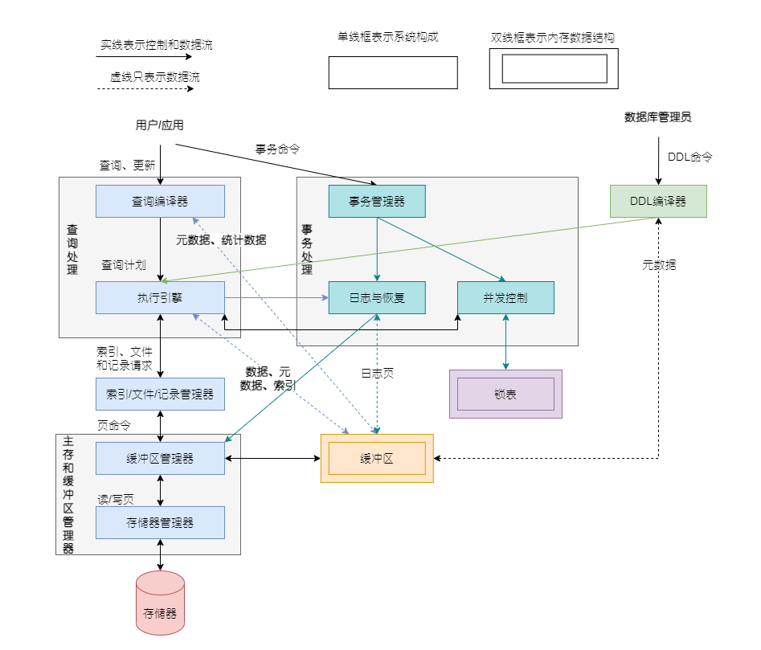

数据库管理系统将满足:

1. 允许用户使用专门的数据定义语言来创建新的数据库并指定其模式(数据逻辑结构)
2. 给予用户恰当的语言来查询和修改数据的能力，这种通常称为查询语言(query language)或数据操纵语言(data-manipulation language).
3. 支持对大量的数据长期存储，允许高效给存取数据以进行查询和数据库修改。
4. 使数据具有持久性(durability)，即能够从故障，多种类型错误或故意滥用中恢复。
5. 控制多个账户同时对数据访问，不允许用户间有不恰当的相互影响(称作独立性isolation)，并且不会发生在数据上进行了部分而不是完整操作的情况(称作原子性atomicity)。

    
    

        <b>数据库管理系统成分</b>
    

# 主存和缓冲区管理

**存储管理器**的任务是控制数据在磁盘上的放置和在磁盘与主存之间的移动，跟踪文件在磁盘上所处的位置，获得缓冲区管理器所需要的文件的磁盘块号。

**缓冲器管理器**负责将可利用的主存空间分割成缓冲区，缓冲区是与页面同等大小的区域（通常缓冲区和磁盘间的传递单位是页或磁盘块），磁盘块的内容是可以传递到缓冲区中。这样所有需要从磁盘上得到信息的DBMS成分都或直接或通过执行引擎与缓冲区和缓冲区管理器交互。不同的DBMS成分所需要的信息类型包括：

- 数据
- 元数据：描述数据库结构及其约束的数据库模式。
- 日志记录：关于最近对数据库所做的改变的信息，这些信息支持数据的持久性。
- 统计信息
- 索引

# 数据定义语言

约束信息也是是数据库模式的一部分。这些进行模式修改的数据定义语言(DDL)命令由DDL处理程序进行分析，然后传给转型引擎，由执行引擎经过过索引/文件/记录管理器去改变元数据(metadata)即数据库模式信息。

# 查询处理器

查询响应由查询编译器读查询进行分析和优化，得到的查询计划，被传给执行引擎。执行引擎向资源管理器发出一系对小的的数据单元(记录或关系元组tuple)的请求，资源管理器掌握存放关系的数据文件、文件中的数据格式和记录的大小以及支持对于数据文件中的元素进行快速查找的索引文件。查找数据的请求被传给缓冲区管理器，缓冲区管理器负责将持久存储在数据的辅助存储器中将数据的适当部分取到主存的缓冲区中。

查询处理器由两个组件表示:

1. **查询编译器(Query Compiler)**，它完成语法分析和优化，将查询转换成查询计划(Query Plan)的内部形式，查询计划是在数据上的操作序列。查询编译器使用关于数据的元数据和统计数据以确定哪种操作序列最快。通常查询计划中的操作用关系代数运算实现，查询编译器主要由三个模块组成:
    1. 查询分析器(Query parser)：它从查询的文本结构中构造出一个查询树结构。
    2. 查询与处理器(Query Preprocessor): 对查询进行语义检查(例如，确保查询使用的关系确实存在)，并将查询语法树转换成表示初始查询计划的代数操作符树。
    3. 查询优化器(Query Optimizer)：将查询初始计划转换成实际数据上执行最有效的操作序列。
    
    查询编译器利用元数据和统计学信息来确定哪个操作序列可能是最快的。
2. **执行引擎(Execute Engine)**: 执行引擎负责执行选定计划。执行引擎和DBMS其他大多数组件一样，直接或间接地通过缓冲区交互访问。为了对数据操作，它必须从数据库中将数据取到缓冲区，与调度器交互访问以避免存取已加锁的数据，还需要与日志管理器交互访问以确保所有数据库的变化都正确地被日志记录。

# 事务处理

事务管理器接受事务命令，从而得知什么时间开始事务，什么时间结束事务，以及应用系统的期望(例如某些应用可能不希望有原子性)。事务处理器执行下面的任务：

1. **日志记录**。为了保证持久性，对于数据库的每一个变化都在磁盘上记录日志。**日志管理器**遵循某几种策略中的某一种工作，这些策略保证任何时候系统发生故障或崩溃，**恢复管理器**都可以查看关于数据库变化的日志，并将数据库恢复到某个一致的状态。开始时，日志管理器将日志写到缓冲器，它与缓冲区管理器协调，保证在适当的时候将缓冲区写到磁盘。
2. **并发控制**。调度器(并发控制管理器)保证多个事务的一个个动作以一种适当的顺序执行，从而是的最终的结果与这些事务事实上一个执行完再执行下一个动作结果相同。典型的调度器通过在数据库的某些部分上维护若干个锁来工作。这些锁防止两个事务造成不良后果的方式存取数据库的相同部分。锁通常存储在主存储器的**锁表**中，调度器禁止执行引擎访问数据库中被封锁的部分，从而对查询和其他数据库操作的执行产生产生影响。
3. **死锁解决**。事务之间通过调度器所授予的锁进行资源竞争时，可能会进入这样的情况：没有任何一个事务可以进行下去，因为任何一个事务都需要另一个事务所持有的某个资源。事务管理器有责任进行干预，取消(回滚)一个或多个事务，从而让其他的事务可以进行下去。

事务处理器分成两个主要部分：

- **并发控制管理器或调度器**，负责保证事务的原子性(Atomicity)和独立性(Isolation)。
- **日志和恢复管理器**，负责事务的持久性(Durability)。

# 参考资料

1. 数据库系统实现(第二版)
2. 数据库系统基础教程(第3版)

