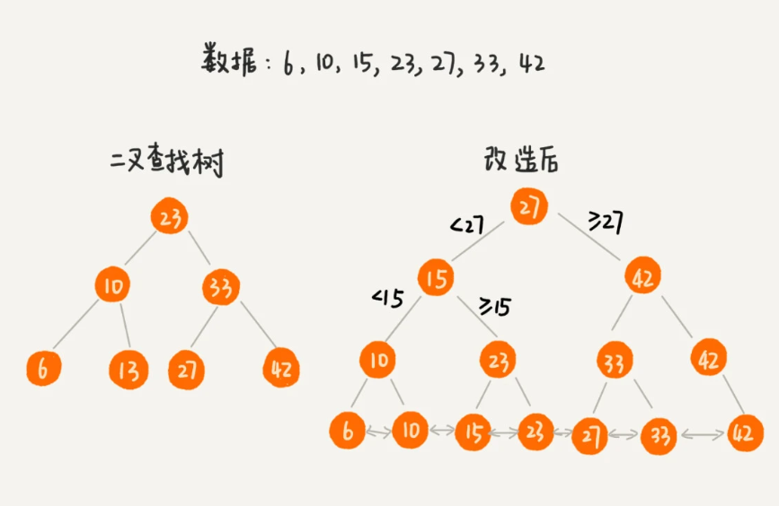
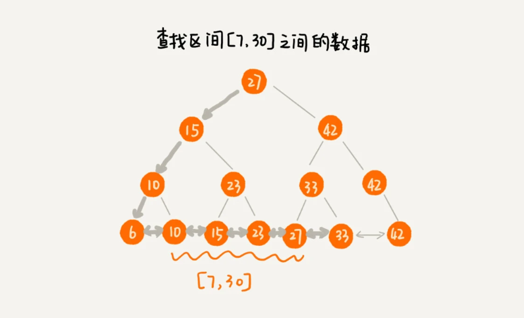
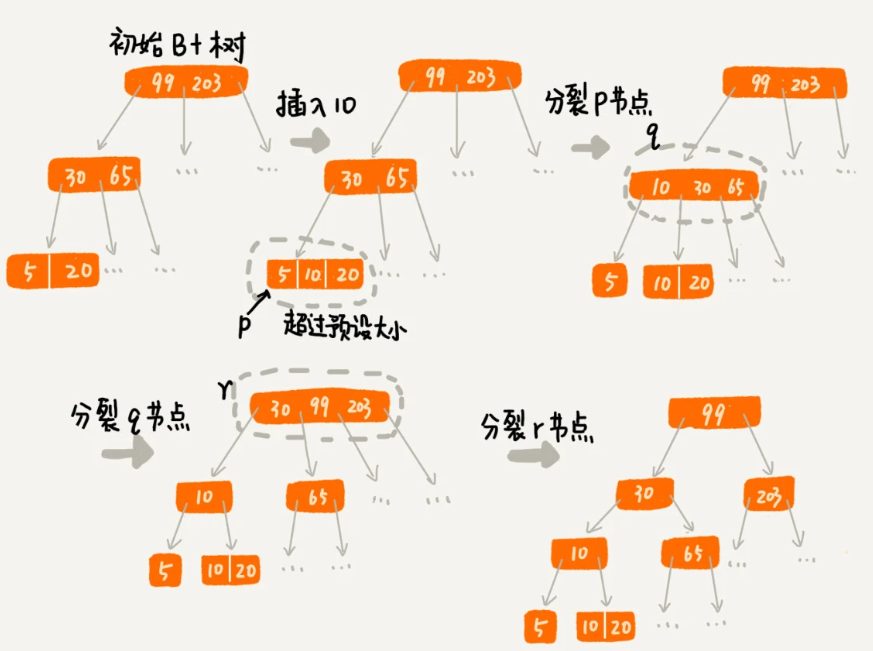
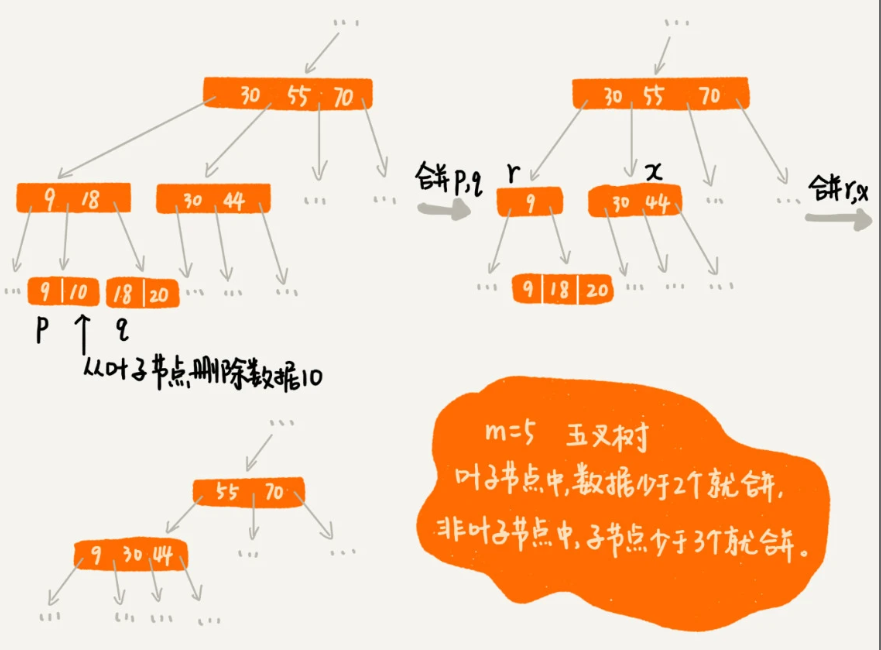

# B+树
首先，进行问题定义。对于数据库索引有两种常用的需求：
1. 根据某个值查找数据。例如`select * from user where id=1234;`
2. 根据区间值来查找某些数据。`select * from user where id > 1234 and id < 2345;`

尝试用一些已知的数据结构来解决这个问题？
- 散列表：查询性能很好，时间复杂度O(1),但不支持区间快速查找
- 平衡二叉搜索树：尽管查询性能也很高，时间复杂度为$O(logN)$，但不支持区间快速查找。
- 跳表：跳表是在链表之上加上多层索引构成的。它支持快速地插入、查找、删除数据，对应的时间复杂度是$O(logn)$。而且也支持按照区间快速地查找数据。从这个角度跳表可以解决这个问题。

B+树发明于1972年，跳表发明于1989年，B+树是从二查查找树演化而来。

## 改造二叉查找树
对二查查找树进行如下的改造：树中的节点并不存储数据本身，而是只是作为索引，每个叶子节点采用双向链表串接在一起，链表中的数据是从小到大有序的。这里采用双向链表方便实现升序和降序。
<center>
    
</center>


改造后，如果要某个区间的数据。只需要拿区间的起始值，在树中进行查找，当查找到某个叶子节点之后，再顺着链表往后遍历，直到链表中的结点数据值大于区间的终止值为止。所有遍历到的数据就是符合区间值的数据。
<center>
    
</center>

如果给一亿个数据构建二叉查找树索引，那索引中会包含大约 1 亿个节点，每个节点假设占用 16 个字节，那就需要大约 1GB 的内存空间。给一张表建立索引，我们需要 1GB 的内存空间。如果我们要给 10 张表建立索引，那对内存的需求是无法满足的。如何解决这个索引占用太多内存的问题呢？
> 可以借助时间换空间的思路，把索引存储在硬盘中。硬盘是一个非常慢速的存储设备。通常内存的访问速度是纳秒级别的，而磁盘访问的速度是毫秒级别的。读取同样大小的数据，从磁盘中读取花费的时间，是从内存中读取所花费时间的上万倍，甚至几十万倍。

如果把树存储在硬盘中，那么每个节点的读取，都对应一次磁盘 IO 操作。树的高度就等于每次查询数据时磁盘 IO 操作的次数。如果想要减少磁盘IO操作，就需要尽量降低树的高度。可以将索引树构建成M叉树，这样树的高度就降低了。


## M叉树实现B+树

假设给int类型的数据库字段添加索引，代码实现如下:
```java

/**
 * 这是B+树非叶子节点的定义。
 *
 * 假设keywords=[3, 5, 8, 10]
 * 4个键值将数据分为5个区间：(-INF,3), [3,5), [5,8), [8,10), [10,INF)
 * 5个区间分别对应：children[0]...children[4]
 *
 * m值是事先计算得到的，计算的依据是让所有信息的大小正好等于页的大小：
 * PAGE_SIZE = (m-1)*4[keywordss大小]+m*8[children大小]
 */
public class BPlusTreeNode {
  public static int m = 5; // 5叉树
  public int[] keywords = new int[m-1]; // 键值，用来划分数据区间
  public BPlusTreeNode[] children = new BPlusTreeNode[m];//保存子节点指针
}

/**
 * 这是B+树中叶子节点的定义。
 *
 * B+树中的叶子节点跟内部节点是不一样的,
 * 叶子节点存储的是值，而非区间。
 * 这个定义里，每个叶子节点存储3个数据行的键值及地址信息。
 *
 * k值是事先计算得到的，计算的依据是让所有信息的大小正好等于页的大小：
 * PAGE_SIZE = k*4[keyw..大小]+k*8[dataAd..大小]+8[prev大小]+8[next大小]
 */
public class BPlusTreeLeafNode {
  public static int k = 3;
  public int[] keywords = new int[k]; // 数据的键值
  public long[] dataAddress = new long[k]; // 数据地址

  public BPlusTreeLeafNode prev; // 这个结点在链表中的前驱结点
  public BPlusTreeLeafNode next; // 这个结点在链表中的后继结点
}
```
对于相同个数的数据构建m叉树索引，m叉树中的m越大，那树的高度就越小，那m叉树中的m是不是越大越好？到底多大才最合适呢？
不管是内存中的数据，还是磁盘中的数据，操作系统都是按页（一页大小通常是 4KB，这个值可以通过 getconfig PAGE_SIZE 命令查看）来读取的，一次会读一页的数据。如果要读取的数据量超过一页的大小，就会触发多次 IO 操作。所以，我们在选择 m 大小的时候，要尽量让每个节点的大小等于一个页的大小。读取一个节点，只需要一次磁盘 IO 操作。因此根据页的大小可以通过计算来获取m和k的值

对于非叶子节点，
```
PAGE_SIZE = (m-1)*4[keywordss大小]+m*8[children大小]
```

对于叶子节点
```
PAGE_SIZE = k*4[keyword大小]+k*8[dataAddress大小] + 8[prev大小] + 8[next大小]
```

索引有利有弊，它也会导致写数据的效率下降。主要是由于数据写入的过程会涉及索引的更新。

### 节点分裂
对于一个B+树来说，m值是根据页的大小事先计算好的，也就是说，每个节点最多只能有m个子节点。在往数据库中写入数据的过程中，这样就有可能使索引中某些节点的子节点个数超过m，这个节点的大小超过了一个页的大小，读取这样一个节点，就会导致多次磁盘IO操作。我们该如何解决这个问题呢？

只需要将这个节点分裂成两个节点。但是，节点分裂之后，其上层父节点的子节点个数就有可能超过m个。可以用同样的方法，将父节点也分裂成两个节点。这种级联反应会从下往上，一直影响到根节点。

假定B+树是三叉树，限定叶子节点数据的个数超过2个就分裂；非叶子节点中，子节点的个数超过3个就分裂，其过程如下：
<center>
    
</center>

### 节点合并
实际上，不光写入数据会变慢，删除数据也会变慢。这是为什么呢？

在删除某个数据时，也要对应地更新索引节点。频繁的数据删除，就会导致某些节点中，子节点的个数变得非常少，长此以往，如果每个节点的子节点都比较少，势必会影响索引的效率。我们可以设置一个阈值。在B+树中，这个阈值等于m/2。如果某个节点的子节点个数小于m/2，我们就将它跟相邻的兄弟节点合并。合并之后节点的子节点个数有可能会超过m，可以借助插入数据时候的处理方法，再分裂节点。

<center>
    
</center>

# 参考资料
1. [极客时间-数据接口和算法之美 B+树：MySQL数据库索引是如何实现的？](https://time.geekbang.org/column/article/77830?screen=full)