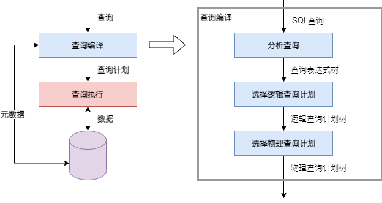
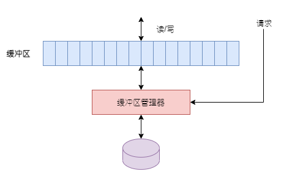

    
    
查询处理主要部分

查询编译可以划分为三大步骤：

1. 分析，建立查询的分析树
2. 查询重写，将分析树转化为初始查询计划，这种查询计划通常是查询的代数表达式，初始查询计划被转化为一个预期所需执行时间较小的等价的计划。
3. 物理计划生成，通过第2步抽象的查询计划，即**逻辑查询计划**的每个操作符选择实现算法并选择这些操作符的执行顺序，逻辑计划转化成**物理查询计划**，物理计划采用表达式树来表示，且含有更多的细节，如被查询的关系是如何被访问，一个关系合适或是否应当被排序等。

第2、3步骤常被称作查询优化器，是查询编译的难点，为了选择做好的查询计划，需要做出如下的判断：

- 查询的哪个代数等价形式会为查询带来最有效的算法？

- 对选中形式的每个操作，应当使用什么算法来实现？

- 数据如何从一个操作传递到另一个操作，比如使用流水线方式，主存缓冲区还是通过磁盘？

这些选择都都依赖于元数据，查询优化可利用典型的元数据包括：每个关系的大小，统计数据如一个属性的不同值的近似数目和频率，某些索引的存在以及数据在磁盘上的分布。

# 物理查询计划操作符

# 缓冲区

我们假设关系上的操作符可以得到M个数量的内存缓冲区来存储所需要的数据。实际上，这些缓冲区很少预先分配给操作符，且M的值依赖于系统条件变化。缓冲区管理器负责为数据库上的查询处理过程提供可用的内存缓冲器。**缓冲区管理器的职责是使处理过程得到它们所需要的内存，并且尽可能缩小延迟和减少不可满足的要求。**

    
    
缓冲区管理器响应内存访问磁盘块的请求

## 缓冲区管理结构

缓冲区管理器有两个主要的结构：

1. 大多数关系型DBMS中，缓冲区管理器直接控制内存。
2. 缓冲区管理器在虚拟内存中分配缓冲区，允许操作系统来决定那些缓冲区在任何时候都真正在内存以及那些缓冲区在操作系统管理的磁盘上的“交换空间”。

**不管DBMS采用哪种方式，都会引起同样的问题：缓冲区管理器应当限制使用的缓冲区数使得它们能够适合内存的容量。** 当缓冲区直接控制内存且超过可得到的空间时，就不得不通过将缓冲区的内存返回到磁盘来清空缓存区。如果缓冲块没有改变，就简单地将其在内存中的内容清除掉，但是，如果块的内容发生了改变，就必须写会磁盘。当缓冲区管理器在虚拟内存中分配空间时，可以分配更多的超过内存容量的缓冲区，但如果这些缓冲区都被真正使用，就会**颠簸**，这是操作系统常见的问题，即由于许多块在磁盘交换空间移进移出，此时，系统花费大量的时间交换块，只能完成很少有用的工作。

通常，DBMS初始化时，缓冲区数目是一个设置参数，我们期望这个缓冲区数目的设置使得缓冲区占用可用的内存，而不管缓冲区是被分配到内存或虚拟内存。

---

如何测试颠簸和修复？

---

## 缓冲区管理策略

假设有一个固定的缓冲池，即查询或其他数据库操作可用的缓冲区集合。缓冲区管理必须做出的关键的选择是当一个新进要求的块需要一个缓冲区时，应该将什么块丢出缓冲区。

## 物理操作符选择和缓冲区管理的关系

查询优化器最终选择一个来执行给定查询的物理操作符的集合，物理操作符的选择假设可以得到执行一个操作符所需的一定数目的缓冲区M。当实际执行查询时，缓冲区管理器不愿或不能够保证它能够得到这M个缓冲区，于是，物理操作符有如下两个相关问题：

1. 这个算法能够适应可得到的内存缓冲区数目M的值的变化吗？
2. 当不能够得到所期望的M个缓冲区，并且期望预留在内存中的块实际上已被缓冲区管理器移到了磁盘上，缓冲区管理器使用的缓冲区替换策略如何影响必须执行的额外的磁盘I/O数量的？

