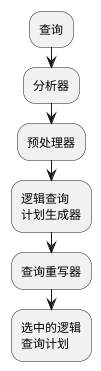

查询处理器必须采取三大步骤
1. 对使用诸如SQL的某种语言书写的查询进行语法分析，亦即将查询语句转换成安某种有用方式表示查询语句结构的语法树
2. 将语法分析树转换成关系代数表达式树(或某种类似标记)，称之为逻辑查询计划
3. 逻辑查询计划必须转换成物理查询计划，物理查询计划不仅指明了要执行的操作，而且找出了这些操作执行的顺序、执行每步所用算法、获得所储存数据的方式以及数据从一个操作符传递给另外一个操作的方式

# 语法分析和预处理
## 语法分析与语法分析树
语法分析器的工作是接手类似SQL的语言编写的文本并将它转化成语法分析树，该树的节点对应于一下两者之一：
1. 原子：它们是词法成分，如关键字(SELECT)、关系或属性名字、常数、括号、运算符(如+或<)以及其他模式成分
2. 语法类：在一个查询中起类似作用的查询子成分所形成的族的名称。用尖括号将描述性名称括起来表示语法类，如<Query>用于表示常用的select-from-where形式查询。

## 预处理
预处理有多个重要功能：
1.查询语句中用到的关系实际上是虚视图，则在from列表中用到该关系的地方必须用描述该视图的语法树来替换，该语法树由视图定义得到，本质上就是一个查询语句。
2. 负责语义检查。即使查询语句语法有效，实际上它可能在名称使用上违反一条或多条语义检查，例如，预处理器必须：
   1. 检查关系的使用。FROM子句中出现的关系必须是当前模式中的关系或视图。
   2. 检查与解析属性的使用。SELECT子句或WHERE子句中提到的每个属性必须是当前范围某个关系的属性。
   3. 检查类型。所有属性的类型必须与其使用相适应。

## 预处理涉及视图的查询

# 运算代价的估算

对于由指定逻辑计划导出的可能的物理计划进行枚举时，为每个物理计划做出一下选择：

- 满足结合律与分配符的运算，如连接、并、交的次序与分组
- 逻辑计划中每个运算符的算法，例如，决定使用嵌套循环连接或散列连接
- 其他运算符，如扫描、排序等，它们是物理计划所需要的但在逻辑计划中都不显式地存在。
- 参数从一个运算符传送到下一个运算符的方式。例如，通过磁盘上保存的中间结果或通过使用迭代算子(iterator)并每次传送一个参数的一个元组或一个主存缓冲区。

在讨论物理计划枚举前，首先必须考虑如何准确估计这些计划的代价，这种估计是基于数据的参数来做的，这些参数要么是准确地由数据计算而得，要么是“统计量收集”过程来估计。在戈丁这些参数值的情况下，我们可以对关系的大小进行许多合理的估计，它们可用于估计完整物理计划的代价。

## 中间关系大小的估计

理想情况下，我们可得到的中间关系中元组的规则，使得这些规则：

- 给出准确的估计
- 易于计算
- 逻辑上一致，即一个中间关系大小的估计不依赖于该关系的计算方式。例如多个关系的连接大小估计不应当依赖于计算这些关系连接的次序。

不存在同时满足删除三个条件的方法，《数据库系统实现》给出了一些是和大多数情况的简单规则。幸好，大小估计的目标不是准确估计大小，而是选择一个物理查询计划，即使大小估计方法不准确，只要该方法产生的误差稳定，也就是说，如果大小估计方法赋予最佳物理查询计划最小的代价，即使该计划的实现代价与所估计的代价不同。

表示关系大小的惯用记法：

- $B(R)$是容纳关系R所有元组所需的块数
- $T(R)$是关系R的元组数
- $V(R,a)$是关系R的属性a的值计数，即关系R中属性a上所具有的不同值的数目。并且$V(R, [a_1, a_2, ..., a_n])$表示关系R中属性$a_1, a_2, ..., a_n$ 一起考虑时所左出线的不同值的数据，即$\pi_{a_1, a_2, ..., a_n}(R)$中不同元组数。

## 投影运算大小的估计

《数据库系统基础教程》中扩展投影是包投影且不去重复。包的扩展投影不同于其他运算符，因为其大小是可以准确计算的。通常投影时元组大小缩减，因为某些成分被消除，然而扩展投影允许产生新的成分，他们是已有属性的组合，因此存在$\pi$运算符实际上增加了关系的大小。

## 选择运算大小的估计

令$S=\sigma_{A=c}$,其中A是R的属性，c是一个常量，对S推荐这样的估计$T(S) = T(R)/V(R, a)$

令$S=\sigma_{A \lt c}$,对T(S)的估计是$T(S) = T(R)/3$

令$S=\sigma_{A \ne c}$,可以假设所有元组都满足这个条件，即取$T(S) = T(R)$，此外还可以假设约有$\frac{1}{V(R, a)}$个R元组不满足条件，可以假设$T(S) = T(R)\frac{(V(R,a)-1)}{V(R,a)}$

当连接条件C是多个等值与不等值比较的AND时，我们可把选择$\sigma_c(R)$作为多个简单选择的级联，每个选择只检查其中的一个条件。需要注意的是，选择的次序是没有关系的。结果的大小估计是原始关系的大小乘以每个条件选中率因子。

有一些特殊情形，当条件矛盾时，会导致分析失效。例如$S=\sigma_{a=10\ AND\ a > 20}$,根据级联规则$T(S)=T(R)/3V(R,a)$,然而事实上，不存在元组可以同时满足$a=10\ AND\ a > 20$，因此$T(S)=0$。重写查询计划时，可以发现很多特殊情形规则的实例，优化器可应用哪些用于查找逻辑上等值与FALSE选择条件的规则，并且用空集代替S表达式。

当选择设计OR条件时，例如$S = \sigma_{c1\ OR\ c2}(R)$,一个简单的假设是没有同时满足两个条件的元组，因此结果的带下是分别满足条件的元组和，该度量一般是过高估计，甚至会得到S中元组数比原始关系R中的还要多。一个稍微复杂但更准确的估计是假设$C_1$和$C_2$相互独立，则如果R中有n个元组，其中有$m_1$个满足$C_1$，有$m_2$个满足$C_2$,估计S中元组$T(S)=n(1-\frac{1-m_1/n}{1-m2/n})$

满足$NOT\ C$的R的元组的估计数是T(R)减去满足C的元组估计数。

## 连接运算大小的估计

只考虑自然连接，其他连接按下面纲要进行处理：

- 等值连接结果中元组数在考虑到变量名变化后可按自然连接那样计算
- 其他$\theta$连接可看做积之后跟一个选择进行估计，积中元组数是所涉及关系的元组数之积。

首先，我们假定两个关系的自然连接只涉及两个属性的等值比较即$R(X, Y) \Join S(Y, Z)$,初步假定Y是单个属性，X,Z可以代表任何属性集，我们不知道R中的Y值和S中的Y值是如何连接的，例如：

- 两个关系可能有不相交的Y值集合，此时连接是一个控制且$T(R \Join S) = 0$
- Y 可能是S的外键且是R的外键，此时R的每个元组正好和S中的元组连接，且$T(R \Join S) = T(R)$
- 几乎S与R的元组都具有相同的Y值，此时$T(R \Join S)$约为$T(R)T(S)$

针对最通用情形，做出两个简化的假设：

- **值集的包含。**如果Y是出现在多个关系中的一个属性，则每个关系从值$y_1, y_2, ....$的一个固定列表的前头选择其值并且取尽前面的所有值。因此如果R和S是具有属性Y的两个关系且$V(R，Y) \le V(S, Y)$，则R的每个Y值将是S的一个Y值。(该假设会被违背，但许多情况下近似为真)。
- **值集的保持。**如果把关系R与另外一个关系连接，则不是连接属性的属性A不会再起可能的值集中丢失值。更准确地说，如果A是R的一个属性但不是S的属性，则$V(R \Join S, A) = V(R, A)$。（该假设也可能会被违背，只有当R中存在“悬挂元组”，即R不与S中的元组相连接的元组）

在上述假设下，$R(X, Y) \Join S(Y, Z)$的大小可以做如下估计。设r是R中的一个元组，s是S中的一个元组，s和r在属性Y上相等的概率是多少？假设$V(R, Y) \ge V(S, Y)$由于值集包含假定，s的Y值肯定出现在R的Y值中。因此r有和s相同的Y值概率为$1/V(R,Y)$,类似，$V(S, Y) \ge V(R, Y)$由于值集包含假定，r的Y值肯定出现在S的Y值中。因此r有和s相同的Y值概率为$1/V(S,Y)$。一般而言，Y上相等的概率当作$1/max(V(R, Y), V(S, Y))$
$$
T(R \Join S) = \frac{T(R)T(S)}{max(V(R, Y), V(S, Y))}
$$

## 多连接属性的自然连接

考虑自然连接一般情形
$$
S = R_1 \Join R_2 \Join ... \Join R_n
$$
假设属性A出现在k个$R_i$中，这k个关系中值的集合个数(即$V(R_i, A)， i=1,2,... k$)的各个值,$v_1 \le v_2 \le ... \le v_k$次序从小到大，假设从每个关系中选一个元组，所选元组在属性A上相同的概率是多少？考虑从具有最小数目的A值$v_1$关系中选取元组$t_1$.根据值集包含假设，这$v_1$个值中每个值在其他具有属性A的关系中属性相同的概率。考虑属性A上有$v_i$个值的关系，它所在元组$t_i$在属性A上与$t_1$相同的概率为$1/v_i$，这对于$i=2, 3, ...,k$均为真，则所有k个元组在A上相同的概率积为$1/v_2v_3...v_k$,该分析为估计任何连接大小给出了一条规则：

**从每个关系中元组数的积出发，对于至少出现两次的属性A，除以除了$V(R, A)$中最小值之外的所有值**。

基于值集保持和值集包含的两个假设，可以得到一个很方便的特性：**不管我们如何对几个关系的自然连接中各项进行组合与排序，分别对每个连接应用估计规则所得到的结果大小是相同的。此外该估计与我们将几个关系作为一个整体来连接并用用估计规则得到的结果大小估计是相同的。**

## 其他运算大小的估计

### 并

如果采用包的并，其大小正好是两参数大小之和，集合的并可以达到两参数大小之和，也可以小至两参数较大者，建议取中间值，例如，取较大者和较小者的一半。

### 交

无论是集合交还是包的交，结果可以少至0个元组或多至两参数较小者。建议估计值取两寄丢安的平均值，即较小值的一半。

### 差

结果可以具有T(R)至T(R)-T(S)个元组，建议估计值取其平均值$T(R)-T(S)/2$.

### 消除重复

若$R(a_1, a_2, ..., a_n)$是关系，则$V(R, [a_1, a_2, ...,a_n])$的大小为$\delta(R)$，实际上很难得到这个值，因此必须取近似值。极端情况下，$\delta(R)$的大小可与R的大小相同(R中没有重复元组)或1(全部元组都相同)，另一个上限是可能存在的不同元组的最大数:$V(R, a_i)$之积之积，$i=1,2,...,n$。一个合理的估计是取$T(R)/2$与所有$V(R, a_i)$之积中较小的一个。

 ### 分组与聚集

假设要估计$\gamma_L(R)$结果的大小。如果统计值$V(R, [g_1, g_2, ...,g_k])$已知，其中$g_i$是L中分组属性，则这就是答案，实际上这还难拿到，那么尝试寻找另外一种估计方法。与$\delta$一样，可以取$V(R,A)$之积作为分组数上限，其中属性A只取L中的分组属性。建议取取$T(R)/2$与所有$V(R, A)$之积中较小的一个。

# 基于代价的计划选择

假设计算表达式的代价可用所执行的磁盘I/O数来加以估计，磁盘I/O受一下因素影响：

- 所选取用于实现查询的特定逻辑运算符，这在选择逻辑查询计划时选定。
- 中间关系大小
- 用于实现逻辑运算符的物理运算符，如一趟或两趟连接的选择，对给定关系是否加以排序选择
- 相似运算的排序
- 由一个物理运算符向下一个物理运算符传递的参数

## 大小参数的获取

现代DBMS一般允许用户或管理员显式地要求做一些统计信息的收集例如$T(R)$和$V(R,a)$。这些统计值用到以后的查询优化中，统计量仅在下一个统计量收集指令发出时才被更新。

对整个关系R扫描，可以得到元组数$T(R)$的计数，并找到每个属性A不同值数目$V(R,a)$,R所占用的块数$B(R)$可通过实际所用块数计数或通过$T(R)$除以一个磁盘块可以容纳R的元组个数。

此外，DBMS可以计算一个给定属性诸值的直方图，如果V(R, A)不是太大，该直方图由具有属性A的每个值的元组数目(或比例)组成。如果这个属性存在大量不同值，只有最常出现的值被单独记录，而其他值则被分组统计，最常见的直方图类型是：

1. 等宽直方图。选定宽度$w$及常量$v_0$。提供值为$v$的元组数计数，$v$的范围是$v_0 \le v \lt v_0 + w, v_0 + w \le v \lt v_0 +2w$等。$v_0$是最小可能值或当前所知的下界。
2. 等高直方图。选择一个小数p，列出最小值、比最小值多p的值、比最小值多2p的值，直到最大值。
3. 最频值。列出最为公共的值以及他们出现次数。

使用直方图对连接大小的估计比前面化简方法估计更加准确。

# PG代价估计

# 参考资料

- [知乎:查询编译综述](https://zhuanlan.zhihu.com/p/60965109)