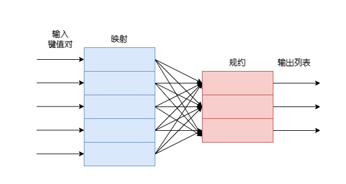
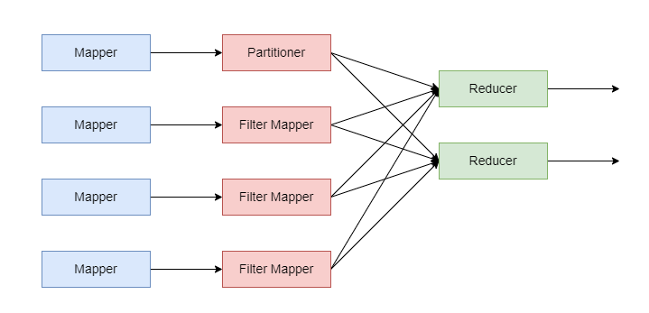
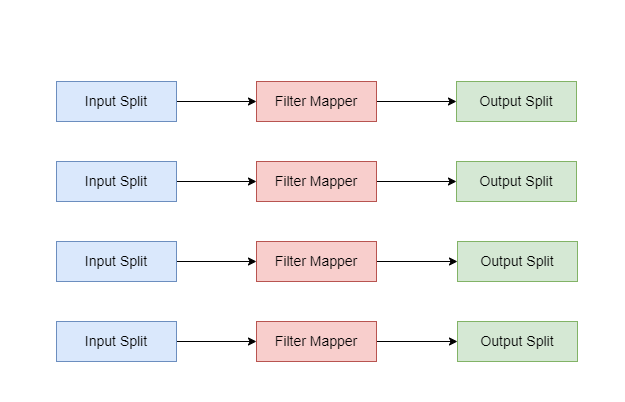
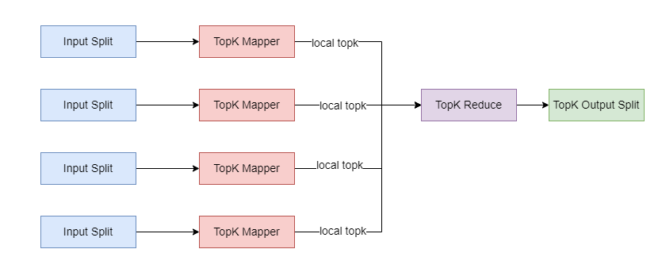
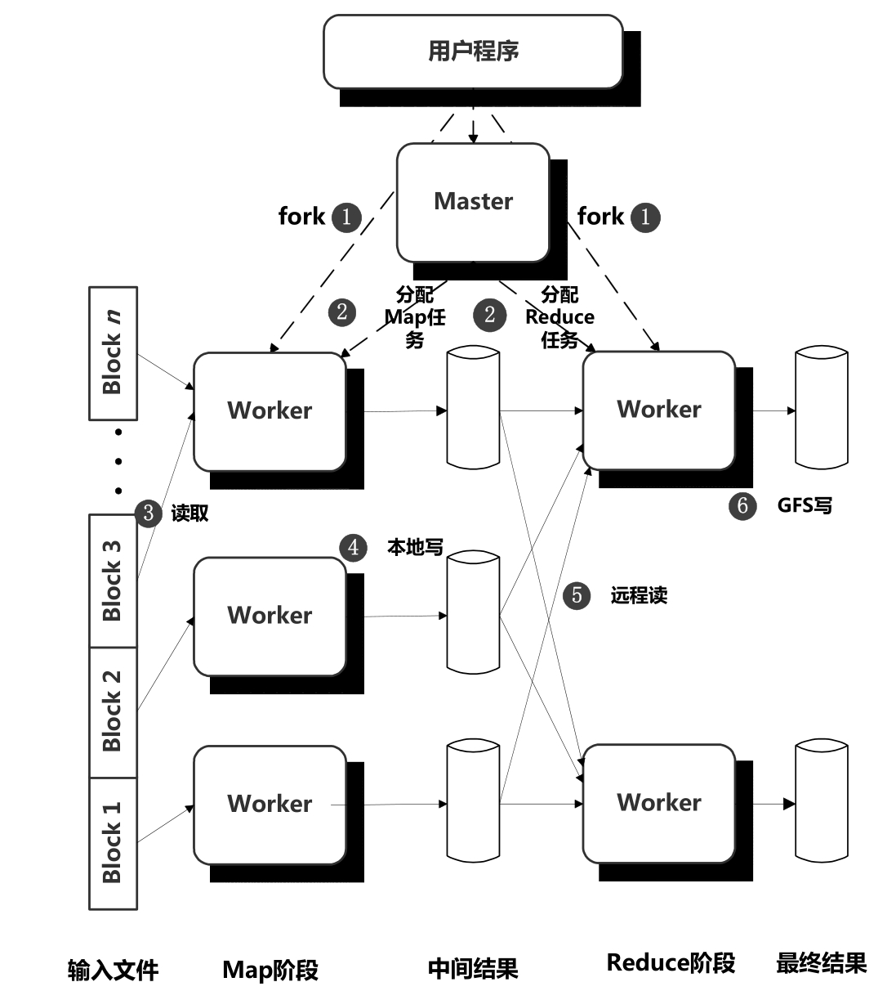
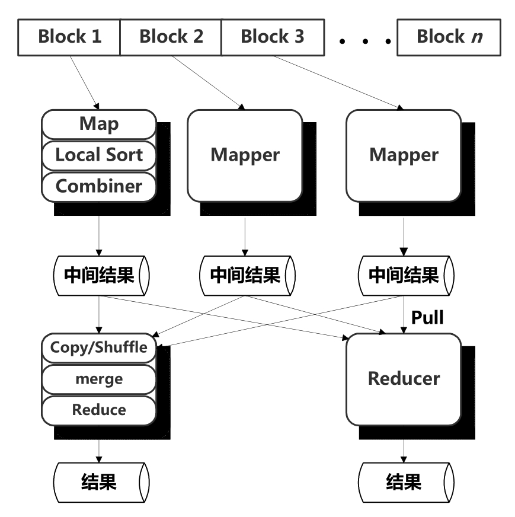

# 并行计算机

并行计算机（Parallel Computer）是指一个计算机中包含多个CPU单元，通过多核、多路来实现。

- 多核(Multicore)是指在一个芯片中集成多个独立的CPU单元，所有CPU可以共同执行计算工作。**这样的芯片称为一个Chip，而芯片集成的每一个CPU称为一个处理器核 （Core）。多核是典型的“横向扩展”设计思想。以前一味提高单个CPU的主频、性能，已经接近了架构设计和实现工艺的极限，摩尔定律的效果也在逐步降低。而增加计算单元的数量来提高计算能力，则相对要容易得多。

- **多路是指在一个计算机主板上安装多个独立的CPU芯片**。多路也是通过“横向扩展”来增加计算单元数量的方法，可以克服多核技术在一个芯片内的集成度和功耗限制。多路主要用于服务器主板上，适用于大并发量的Web服务器、数据库、云计算等场景。整个服务器中包含的CPU数量的计算公式为“CPU数量 = 路数 × 每个芯片包含的核数”

操作系统同时管理多个处理器核，把应用程序的执行负载尽可能平均地分配在所有处理器核上。不同的应用程序可以分配到不同的核上运行，一个应用程序也可以用并行编程（Parallel Programming）的技术，把自身分解成同时运行的多个执行线索，例如多进程、多线程机制，这样也可以使用多个处理器核同时计算。

## 内存结构:SMP和NUMA

<b>SMP是指CPU访问所有内存的速度相同，NUMA是指CPU访问内存的速度有差异。</b>并行计算机包含多个CPU，多个CPU与内存的连接方式形成不同的结构。

- “对称多处理”（Symmetrical Multi-Processing，SMP）是并行计算机的一种内存组织方式，所有CPU都可以访问所有内存。CPU、内存之间通过一种高速的互联网络进行数据传递。**所有内存组成一整块统一的地址空间，软件无论运行在哪一个CPU上，只要按照唯一的内存地址就能访问到相同的内存单元。所有CPU访问所有内存单元的时间是相同的。**
- “非统一内存访问”（Non Uniform Memory Access，NUMA）是另外一种内存组织方式，**每个CPU都安装内存条（称为本地内存），所有CPU之间通过互联网络进行合作，每个CPU还能访问其他CPU安装的内存（称为远程内存）。CPU访问本地内存的速度比访问远程内存更快**，这也是“非统一”的含义。

SMP与NUMA内存模型如图所示：

    

SMP的优点是结构简单，缺点是当CPU个数增加和内存容量增大时会造成互联网络开销增大，容易成为扩展的瓶颈。而NUMA相比SMP更容易支持大容量内存，互联网络不容易成为瓶颈，兼容了共享内存的方便性和系统扩展的灵活性。

# 并行数据库

## 并行模型

### 共享内存机器

    

每个处理器都可以访问所有处理器的所有内存，也就是说对整个机器有一个单一的物理地址空间。实际上每个处理器也都有一些局部的可以单独使用的内存，但是，在需要的时候可以访问其他处理器的内存，这类大型机大多是NUMA类型。**当前结构中最大的差异不是内存访问时间，而是不管数据在哪里，内存访问时间都远远大于高速缓存访问时间，因此关键问题是处理器所需的数据是否在它自己的高速缓存中。**

### 共享磁盘机器

每个处理器都有它自己的内存，其他的处理器不能直接访问。但磁盘可以由任意一个处理器通过通信网络访问到，磁盘控制器管理来自不同处理器的潜在竞争需求。磁盘和处理器的数据不必像下图一样相同。现在这种结构根据硬盘与处理器间转移数据单位不同可以分为两类：

- 网络附加存储(NAS)的特大容量磁盘存储，它转移的是文件。
- 存储区域网络(SAN)，它在硬盘和储存器之间转移的是磁盘块。

    

### 无共享机器

    

所有的存储器都有它自己的内存和一个或多个磁盘。所有的通信都经过处理器到处理器的通信网络。例如处理器P想要另外一个处理器Q磁盘上的元组，那么处理器P向Q发送请求数据的消息，接着，Q从磁盘中获得元组，并用另一条消息将它们通过网络发送给P。

**无共享的体系结构是最常用的。**其建造相对便宜，可以购买几台成架的商品及，一个架上的机器用网络连接起来，架与架之间用网络连接起来。

为这些机器设计算法时，必须 <b> 注意从一个处理器向另外一个处理器发送数据的代价很高。通常数据必须在处理器之间的消息中发送，需要客观的系统开销。两个处理器必须都执行一个支持消息发送的程序，这里会有一个与通信网络相关的竞争或延迟。消息的代价通常可以分为一个固定系统开销加上每个字节传送的少量的时间。</b> 这样设计一个处理并行算法使得处理器之间的通信包括大数据量的发送将会很有益。例如，处理器P中将要发送到处理器Q的数据的若干个块进行缓冲，如果Q不立即需要数据，那么等到P中有一个长消息时再将其发送到Q会非常有效。最常用的数据库操作并行算法可以有效地使用长消息。

## 计算模型

### MPP(Massively Parallel Processing)计算模型

### Map-Reduce计算模型

MapReduce是一种分布式批处理计算模型。

    
    
Map-Reduce并行计算

MapReduce计算模型和框架具有很多优点。

1. 具有极强的可扩展性，可以在数千台机器上并发执行。
2. 具有很好的容错性，即使集群机器发生故障，一般情况下也不会影响任务的正常执行。
3. 简单性，用户只需要完成Map和Reduce函数即可完成大规模数据的并行处理。

一般认为MapReduce的缺点包括：

1. 无高层抽象数据操作语言、数据无Schema及索引(设计目的就是高吞吐、高容错的批处理系统，不算真正的缺点)。
2. 单节点效率低下、任务流描述方法单一。

MapReduce运算机制的优势是数据的高吞吐量、支持海量数据处理的大规模并行处理、细粒度的容错，但是并不适合对时效性要求较高的应用场景，比如交互式查询或者流式计算，也不适合迭代运算类的机器学习及数据挖掘类应用,原因如下：

1. 其Map和Reduce任务启动时间较长。因为对于批处理任务来说，其任务启动时间相对后续任务执行时间来说所占比例并不大，所以这不是个问题，但是对于时效性要求高的应用，其启动时间与任务处理时间相比就太高，明显很不合算。
2. 在一次应用任务执行过程中，MapReduce计算模型存在多处的磁盘读／写及网络传输过程。比如初始的数据块读取、Map任务的中间结果输出到本地磁盘、Shuffle阶段网络传输、Reduce阶段的磁盘读及GFS写入等。对于迭代类机器学习应用来说，往往需要同一个MapReduce任务反复迭代进行，此时磁盘读／写及网络传输开销需要反复进行多次，这便是导致其处理这种任务效率低下的重要原因。

#### 计算模式

##### 求和模式(Summarization Pattern)

对于海量数据来说，通过对相似数据进行简单求和、统计计算或者相似内容归并是非常常见的应用场景，求和模式即描述这类应用场景及其对应的MapReduce解决方案，根据求和对象的类型，可以细分为数值求和以及记录求和两种情况。

1. 数值求和。如果计算对象是数值类型，那么对其进行统计计算是最常见的应用，统计计算包括简单计数、求最小值／最大值、求平均值／中位数等各种情况
2. 对于非数值的情况，往往需要将非数值内容进行累加形成队列。

    

Mapper以需要统计对象的ID作为Key，其对应的数值作为Value，比如单词计数中Key为单词本身，Value为1。在此种应用中如果使用Combiner会极大地减少Shuffle(拖曳)阶段的网络传输量。另外，Partitioner在这种应用中如何设计也很重要，一般的策略是对Reducer个数哈希取模，但是这可能会导致数据分布倾斜(Skewed)，即有些Reducer需要处理大量的信息，如果能够合理选择Partitioner策略会优化此种情形。通过Shuffle阶段，MapReduce将相同对象传递给同一个Reducer，Reducer则对相同对象的若干Value进行数学统计计算，得到最终结果。比如单词计数中这个数学计算就是求和，对于其他类型的应用，在这里也可以采取求均值或者中位数等各种统计操作。

##### 过滤模式(Filtering Pattern)

从海量数据中筛选出满足一定条件的数据子集，这就是典型的数据过滤场景。其应用包含简单过滤和Top K。

简单过滤即根据一定条件从海量数据中筛选出满足条件的记录。我们假设存在一个函数f对记录内容进行判断，并以返回True或者False作为判断结果，这个函数即是记录满足条件与否的判断标准，不同应用只是函数实现不同，其整体处理逻辑是一致的。

    

Top K是从大量数据中，根据记录某个字段内容的大小取出其值最大的k个记录。

    

#### 数据组织模式(Data Organization Pattern)

##### 数据分片

##### 全局排序

##### Join模式(Join Pattern)

常见的Join包括Reduce-Side Join和Map-Side Join。

#### 实现方式

##### Google的MapReduce

    
    
<b>Google的MapReduce计算框架架构</b>

由上图可见，当用户程序执行MapReduce提供的调用函数时，其处理流程如下:

1. MapReduce框架将应用的输入数据切分成M个数据块，典型的数据块大小为64MB，然后可以启动位于集群中不同机器上的若干程序。
2. 这些程序中有一个全局唯一的主控Master程序以及若干工作程序(Worker)，Master负责为Worker分配具体的Map任务或者Reduce任务并做一些全局管理功能。整个应用有M个Map任务和R个Reduce任务，具体的M和R个数可以由应用开发者指定。Master将任务分配给目前处于空闲状态的Worker程序。
3. 被分配到Map任务的Worker读取对应的数据块内容，从数据块中解析出一个个Key/Value记录数据并将其传给用户自定义的Map函数，Map函数输出的中间结果Key/Value数据在内存中进行缓存。
4. 缓存的Map函数产生的中间结果周期性地被写入本地磁盘，每个Map函数的中间结果在写入磁盘前被分割函数(Partitioner)切割成R份，R是Reduce的个数。这里的分割函数一般是用Key对R进行哈希取模，这样就将Map函数的中间数据分割成R份对应每个Reduce函数所需的数据分片临时文件。Map函数完成对应数据块的处理后将其R个临时文件位置通知Master，再由Master将其转交给Reduce任务的Worker。
5. 当某个Reduce任务Worker接收到Master的通知时，其通过RPC远程调用将Map任务产生的M份属于自己的数据文件（即Map分割函数取模后与自己编号相同的那份分割数据文件）远程拉取（Pull）到本地。
6. Reduce任务Worker遍历已经按照中间结果Key有序的数据，将同一个Key及其对应的多个Value传递给用户定义Reduce函数，Reduce函数执行业务逻辑后将结果追加到这个Reduce任务对应的结果文件末尾。
7. 当所有Map和Reduce任务都成功执行完成时，Master唤醒用户的应用程序，此时，MapReduce调用结束，进入用户代码执行空间。

从第5步可以看出，只有所有Map任务都完成时Reduce任务才能启动，也即MapReduce计算模型中在Map阶段有一个所有Map任务同步的过程，只有同步完成才能进入Reduce阶段。当所有中间数据都拉取成功，则Reduce任务根据中间数据的Key对所有记录进行排序，这样就可以将具有相同Key的记录顺序聚合在一起。

<b>Reduce任务从Map任务获取中间数据时采用拉取方式而非由Map任务将中间数据推送(Push)给Reduce任务，这样做的好处是可以支持细粒度容错。</b>假设在计算过程中某个Reduce任务失效，那么对于Pull方式来说，只需要重新运行这个Reduce任务即可，无须重新执行全部所有的Map任务。而如果是Push方式，这种情形下只有所有Map任务都全部重新执行才行。因为Push是接收方被动接收数据的过程，而Pull则是接收方主动接收数据的过程。

<b>Google的MapReduce框架支持细粒度的容错机制。Master周期性地Ping各个Worker，如果在一定时间内Worker没有响应，则可以认为其已经发生故障。对于已经完成的和正在进行的所有Map任务重新设置为Idle状态，这些任务由其他Worker重新执行。对于已经完成的Reduce任务，即使Worker节点发生故障也无需重新执行。由于Master是单节点的，如果Master失败，整个MapReduce任务失败，应用可以通过反复提交来完成任务。</b>为什么已经完成的Map任务也需要重新执行？这是因为Map阶段将中间结果保存在执行Map任务的Worker机器本地磁盘上，Map任务的Worker发生故障意味着机器不可用，所以无法获取中间结果，此时只能重新执行来获得这部分中间数据。对于已经完成的Reduce任务来说，即使Worker发生故障也无须重新执行，因为其结果数据是保存在GFS中的，数据可用性已经由GFS获得了保证。

<b>为了优化执行效率，MapReduce计算框架在Map阶段还可以执行可选的Combiner操作。所谓“Combiner操作”，即是在Map阶段执行的将中间数据中具有相同Key的Value值合并的过程，这样可以大大减少中间数据量，减少网络传输，从而提高效率。</b>其业务逻辑一般和Reduce阶段的逻辑相似，和Reduce的区别无非是其在Map任务本地产生的局部数据上操作，而非像Reduce任务一样是在全局数据上操作。例如，单词计数，如果Map阶段的中间结果数据中对单词进行了Combiner操作，则对某个单词来说网络只须传输一个`<key, value>`数值即可，而无须传输Value个`<key, 1>`，大大减少了网络传输。Combiner一般也作为与Map和Reduce并列的用户自定义函数接口的方式存在。

##### Hadoop的MapReduce计算

    
    
<b>Hadoop MapReduce运行机制</b>

Hadoop的MapReduce运行机制基本上与Google的MapReduce机制类似。Mapper任务调用用户自定义Map函数后对中间结果进行局部排序，然后运行Combiner对数据进行合并。Reducer任务的Shuffle过程就是上述Google的MapReduce运行流程中的步骤5，不过Hadoop是采用HTTPS协议来进行数据传输的，并采用归并排序（Merge-Sort）来对中间结果Key进行排序，然后调用用户自定义Reduce函数进行业务逻辑处理并输出最终结果的。

### DAG(Directed Acyclic Graph)计算模型

# 分布式数据库

一个分布式系统与一个无共享的并行系统的区别是对通信代价的假定。

## 数据分布
- 水平分解. 将逻辑关系划分为物理片段。
- 垂直分解, 将一个逻辑的关系分解为两个或更多关系，每个关系有原来一个属性子集且位于不同节点。
  
## 分布式事务
分布式事务由一些相关通信的事务成分构成，每个部件位于不同的结点并与局部的调度器和日志管理器通信。因此需要考虑如下的问题：
1. 如何管理分布式事务的提交/终止决定？如果一个事务的一个部件希望终止整个事务，而其他部件没有遇到任何问题因而希望提交事务，此时会发生什么？(两阶段提交技术)
2. 如何保证设计多个节点上部件的事务的可串行性？（分布式封锁技术）

## 数据复制
数据复制，即在不同节点上建立数据的副本，这样做的动机
- 如果一个节点故障，可能另一个节点可以提供与故障节点相同的数据
- 通过在提交查询的节点上建立所需数据的副本来提高查询的速度

数据复制会带来如下的问题
1. 如何保持副本相互一致？实质上，对有副本的数据库元素更新将编程更新所有副本的分布式事务。
2. 如何确定维护多少副本以及在什么地方维护副本？副本越多，更新越难，查询越容易。
3. 当网络通信发生故障时，统一数据的不同副本可能各自烟花，因而在网络连接回复时必须对各个副本进行协调，这种情况如何协调？

# 参考资料

1. 《CPU通识课》
2. 《数据库系统实现 第2版》
3. 《大数据日知录：架构与算法》