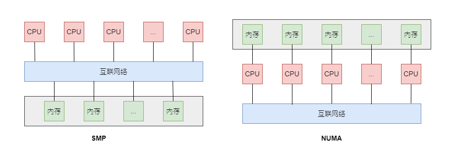
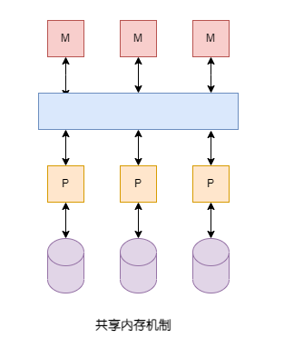
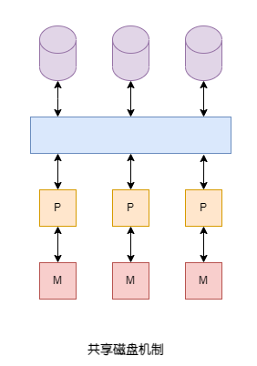
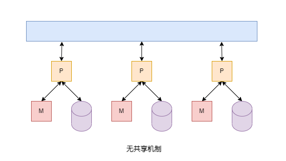

# 并行计算机

并行计算机（Parallel Computer）是指一个计算机中包含多个CPU单元，通过多核、多路来实现。

- 多核(Multicore)是指在一个芯片中集成多个独立的CPU单元，所有CPU可以共同执行计算工作。**这样的芯片称为一个Chip，而芯片集成的每一个CPU称为一个处理器核 （Core）。多核是典型的“横向扩展”设计思想。以前一味提高单个CPU的主频、性能，已经接近了架构设计和实现工艺的极限，摩尔定律的效果也在逐步降低。而增加计算单元的数量来提高计算能力，则相对要容易得多。

- **多路是指在一个计算机主板上安装多个独立的CPU芯片**。多路也是通过“横向扩展”来增加计算单元数量的方法，可以克服多核技术在一个芯片内的集成度和功耗限制。多路主要用于服务器主板上，适用于大并发量的Web服务器、数据库、云计算等场景。整个服务器中包含的CPU数量的计算公式为“CPU数量 = 路数 × 每个芯片包含的核数”

操作系统同时管理多个处理器核，把应用程序的执行负载尽可能平均地分配在所有处理器核上。不同的应用程序可以分配到不同的核上运行，一个应用程序也可以用并行编程（Parallel Programming）的技术，把自身分解成同时运行的多个执行线索，例如多进程、多线程机制，这样也可以使用多个处理器核同时计算。

## 内存结构:SMP和NUMA

<b>SMP是指CPU访问所有内存的速度相同，NUMA是指CPU访问内存的速度有差异。</b>并行计算机包含多个CPU，多个CPU与内存的连接方式形成不同的结构。

- “对称多处理”（Symmetrical Multi-Processing，SMP）是并行计算机的一种内存组织方式，所有CPU都可以访问所有内存。CPU、内存之间通过一种高速的互联网络进行数据传递。**所有内存组成一整块统一的地址空间，软件无论运行在哪一个CPU上，只要按照唯一的内存地址就能访问到相同的内存单元。所有CPU访问所有内存单元的时间是相同的。**
- “非统一内存访问”（Non Uniform Memory Access，NUMA）是另外一种内存组织方式，**每个CPU都安装内存条（称为本地内存），所有CPU之间通过互联网络进行合作，每个CPU还能访问其他CPU安装的内存（称为远程内存）。CPU访问本地内存的速度比访问远程内存更快**，这也是“非统一”的含义。

SMP与NUMA内存模型如图所示：

    

SMP的优点是结构简单，缺点是当CPU个数增加和内存容量增大时会造成互联网络开销增大，容易成为扩展的瓶颈。而NUMA相比SMP更容易支持大容量内存，互联网络不容易成为瓶颈，兼容了共享内存的方便性和系统扩展的灵活性。

# 并行数据库

## 并行模型

### 共享内存机器

    

每个处理器都可以访问所有处理器的所有内存，也就是说对整个机器有一个单一的物理地址空间。实际上每个处理器也都有一些局部的可以单独使用的内存，但是，在需要的时候可以访问其他处理器的内存，这类大型机大多是NUMA类型。**当前结构中最大的差异不是内存访问时间，而是不管数据在哪里，内存访问时间都远远大于高速缓存访问时间，因此关键问题是处理器所需的数据是否在它自己的高速缓存中。**

### 共享磁盘机器

每个处理器都有它自己的内存，其他的处理器不能直接访问。但磁盘可以由任意一个处理器通过通信网络访问到，磁盘控制器管理来自不同处理器的潜在竞争需求。磁盘和处理器的数据不必像下图一样相同。现在这种结构根据硬盘与处理器间转移数据单位不同可以分为两类：

- 网络附加存储(NAS)的特大容量磁盘存储，它转移的是文件。
- 存储区域网络(SAN)，它在硬盘和储存器之间转移的是磁盘块。

    

### 无共享机器

    

所有的存储器都有它自己的内存和一个或多个磁盘。所有的通信都经过处理器到处理器的通信网络。例如处理器P想要另外一个处理器Q磁盘上的元组，那么处理器P向Q发送请求数据的消息，接着，Q从磁盘中获得元组，并用另一条消息将它们通过网络发送给P。

**无共享的体系结构是最常用的。**其建造相对便宜，可以购买几台成架的商品及，一个架上的机器用网络连接起来，架与架之间用网络连接起来。

为这些机器设计算法时，必须 <b> 注意从一个处理器向另外一个处理器发送数据的代价很高。通常数据必须在处理器之间的消息中发送，需要客观的系统开销。两个处理器必须都执行一个支持消息发送的程序，这里会有一个与通信网络相关的竞争或延迟。消息的代价通常可以分为一个固定系统开销加上每个字节传送的少量的时间。</b> 这样设计一个处理并行算法使得处理器之间的通信包括大数据量的发送将会很有益。例如，处理器P中将要发送到处理器Q的数据的若干个块进行缓冲，如果Q不立即需要数据，那么等到P中有一个长消息时再将其发送到Q会非常有效。最常用的数据库操作并行算法可以有效地使用长消息。

## 计算模型

### MPP(Massively Parallel Processing)计算模型

### Map-Reduce计算模型

### DAG(Directed Acyclic Graph)计算模型

# 分布式数据库

一个分布式系统与一个无共享的并行系统的区别是对通信代价的假定。

## 数据分布
- 水平分解. 将逻辑关系划分为物理片段。
- 垂直分解, 将一个逻辑的关系分解为两个或更多关系，每个关系有原来一个属性子集且位于不同节点。
  
## 分布式事务
分布式事务由一些相关通信的事务成分构成，每个部件位于不同的结点并与局部的调度器和日志管理器通信。因此需要考虑如下的问题：
1. 如何管理分布式事务的提交/终止决定？如果一个事务的一个部件希望终止整个事务，而其他部件没有遇到任何问题因而希望提交事务，此时会发生什么？(两阶段提交技术)
2. 如何保证设计多个节点上部件的事务的可串行性？（分布式封锁技术）

## 数据复制
数据复制，即在不同节点上建立数据的副本，这样做的动机
- 如果一个节点故障，可能另一个节点可以提供与故障节点相同的数据
- 通过在提交查询的节点上建立所需数据的副本来提高查询的速度

数据复制会带来如下的问题
1. 如何保持副本相互一致？实质上，对有副本的数据库元素更新将编程更新所有副本的分布式事务。
2. 如何确定维护多少副本以及在什么地方维护副本？副本越多，更新越难，查询越容易。
3. 当网络通信发生故障时，统一数据的不同副本可能各自烟花，因而在网络连接回复时必须对各个副本进行协调，这种情况如何协调？

# 参考资料

1. 《CPU通识课》
2. 《数据库系统实现 第2版》