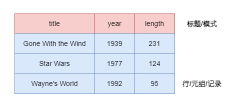
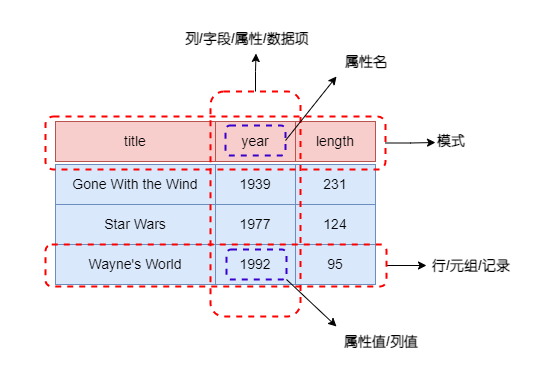
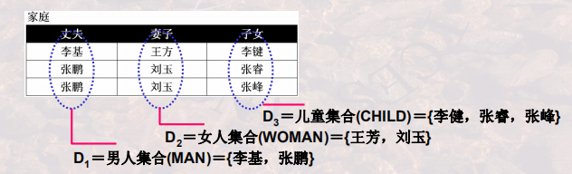
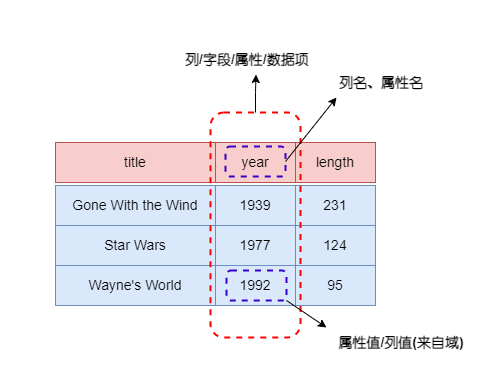
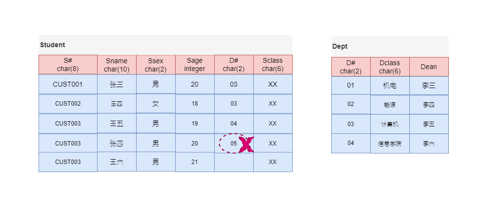
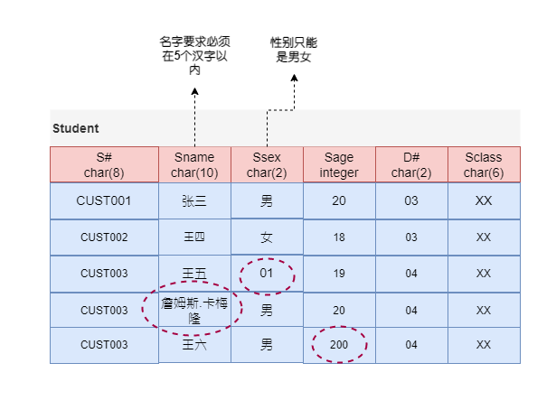

# 数据模型

数据模型(Data Model)用于描述数据或信息的标记，一般由三部分组成：

1. **数据结构(structure of the data)**: 数据库系统中讨论的数据结构是一种物理数据模型(physical data model)，在数据库中，数据模型处于比数据结构更高的层次，为强调这一点，将其称之为概念模型(conceptual model)。
2. **数据操作(operation on the data)**: 在数据库数据模型中，数据操作是在数据上附加的一些有限的可执行操作集，例如查询(query, 检索信息操作)，修改(modification，修改数据库操作)等。这些限制对于数据库是一个强有力的约束操作，通过这些约束操作，开发者可以在一个较高层级上对数据库操作进行描述，从而是的数据库管理系统可以更有效地执行这些操作。
3. **数据上的约束(constraint on the data)**: 例如一周的每天只能是1~7的正数，一部电影最多只能有一个名字等等。

数据库有三大经典的数据模型：关系数据模型、网状数据模型和层次数据模型。

1. 层次模型(hierarchical model)是一种基于树结构的模型，类似于半结构化数据模型，其缺点是他是真正在物理层次上操作，这样开发者无法在一个较高的层次上进行代码实现。
2. 网状模型(network model)是一种基于图的位于物理层次上的模型。
3. 关系数据模型

# 关系数据模型

关系数据模型是一种基于表的数据模型，一个关系(relation)就是一个Table。例如下面的关系：

    

关系模型处理Table，它由三部分组成：

1. 描述DB各种数据的基本结构形式(Table/Relation)
2. 描述Table与Table间所可能发生的各种操作(关系运算)
3. 描述这些操作所应遵循的约束条件(完整性约束)

研究关系模型就是学习Table如何描述，有哪些操作、结果是什么，有哪些约束。

## 关系基本结构

关系模型提供了一种描述数据的方法：一个称为关系(Relation)的二维表。关系模型的基本结构：Table/Relation：

    

关系的列命名为**属性(attribute)**。

---

**模式(Schema)**

关系名和属性集合的组合称为这个关系的**模式(schema)**。描述关系模式时，先给出一个关系名，其后用圆括号括起来所有的属性，例如`Movies(title, year, length, genre)`。

关系和模式的关系：同一关系模式下，可有很多的关系。关系模式是关系的结构，关系是关系模式在某一时刻的数据。关系模式是稳定的；而关系是某一时刻的值，是随时间可能变化的。

---

**元组(Tuple)**

关系中出含有属性名所在行以外的其他数据行称为**元组(tuple)**，每个元组均有一个分量(component)对应于关系的每个属性。

关系是元组的集合而非元组列表，因此关系中元组出现的顺序不是实质问题。关系属性次序也可以任意排列，关系不改变，由于属性是标题，因袭改变属性次序也需要改变列的次序，同时，元组分量也需要相应发生改动。

一个给定关系中元组集合叫关系的实例(instance)。通常一个数据库系统仅仅维护关系的一个版本即关系的当前元组集合，这个关系实例称为当前实例(current instance)。

---

**域(Domain)**

关系模型要求元组每个分量具有原子性，即它必须属于某种元素类型，例如integer或string，不可以是集合、列表等可以分解为更小分量的组合类型。进一步假定与关系的每个属性相关联的是一个**域(domain)**，即一个特殊的元素类型，关系的任一个元组的分量值必须属于对应的列的域。例如关系`Movies`中分量对应的数据类型分别是`string, integer, integer, string`，可以采用这样的方式来描述关系`Movies`：`Movies(title:string, year:integer, length:integer, genre:string)`。

域是列的取值范围。它是一组具有相同数据类型的值的集合，集合中元素的个数称为域的基数(Cardinality)。

    

---

**域和关系之间的关系以及表达**

笛卡尔积是所有可能组合成的元组。一组域$D_1, D_2, ..., D_n$的笛卡尔积为:
$$
D_1 \times D_2 \times ... \times D_n = \{(d_1, d_2, ..., d_n) | d_i \in D_i, i=1, ....n\}
$$
笛卡尔积的每个元素$(d_1, d_2, ..., d_n)$称作一个n-元组(n-tuple)，笛卡尔积是由n个域形成的所有可能的n-元组的集合。元组$(d_1, d_2, ..., d_n)$的每一个值叫做一个分量(Component)，若$D_i$的基数为$m_i$，则笛卡尔积基数即元组个数为$m_1 \times m_2 \times ... \times m_n$。

关系是一组域$D_1, D_2, ..., D_n$的笛卡尔积的子集，笛卡尔积中具有某一方面意义的那些元组被称作一个关系(Relation)。由于关系的不同列可能来自同一个域，为区分，需要为每一列起一个名字，即属性名。

    

关系可以用$R(A_1:D_1, A_2:D_2, ..., A_n:D_n)$表示，可简记为$R(A_1, A_2, ..., A_n$，这种模式又被称为关系模式(schema)或标题(Head)。其中$R$是关系名称，$A_i$是属性，$D_i$是属性所对应的域，n是关系的度或目(degree)，**关系中元组的数目称为关系的基数(Cardinality)**。

## 关系操作

描述Table与Table间所可能发生的各种操作，也就是关系运算，可以分为：

- 关系代数，它以一个或多个关系为输入，产生一个新的关系。ISBL是基于关系代数设计的数据库语言。
- 关系演算，它以数理逻辑中的谓词演算为基础，根据谓词变量的不同，可以分为关系元组演算(Ingres系统的QUEL是基于元组演算设计的数据库语言)和关系域演算(QBE是基于域演算设计的数据库语言)

$$
基本操作

\cup 并，Union
- 差，Difference
\times 广义积，Product
选择 Selection
\pi 投影 Projection

扩展操作
\cap 交 Intersection
\Join 连接 Join
\div 除 Division
$$
## 关系约束条件

完整约束

实体完整性、参照完整性和用户自定义完整性

# 关系特性

1. 列是同质：即每一列中的分量来自同一域，是同一类型的数据
2. 不同的列可来自同一个域，称其中的每一列为一个属性，不同的属性要给予不同的属性名。关系模式$R(A_1:D_1, A_2:D_2, ..., A_n:D_n)$中，$A_i (i = 1,…,n)$必须是不同的, 而$D_i(i = 1,…,n)$可以相同.
3. 列位置互换性：区分哪一列是靠列名
4. 行位置互换性：区分哪一行是靠某一或某几列的值(关键字/键字/码字) 
5. 关系是以内容(名字或值)来区分的，而不是属性在关系的位置来区分
6. 理论上，关系的任意两个元组不能完全相同。(集合的要求：集合内不能有相同的两个元素)；现实应用中，表(Table)可能并不完全遵守此特性。
7. 元组相同是指两个元组的每个分量都相同。
8. **属性不可再分特性**:又被称为关系第一范式

# 关系上的概念

## 候选码(Candidate Key)/候选键

关系中的一个属性组，其值能唯一标识一个元组，若从该属性组中去掉任何一个属性，它就不具有这一性质，这样的属性组称作候选码。

例如，学生(S#, Sname, Sage, Sclass),S#是一个候选码，在该关系中，任何两个元组的S#一定是不同的。选课(S#, C#,Sname, Cname, Grade)，(S#, C#)联合起来是一个候选码。

在关系中可能会有很多候选码，例如，学生(S#, Sname, Sage, Sclass, Saddress)其中属性S#是候选码，属性组(Sname, Saddress)也是候选码(同名同地址的两个同学是不存在的)。

## 主码(Primary Key)/主键

当有多个候选码时，可以选定一个作为主码。DBMS以主码为主要线索管理关系中的各个元组。

例如，学生(S#, Sname, Sage, Sclass, Saddress)，可以将S#属性做该表的主码，也可以选定属性组(Sname, Saddress)做表的主码。

## 主属性与非主属性

包含在任何一个候选码中的属性被称作主属性，而其他属性被称作非主属性。

- 最简单的，候选键只包含一个属性
- 最极端情况下，所有的属性构成这个关系的候选码，称为全码(All-Key)。

例如，选课(S#, C#,Sname, Cname, Grade)，(S#, C#)联合起来是一个候选码，S#，C#是主属性，而Sname, Cname, Grade是非主属性。

## 外码(Foreign Key)/外键

关系R中的一个属性组，它不是R的候选码，但它与另一个关系S的候选码相对应，则称这个属性组为R的外码或外键。两个关系通常是通过外码联系的。

    

# 关系完整性

关系完整性即指关系的正确性、相容性和有效性。它是给定的关系模型中数据及其联系的所有制约和依存规则，用以限定数据库状态及状态变化，从而保证数据的正确、相容和有效。

关系模型的完整性有三类: 实体完整性、参照完整性和用户定义的完整性。其中，实体完整性和参照完整性是关系模型必须满足的完整性约束条件。

## 实体完整性

此约束指关系的主属性，关系的主码中的属性值不能为空值，空值：不知道或无意义的值；

意义：关系中的元组对应到现实世界相互之间可区分的一个个体，这些个体是通过主码来唯一标识的；若主码为空，则出现不可标识的个体，这是不容许的。

空值：不知道、不存在或无意义的值。有空值的时候是需要特殊处理的，要特别注意。

> 在进行关系操作时，有时关系中的某属性值在当前是填不上的，比如档案中有“生日不详”、“下落不明”、“日程尚待公布”等，这时就需要空值来代表这种情况。关系模型中用‘?’表征
>
> 数据库中有了空值，会影响许多方面，如影响聚集函数运算的正确性，不能参与算术、比较或逻辑运算等。例如：“3 + ?”结果是多少呢？ “3 * ?”结果是多少呢？ “? and (A=A)”结果又是多少呢？
>
> 再例如，一个班有30名同学，如所有同学都有成绩，则可求出平均成绩；如果有一个同学没有成绩，怎样参与平均成绩的计算呢，是当作0，还是当作100呢？还是不考虑他呢？

## 参照完整性

参照完整性约束就说定义外码和主码之间的引用规则，是对关系间引用数据的一种限制。若属性（属性组）X 是基本关系 R 的外码，它与基本关系 S 的主码 Y 对应，那么 R 中每个元组在 F 上的值要么取 NULL，要么等于 S中对应元组的主码值。 R 和 S 可以是不同的关系，也可以是同一关系。

意义：如果关系R1的某个元组t1参照了关系R2的某个元组t2，则t2必须存在

    

在上图所示的例子中，关系Student在D#上的取值有两种可能: 

- 空值，表示该学生尚未分到任何系中
- 若非空值，则必须是Dept关系中某个元组的D#值，表示该学生不可能分到一个不存在的系中。

## 用户自定义完整性

用户针对具体的应用环境定义的完整性约束条件。

    

## 完整性约束检测

对数据库修改时必须检验是否满足上述三类完整性约束

### 插入操作

1. 首先，**检查实体完整性约束**，检查插入行在主码属性上的值是否已存在，不存在，可以执行插入，否则不可插入。
2. 然后，**检查参照完整性约束**，如果是向被参照关系插入，则不需要考虑此约束；如果向参照关系插入，则检查插入行在外码属性上的值是否已在相应被参照关系的主码属性中存在，存在，可插入，否则不可插入，或者将插入行的外码属性的值改为NULL，再插入。
3. 最后，**检查自定义完整性约束**，包括数据的类性、精度、取值范围、是否允许空值、是否有默认值等，满足即可执行插入操作，否则给出错误信息。

### 删除操作

一般只需对被参照关系检查参照完整性约束。如果主键被引用则不可删，或将参照关系中对应行的外码属性改为为NULL，再删除。

### 更新操作

结合删除和插入操作，先删除再插入。

# 参考资料

1. 数据库系统基础教程(第3版)
2. MOOC 哈尔滨工业大学: 数据库系统(上)：模型与语言
3. [关系数据模型要素三 关系完整性约束](https://owen027.github.io/2019/09/19/integrity_constraint_of_relational/)

