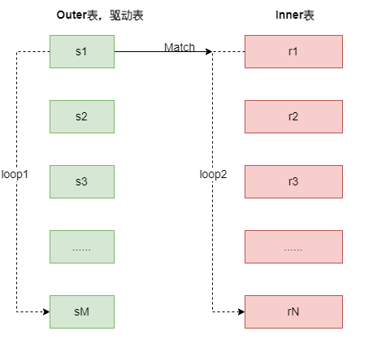
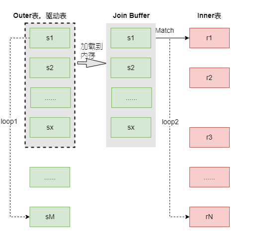
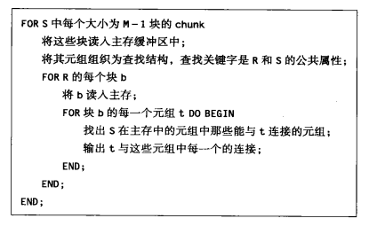
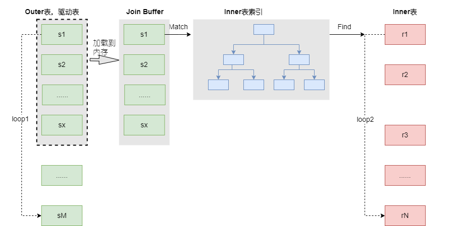
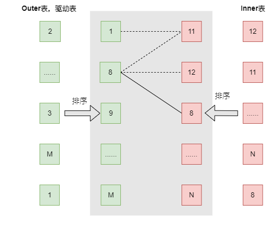
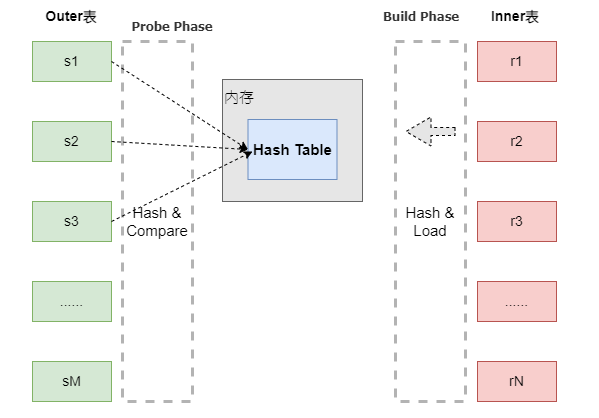
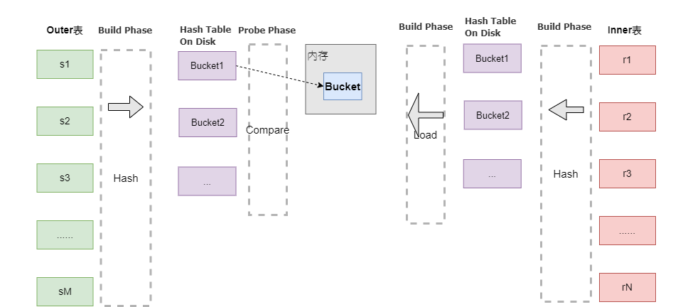
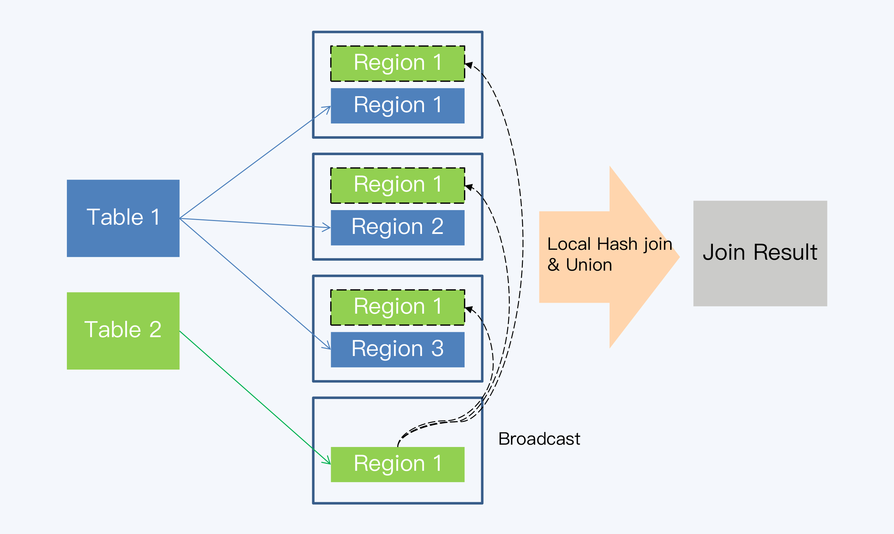

| 操作符                                 | 大致需要的内存  | 磁盘I/O       |
| -------------------------------------- | --------------- | ------------- |
| $\sigma$, $\pi$                        | 1               | B             |
| $\gamma$, $\delta$                     | B               | B             |
| $\cup$, $\cap$, $-$, $\times$, $\Join$ | Min(B(R), B(S)) | $B(R) + B(S)$ |
| $\Join$基于块的嵌套循环                | 任意$M\ge 2$    | $B(R)B(S)/M$  |


# 关联算法(Join)

常见的关联算法有三大类，分别是嵌套循环(Nested Loop Join)、排序归并连接(Sort-Merge Join)和哈希连接(Hash Join)。

## 嵌套循环

嵌套循环都由两个内外循环构成，分别实现从两张表中顺序取数据。其中，外层循环表称为外表(Outer 表, 也称为驱动表)，内层循环表则称为内表(Inner表)。最终得到的结果集中，记录的排列顺序与 Outer 表的记录顺序是一致的。

嵌套循环循环算法从某种意义上需要“一趟半”，因为其中的各种算法，两个操作对象中有一个元组仅读取一次，而另一个操作对象会重复读取。嵌套循环可用于任何大小的关系；没有必要要求一个关系必须能装入内存中。根据处理环节的不同，嵌套循环算法又可以细分为三种，分别是 Simple Nested-Loop Join(SNLJ)、Block Nested-Loop Join(BNJ)和 Index Lookup Join(ILJ)。

### Simple Nested-Loop Join

这是嵌套循环实现的最简单粗暴的方式，实现涉及的循环是对所涉及的各个元组进行的，称为基于元组的嵌套循环连接算法。

<center>
    
    <div>基于元组的嵌套循环连接</div>
</center>

假设实现计算$R(X, Y) \Join S(Y, Z)$

```
For S中的每个元组s DO
    For R中的每个元组r DO
    	IF r与s连接形成元组t THEN
    		output t;
```

如果忽略R和S的块缓冲方法，该算法需要磁盘I/O可能多达$T(R)T(S)$，很多情况下，我们可以修改该算法实现降低代价，改进的方式：

- 当利用R连接属性上的索引来查找与S元组匹配时，我们不必读取整个R，实现基于索引的连接。
- 更加注重R和S元组在各块的分布方式，实现基于块的嵌套循环。在执行内循环时，尽可能多地利用内存来减少磁盘I/O数目。

嵌套循环连接非常适合于迭代结构，在某种情况下可以避免将中间关系存储在磁盘。假设关系R和S非空，利用R和S的迭代器实现$R\Join S$的迭代器

```C++
// 假设用R.Open()和S.Open()分别表示R和S的迭代器
// 实现基于元组的嵌套循环连接迭代器
Open() {
	R.Open(), S.Open();
	s := S.GetNext();
}

GetNext() {
	REPEAT {
		r := R.GetNext()
		if (r == NotFound) { // 对于当前S，R已消耗完
			R.Close();
			s := S.GetNext();
			if (s == NotFound) return; // R和S都已经消耗完
			R.Open();
			r := R.GetNext();
		}
	}
	UNTIL(r与S能连接);
	return r和s的连接
}

Close() {
	R.Close();
	S.Close();
}
```


### Block Nested-Loop Join

对基于元组的嵌套循环进行如下的改进得到基于块的嵌套循环连接算法：

- 对操作的两个关系访问都按块组织。这一点确保了内层循环处理内表R时，可以尽可能少地减少磁盘I/O。
- 使用尽可能多的内存来存储属于外表S的元组。这一点使得将R的每个元组可以与尽可能多装入内存中的S的元组进行连接。

该算法主要的改进点在于减少内表的全表扫描次数，一般情况下，将小表作为外表可以获得略微的优势。在MySQL中存在一个Join Buffer的设置项`join_bufer_size`，它影响了执行效率。

<center>
    
    <div>基于块的嵌套循环连接</div>
</center>

假设$B(S)\le B(R)且B(S)>M，即任何一个关系都无法完整地加载到内存中$。

<center>
    
    <div>基于块的嵌套循环连接算法</div>
</center>

假设B(R)=1000， B(S)=500，M=101，采用100个内存块按照大小为100块的chunk对S缓冲

- 如果采用S做外表，R做内表，每次迭代采用100个磁盘I/O来读取S的chunk，第一层循环需要5次，第二层循环必须采用1000个磁盘I/O来完整读取R，第一层循环每次迭代需要$1000 + 100 = 1100$次磁盘I/O，需要的磁盘I/O的总数为$5 \times 1100=5500$
- 如果反过来，R做外表，S做内表，第一层循环需要1000/10=10次，第二层循环必须采用500个磁盘I/O来完整读取R，因此第一层循环每次迭代需要$500 + 100 = 600$次磁盘I/O，需要的总的磁盘I/O总数为$10 \times 600 = 6000$

这里可以，嵌套循环连接的代价并不比一趟算法(1500次磁盘I/O)大很多，实际上如果$B(S)\le M-1$,嵌套循环和一趟算法的磁盘I/O数是一样的。**一般而言，在外层循环使用小表略有优势。**

对一般的基于块的嵌套循环连接算法的复杂度分析，假设S是较小的关系，外层循环的迭代次数为$B(S)/(M-1)$，每次迭代读取S的M-1块和R的B(R)块，因此磁盘I/O的数量为$B(S)(M-1+B(R))/(M-1)$，或者$B(S)+(B(S)B(R))/(M-1)$，如果B(R)，B(S)和M都很大，前面的公式近似等于$B(R)B(S)/M$。嵌套循环算法通常可能不是最有效的算法，但是即使在当下的数据库实现中仍然会采用该实现，例如，当各个关系中大量元组在连接属性上具有相同的值时，嵌套循环算法依然有效。

### Index Lookup Join

该算法在Block Nested-Loop Join算法的基础上利用了索引。

<center>
    
    <div>基于索引的连接</div>
</center>

## 排序归并连接

也就是Sort-Merge Join(SMJ)，也被称为 Merge Join，可以分为排序和归并两个阶段：

- 第一阶段排序，按照连接键对 Outer 表和 Inner 表排序。
- 第二阶段归并，由于Outer 表和 Inner 表都已经有序，进行一次循环遍历完成比对就可以。

比较适合于表数据本身已经是有序的了，例如索引天然就有序。

<center>
    
</center>


## 哈希连接

哈希连接的基本思想是取关联表的记录，计算连接键上数据项的哈希值，再根据哈希值映射为若干组，然后分组进行匹配，体现了一种分治思想。Hash Join不仅可以处理大小表的连接，而且对于大表之间的连接效率也有明显的提升效果，但它只适用于等值连接。

常见的哈希连接算法有三种，分别是 Simple Hash Join、Grace Hash Join 和 Hybrid Hash Join。

###  Simple Hash Join

也称为经典Hash连接(Classic Hash Join)，其执行过程包括建立阶段(Build Phase)和探测阶段(Probe Phase)。

- 建立阶段。选择一张表作为 Inner 表，对其中每条记录上的连接属性(Join Attribute)使用哈希函数得到哈希值，建立哈希表。在计算逻辑允许的情况下，建立阶段选择数据量较小的表作为 Inner 表，以减少生成哈希表的时间和空间开销。
- 探测阶段。另一个表作为 Outer 表，扫描它的每一行并计算连接属性的哈希值，与建立阶段生成的哈希表进行对比。哈希值相等不代表连接属性相等，还要再做一次判断，返回最终满足条件的记录。

该算法做理想化的假设，也就是 Inner 表形成的哈希表小到能够放入内存中。实际上，哈希表是有可能超过内存容量的。哈希表无法全部放入内存，就要使用 Grace Hash Join 算法。

<center>
    
</center>


### Grace Hash Join

该算法正视了哈希表大于内存，将哈希表分块缓存在磁盘上。Grace 并不是指某项技术，而是首个采用该算法的数据库的名字。算法执行分为两个阶段

- 第一阶段，Inner 表的记录会根据哈希值分成若干个块(Bucket)写入磁盘，而且每个 Bucket 必须小于内存容量。Outer 表也按照同样的方法被分为若干 Bucket 写入磁盘，但它的大小并不受到内存容量限制。
- 第二阶段，先将 Inner 表的 Bucket 加载到内存，再读取 Outer 表对应 Bucket 的记录进行匹配，所有 Inner 表和 Outer 表的 Bucket 都读取完毕后，得到最终的结果集。

<center>
    
</center>

### Hybrid Hash Join

也就是混合哈希，字面上是指 Simple Hash Join 和 Grace Hash Join 的混合。它主要是针对Grace Hash Join 的优化，在内存够用的情况下，可以将 Inner 表的第一个 Bucket 和 Outer 表的第一个 Bucket 都保留在内存中，这样建立阶段结束就可以进行匹配，节省了先写入磁盘再读取的两次 I/O 操作。

## 分布式架构下关联算法

### 大小表关联

大小表关联时，可以把小表复制到相关存储节点，将全局关联就被转换为一系列的本地关联，再汇总起来就得到了最终结果，有两种实现方式：

- 静态复制表。在创建表的时候，直接使用关键字将表声明为复制表，这样每个节点上都会保留一份数据副本。当它与大表关联时，计算节点就可以将关联操作下推到每个存储节点进行。TBase、TDSQL 等都支持定义复制表。
- 动态复制表。动态方式也称为“小表广播”，这种方式不需要人工预先定义，而是在关联发生时，系统自行处理。也就是说，当关联的某张表足够小时，在整个集群中分发不会带来太大的网络开销，系统就将其即时地复制到相关的数据节点上，实现本地关联。

<center>
    
</center>

### 大表关联

大表关联的解决方案便是重分布。例如

```SQL
SELECT A.C1,B.C2 FROM A INNER JOIN B ON A.C1=B.C1
```

可能会出现下面数据重分布操作

- 如果`C1`是 A 表的分区键，但不是 B 表的分区键，则 B 表按照`C1`重分布，推送到 A 的各个分片上，实现本地Hash Join。
- 如果两张表的分区键都不是`C1`，则两张表都要按照`C1`做重分布，而后在多个节点上再做本地Hash Join。


## 参考资料

1. [极客时间:关联查询-如何提升多表Join能力?](https://time.geekbang.org/column/article/289299?screen=full)
2. 数据库系统实现(第二版)

