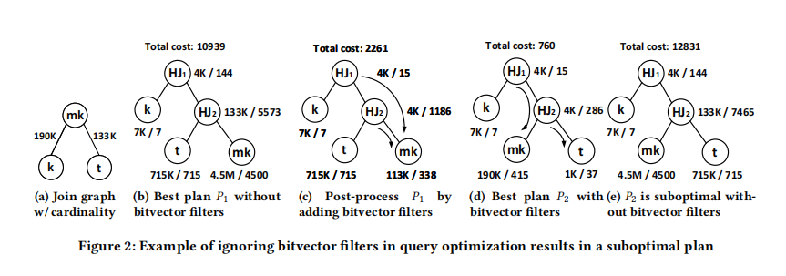
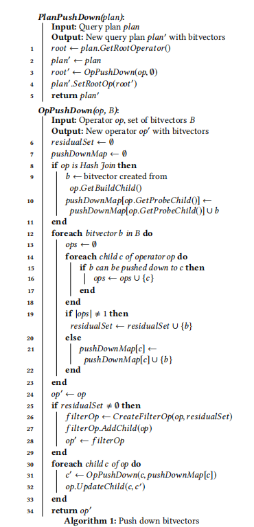

> Motivated by our analysis, we propose an algorithm that accounts for the impact of bitvector filters in query optimization. Our algorithm optimizes the join order for an arbitrary decision support query by choosing from a linear number of candidate plans in the number of relations in the query. We implement our algorithm in Microsoft SQL Server as a transformation rule. Our evaluation on both industry standard benchmarks and customer workload shows that, compared with the original Microsoft SQL Server, our techniquereduces the total CPU execution time by 22%-64% for the workloads, with up to two orders of magnitude reduction in CPU execution time for individual queries.
>
> 在分析的启发下，本文提出了一种算法，解释了位向量过滤器在查询优化中的影响。该算法通过从一个线性数量的候选计划中选择一个符合查询关系数量的计划来优化任意决策支持查询的连接顺序。在Microsoft SQL Server中实现了该算法作为转换规则。我们对行业标准基准和客户工作负载的评估表明，与原始的Microsoft SQL Server相比，我们的技术在工作负载下减少了22%-64%的总CPU执行时间，单个查询的CPU执行时间最多减少了两个数量级。

```sql
SELECT COUNT(*)
	FROM movie_keyword mk, title t, keyword k
	WHERE mk.movie_id = t.id AND mk.keyword_id = k.id
		AND t.title LIKE '%(' AND k.keyword LIKE '%ge%';
```


<center>
    
</center>

> Incorporating bitvector filters into query optimization is surprisingly challenging. Existing top-down or bottom-up dynamic programming (DP) based query optimization framework cannot directly integrate the bitvector filters into its optimization, because the effect of bitvector filters can violate the substructure optimality property in DP.
>
> In a DP based query optimization framework, either top-down or bottom-up, an optimal subplan is stored for each subset A of relations involved in a query. With bitvector filters, however, in addition to the relations in A, the optimal subplan also depends on what bitvector filters are pushed down to A and how these bitvector filters apply to the relations in A based on the structure of the subplan.

将位向量过滤器(bitvector filter)集成到查询优化存在很大的挑战。由于位向量过滤器会违反子结构的最优性，现有的基于自顶向下或自底向上动态规划(DP)的查询优化框架不能直接将位向量过滤器集成到其优化中。在基于DP的查询优化框架中，无论是自顶向下还是自底向上，查询所涉及的关系子集$\mathcal{A}$都会存储为一个最优子计划。然而，对于位向量过滤器，除了$\mathcal{A}$中的关系之外，最优子规划还取决于下推到$\mathcal{A}$中的位向量过滤器，以及这些位向量过滤器如何根据子计划的结构应用于$\mathcal{A}$中的关系。

> Incorporating bitvector filters into query optimization straightforwardly can be expensive. Similar to supporting interesting orders in query optimization[34], the number of optimal substructures can increase by an exponential factor in the number of relations to account for the impact of various combinations of bitvector filters.

直接将位向量过滤器集成到优化可能会引起很好的代价。与查询优化中支持Join Reorder类似，如果考虑各种位向量过滤器的组合的影响，最优子结构的数量可能会随关系数量呈指数级增长。

# Bitvector Filter算法

HashJoin算子在build端用等值连接的列创建位向量过滤器，之后将这个位向量过滤器尽可能下推到probe端较低的子树，以便尽可能早地从子树中进行数据过滤，消除不必要的元组。

<center>
    
</center>

# 3. 概述和初步准备

<b><font color="orange">位向量过滤器的性质和cost函数</b>

## 3.1 性质

性质1：交换律 $R/(R_1, R_2) = R/(R_2, R_1)$

性质2：Reduction，$|R/R_1| \le |R|$

性质3：Redundancy，$|R_1 \Join R_2|/R_2 = R_1 /Join R_2$

性质4：结合律，$R/(R_1, R_2) = (R/R_1)/R_2,如果(R_1, R_2), R_1和R_2创建的位向量过滤器没有误判$


$$
\begin{array}{l}
C_{out}(T) =
\begin{cases}
 |T| & \text{ if } T \ is \ base \ table\\
 |T| + C_{out}(T_1) + C_{out}(T_2) & \text{ if } T = T_1 \Join T_2
\end{cases}
\end{array}
$$
