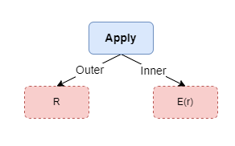

# Apply逻辑算子
引入表示子查询的逻辑算子Apply(也称作Correlated Join)，接受两个关系树输入，与一般Join不同的是，Apply的Inner输入是带参数的关系树,即E代表参数化的子查询。该Apply算子的语义：

$$
\begin{array}{l}
R \ A^{\otimes} \ E = \bigcup_{r\in R}(\{r\} \otimes E(r))
\end{array}
$$

`Apply`的含义采用右半部分的集合表达式定义：对于`Outer Relation`$R$中的每条数据$r$，计算`Inner Relation` $E(r)$，输出其Join的结果$r \otimes E(r)$，`Apply`的结果是所有这些结果的包并集。

根据连接方式$\otimes$不同，`Apply`有四种形式：
- $A^{\times}$`Cross Apply`：
- $A^{LOJ}$`Left Outer Apply`：即使$E(r)$为空，也会生成一个$r \circ {NULLs}$
- $A^{\exist}$`Semi Apply`：如果$E(r)$不为空则返回r,否则丢弃
- $A^{\nexists}$`Anti-Semi Apply`：如果$E(r)$为空则返回r,否则丢弃

对于Scalar Agg子查询有且只有一行结果，所以可以直接转换成Apply，存在某些情况，无法肯定子查询一定会返回0或1行，为了确保SQL语义，需要在Apply右边添加一个`Max1Row`算子:

$$
\begin{array}{l}
  Max1Row(E) = \left\{\begin{matrix} 
  &Null, &if |E| = 0 \\ 
  &E, &if|E| = 1 \\ 
  &Error,&otherwise 
\end{matrix}\right.    
\end{array}
$$

## 引入Apply将子查询去关联化规则

**基本的消除规则**:也就是说如果Apply右边不含来自左右的参数，那么和直接Join等价。

$$
\begin{array}{l}
R \ A^{\otimes}\  E = R \otimes_{true} E,当E不包含R的列时\\
R \ A^{\otimes}\  (\sigma_p E) = R \otimes_p E, 当E不包含R的列时 \\
\\
其中\\
\otimes可以是\left \{ \times, LOF, \exists, \nexists \right \}中的任意一个
\end{array}
$$

**Project和Filter的去关联化**，尽可能将Apply下推，将Apply下面的算子向上提。
$$
\begin{array}{l}
R \ A^{\times}\ (\sigma_p E) = \sigma_p(R \ A^{\times}\ E)(3)\\
R \ A^{\times}\ (\pi_v E) = \pi_{v \cup cols(R)}(R \ A^{\times}\ E) (4) \\
\end{array}
$$

**处理子查询中的Aggregate**
$$
\begin{array}{l}
R \ A^{\times}\ (\mathcal{G}_{A, F}E) = \mathcal{G}_{A \cup pk(R), F}(R \ A^{\times}\ E) \\
R \ A^{\times}\ (\mathcal{G}^{1}_{F}E) = \mathcal{G}_{A \cup pk(R), F^{'}}(R \ A^{LOJ}\ E) \\
\\
其中：\\
\mathcal{G}_{A, F}表示带有Group By分组的聚合(Group\ Agg)，A表示分组列，F表示聚合函数的列\\
\mathcal{G}^{1}_{F}表示不带分组的聚合(Scalar\ Agg)
\end{array}
$$

**集合运算的去关联化**
$$
\begin{array}{l}
R \ A^{\times}\ (E_1 \cup E_2) = (R \ A^{\times}\ E_1) \cup (R\ A^{\times}\ E_2) \\
R \ A^{\times}\ (E_1 - E_2) = (R \ A^{\times}\ E_1) - (R\ A^{\times}\ E_2) \\
R \ A^{\times}\ (E_1 \times E_2) = (R \ A^{\times}\ E_1) \Join_{R.key} (R\ A^{\times}\ E_2)\\
\end{array}
$$

# 参考资料
- [SQL 子查询的优化](https://zhuanlan.zhihu.com/p/60380557)