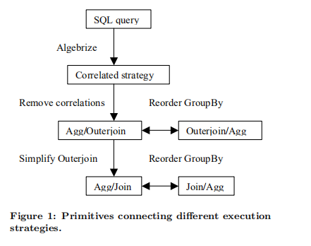
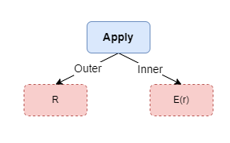
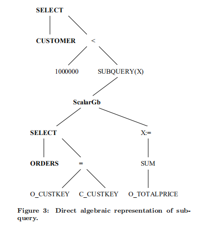
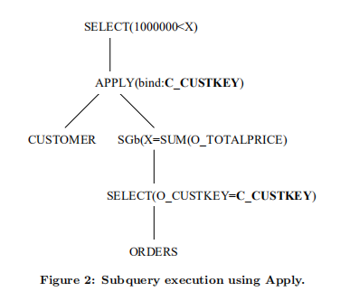
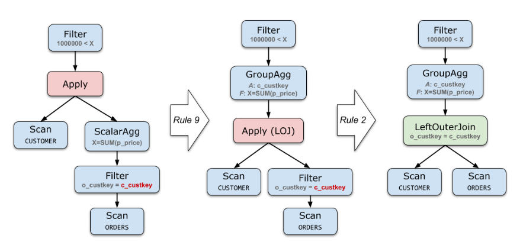
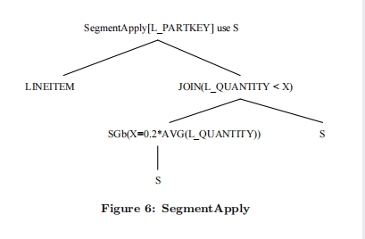
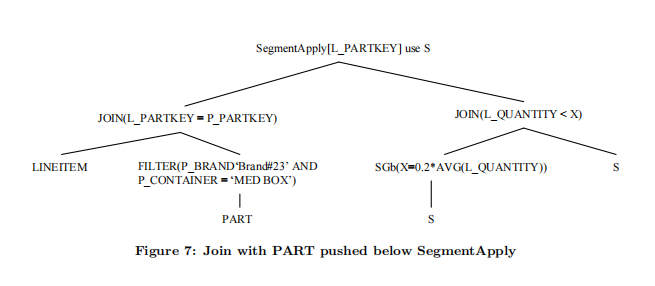

<b><font color="orange">作者发现的问题和尝试解决方案概述(原语+正交区域)</font></b>

> Here, we make the observation that there is significant overlap between techniques proposed for subquery execution and others such as GroupBy evaluation. Therefore we take the approach of identifying and implementing more primitive, independent optimizations that collectively generate efficient execution plans.

<div>
    <b>
        <font color="green">
        用于子查询执行提出的技术与其他技术（如Groupby Evaluation）之间存在很大重叠，本文采取更原始、独立的优化实现生成更高效的执行计划
        </font>
   </b>
</div>

> In this paper we show how a number of small, independent primitives generate a rich set of efficient execution strategies —covering standard proposals for subquery evaluation suggested in earlier literature. These small primitives fall into two main, orthogonal areas: Correlation removal, and efficient processing of outerjoins and GroupBy

<div>
    <b>
        <font color="green">
        本文通过一些小的，独立的原语生成一组丰富高效的执行策略，这些原语主要划分为两个正交区域：
        <ul>
            <li>扁平化(相关性去除)</li>
            <li>outerjoin和GroupBy的高效处理</li>
        </ul>
        </font>
   </b>
</div>


本文描述了在Microsoft SQL Server(7.0版和8.0版)中实现的基于一些用于包含子查询和/或聚合的查询的正交优化，分别专注于删除相关的子查询，也称为“查询扁平化”，以及有效执行带有聚合的查询。最终的结果是一个模块化、灵活的实现，产生了非常有效的执行计划。

---

# 标准子查询执行策略

SQL中有两种聚合形式，这两种聚合行为在空输入处理有所不同

1. 矢量聚合(Vector Aggregation)：指定分组列和Agg来计算，DISTINCT去除重复是一种是矢量聚合的一种特殊情况，即将相等的值折叠成一行，但实际上没有聚合函数来计算，Microsoft SQL Server将`DISTINCT`规范化(Normalize)为`GroupBy`。

    ```sql
    -- 计算每天的销售总额
    SELECT o_orderdate, SUM(o_totalprice)
    	FROM orders
    	GROUP BY o_orderdate;
    ```

    如果`orders`为空，则查询计算结果也为空。

2. 标量聚合(Scalar Aggregation)：不指定分组列，例如

    ```sql
    -- 计算总销售额,结果只有一行
    SELECT SUM(o_totalprice) FROM orders;
    ```

    如果`orders`为空，对于`SUM`计算结果是`NULL`，对于`COUNT`结果是0。

在代数表达式中，采用$\mathcal{G}_{A,F}$表示矢量聚合，$\mathcal{G}_{F}^{1}$表示标量聚合。


对于下面的查询：找出消费大于100000的客户，它是相关子查询(Correlated Subquery)：

遍历`customer`客户表，对每个客户在`orders`消费表中求相应客户消费总额度。

```sql
SELECT c_custkey
	FROM customer
	WHERE 1000000 < (
        -- 每个客户的消费总额度，scalar聚合
        SELECT SUM(o_totalprice) FROM orders
        	WHERE o_custkey = c_custkey);
```

1. **相关执行(Correlated Execution)**。最直接的执行算法，类似于`NestLoop`，先获取每个客户并计算子查询指定的总金额，然后过滤出订购金额少于指定金额的客户。也就是，先用外层查询`customer`的每行去遍历子查询内层查询的orders表(对于外层查询的一行数据`c_custkey`已知，计算得到客户的消费总额(`SELECT SUM(o_totalprice) FROM orders WHERE o_custkey = c_custkey`)，一行数据即Scalar Agg)，如果这个客户的消费总额`> 1000000`，则输出这一行的`customer.c_custkey`。

    这种执行策略性能低下，它是逐行处理`customer`，而不是面向集合的执行(set oriented execution)，其复杂度是笛卡尔积。在外层表很小且存在适当的索引的情况下，可能是最好的策略。。

2. **先`Outer Join`然后`Agg`**：该执行策略最早由Dayal提出。使用set-oriented算法，先收集customer的所有orders，之后在`customer`分组，再进行聚合。

    ```sql
    SELECT c_custkey
    	-- 1. 先Left Outer Join, 建立所有customer的order信息
    	-- 采用LOJ即使customer无法和orders不匹配也会被保留，对于不匹配的行agg结果为NULL
    	-- 这里如果聚集函数是COUT(*)先Join再agg不对，需要将其转换COUNT(column)
    	FROM customer LEFT OUTER JOIN orders ON o_custkey = c_custkey
    	-- 2. 再分组并聚集
    	GROUP BY c_custkey
    	HAVING SUM(o_totalprice) > 1000000;
    ```

3. **先`Agg`再Join**。该策略最早由Kim提出。先对`orders`分组并聚合计算(`GROUP BY + HAVING`),再和`customer`进行Join，相当于将Agg下推导Join的下面。SQL公式(formulation)采用派生表(derived table)，而不是子查询。

    ```sql
    -- 2. 再Join
    SELECT c_custkey FROM customer, (
        	-- 1. 先对orders按照c_custkey分组并聚合计算
            SELECT o_custkey FROM orders
    			GROUP BY c_custkey
    			HAVING SUM(o_totalprice) > 1000000)
        WHERE o_custkey = c_custkey;
    ```


## 基于原语正交组合的优化策略

上面提出的这些，最有效的执行策略最终取决于表大小，选择率，Agg压缩率，需要根据代价动态选择。本文提出采用正交的、可重用的基元来实现上面列出的功能甚至更多，并使用代价估计在它们之间选择较优的执行策略。

<center>
    
</center>

上图展示了原始优化如何实现不同的子查询策略。

> By implementing all these orthogonal techniques, the query processor should then produce the same efficient execution plan for the various equivalent SQL formulations we have listed above, achieving a degree of syntax-independence.

通过实现所有这些正交技术，查询优化可以列出上面提到的各种等价SQL公式(formulation)为其生成等价的有相同执行效率的执行计划，实现一定程度的语法独立性。

上图展示的基本变换描述如下：

1. `Algebrize into initial operator tree`：通过引入Apply算子来表示关联subquery，这是一个二阶的关系代数运算符，用来表达参数化的子查询。
2. `Remove correlations`：去关联化就是把Apply改些成其他算子，比如outer join。
3. `Simplify outerjoin`：在拒绝null的条件下，可以将outer join简化成join，这样可以和join使用同一个执行框架，但需要在`GroupBy`增加null-rejection的判断。去关联化通常产生outer join，然后在计算正确的情况下简化成join。比如：`1000000 < x`会拒绝`x`为`null`的情况，因此可以将outer join最终转换成ioin。
4. `Reorder GroupBy`：在outer join的上游或者下游重排序Agg。


## 参数化的关系代数描述关联子查询

<b><font color="orange">增加逻辑算子进行关系代数表达：引入Apply处理标量子查询(row-valued)和SegmentApply处理tabled-valued子查询</font></b>

引入Apply(也称作Correlated Join)逻辑算子使用关系代数接受两个关系树的输入来描述关联子查询，与一般Join不同的是，Apply的Inner输入是带参数的关系树，即`E`代表参数化的子查询。它对关系`R`中每行数据`r`，执行表达式`E`，返回符合条件的`r`集合。Apply算子适用于Scalar Valued，将标量作为子查询的参数。其公式：
$$
\begin{array}{l}
R \ A^{\otimes} \ E = \bigcup_{r\in R}(\{r\} \otimes E(r))
\end{array}
$$
其中$\otimes$可以是笛卡尔积,Left Outer Join,Left Semi Join, Left Anti Join。本文使用的所有的运算都是包运算且假设没有自动去除重复，因此$\bigcup$是`UNION ALL`。可以用`DISTINCT`显式去除重复，这只是`GroupBy`的一种特殊情况。

<center>
    
</center>

Apply使用于标量作为表达式的参数。Apply在(sub-)query的处理至少被三个组织研究：` Tandem`称为`tuple substitution`;`Oregon Graduate Institue and Portland State University`和微软称作`d-join`。<b><font color="red">值得注意的是，这三个研究小组都采用了Goetz Graefe的Cascades查询优化器。</font></b>

---

`SegmentApply`算子：table-valued做为表达式的参数。它采用关系R作为输入，采用列`A`对`R`进行分组(类似于`GroupBy`),将每一个分组`S`传递给`E`，执行参数化表达式`E(S)`。其公式：
$$
\begin{array}{l}
R \ \mathcal{S}\mathcal{A}_A \ E = \bigcup_{a}(\{a\} \times E(\sigma_{A = a} \ R))
\\
其中, a取域A中所有值
\end{array}
$$

---

# 形式化表达和规范化(Normalizing)

<b><font color="orange">介绍如何将一个子查询SQL，生成不使用相关执行的等价操作符树(operator tree)</font></b>

## 直接代数形式化表达

> As a first step, the parser/algebrizer takes the SQL formulation and generates an operator tree, which contains both relational and scalar operators.

首先，parser将SQL解析成含关系和Scalar算子的operator树。比如`WHERE`翻译成`Select`，这个operator树中含有两个子表达式。

<center>
    
    <div>
        其中黑色加黑表示关系节点
    </div>
</center>

直接执行这个operator tree，它的执行过程类似于Nest Loop，对外层关系的每一行都需要调用谓词的scalar求值(evaluation)。


## 用Apply的代数表达

通过引入Apply算子消除关系节点(customer)和scalar阶段(含子连接的谓词)之间的相互递归(不再需要类似于Nest Loop方式的执行)。一般的方案是在标量标量表达式需要子查询结果之前，显示地对子查询求值。假设有一个输入关系R，它带有以子查询`Q`为参数的表达式`e`。首先，通过Apply执行子查询，这样子查询的结果便可以以一个新列`q`的形式被使用，之后用这个变量替换子查询：
$$
\begin{array}{l}
\odot_{e(Q)} R \hookrightarrow \odot_{e(q)}(R \ \mathcal{A}^{\otimes} \ Q )
\end{array}
$$

<center>
    
</center>

此时直接执行依然是Nest Loop，但由于scalar求值不再需要回调到关系引擎(Relational Engine)，消除了Scalar和关系计算间的递归调用，删除递归调用不仅影响性能且可以简化实现。


通过引入Apply算子，以关系代数的方式形式化子查询，在原有关系代数的基础上增加了SQL执行的可选择空间。普通的关系代码描述的集合操作，Apply算子和普通关系代数算子不同的是：Apply是一次执行一个tuple，tuple-at-a-time。


## 去除Apply

$$
\begin{array}{l}

R \ A^{\otimes}\  E = R \otimes_{true} E,当E不包含R的列时 && (1)\\
R \ A^{\otimes}\  (\sigma_p E) = R \otimes_p E, 当E不包含R的列时 && (2)\\
\\ 
\\
R \ A^{\times}\ (\sigma_p E) = \sigma_p(R \ A^{\times}\ E)  && (3)\\
R \ A^{\times}\ (\pi_v E) = \pi_{v \cup cols(R)}(R \ A^{\times}\ E) && (4)
\\
\\
R \ A^{\times}\ (E_1 \cup E_2) = (R \ A^{\times}\ E_1) \cup (R\ A^{\times}\ E_2) && (5)\\
R \ A^{\times}\ (E_1 - E_2) = (R \ A^{\times}\ E_1) - (R\ A^{\times}\ E_2) && (6) \\
R \ A^{\times}\ (E_1 \times E_2) = (R \ A^{\times}\ E_1) \Join_{R.key} (R\ A^{\times}\ E_2) && (7)\\
\\
\\
R \ A^{\times}\ (\mathcal{G}_{A, F}E) = \mathcal{G}_{A \cup pk(R), F}(R \ A^{\times}\ E)  && (8)\\
R \ A^{\times}\ (\mathcal{G}^{1}_{F}E) = \mathcal{G}_{A \cup pk(R), F^{'}}(R \ A^{LOJ}\ E)  && (9)\\
\\
\otimes可以是\left \{ \times, LOF, \exists, \nexists \right \}中的任意一个

\end{array}
$$

(7) ~(9)需要R包含key`(R.key)`，公式(9)，$F'$包含$F$中通过单列表示的Agg，例如$F$为`COUNT(*)​`，则$F'$是`COUNT(c)`，c是E中非空的列。（9）对于所有$agg{\oslash } = agg(null)$的聚集运算都有效。


<div>
    <b>
        无需在执行器中实现Apply算子，可以通过上面的9种规则消除Apply算子转换成Join算子，其方法是：
        <ol>
            <li> 先用Apply算子替换子查询</li>
            <li>Apply算子下推(相当于Agg，Filter上移)，直到右表不再包含左表的参数。</li>
            <li>最终得到最简化的Apply算子形式，利用公式(1)和(2)可以得到普通的Join算子形式。</li>
		</ol>
	</b>
</div>

   

<center>
    
</center>


## 任意子查询去关联

对于bool值的子查询，即`EXISTS, NOT EXISTS,IN`和集合比较，子查询可以被重写为标量`COUNT`。无论等于0还是大于0，只要获取到一行，Agg算子都可以立马停止行请求计算，因为多余的行不会影响比较运算的结果。

如果select中有且仅有一个存在性子查询（或从多个AND分离出这样的只含一个存在性子查询），这时select运算可以`exists -> ApplySemiJoin`，`NOT EXISTS -> ApplyAntiSemiJoin`，再运用公式(2)将其转换非相关。


有两种情况，在将其规范到标准关系代数上会出现一些问题。

> We call those exception subqueries and they require  scalar-specific features.

考虑下面的查询：

```sql
SELECT c_name, (
        SELECT o_orderkey FROM orders WHERE o_custkey = c_custkey)
	FROM customer
```

上面的子查询会返回3种可能的结果：

1. 返回`null`，那么该子查询最终结果返回`null`
2. 返回一行，那么该子查询最终结果返回该行
3. 返回多行，那么需要产生run-time-error。

引入`Max1Row`算子，对子查询结果集检查，如果超过1行报run-time-error。
$$
\begin{array}{l}  Max1Row(E) = \left\{\begin{matrix}   &Null, &if |E| = 0 \\   &E, &if|E| = 1 \\   &Error,&otherwise \end{matrix}\right.    \end{array}
$$
并不是所有的子查询都需要`Max1Row`判断：

```sql
-- c_custkey是customer的键,是唯一的,不会产生多行
-- 利用语义优化，不需要生成Max1Row
SELECT o_orderkey, (
    	SELECT c_name FROM customer WHERE c_custkey = o_custkey)
	FROM orders
```


另外一个可能导致问题的是：Conditional Scalar Execution

```sql
-- 当COND为true,VALUE2不应该被执行
-- 如果提前执行VALUE2，假设VALUE2有问题(特别是生成run-time-error)
CASE WHEN <COND> THEN <VALUE1> ELSE <VALUE2> END
```

为了解决这个问题，通过扩展Apply with conditional execution of the parameterized expression, based on a predicate.来实现。论文指出这种场景在实际业务中不常见。


## 子查询分类

分类1：无需额外引入通用表达式将子查询删除。(Subqueries that can be removed with no additional common subexpressions)

通常，移除Apply需要引入额外的通用表达式（公因式）。比如规则5，在消除Apply后需要引入两次R。能够简单的被`select/project/join/agg`描述的子查询，在去除Apply时相对简单些，例如：

```sql
SELECT c_custkey
	FROM customer
	WHERE 1000000 < (
        SELECT SUM(o_totalprice) FROM orders
        	WHERE o_custkey = c_custkey);

-- 等价于
SELECT c_custkey
	FROM customer LEFT OUTER JOIN orders ON o_custkey = c_custkey
	GROUP BY c_custkey
	HAVING SUM(o_totalprice) > 1000000;
```


---

分类2：通过额外引入公共子表达式来删除的子查询(Subqueries that are removed by introducing additional common subexpressions)

对于有公共子表达式的查询，MicroSoft SQL Server没有在normalization阶段去关联化，

```sql
SELECT * FROM partsupp
WHERE 100 > (
    SELECT sum(s_acctbal) FROM(
        SELECT s_acctbal FROM supplier WHERE s_suppkey = ps_suppkey 
        UNION ALL
        SELECT p_retailprice FROM part WHERE p_partkey = ps_partkey
    ) as unionresult);
```

---

分类3: Exception subqueries

实际业务中很少，例如上面的SQL：

```sql
-- 子查询是标量的，如果返回大于1行会产生run-time-error
SELECT c_name, (
        SELECT o_orderkey FROM orders WHERE o_custkey = c_custkey)
	FROM customer
```

---

# Agg优化

<b><font color="orange">介绍了一些关于Agg的优化方法</font></b>

本节中，描述高效处理带agg的查询。通过关系代数来描述`GroupBy/Aggregate`的重排序以及查询的分段执行(segmented execution).

## Reordering GroupBy

`Agg`计算能减少结果集，因此借助`Agg`做为提前过滤的一种手段。但通常`Agg`花销也很大，这比较依赖于`Agg`聚集的行数。拿join来说，join的条件也可能减少结果集，这样先计算join在计算`GroupBy`更优；或者join可以借助索引，如果先进行`Agg`，那么索引就无法使用。因此最好是同时生成可选方案，基于代价进行选择。

<b>Group和Filter, join, semijoin等重排序</b>

filter和`Agg`的重排序

> For a GroupBy operator, rows in the input relation that have same values for the grouping columns generate exactly one output row. If a filter above an aggregate rejects a row, it needs to reject the whole group that generated this row after it is pushed below the aggregate. The only characteristic shared by this group of rows is the values of the grouping columns.
>
> 对于GroupBy操作符，对于分组列具有相同值的输入关系中的行只输出一行。如果聚合上方的filter过滤掉了这一行，那么将filter下推到agg的下面，它会过滤掉产生这一行的一组数据。产生这一组数据的特征是grouping列。
>
>  Therefore we can move a filter around a GroupBy if and only if all the columns used in the filter are functionally determined by the grouping columns in the input relation.

filter算子能够下推或者上拉的充要条件是：filter中的列是grouping列的子集。

---

`GroupBy`和Join重排序
$$
\mathcal{G}_{A,F}(S \Join_p R) \ -Agg下推-> S \Join_p (\mathcal{G}_{A \bigcup \ columns(p)-columns(s), F})
$$
<b>将Group下推到Join下面，grouping列和`Agg`函数以及Join谓词满足一定条件：</b>


1. 如果join条件p中的使用的关系R的列，那么这些列需要属于grouping列。(保证grouping列包含了R中的所有参与join谓词的列)
2. S的key属于`grouping`集合；(保证一个`GroupBy`组中不会出现S中两个行，因为它的key在`GroupBy`中)
3. `Agg`表达式必须只使用R的列；（保证能够下推到R上）

上面为什么正确，将join当作笛卡尔积+filter，1.2两个条件确保`GroupBy`可以下推到filter下面，3可以保证`Agg`计算只是在关系R上进行(保证`Agg`可以下推到R)。

总结，把`groupby`下推到R上，grouping的类列分成两部分：

1. 一个部分是S的列 - 必须是S的key，保证一个分组里最终只有一行S；
2. 一部分是R的列 - 更上层的filter列，保证`groupby`能够下推到这个filter下；


$$
S \Join_p (\mathcal{G}_{A,F}R) = \mathcal{G}_{A \bigcup columns(S),F}(S \Join_p R)
$$
<b>将AGG上拉到Join上,需要满足：</b>

1. 左边的表S有唯一key；（保证`groupby`聚合前后，每个分组里都只有S的一行数据,在实际使用中如果没有key可以在执行中生成）
2. join条件没有用到`agg`的函数结果；（保证`groupby`上拉，不影响join的进行）

如果上拉之前有对`groupby`聚合后结果集的filter过滤，那么`groupby`上拉之后，也可以在having中执行该filter过滤，比如Q1的处理。

---

`GroupBy`和`SemiJoin`, `AntiSemiJoin`重排序

> Suppose we have an aggregate followed by a semijoin i.e. (G(A,F) R) Semi Join S we can push the semijoin below if and only if *p* does not use the result of any aggregate expressions and every column of predicate *p*, say *c*, satisfifies the condition that if *c* not in *columns*(*S*) then *c* is functionally determined by the grouping columns(i.e. the set *A*).

可以将`SemiJoin`,`AntiSemiJoin`看做含/不含关系中列值的过滤计算。对于$\mathcal{G}_{A,F}R \ SemiJoin \ S$满足下推当且仅当：join条件没有用到agg的函数结果且谓词p中使用的每一列，记为c，假设满足$c \notin columns(S)$，c是grouping的子集。

---

## GroupBy和OuterJoin重排序

将`GroupBy`下推到`OuterJoin`下面，需要满足上面将`GroupBy`下推到`Join`的三个条件，此外还需要额外添加一个投影(project)，这是因为`OuterJoin`的结果分两种情况：

- 匹配(match)，和上面Join相同。
- 不匹配(unmatch)，对于失配元组需要追加NULLs。提前进行AGG计算会导致不匹配的行不会被AGG计算。

> For the aggregate expressions which do not result in a NULL, we need to add a project which for each unmatched row sets the aggregate result to the appropriate constant value. Note that this constant can be calculated at compile time. For count(*), the value of this constant is zero.

对于Agg不返回NULL，我们需要添加一个投影,为每个不匹配的行聚集结果生成一个适当的常量。该常量可以在编译时计算，例如`COUNT(*)`增加的常量为0(论文内容)。个人存疑：这里是不是不正确`COUNT(*)`对于`NULL`是1，`COUNT(col)`是0。
$$
\mathcal{G}_{A,F}(S \ LOJ_p \ R) = \pi_c(S \ LOJ_p (\mathcal{G}_{A-colums(s), F}R))
$$
例如上面的例子：

```sql
SELECT c_custkey
	FROM customer
	WHERE 1000000 < (
        -- 每个客户的消费总额度，scalar聚合
        SELECT SUM(o_totalprice) FROM orders WHERE o_custkey = c_custkey);

-- 等价于，先LOJ再AGG
SELECT c_custkey
	FROM customer LEFT OUTER JOIN orders ON o_custkey = c_custkey
	GROUP BY c_custkey
	HAVING SUM(o_totalprice) > 1000000;

-- 将AGG下推到LOJ等价于
SELECT c_custkey
	FROM customer LEFT OUTER JOIN (
        -- 不需要添加额外的投影,因为在NULL上计算sum(o_totalprice)返回NULL
        SELECT o_custkey, sum(o_totalprice) as total_order FROM orders
        	GROUP BY o_custkey
    ) ON o_custkey = c_custkey
    WHERE total_order>10000;
```


## Local Agg

引入一个新的操作符`LocalGroupBy`记为$\mathcal{LG}$，并开发一些原语实现将它下推实现提前聚集。

下推部分`group by`的工作量到下层，聚合函数`f`被拆分成两个聚合函数：

1. 下层的称为`Local Agg`，记为$f_l$
2. 上层的称为`Global Agg`，记为$f_g$，生成最终的聚集结果。

对于任意集合$S$，它可以被任意地划分为$\{S_1, S_2, ...., S_n \}$,那么有：
$$
f(\bigcup_{i=1}^{n}S_i) = f_g(\bigcup_{i=1}{n} \ f_l(S_i))
$$

`GroupBy`中的聚集函数都可以这样拆分，我们可以用`LocalGroupby`替换`GroupBy`之后跟一个`Global GroupBy`，即
$$
\mathcal{G}_{A,F}R = \mathcal{G}_{A,F_g} \ \mathcal{LG}_{A, F_l} \ R
$$
`LocalGroupBy`有一个有趣的属性，它的grouping列可以扩展，而不会影响最终的结果。

GroupBy下推需要满足三个条件，当不满足的时候，任何`Agg`都可以拆分为`Local Agg`和`Global Agg`，而`LocalGroupBy`的grouping列可以任意扩展，因此将需要的列追加到`LocalGroupBy`的grouping列中，条件1和2便可以被满足。

这样便只剩下条件3，解决的方法依然是扩充grouping列，

> An aggregate function computation can be removed from a LocalGroupBy using the following steps: First extend the grouping columns by adding the aggregate input column (or expression, in general); at this point, the aggregate function is operating on a set of `count(*)` identical values. Now, replace the aggregate computation by a later project that, in general, computes the result based on count(*) and the original aggregate input, which is a constant for the group.

例如假设grouping列包含列a，聚集计算之一是`SUM(a)`，通过`a * COUNT(*)`依然可以得到正确结果。聚集函数可以通过`COUNT(*)`替换，第三个限制条件解除。

更多将`LocalGroupby`和其他算子排序已经证明参见《`M. M. Joshi and C. A. Galindo-Legaria. Properties of the GroupBy/Aggregate relational operator. Technical report, Microsoft, 2001. MSR-TR-2001-13`》

## Segmented execution

例如，TPC-H Query-17:

```sql
SELECT sum(l_extendedprice)/7.0 AS avg_yearly
	FROM lineitem, part,(
        SELECT l_partkey AS l2_partkey, 0.2 * avg(l_quantity) AS x
			FROM lineitem
			GROUP BY l_partkey) AS aggresult
	WHERE p_partkey = l_partkey AND p_brand = 'brand#23'
		AND p_container = 'med box' AND p partkey = l2_partkey
		AND l_quantity < x;
```

存在两个`lineitem`b表Join,其中一个对`l_partkey`进行`group by`

```sql
-- 语义:找出lineitem中quantity小于平均的20%
SELECT l_partkey, l_extendedprice 
	FROM lineitem,(
        -- 按照lineitem.l_partkey进行分组,得到分组S
        -- 在分组S作为参数传递，之后在分组S上Join
        -- 这就是分段执行
    	SELECT l_partkey as l2_partkey, 0.2 * avg(l_quantity) AS x
                FROM lineitem
                group by l_partkey) AS aggresult 
	WHERE l_partkey = l2_partkey AND l_quantity < x
```

也就是说，过滤`lineitem`的特定行并不需要对整个`lineitem` 计算`aggresult`，需要的只是`l_quantity`的均值。这样就产生了一个相关执行策略。对`lineitem`基于`l_partkey`分段，并对每个分段进行独立的Join。

<center>
    
</center>

1. 左边的`lineitem`按照`l_partkey`分组；
2. 每个分组S做为参数传给`SegmentApply`的右子树；
3. 右子树对这个分组S进行JOIN：先计算出`0.2 * AVG`的值做为一个新列；然后和S自身Join，条件是`l_quantity < x`。

`SegmentApply`和`Apply`的唯一区别在于`Apply`的参数只有一行，`SegmentApply`的参数是一组数据。

> Our contribution is to formulate it as an algebraic operator so that it can be used in a cost based optimizer. The formalism also allows us to introduce reordering primitives.

本文的贡献是将其表述为代数算子，以便可以在基于成本的优化器中使用。这种形式还允许我们引入重排原语。

---

当发现两个表达式两个示例通过join连接，其中一个表达式有`Agg`，`Filter`或`Agg+Filter`，我们尝试用`SegmentApply`生成一个可替换方案。

> The key  thing to look for is a conjunct in the join predicate that is an  equality comparison between two instances of the same column from the two expressions. Such a comparison implies that rows for which this column differs will never match. We can therefore use the column to partition the relation. Note that the join predicate can have multiple columns that satisfy this criterion allowing us to have finer segments. If  the join predicate does yield such segmenting columns, we introduce a correlated execution alternative that uses SegmentApply.

关键在于要在Join谓词中找到一个连接条件，它是两个实例间相同列的等值比较，这也就以为这列不同的行永远不会被匹配。我们可以采取这个列对关系分段。值得注意的是，join谓词可以有多个满足这个条件的列，这允许我们产生更细的段。如果join谓词确实含有满足这个条件的分段列，便可以采用SegmentApply得到一个相关执行的可选方案。


## Join和SegmentApply重排序

当且仅当 Join谓词中使用的columns 是`SegmentApply`的分段key和T 表主键或唯一索引的 columns 并集的子集时，Join可以下推到`SegmentApply `左子树。
$$
\begin{array}{l}
(R \ \mathcal{SA}_A \ E) \Join_p \  T = (R \Join_p T) \  \mathcal{SA}_{A \bigcup columns(T)} \ E \\
iff \ \ columns(p) \subseteq A \bigcup columns(T)
\\
\\
其中，A是分段列(Segment Key)集合,p是谓词
\end{array}
$$
TPC-H Query-17最终表达为

<center>
    
</center>


# SQL Server的查询编译

SQL Server中优化器的三个阶段：

1. Parser And Bind阶段：将SQL文本翻译成Operator Tree，此时含子查询。
2. Query normalization阶段：(逻辑优化)简化Operator Tree：Outer Join转Join；消除空表达式；递归消除多层关联/非关联子查询。此阶段结束，大部分情况下，子查询被转化为Join。
3. Cost-based optimization阶段：(物理优化)，利用转换规则生成可选执行方案并选择代价最低的计划执行。调整join顺序；上拉/下推`group by`和`join`；相关执行(correlated execution,最简单和常见形式是index-lookup-join)。本文基于Volcano优化器，通过一些transformation rule来扩展搜索空间；

# 参考资料

- [子查询优化论文解读 - Orthogonal Optimization of Subqueries and Aggregation](https://developer.aliyun.com/article/802290)
- [知乎:SQL 子查询的优化](https://zhuanlan.zhihu.com/p/60380557)

