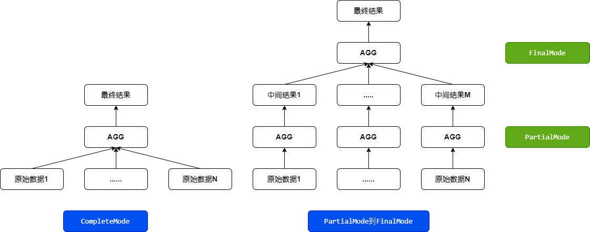

# 聚合算子
聚合操作可划分为两类
- `scalar-agg`,例如`sum`, `avg`, `min`, `max`等的数据聚合操作，最终返回一个数据行的结果集
- `multi-agg`, 对应于SQL中的`GROUP By`

## Stream Aggregate算法
> 原理:Stream Aggregate的计算需要保证输入数据按照Group-By列有序。在计算过程中，每当读到一个新的Group的值或所有数据输入完成时，便对前一个Group的聚合最终结果进行计算。Stream Aggregate的输入数据需要保证同一个Group的数据连续输入，所以Stream Aggregate处理完一个Group的数据后可以立刻向上返回结果[1]

伪码:
```
clear the current aggregate results 
clear the current group by columns 
for each input row 
  begin 
    if the input row does not match the current group by columns 
      begin 
        output the aggregate results 
        clear the current aggregate results 
        set the current group by columns to the input row 
      end 
    update the aggregate results with the input row 
  end
```
## Hash Aggregate算法
> 在Hash Aggregate 的计算过程中，我们需要维护一个Hash表，Hash表的键为聚合计算的 Group-By 列，值为SQL的输出数据。计算过程中，只需要根据每行输入数据计算出键，在 Hash 表中找到对应值进行更新即可。
> 
> 由于分布式计算的需要，对于聚合函数的计算阶段进行划分，相应定义了两种计算模式：
> - CompleteMode
> - FinalMode，PartialMode[1]。

|计算模式 | 输入值 |输出值|
|:---:|:----:|:----:|
|CompleteMode|原始数据最终结果|
|FinalMode| 中间结果 | 最终结果|
| PartialMode | 原始数据 | 中间结果|



```
begin 
  calculate hash value on group by column(s) 
  check for a matching row in the hash table 
  if we do not find a match 
    insert a new row into the hash table 
  else 
    update the matching row with the input row 
end 
output all rows in the hash table
```

# 参考资料
- 1 [数据库内核:物理算子之Aggregate聚合算子实现](https://blog.csdn.net/Night_ZW/article/details/109446779)
