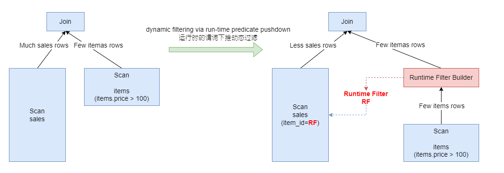

Runtime Filter是一种在数据库中广泛使用的一种优化技术，其基本原理是通过在join的probe端提前过滤掉不会命中join的输入数据来大幅减少join中的数据传输和计算，从而减少整体的执行时间。例如下面的SQL语句，其中`sales`是一个事实表，` items`是一个纬度表

```sql
SELECT *
	FROM sales JOIN items 
	ON sales.item_id = items.id
	WHERE items.price > 100
```

<center>
    
</center>


# TrinoDB的RF实现

Tirino采用运行时谓词下推的动态过滤，可以很明显地优化高选择率的Inner Join

# PolarDB的RF实现

在PolarDB-X中我们将Runtime Filter的生成规则与优化器的统计信息有效地结合，通过多个纬度的数据来决定是否需要生成Runtime Filter:
- probe端的数据量的大小。如果probe端的数据量过小，即便被过滤很多的数据，其性能提升也无法弥补bloom filter的额外开销，此时我们会放弃生成bloom filter。
- bloom filter的大小。bloom filter的大小由输入的数量和fpp(错误率)决定，并和输入的数量成正比。当bloom filter太大，不仅会增大网络传输的数据，也会增大内存占用，因此我们将bloom filter的大小限制在一定范围内。
- 过滤比例。当生成的bloom filter的过滤比例太小时，将其下推到join的probe端不仅不会起到任何的效果，而且精确的过滤比例的计算是一个比较复杂的过程，这里我们使用一个近似的公式来估算过滤性：$1-buildNdv*(1+fpp)/probeNdv$。只有当过滤比大于一定阀值时我们才会生成runtime filter。

# 参考资料
1. [Query Performance Optimization – Runtime Filter](https://www.alibabacloud.com/blog/query-performance-optimization-runtime-filter_598126)
2. [知乎PolarDB_X实现原理:查询性能优化之 Runtime Filter](https://zhuanlan.zhihu.com/p/354754979)
3. [TrinoDB Blog:Dynamic filtering for highly-selective join optimization](https://trino.io/blog/2019/06/30/dynamic-filtering.html)
